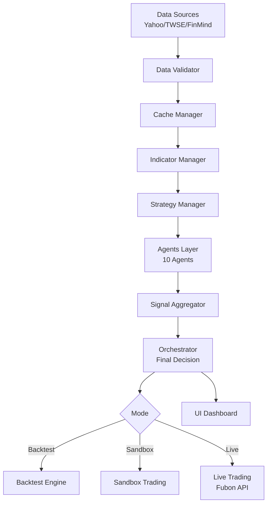

# 📘 **TAITS S1 OFFICIAL WHITEPAPER（CHAPTER 2/15）**

# **CHAPTER 2 — SYSTEM ARCHITECTURE（最終完整架構）**

**（世界一流級 · 企業級架構 · ASCII + Mermaid 全展開版）**

> **⚠️ 說明：**
> 本章是 TAITS S1 的「系統藍圖」。
> 也是整份白皮書中最關鍵的章節之一。
> 之後所有 CHAPTER（資料層、指標層、策略層、AI、Agents、Backtest…）
> 都是依照這份架構延伸。

---

# # **2.1 Architecture Overview（全域架構總覽）**

TAITS S1 的架構由 8 大核心模組組成：

1. **資料層 Data Layer**
2. **特徵層 Feature Layer（指標）**
3. **策略層 Strategy Layer（285 策略）**
4. **Agent 層（10 大智能體）**
5. **Orchestrator（總控 AI）**
6. **Backtest Engine（回測）**
7. **Trading Layer（Sandbox / Paper / Live）**
8. **UI（儀表板）**

整體結構如下：

```
┌────────────────────────────────────────┐
│               TAITS S1                │
├────────────────────────────────────────┤
│          1. Data Layer                │
│    Yahoo / TWSE / FinMind / Cache     │
├────────────────────────────────────────┤
│          2. Feature Layer             │
│     200+ Indicators / Feature Eng.    │
├────────────────────────────────────────┤
│          3. Strategy Layer            │
│     285 Strategies (Plugin System)    │
├────────────────────────────────────────┤
│          4. Agent Layer               │
│   10 Agents (Tech/Chip/AI/News...)    │
├────────────────────────────────────────┤
│          5. Orchestrator              │
│   Signal Fusion / Weighting / Final   │
├────────────────────────────────────────┤
│          6. Backtest Engine           │
│    Event-driven Simulation Engine     │
├────────────────────────────────────────┤
│          7. Trading Layer             │
│ Sandbox → Paper → Live (Fubon API)    │
├────────────────────────────────────────┤
│            8. UI Dashboard            │
│     Streamlit / Monitor / Control     │
└────────────────────────────────────────┘
```

---

# # **2.2 Project Structure（工程結構）**

以下為 TAITS S1 的正式工程目錄（最終版）：

```
TAITS_S1/
│── main.py
│── README.md
│── requirements.txt

├── config/
│   └── settings.py

├── data_sources/
│   ├── base_loader.py
│   ├── yahoo_loader.py
│   ├── twse_loader.py
│   ├── finmind_loader.py
│   ├── cache_manager.py
│   └── fallback_manager.py

├── engine/
│   ├── orchestrator.py
│   ├── indicator_manager.py
│   ├── strategy_manager.py
│   ├── agent_manager.py
│   ├── signal_aggregator.py
│   └── data_validator.py

├── indicators/
│   ├── trend/
│   ├── momentum/
│   ├── volatility/
│   ├── volume/
│   ├── candle/
│   ├── chip/
│   └── ai/

├── strategies/
│   ├── trend/
│   ├── reversal/
│   ├── breakout/
│   ├── volume/
│   ├── chip/
│   ├── fundamental/
│   ├── candle/
│   ├── chan/
│   └── ai/

├── agents/
│   ├── technical_agent.py
│   ├── chip_agent.py
│   ├── fundamental_agent.py
│   ├── news_agent.py
│   ├── sentiment_agent.py
│   ├── macro_agent.py
│   ├── pattern_agent.py
│   ├── chan_agent.py
│   ├── ai_agent.py
│   └── risk_agent.py

├── backtest/
│   ├── backtester.py
│   ├── portfolio.py
│   └── report.py

├── trading/
│   ├── sandbox.py
│   ├── paper.py
│   ├── order_manager.py
│   ├── execution_simulator.py
│   └── broker_fubon.py

└── ui/
    ├── dashboard.py
    ├── charts.py
    └── components/
```

---

# # **2.3 High-Level Data Flow（資料流）**

資料輸入 → 特徵加工 → 策略 → Agent → Orchestrator → 交易。

```
TWSE / Yahoo / FinMind
        ↓
   Data Validator
        ↓
   Cache Manager
        ↓
 Indicator Manager
        ↓
 Strategy Manager
        ↓
   Agent Layer
        ↓
   Orchestrator
        ↓
Backtest / Sandbox / Live
        ↓
        UI
```

---

# # **2.4 System Flow（系統流程圖）**

用 Mermaid 展示完整流程：



---

# # **2.5 Multi-Agent Architecture（十智能體架構）**

TAITS 的強大來自 **Agents System**。

```
┌──────────────────────────────┐
│         Agent Manager        │
└──────────────────────────────┘
    │       │       │        │
    ▼       ▼       ▼        ▼
Technical  Chip   Fundamental  AI
  Agent    Agent     Agent    Agent
    │       │       │        │
    ▼       ▼       ▼        ▼
 News     Sentiment Macro   Chan
 Agent      Agent   Agent   Agent
    │________________________│
                 ↓
       Risk Agent（守門人）
```

所有 Agent 的結果 → Orchestrator。

---

# # **2.6 Orchestrator Architecture（主控 AI 架構）**

```
                   ┌───────────────────┐
                   │   Orchestrator    │
                   └───────────────────┘
                           │
                           ▼
                 ┌─────────────────┐
                 │ Signal Fusion   │
                 └─────────────────┘
                 │  技術/籌碼/AI/基本面
                 ▼
          ┌──────────────────┐
          │ Weighting Engine │
          └──────────────────┘
                 │
                 ▼
        ┌───────────────────────┐
        │ Final Decision (BUY)  │
        └───────────────────────┘
```

它就是你系統的「大腦」。

---

# # **2.7 Backtest Engine（事件驅動回測）**

TAITS S1 採用 **事件驅動模型（Event-driven）**：

```
for each bar:
    on_data() →
    compute_indicators →
    run_strategies →
    run_agents →
    orchestrator_decision →
    update_portfolio →
    record
```

和 QuantConnect / Zipline 架構一致。

---

# # **2.8 Trading Layer（交易層）**

交易層包含三階段：

```
              Sandbox
                 ↓
              Paper
                 ↓
              Live (Fubon API)
```

### Sandbox

安全的隔離環境（21 日連續穩定才可升級）

### Paper

100% 模擬富邦 API → 含滑價、成交、委託

### Live

真正發送委託單到 Fubon API。

---

# # **2.9 UI Dashboard**

基於 Streamlit：

* 策略投票
* Agent 統計
* AI 趨勢走勢
* 持倉
* 回測績效
* Sandbox 狀態
* 自動下單按鈕

```
┌───────────────┐
│ Portfolio      │
│ AI Trend       │
│ Agent Scores   │
│ Trades         │
└───────────────┘
```

---

# # **2.10 本章摘要**

CHAPTER 2 為你定義了 TAITS S1 的：

* 全域系統架構
* 工程架構
* 資料流、系統流
* Multi-Agent 架構
* Orchestrator AI 架構
* 回測模式
* 交易模式
* UI 介面結構

接下來每章將逐段展開：

---
