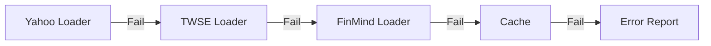
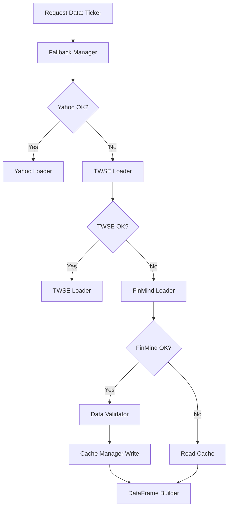

# 📘 **TAITS S1 OFFICIAL WHITEPAPER（CHAPTER 3/15）**

# **CHAPTER 3 — DATA LAYER（資料層 · 完整規格）**

**（世界一流級 · 台股專用資料層 · 3 層 Fallback + Cache + Validation）**

> ⚠️ 本章是 **TAITS S1 的地基**。
> 資料乾淨 → 指標準確 → 策略有效 → Agent 判斷正確 → AI 訓練正常。
>
> **若資料層錯 1%，策略層會錯 50%，AI 會錯 90%。**
>
> 因此 CHAPTER 3 是核心章節之一。

---

# # **3.1 Data Layer Overview（資料層總覽）**

TAITS S1 的資料層由 7 大模組組成：

1. **Yahoo Loader（最快）**
2. **TWSE Loader（官方資料）**
3. **FinMind Loader（最完整台股資料）**
4. **Fallback Manager（自動切換來源）**
5. **Cache Manager（本地快取）**
6. **Data Validator（資料清洗）**
7. **DataFrame Builder（特徵基底）**

整體架構：

```
Yahoo → TWSE → FinMind → Cache → Error
    │       │        │
    └────→ Validator → DataFrame
```

---

# # **3.2 全部資料來源（完整定義）**

本章將定義 TAITS 所使用的「全部資料來源」：

## **📌 資料來源分類（共 10 類）**

| 類別                  | 來源                            |
| ------------------- | ----------------------------- |
| 1. 台股 K 線（日/週/月/分鐘） | Yahoo / TWSE / FinMind        |
| 2. 法人籌碼             | FinMind                       |
| 3. 融資券              | FinMind                       |
| 4. 財報資料             | Cnyes / MOPS                  |
| 5. 新聞資料 NLP         | Cnyes / 鉅亨 / MoneyDJ          |
| 6. 類股指數             | TWSE                          |
| 7. 國際行情             | Yahoo（SOX/NASDAQ/VIX/USD/TWD） |
| 8. 市場寬度             | TWSE 上漲家數                     |
| 9. AI 輸入資料          | Kronos / 序列資料                 |
| 10. 交易模擬資料          | TAITS Simulator               |

---

# # **3.3 Yahoo Finance（第一層）**

### **優點：**

✔ 最快（毫秒級）
✔ 免費
✔ 國際行情完整
✔ 支援日/週/月/分鐘
✔ 匯率、VIX、SOX…一應俱全

### **缺點：**

❗ 有時會 SSL 錯誤
→ TAITS S1 已加入「SSL fallback 模式」

---

# # **3.4 TWSE OpenAPI（第二層）**

網址：

```
https://openapi.twse.com.tw/v1/exchangeReport/STOCK_DAY_ALL
```

### **優點：**

✔ 官方資料
✔ 台灣 IP 速度快
✔ 可靠性高
✔ 免登入、免 token
✔ 不會被封鎖

### **缺點：**

資料格式需要大量清洗（Validator 會處理）

---

# # **3.5 FinMind（第三層）**

提供台股最完整資料：

* 日線
* 5 秒/1 分資料（加值）
* 法人三大
* 融資券
* 財務資料
* 資金流向

### **優點：**

✔ API 完整
✔ 社群活躍
✔ 方便延伸 AI 訓練資料

### **缺點：**

❗ 偶爾會有欄位異動
→ Data Validator 做安全防禦。

---

# # **3.6 Fallback Manager（核心切換系統）**

TAITS S1 具備「自動切換資料來源」機制：

```
try Yahoo
  if fail → try TWSE
     if fail → try FinMind
        if fail → try Cache
            else Error
```

Mermaid 表示：



---

# # **3.7 Cache Manager（資料快取）**

快取位置（建議放 D 槽）：

```
/data_cache/
    ├── price/
    ├── chip/
    ├── margin/
    ├── financial/
    ├── news/
    ├── sector/
    ├── macro/
    └── ai/
```

### Cache 功能包含：

| 功能          | 說明                             |
| ----------- | ------------------------------ |
| 1. 自動建立快取   | Yahoo/TWSE/FinMind 任一來源成功後自動寫入 |
| 2. TTL 過期管理 | 舉例：K 線（1 天）、新聞（10 分鐘）          |
| 3. 自動讀取舊快取  | 來源全掛掉時使用                       |
| 4. 加速系統運算   | 策略、回測、大幅提速 3×～20×              |

---

# # **3.8 Data Validator（資料驗證 + 清洗）**

功能包含：

### **① 欄位清洗**

* 缺值補齊
* 錯誤資料排除
* 開盤不交易日剔除
* 連續跳空檢查

### **② 異常值處理**

如：

```
volume = 0
open/high/low/close = 0
跳空異常 20%
負數量
```

### **③ 欄位標準化**

強制所有資料轉換成：

```
date (datetime)
open
high
low
close
volume
turnover
```

---

# # **3.9 DataFrame Builder（特徵 DataFrame）**

Data Layer 最終輸出統一格式：

```
Index：DatetimeIndex
Columns：
    open
    high
    low
    close
    volume
    adj_close (如有)
    chip_xxx
    fund_xxx
    margin_xxx
    indicator_xxx
    ai_xxx
```

---

# # **3.10 Data Schema（欄位結構）**

## 📌 **完整欄位表（台股專用）**

### **價格欄位**

```
open, high, low, close, volume, turnover
```

### **法人籌碼**

```
foreign_buy
foreign_sell
it_buy
it_sell
dealer_buy
dealer_sell
three_inst_net
```

### **融資券**

```
margin_buy
margin_sell
margin_balance
short_balance
```

### **基本面**

```
eps
eps_yoy
revenue
gross_margin
roe
```

### **NLP**

```
sentiment_score
impact_level
news_count
```

### **國際行情**

```
sox
nasdaq
usd_twd
vix
```

### **AI**

```
kronos_up_prob
kronos_down_prob
lstm_trend
transformer_reverse
```

---

# # **3.11 Data Loading Example（實際流程示例）**

使用 pseudo-code 展示一個 TSMC（2330）資料讀取：

```
data = FallbackManager.load("2330")

→ Yahoo 成功
    ↓
Validator 清洗
    ↓
Cache 寫入
    ↓
Indicator Manager
    ↓
Strategy Manager
    ↓
Agent System
    ↓
Orchestrator Decision
```

---

# # **3.12 完整 Data Flow（白皮書級）**



---

# # **3.13 本章總結**

CHAPTER 3 定義了 TAITS S1 的：

### ✔ 三層資料來源（Yahoo → TWSE → FinMind）

### ✔ Fallback Manager（自動切換）

### ✔ Cache Manager（快取系統）

### ✔ Data Validator（清洗）

### ✔ 統一 DataFrame（欄位架構）

### ✔ 資料流（Mermaid + ASCII）

### ✔ 資料完整 Schema

---
