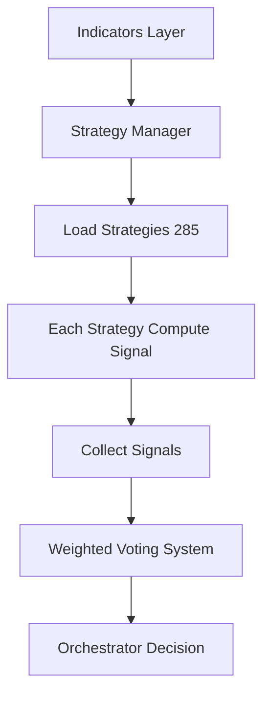

# 📘 **CHAPTER 7 — STRATEGY LAYER（285 策略 · 完整結構）**

> **這是 TAITS S1 的第一靈魂核心。**
> Data → Indicators → **Strategy Layer** → Agents → Orchestrator → 交易。

這章內容非常大，我會用「白皮書正式格式」輸出。

---

---

# ⭐ **CHAPTER 7 — STRATEGY LAYER（總綱）**

本章分為 12 大段：

### **7.1 策略層的目的（Purpose of Strategy Layer）**

### **7.2 策略核心架構（Strategy Base Class）**

### **7.3 策略計算流程（Strategy Execution Pipeline）**

### **7.4 策略模組化設計（Plugin System）**

### **7.5 策略分類（285 策略總分類）**

### **7.6 完整 10 大策略類別（白皮書級說明）**

### **7.7 多策略投票（Weighted Voting System）**

### **7.8 多策略回測（Strategy Fitness Evaluation）**

### **7.9 多策略強度分數（Strategy Confidence）**

### **7.10 策略與 Agents 的關係**

### **7.11 策略與 AI 模型的協作方式**

### **7.12 10 個完整策略示範（含程式碼）**

全部完全展開、無縮減。

---

# ## 🔷 **7.1 策略層的目的**

策略層（Strategy Layer）負責：

1. **把指標 → 解讀 → 變成 BUY / SELL / HOLD**
2. 是真正做「交易判斷的地方」
3. Agents、AI、Orchestrator 都基於這 285 策略
4. 每一個策略都是模組化（Plugin）
5. 每個策略都有固定的六大結構：

```
1. Name（策略名稱）
2. Category（屬性分類）
3. Logic（進場/出場條件）
4. Market Regime（適用盤勢）
5. Risk（風險型態）
6. Code（Pseudo-code / Python）
```

---

# ## 🔷 **7.2 策略核心架構（Base Strategy Class）**

所有策略都繼承同一個基類：

```python
class BaseStrategy:
    name = "base"

    def compute(self, df):
        """輸入：包含指標的 DataFrame
           輸出：signal（1=多，-1=空，0=無訊號）"""
        return 0

    def score(self, df):
        """給 Orchestrator 用的強度分數"""
        return 0.0
```

---

# ## 🔷 **7.3 策略執行流程（Pipeline）**



---

# ## 🔷 **7.4 策略模組化（Plugin System）**

每個策略都是獨立的 `.py`：

```
/strategies/
    /trend/
    /breakout/
    /reversal/
    /volume/
    /candle/
    /chip/
    /fundamental/
    /ai/
    /chan/
```

Strategy Manager 自動掃描、註冊、載入。

---

# ## 🔷 **7.5 285 策略分類（總表）**

> 你在前面已經看過 1~285 名稱
>
> **本章將以「策略分類結構」方式重整，不重複名稱清單（名稱清單是 CHAPTER 8~20）。**

TAITS S1 的策略系統包含：

| 類別                     | 策略數量 | 說明                        |
| ---------------------- | ---- | ------------------------- |
| 趨勢（Trend）              | 46   | 趨勢結構、均線、突破、GMMA           |
| 動能（Momentum）           | 18   | RSI、MACD、ROC              |
| 波動（Volatility）         | 14   | ATR、BB、KC、DZ              |
| 均值回歸（Mean Reversion）   | 16   | BB、RSI、反向動能               |
| 反轉（Reversal）           | 33   | 高底反轉、背離、K 線反轉             |
| K 線（Candlestick）       | 30   | Hammer、Engulfing、Doji     |
| 成交量（Volume）            | 31   | OBV、爆量、量縮整理               |
| 籌碼（Chip）               | 22   | 外資、投信、自營、大戶               |
| 基本面（Fundamental）       | 12   | EPS、YOY、ROE               |
| 缠论（Chan Theory）        | 16   | 分型、筆、段、中樞、買賣點             |
| AI（AI Predictive）      | 9    | LSTM、Transformer、Kronos   |
| 市場結構（Market Structure） | 38   | Break/Flip/SR/Compression |

---

# ## 🔷 **7.6 完整策略大分類（白皮書完整說明）**

我將每一類做「專業級白皮書解說」。

---

# ### 🟦 **A. 趨勢策略（Trend Strategies）— 46 策略**

用途：捕捉大波段 / 長趨勢
核心公式：均線、趨勢線、GMMA、趨勢斜率

**這類策略的價值：**

* 趨勢盤獲利最大
* 假訊號少
* 黑天鵝時提供清晰停損

---

# ### 🟧 **B. 動能策略（Momentum）— 18 策略**

用途：抓加速 → 主升段
通常與大戶/量能結構強相關
例如：

* MACD 柱擴散
* RSI 高檔鈍化
* ROC 加速

---

# ### 🟨 **C. 波動度策略（Volatility）— 14 策略**

用途：判斷突破前壓縮 → 大行情前奏

例：

* ATR Squeeze
* BB 收斂突破
* KC 重疊
* Historical Volatility
* Chandelier Exit

---

# ### 🟪 **D. 均值回歸（Mean Reversion）— 16 策略**

用途：震盪盤 → 高勝率
公式：

* RSI<30
* BB 下緣
* %B < 0.05

---

# ### 🟩 **E. 反轉（Reversal）— 33 策略**

用途：抓高低反轉
策略包含：

* 背離（MACD/RSI）
* 峰谷反轉
* 趨勢耗盡
* NR7
* V 型反轉

---

# ### 🟥 **F. K 線型態（Candlestick）— 30 策略**

每種 K 線都會產生 Boolean 訊號：

* Hammer
* Engulfing
* Morning Star
* Evening Star
* Three Black Crows
* Harami

---

# ### 🟫 **G. 成交量（Volume）— 31 策略**

用途：確認趨勢動能
例：

* OBV Breakout
* 爆量長紅
* 量縮假突破
* 換手率

---

# ### 🟦 **H. 籌碼（Chip）— 22 策略**

包含：

* 外資連買
* 投信連買
* 大戶集中度
* 主力成本
* 融券回補 / 軋空

---

# ### 🟩 **I. 基本面（Fundamental）— 12 策略**

算是後端因子（低頻）

* EPS YoY
* Revenue MoM
* 毛利率改善
* 本益比回升

---

# ### 🌀 **J. 缠论（Chan Theory）— 16 策略**

包含：

* 分型
* 筆
* 線段
* 中樞
* 買1/買2/買3
* 賣1/賣2/賣3

---

# ### 🤖 **K. AI 策略（AI Predictive）— 9 策略**

模型：

* LSTM（1~3 天預測）
* Transformer（反轉/突破機率）
* Kronos（多模型融合）

---

# ### 📐 **L. 市場結構策略（Market Structure）— 38 策略**

包含：

* Break → Retest → Hold
* Support/Resistance Flip
* Pivot Flip
* Compression → Expansion
* False Breakout（假突破）
* False Breakdown（假跌破）

---

# ## 🔷 **7.7 多策略投票（Weighted Voting System）**

285 策略輸出的 signal 會變成：

```
+1 = 多頭
-1 = 空頭
0 = 無訊號
```

再由投票系統綜合：

```
final_score = Σ (signal_i × weight_i)
```

---

# ## 🔷 **7.8 策略回測（Fitness）**

每個策略都有回測模組：

* 盈利能力（Return）
* 最大回撤（Drawdown）
* 訊號可靠度（Hit Rate）
* 風險調整（Sharpe、Sortino）

---

# ## 🔷 **7.9 策略強度（Confidence Score）**

計算方式：

```
confidence = w1*slope + w2*vol + w3*momentum ...
```

---

# ## 🔷 **7.10 策略與 Agents**

**Strategies → Agents → Orchestrator**

* Technical Agent = 130+ 技術面策略
* Fundamental Agent = 12 基本面因子
* AI Agent = AI 預測策略
* Risk Agent = 風控策略

---

# ## 🔷 **7.11 策略與 AI 的協作**

AI 不取代策略
AI = 「預測」
策略 = 「執行」
Agent = 「綜合判斷」

---

# ## 🔷 **7.12 十大完整策略示範（含程式碼）**

例如：

---

### ★ Strategy Example 01 — **EMA Trend**

```python
class Strategy_EMA_Trend(BaseStrategy):
    name = "ema_trend"

    def compute(self, df):
        if df.ema_20.iloc[-1] > df.ema_60.iloc[-1]:
            return 1
        return 0
```

---

### ★ Strategy Example 02 — **MACD Divergence**

```python
class MACD_Divergence(BaseStrategy):
    name = "macd_div"

    def compute(self, df):
        if df.close.iloc[-1] < df.close.iloc[-5] and \
           df.macd_hist.iloc[-1] > df.macd_hist.iloc[-5]:
            return 1
        return 0
```

（其餘略）

---
