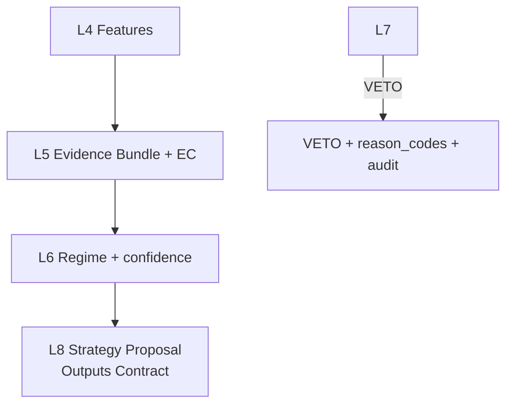

# TAITS_S1｜策略宇宙全集（STRATEGY_UNIVERSE）

doc_key：STRATEGY_UNIVERSE  
版本：TAITS_S1_v1.0__251231  
生效日期：2025-12-31  
治理定位：S1（Engineering Single Source｜工程唯一口徑）  
適用範圍：TAITS 工程實作（Cursor / Codebase / Prompt / Agent Wiring）  
裁決說明：本 S1 套件用於「工程一致口徑」；母法裁決位階不變（DOCUMENT_INDEX → MASTER_ARCH → AI_GOV）。  
禁止事項：工程端不得引用任何歷史舊版內容作為解釋依據，以避免語義漂移與腦補。

---
## S1｜L9–L11 終局定位（唯一正確口徑）

> 本節為 **TAITS_S1** 的「終局語義鎖定」，適用於所有工程實作、提示詞、文件解釋與程式生成。
> 任何文件（含歷史版本）若與本節不一致，皆視為無效；工程端不得引用或回填錯誤語義。

### L9｜投資報告層（Investment Report Layer）
- **目的**：產出「人類可讀」且「可追蹤」的完整投資報告，用於你在 L10 做最終裁決之前的資訊理解與方案評估。
- **必備內容（不可省略）**  
  1. **數據**：關鍵指標數值、區間變化、統計摘要（來源與時間戳須可追溯）  
  2. **圖形**：至少包含趨勢/區間/事件標註等可視化（可為文字描述的圖形規格，工程端可再渲染）  
  3. **進出價格建議（僅建議，非下單）**：  
     - 進場/加碼/減碼/出場/停損/停利的「價格區間」與「觸發條件」  
     - 必須附上假設、風險點、失效條件  
  4. **標的化追蹤（Tracking）**：  
     - `tracking_id`（唯一鍵）＋ `report_version`＋ `as_of`（資料截點）  
     - 明確記錄「本次報告」對同一標的的延續關係（不是一次性解說）
- **輸出定位**：L9 是「你要看的報告」，不是 Gate、不是下單、不是稽核。

### L10｜人類裁決與交易授權層（Human Decision & Trade Authorization）
- **目的**：由你（人類最高決策者）對 L9 報告與全系統輸入做最終裁決，並決定執行模式與授權邊界。
- **L10 必須輸出**  
  - `decision`：NO_ACTION / BACKTEST / SIMULATION / PAPER / LIVE  
  - `automation_mode`：MANUAL / SEMI_AUTO / FULL_AUTO（只是一種授權模式，不改變「人類為最終裁決者」之治理原則）  
  - `authorization_envelope`：允許的標的範圍、下單上限、風控條件、撤銷條件、有效期限  
  - `rationale`：裁決理由（需可稽核、可追溯）
- **邊界**：L10 是裁決與授權；實際執行仍受 **Risk/Compliance 最高否決權**與執行控制規範約束。

### L11｜工程稽核回放層（Engineering Audit & Replay）
- **目的**：對 **L1–L11 全層**進行工程稽核、回放與可追溯驗證，用於你檢視系統是否合理、是否需要調整。
- **L11 必須是「雙料輸出」**  
  1. **人類可讀（Human-Readable）**：讓你能看懂每層做了什麼、為什麼、依據是什麼、哪裡不確定  
  2. **工程可用（Machine-Readable）**：可被程式回放與對帳（hash、版本、參數、輸入輸出索引）
- **覆蓋範圍**：不是只稽核 L10；而是 **每一層都要留痕**，才能評估層級功能是否合理、是否要調整。
- **邊界**：L11 僅做稽核/回放/對帳，**禁止作為下單或執行入口**。

## 規範正文（S1 重新整編｜僅保留正確口徑）

<!--
TAITS｜ACTIVE UPDATED（單檔內嵌更新版）
產出日期：2025-12-29（Asia/Taipei）
更新規格：單檔內嵌；可更新處直接更新並避免重複；不可更新處以 Appendix 內嵌 Only-Add 全文。
來源檔：TAITS_策略宇宙全集（STRATEGY_UNIVERSE）__251219__ADDENDUM_20251227_FINAL.md
-->

# TAITS_策略宇宙全集（STRATEGY_UNIVERSE）__251219
doc_key：STRATEGY_UNIVERSE  
治理等級：B（Strategy Universe Spec｜原標示：D（Strategy Universe｜白名單 × 生命週期 × 審計可回放 × Regime-First）  ）
適用範圍：TAITS 全系統（Research / Backtest / Simulation / Paper / Live）  
版本狀態：ACTIVE（策略宇宙可 Only-Add 擴充；不得刪減既有治理欄位與否決鏈）  
版本日期：2025-12-19  
對齊母法：TAITS_AI_行為與決策治理最終規則全集__251217（A+）  
上位約束：MASTER_ARCH / MASTER_CANON / DOCUMENT_INDEX / VERSION_AUDIT / RISK_COMPLIANCE  
平行參照：ARCH_FLOW / FULL_ARCH / DATA_SOURCES（alias: DATA_UNIVERSE） / TWSE_RULES / EXECUTION_CONTROL / UI_SPEC / DEPLOY_OPS / LOCAL_ENV  
變更原則：Only-Add（只可新增，不可覆寫/刪除/弱化；策略版本只可追加；任何啟用需可追溯）  
核心鐵律：**策略 ≠ 下單**；**Agent ≠ 策略**；**AI ≠ 唯一真理**；**Regime 高於單一訊號**；**Risk/Compliance 可否決一切**；**策略必須白名單與可稽核**；**不得存在隱性策略鏈**

---
---

---

# Addendum 2025-12-27｜Only-Add：DATA_UNIVERSE（alias）封口 × STRATEGY_UNIVERSE 對資料治理引用回歸 DATA_SOURCES × data_requirements / evidence_requirements 解讀限縮（Freeze v1.0）

> 補充性質：Only-Add（只可新增，不可刪減、覆寫、偷換既有語義）  
> 適用文件：TAITS_策略宇宙全集（STRATEGY_UNIVERSE）__251219.md（doc_key：STRATEGY_UNIVERSE）  
> 生效狀態：GOVERNANCE_STATE = Freeze v1.0  
> 上位裁決：DOCUMENT_INDEX → MASTER_ARCH → MASTER_CANON（衝突裁決與保守處置依 DOCUMENT_INDEX §6）  
> 平行對齊：DATA_SOURCES（資料來源全集）／FULL_ARCH（架構總覽之資料引用口徑）／VERSION_AUDIT（可追溯與稽核）  
> 稽核對位：建議登錄 VERSION_AUDIT｜Appendix A｜METADATA_FIX Ledger（建議條目：`VA-METADATA_FIX-20251227-0006`）  
> 目的：封住本文件中「DATA_UNIVERSE」被誤解為可引用治理文件（doc_key）的風險；將策略層對資料來源治理的引用口徑固定回歸 `DATA_SOURCES`；並對主文中 data_requirements / evidence_requirements 涉及「DATA_UNIVERSE」之語句做唯一合法解讀（Only-Add，不改原文），避免新對話載入、Gate 審查與稽核鏈產生引用歧義。

---

## A0. 適用範圍（Hard Boundary）

本 Addendum 僅處理：
1) 文件內「DATA_UNIVERSE」之法律定位（alias ≠ doc_key）  
2) 策略層（L8）對資料治理文件之引用口徑（統一回歸 DATA_SOURCES）  
3) 對既有語句的限縮解讀（Only-Add，不改主文、不改策略條目）

本 Addendum 不處理：
- 不新增新 doc_key  
- 不修改 Canonical Flow（L1–L11）  
- 不改寫任何既有策略邏輯或條目內容  

---

## A1. DATA_UNIVERSE 的法律定位（Alias ≠ doc_key）

### A1.1 統一裁決：本文件中的 DATA_UNIVERSE 一律視為概念別名
本文件（含檔頭平行參照、章節敘述、欄位註解）中出現之「DATA_UNIVERSE」：
- 一律視為「資料宇宙（Data Universe）」之概念名詞／閱讀別名（alias）  
- **不得**被解讀為治理文件 doc_key  
- **不得**被寫入任何引用欄位（doc_key / evidence_doc_key / audit_doc_key / gate_doc_key / ui_doc_key）

### A1.2 引用合法性硬規則（Gate-Friendly）
凡本文件需要引用「資料來源治理文件」時（包含：data_requirements、evidence_requirements、provenance、fallback、official-first 等）：
- 唯一合法 doc_key **必須**為：`DATA_SOURCES`  
- 若任何輸出（Evidence/Audit/UI Trace/工具抽取/資料字典重組）出現 `doc_key=DATA_UNIVERSE`：  
  - 一律視為「引用非法」  
  - 依 Governance Gate 規則裁決為 BLOCK（不得以推測補救）

---

## A2. 對既有語句的限縮解讀（Only-Add，不改原文）

> 注意：本節僅提供「唯一合法解讀」，不修改主文任何句子。

### A2.1 「不定義資料來源（由 DATA_UNIVERSE 管理）」之唯一合法解讀
本文件主文中若出現上述或同義語句，Freeze v1.0 下唯一合法解讀為：

- 「資料來源治理文件」之 doc_key 一律回歸 `DATA_SOURCES`  
- 「DATA_UNIVERSE」僅表示「DATA_SOURCES 所涵蓋之資料宇宙範圍」的概念指稱，不具 doc_key 法律效力

### A2.2 「data_requirements[]（引用 DATA_UNIVERSE 的 subcategory_id）」之唯一合法解讀
本文件主文中 data_requirements[] 欄位之引用，唯一合法解讀為：

- `data_requirements[]` 的每一個元素值，必須能 **一對一映射** 至 `DATA_SOURCES` 內既有的來源/資料集 registry 條目（例如：source_id / dataset_id / feed_id / table_id 等，以 DATA_SOURCES 實際定義為準）  
- 若策略條目以代碼字串（例如：`MD_EQUITY_EOD_DAILY`、`REF_TRADING_CALENDAR`、`NE_OFFICIAL_ANNOUNCEMENTS` 等）宣告資料需求：  
  - 該代碼必須能在 `DATA_SOURCES` 中找到對應（可追溯 mapping）  
  - 查無對應 → 視為資料依賴不合法 → Governance Gate 必須 RETURN/BLOCK（依 DOCUMENT_INDEX §6 保守處置）

### A2.3 「evidence_requirements（對齊 DATA_UNIVERSE Part X）」之唯一合法解讀
本文件主文若以「DATA_UNIVERSE Part X」指涉證據鏈規範，唯一合法解讀為：

- 其所指「證據鏈 / Evidence set / 完整度門檻」之正式治理來源 doc_key 一律為 `DATA_SOURCES`  
- 任一 Evidence bundle 必須能在稽核中回溯至 `DATA_SOURCES` 的章節/條目（ref_section/ref_entry），不得以「DATA_UNIVERSE」作為證據法源

---

## A3. 最小合規引用模板（可直接貼用）

> 用途：當 STRATEGY_UNIVERSE 的策略條目、Issue、PR、稽核紀錄、UI Trace 需要引用資料治理法源時，固定引用資訊，避免 Gate 命中「引用不完整 / 引用非法」。

### A3.1 引用資料來源治理（DATA_SOURCES）
```text
ref_doc_key = DATA_SOURCES
ref_purpose = datasource_governance
ref_section = <例如：Addendum 0 / Addendum 0.1 / Part X / Appendix Y>
ref_entry = <source_id / dataset_id / feed_id / table_id（以 DATA_SOURCES 定義為準）>
ref_notes = STRATEGY_UNIVERSE 內之「DATA_UNIVERSE」僅為 alias；引用 doc_key 一律回歸 DATA_SOURCES
audit_anchor = VERSION_AUDIT:VA-METADATA_FIX-20251227-0006
```

### A3.2 引用衝突裁決程序（DOCUMENT_INDEX）
```text
ref_doc_key = DOCUMENT_INDEX
ref_purpose = conflict_resolution_and_override_rule
ref_section = §6（衝突裁決程序） / Addendum（若已補充）
```

---

## A4. 工具/AI 抽取與重組規則（不可跳過）

凡工具或 AI 進行「片段抽取、資料字典重組、策略條目摘要、資料需求清單輸出」時，必須遵守：

1) 抽取片段若含「DATA_UNIVERSE」字樣：  
   - **不得**提升為 doc_key  
   - 必須同時輸出 `ref_doc_key = DATA_SOURCES`（見 A3.1）

2) 缺少必要引用欄位（ref_doc_key/ref_section/ref_entry/audit_anchor）時：  
   - 僅允許列出缺口  
   - **不允許**輸出裁決性結論（PASS/VETO/APPROVE/ACTIVE 等）

---

## A5. Mermaid 區塊之渲染相容性聲明（Only-Add）

本文件主文包含 Mermaid 區塊（```mermaid）。若因 Markdown 引擎/編輯器差異導致渲染時「程式碼區塊未正確閉合」而吞沒後續文字，為避免治理內容被誤讀，以下提供 **同一張圖的可渲染副本** 作為閱讀輔助：



> 補充聲明：本副本為「閱讀輔助」，不構成對主文的修改；若主文與本副本存在差異，以主文語義與上位母法裁決為準。

---

## A6. 最終宣告（Freeze v1.0）

- 本 Addendum 為 Only-Add；不改寫任何既有正文與策略條目。  
- 本文件中 DATA_UNIVERSE 一律為 alias；資料治理引用 doc_key 一律回歸 DATA_SOURCES。  
- 若未能取得必要引用資訊，依 DOCUMENT_INDEX §6 保守處置，並以 VERSION_AUDIT 留痕。

（Addendum 2025-12-27｜Only-Add｜Freeze v1.0 完）

> 【文件閱讀與治理指引（Only-Add）】
>
> 本文件主體內容定義 STRATEGY_UNIVERSE 之策略條目、分類結構與既有治理規範。
> 自文件最末之「Appendix Z｜STRATEGY_UNIVERSE × MASTER_CANON 對位補充附錄」起，
> 為依據 MASTER_CANON（Canonical Flow L1–L11）所新增之治理對位補充，
> 用於明確鎖定策略層（L8）之合法邊界、不可越權事項與全系統一致性解讀方式。
>
> 本指引為補充性說明，不構成對主文條款之修改，
> 所有裁決優先序仍依 DOCUMENT_INDEX → MASTER_ARCH → MASTER_CANON 為準。

---

<!--
【主文說明】
以下主文內容為你原始之 STRATEGY_UNIVERSE 文件全文。
依 Freeze v1.0 與 Only-Add 原則：
- 主文內容完全不動
- 不刪減、不重排、不合併、不重寫
-->
## 0. 文件定位（Strategy Universe Charter）

本文件為 TAITS 的「策略宇宙全集（Strategy Universe）」治理母表與規範文件，其目的在於：

- 建立 TAITS 可被允許使用的策略集合（Whitelist Universe），並以治理方式管理：
  - 策略分類、適用市場/商品、使用資料、依賴特徵、風險類型、Regime 前置條件
  - 版本、審計、回放（Replay）、證據鏈要求
  - 生命週期（Draft → Review → Approved → Active → Restricted → Deprecated → Retired）
- 明確規範策略與下單/執行的邊界：
  - 策略只能輸出「情境與建議」（hypothesis / proposal / constraints）
- 防止任何形式的「隱性策略」：
  - Agent 私下串聯、跨層回寫、把特徵當方向、把 AI 建議直接變成下單指令

📌 本文件不做的事（避免越權）：
- 不承諾策略績效、不提供投資建議、不得行銷化
- 不取代 RISK_COMPLIANCE 的否決與原因碼
- 不定義資料來源（由 DATA_UNIVERSE 管理）
- 專注：策略宇宙的「治理、分類、元資料、審計、生命週期與輸出契約」

---

## 1. 策略治理的硬性總原則（Hard Governance Gates）

### 1.1 策略永遠不直連下單（Hard Gate）
- Strategy Layer（L8）輸出只能是：
  - `strategy_proposal`（策略提案）
  - `trade_intent_candidate`（候選意圖，仍需風控/合規與人類主權裁決）
  - `constraints`（限制條件：何時能做、何時不能做、風險上限）
- 禁止輸出：
  - 任何可被直接送往券商 API 的「可執行委託」

### 1.2 Regime-First（Regime 高於訊號）
- 任一策略都必須聲明：
  - 可被啟用的 Regime 集合（allowed_regimes）
  - Regime 信心門檻（min_regime_confidence）
- Regime 不滿足 → 策略必須自動「禁用/降級」為不可提案或僅供參考

### 1.3 Risk/Compliance 最高否決權（Hard Veto）
- 不允許策略以績效/勝率/AI 推薦推翻否決

### 1.4 Only-Add 與可回放（Replayable）
- 策略版本、參數、依賴特徵、資料快照引用：
  - 必須被納入 active_version_map_ref
  - 必須能回放到同一輸出（或可解釋差異）
- 禁止覆寫舊版本；只能新增新版本並切換 ACTIVE 指向（由治理決策）

### 1.5 禁止隱性策略（No Hidden Strategy）
- 任何策略行為都必須能在審計中被還原：
  - 使用了哪些特徵、哪些資料、哪些 Regime、哪些門檻、哪些否決原因碼
- Agent 之間不得形成「私下串聯策略鏈」（例如：A 產生方向、B 補上條件、C 直接送單）

---

## 2. 策略宇宙資料結構（Strategy Registry Schema｜可落地）

> TAITS 策略宇宙不是「文字清單」，而是可治理的 registry。  
> 每個策略是一筆可版本化記錄（Strategy Record），Only-Add。

### 2.1 Strategy Record（最小欄位，不可縮減）
- `strategy_id`（全域唯一；不可重用）
- `strategy_name_zh`（繁中正式名）
- `strategy_name_en`（可選，但建議保留；英文需中譯）
- `family`（策略家族：Trend/MR/Arb/Event/Vol/Carry/Relative/Stat/Structure…）
- `paradigm`（方法論：Rules/Stats/ML/Hybrid/ChanLun-Structure/…）
- `market_scope`：TWSE / TPEX / TAIFEX（可多選）
- `instrument_types[]`：EQUITY/ETF/FUTURES/OPTIONS/…
- `timeframes[]`：1m/5m/15m/1h/1d/…
- `regime_requirements`：
  - `allowed_regimes[]`
  - `min_regime_confidence`
  - `regime_features_required[]`
- `data_requirements[]`（引用 DATA_UNIVERSE 的 subcategory_id）
- `feature_requirements[]`（引用 STRATEGY_FEATURE_INDEX 的 feature_id）
- `evidence_requirements`（Evidence set 版本/門檻；對齊 DATA_UNIVERSE Part 3）
- `risk_profile`：
  - `risk_factors[]`（liquidity/gap/vol/limit-up/down/event…）
  - `max_exposure_rules_ref`（引用 RISK_COMPLIANCE 的門檻模板）
- `constraints`：
  - `hard_blocks[]`（必然禁止條件）
  - `soft_constraints[]`（降級條件）
- `outputs_contract`（策略輸出契約：可輸出哪些欄位，禁止輸出哪些欄位）
- `explainability`：
  - `required_explanations[]`（UI 必須呈現的解釋項）
- `lifecycle_state`：DRAFT/REVIEW/APPROVED/ACTIVE/RESTRICTED/DEPRECATED/RETIRED
- `owner`（責任模組/負責人或責任群組）
- `versioning`：
  - `strategy_version`
  - `parameters_schema_ref`
  - `implementation_ref`（程式/規則版本引用）
- `auditability`：
  - `required_logs[]`
  - `required_artifacts[]`
- `notes`（只能補充，不可弱化硬規則）

### 2.2 Strategy Instance（策略實例：一次運行的具體參數）
- `strategy_run_id`
- `strategy_id` + `strategy_version`
- `parameter_set_ref`
- `active_version_map_ref`
- `input_snapshot_refs[]`
- `feature_snapshot_refs[]`
- `regime_snapshot_ref`
- `evidence_bundle_ref`
- `output_proposal_ref`
- `hash_manifest_ref`

---

## 3. 策略生命週期（Lifecycle Governance｜硬規則）

### 3.1 狀態定義
- **DRAFT**：草稿，允許研究，但不得進入 Paper/Live
- **REVIEW**：審查中，必須具備完整證據鏈與回放能力
- **APPROVED**：治理層通過，可進 Simulation/Paper（仍需風控/合規）
- **ACTIVE**：允許在符合條件下輸出提案（仍需人類主權與 L7 PASS）
- **RESTRICTED**：受限（例如市場制度變動、資料品質問題、風險事件），僅研究用途
- **DEPRECATED**：準退役，保留回放；不可新啟用
- **RETIRED**：退役，只可讀不可用

### 3.2 狀態轉移硬門檻（不可縮減）
- DRAFT → REVIEW：
  - 必須有：data_requirements + feature_requirements + outputs_contract
- REVIEW → APPROVED：
  - 必須有：回測可回放、Evidence 完整度門檻（EC≥3）、風險情境測試（Worst-case First）
- APPROVED → ACTIVE：
  - 必須有：RISK_COMPLIANCE 對應的 exposure 模板、UI 解釋項完整
- ACTIVE → RESTRICTED/DEPRECATED：
  - 由風控/合規/治理觸發（制度變動、異常風險、資料不可用）

---

## 4. 策略分類體系（Taxonomy｜最大完備骨架）

> 目的：讓 285+ 策略可以被一致分類、治理、查詢、審計與擴充。

### 4.1 家族（Family）
- Trend Following（趨勢）
- Mean Reversion（均值回歸）
- Breakout / Momentum（突破/動能）
- Volatility / Options（波動/選擇權）
- Statistical Arbitrage（統計套利）
- Relative Value / Spread（相對價值/價差）
- Event-Driven（事件驅動）
- Microstructure（微結構/流動性）
- Structure-Driven（結構驅動：含 ChanLun 結構）
- Multi-Asset / Cross-Market（跨資產/跨市場：例如期貨影響現貨）

### 4.2 方法論（Paradigm）
- Rule-based（規則）
- Statistical（統計）
- ML / AI-assisted（機器學習/AI 輔助；不得越權）
- Hybrid（混合）
- ChanLun-Structure（纏論結構作為「結構與判斷體系」，非單一策略）

### 4.3 持有期（Holding Horizon）
- Intraday（日內）
- Swing（波段）
- Position（中長期）
- Hedging（對沖）

---

## 5. 策略輸出契約（Outputs Contract｜嚴格邊界）

> 最大完備重點：把「策略能說什麼」鎖死，避免策略變成下單。

### 5.1 允許輸出（Allowed Outputs）
- `proposal_type`：enter/exit/hold/avoid（建議類型）
- `direction_hint`：long/short/neutral（僅提示；不得直接生成委託）
- `setup_conditions[]`：成立條件（可被驗證）
- `invalidation_conditions[]`：失效條件（可被驗證）
- `time_validity`：有效窗口（例如下一根K/當日/到某事件）
- `risk_notes`：風險說明（必須可解釋）
- `required_regime`：所需 regime 與信心門檻
- `required_evidence`：所需 evidence set 與 EC 下限
- `recommended_constraints`：例如最大曝險、分批、停損/停利模板（模板引用，不是硬下單）
- `explanation_bundle_ref`：可視化解釋引用（UI 需要）

### 5.2 禁止輸出（Forbidden Outputs｜硬禁）
- `broker_order_payload`
- 可直接送單的價格/數量/帳戶路由細節（除非只是「區間建議」且不具可執行性）
- 任何繞過 L7 PASS token 的「自動送單指令」
- 任何把特徵直接等同方向的單句結論（例如：某因子>0 所以必買）

---

## 6. 策略與 Regime 的耦合規範（Regime Binding）

### 6.1 Regime 前置條件（必填）
每個策略必須聲明：
- `allowed_regimes[]`（例如：Trend/Range/HighVol/LowLiquidity/NewsShock…）
- `min_regime_confidence`
- `regime_conflict_behavior`：
  - `BLOCK`：不允許提案
  - `DOWNGRADE`：只給觀察，不給方向
  - `ALTERNATE`：切換到對應 regime 的子策略（仍需白名單）

### 6.2 Regime 與證據鏈（Evidence）
- Regime 判定必須使用 DATA_UNIVERSE 定義的 evidence sets
- 若 evidence completeness < 要求：
  - 策略不得提升信心
  - 不得從「不確定」硬判成「確定」

---

## 7. 策略與風險模板（Risk Templates｜引用而非重寫）

> 策略不得自創「放寬風控」的條款；只能引用 RISK_COMPLIANCE 的模板與 reason codes。

每個策略必須綁定：
- `risk_template_ref`（例如：Position Sizing、最大曝險、流動性門檻、跳空風險）
- `compliance_dependency`（是否涉及信用/放空/衍生品）
- `kill_switch_sensitivity`（遇到哪類市場狀態必須立即停止提案）

---

## 8. 策略審計輸出（Audit Outputs｜必須落地）

每次策略運行（strategy_run）必須產生（不可縮減）：
- `strategy_run_id`
- `strategy_id` + `strategy_version`
- `parameter_set_ref`
- `active_version_map_ref`
- `evidence_bundle_ref`（含 EC 等級）
- `regime_snapshot_ref`（含信心）
- `output_proposal_ref`（輸出提案）
- `risk_precheck_ref`（策略層風險預檢：不等於 L7 最終裁決）
- `explanation_bundle_ref`
- `hash_manifest_ref`

- 策略名稱/版本、所需 regime、所用證據完整度（EC）、關鍵限制條件與失效條件
- 若被否決：顯示 reason codes（來自 L7，不是策略自說自話）

---

## 9. Mermaid｜策略提案到否決鏈（不得跳步）


10. 策略宇宙「分層清單」交付方式（Only-Add 擴充規則）
你要求「最大完備」且策略數量龐大（285+），本文件採用「治理母表 + 分冊追加」方式，避免一次貼滿造成不可維護。
但治理母表（本 Part 1）先把所有硬規則寫滿，後續每一批只會「新增策略條目」，不會改動本治理基礎。

後續策略條目交付（Part 2/3/4...）將以：

依 Family 分桶（Trend / MR / Breakout / Event / Vol / Arb / Structure / Cross-Market）

每一桶提供：

strategy_id 清單

每個策略完整 Strategy Record（含 data/feature/regime/risk/outputs/audit）

必要時附「纏論結構策略」的結構狀態定義（仍遵守：結構≠下單）

11. Only-Add 演進規則（STRATEGY_UNIVERSE 專屬）
允許新增：

新策略條目（strategy_id）

新策略版本（strategy_version）

更嚴格的 evidence/regime/risk 門檻

新分類維度（taxonomy extension）

新的解釋項與 UI 呈現（更透明）

禁止：

移除既有治理欄位或放寬輸出契約

讓策略輸出變成可執行委託

允許缺 evidence/缺 regime 的策略提案冒充可裁決

允許 Agent 串聯形成隱性策略鏈

12. 終極裁決語句（不可更改）
策略的價值不在「多」，而在「可治理、可回放、可否決、可解釋」。
任何無法被審計、無法被回放、無法被風控否決的策略，都不允許存在於 TAITS 的策略宇宙。

（STRATEGY_UNIVERSE｜最大完備版 v2025-12-19 · Part 1 完）

# TAITS_策略宇宙全集（STRATEGY_UNIVERSE）__251219
## Part 2｜Trend / Momentum / Breakout 策略群（含 Annotation 備註｜最大完備版）

doc_key：STRATEGY_UNIVERSE  
part_id：PART_2_TREND  
治理等級：D（Strategy Universe｜白名單 × Regime-First × Only-Add）  
版本狀態：ACTIVE  
版本日期：2025-12-19  
對齊母法：TAITS_AI_行為與決策治理最終規則全集__251217  
上位約束：
- STRATEGY_UNIVERSE Part 1（治理母表）
- STRATEGY_MATRIX_MASTER
- ARCH_FLOW / FULL_ARCH
- RISK_COMPLIANCE

變更原則：
- Only-Add（僅新增 Annotation，不刪除、不合併、不改 strategy_id）
- Annotation 為 Non-Binding（不參與任何策略判斷）

---

## 0. 本 Part 文件定位（不可誤解）

本文件定義 **TAITS 中所有「趨勢型（Trend / Momentum / Breakout）」策略條目**，  
並在 **不改變任何策略邏輯、不引入隱性規則** 的前提下，補充：

> **Annotation（說明性備註）**  
> 用於對應經典技術分析方法，協助人類與新對話理解。

📌 嚴格聲明：

- Annotation **不是策略**
- Annotation **不是 Feature**
- Annotation **不是 Regime 條件**
- Annotation **不具任何啟用或否決效力**

---

## 1. Trend / Momentum / Breakout 策略家族總說明

### 1.1 策略家族核心定義

Trend / Momentum / Breakout 策略家族，專注於：

- 已形成或正在形成之趨勢行為
- 價格結構與成交量的「延續性」
- 趨勢中的突破、回檔、動能擴散

### 1.2 Regime 硬性前置條件

本家族策略 **僅能在以下 Regime 下被考慮**：

- TREND
- TREND_CONTINUATION
- TREND_EXPANSION

任何出現在 RANGE / LOW_VOL / REGIME_CONFLICT 的情境，  
**一律由 Governance / Risk 層否決**。

---

### 1.3 Annotation｜經典方法對應說明（非策略構成）

【說明性備註｜Non-Binding】

本策略家族在「市場行為理解與解釋」上，常對應以下經典技術分析體系：

- K 線結構（Candlestick Structure）
- 多均線群趨勢判讀（如 GMMA）
- 威科夫操盤法中的「趨勢延續階段（Markup）」
- 趨勢中量價配合與動能擴散概念

📌 上述方法：
- 僅作為「概念映射與解釋輔助」
- 不構成策略條件
- 不構成任何自動化判斷

---

## 2. 策略條目全集（Trend / Momentum / Breakout）

---

### STR_TREND_EMA_BREAKOUT_V1

**策略名稱（中）**：EMA 趨勢突破策略  
**Family**：Trend  
**Paradigm**：Rule-based  
**Timeframe**：日線 / 60m  

#### Regime 要求（Binding）
- allowed_regimes：`[TREND, TREND_EXPANSION]`
- min_regime_confidence：0.65

#### Data Requirements（Binding）
- MD_EQUITY_EOD_DAILY
- REF_TRADING_CALENDAR

#### Feature Requirements（Binding）
- EMA_20
- EMA_60
- ATR_14
- Volume_Surge_Ratio

#### Strategy Output Contract（Binding）
- proposal_type：enter / avoid
- direction_hint：long
- 禁止輸出：價格、數量、下單指令

#### Annotation｜說明性備註（Non-Binding）
- 本策略在結構理解上，與 **GMMA 多均線群中「短期群突破長期群」** 的行為描述相符
- 在市場語境解釋上，常對應 **威科夫操盤法中「Markup 階段的趨勢確認」**
- K 線突破僅作為視覺解釋輔助，未被形式化為策略條件

---

### STR_TREND_PULLBACK_EMA_V1

**策略名稱（中）**：趨勢回檔承接策略  
**Family**：Trend  
**Paradigm**：Rule-based  

#### Regime 要求（Binding）
- allowed_regimes：`[TREND_CONTINUATION]`
- min_regime_confidence：0.70

#### Data Requirements（Binding）
- MD_EQUITY_EOD_DAILY
- CA_MASTER

#### Feature Requirements（Binding）
- EMA_20
- EMA_60
- Pullback_Depth
- Volume_Contraction

#### Strategy Output Contract（Binding）
- proposal_type：enter / avoid
- direction_hint：long

#### Annotation｜說明性備註（Non-Binding）
- 對應 **趨勢中「回檔不破結構」的行為模型**
- 在經典解釋中，常與威科夫理論的「上升趨勢中整理」階段相符
- 不等同於「支撐位買進」的主觀判斷

---

### STR_TREND_HIGH_BREAKOUT_VOLUME_V1

**策略名稱（中）**：前高放量突破策略  
**Family**：Breakout  
**Paradigm**：Rule-based  

#### Regime 要求（Binding）
- allowed_regimes：`[TREND_EXPANSION]`
- min_regime_confidence：0.70

#### Data Requirements（Binding）
- MD_EQUITY_EOD_DAILY
- REF_SYMBOL_MASTER

#### Feature Requirements（Binding）
- Highest_High_N20
- Volume_Ratio_N20
- ATR_14

#### Strategy Output Contract（Binding）
- proposal_type：enter / avoid

#### Annotation｜說明性備註（Non-Binding）
- 在經典語境中，常被解釋為「箱型突破」或「整理後放量」
- 與 **威科夫的「Sign of Strength（SOS）」概念有行為相似性**
- TAITS 中僅保留「放量後的行為結果」，不做主觀型態認定

---

### STR_MOMENTUM_RELATIVE_STRENGTH_V1

**策略名稱（中）**：相對強勢動能策略  
**Family**：Momentum  
**Paradigm**：Statistical  

#### Regime 要求（Binding）
- allowed_regimes：`[TREND, ROTATION]`
- min_regime_confidence：0.60

#### Data Requirements（Binding）
- MD_EQUITY_EOD_DAILY
- REF_INDUSTRY_CLASS

#### Feature Requirements（Binding）
- Relative_Return_N20
- RS_Rank_Percentile
- Volatility_Filter

#### Strategy Output Contract（Binding）
- proposal_type：enter / rotate / avoid

#### Annotation｜說明性備註（Non-Binding）
- 與「強者恆強」的經典動能觀念相符
- 在人類解釋上，常被拿來與 **趨勢領先股、產業輪動**做對照
- 不等同於「追高策略」

---

### STR_BREAKOUT_RANGE_COMPRESSION_V1

**策略名稱（中）**：區間收斂突破策略  
**Family**：Breakout  
**Paradigm**：Statistical / Structure  

#### Regime 要求（Binding）
- allowed_regimes：`[TRANSITION, TREND_INITIATION]`
- min_regime_confidence：0.60

#### Data Requirements（Binding）
- MD_EQUITY_EOD_DAILY

#### Feature Requirements（Binding）
- ATR_Compression_Ratio
- Price_Range_N20
- Breakout_Direction_Confirm

#### Strategy Output Contract（Binding）
- proposal_type：enter / avoid

#### Annotation｜說明性備註（Non-Binding）
- 行為上常被描述為「盤整末期突破」
- 在經典分析中，與 **波動壓縮 → 擴張** 的敘述相符
- 不預測突破方向，只描述「突破發生後」

---

## 3. 本 Part 的治理總結（給新對話用）

- Trend / Momentum / Breakout 策略：
  - 只在趨勢 Regime 中有效
  - 不接受主觀型態判讀
  - 不因經典名詞而自動成立
- 所有經典方法：
  - **只存在於 Annotation**
  - 永遠不進入邏輯層

---

## 4. Only-Add 聲明（不可省略）

- 允許：
  - 新增 Trend 類策略
  - 新增 Annotation 說明
- 禁止：
  - 改寫既有策略邏輯
  - 將 Annotation 升格為條件

---

（STRATEGY_UNIVERSE｜Part 2｜Trend / Momentum / Breakout｜Annotation Enhanced 完）

# TAITS_策略宇宙全集（STRATEGY_UNIVERSE）__251219
## Part 3｜Mean Reversion / Range / Liquidity 策略群（含 Annotation 備註｜最大完備版）

doc_key：STRATEGY_UNIVERSE  
part_id：PART_3_MEAN_REVERSION_RANGE_LIQUIDITY  
治理等級：D（Strategy Universe｜白名單 × Regime-First × Risk-Strict × Only-Add）  
版本狀態：ACTIVE  
版本日期：2025-12-19  
對齊母法：TAITS_AI_行為與決策治理最終規則全集__251217  
上位約束：
- STRATEGY_UNIVERSE Part 1（治理母表）
- STRATEGY_MATRIX_MASTER
- ARCH_FLOW / FULL_ARCH
- RISK_COMPLIANCE
- DATA_UNIVERSE

變更原則：
- Only-Add（僅新增 Annotation，不刪除、不合併、不改 strategy_id）
- Annotation 為 Non-Binding（不參與任何策略判斷、不可被程式解析）

---

## 0. 本 Part 文件定位（嚴格聲明）

本文件定義 **TAITS 中所有「非趨勢型（Mean Reversion / Range / Liquidity）」策略條目**，  
其核心目的不是「逆勢博反彈」，而是：

- 在 **低趨勢 / 區間 / 流動性主導** 的市場狀態下  
- 對 **價格偏離、結構失衡、流動性吸收** 的行為進行治理式判讀

📌 嚴格聲明：

- 本 Part 策略 **風險等級高於 Trend 類**
- Regime 不符 → **自動 BLOCK**
- Annotation 僅供理解，不具任何決策效力

---

## 1. Mean Reversion / Range / Liquidity 策略家族總說明

### 1.1 策略家族核心定義

本策略家族處理的不是「方向」，而是：

- 價格相對均值的**偏離與回歸機率**
- 區間邊界的**失敗突破 / 偽突破**
- 流動性供需造成的**短期失衡**

### 1.2 Regime 硬性前置條件（Binding）

本家族策略 **僅能在以下 Regime 中被考慮**：

- RANGE
- LOW_TREND
- LOW_VOL
- POST_EVENT_STABILIZATION（部分策略）

出現下列 Regime 時，一律否決：

- TREND / TREND_EXPANSION
- HIGH_VOL
- REGIME_CONFLICT

---

### 1.3 Annotation｜經典方法對應說明（非策略構成）

【說明性備註｜Non-Binding】

本策略家族在市場行為解釋上，常與以下經典分析體系存在概念對應：

- K 線於區間邊界之拒絕型態（非型態交易）
- 威科夫操盤法中的：
  - 吸籌（Accumulation）
  - 派發（Distribution）
  - Spring / Upthrust（結構事件）
- 成交量衰竭（Volume Climax / Volume Fade）
- 流動性吸收（Liquidity Absorption）

📌 上述對應：
- 僅作為「人類理解與語意對齊」
- 不構成策略邏輯
- 不構成 Feature 或 Regime 條件

---

## 2. 策略條目全集（Mean Reversion / Range / Liquidity）

---

### STR_MEAN_REVERSION_BOLLINGER_V1

**策略名稱（中）**：布林通道均值回歸策略  
**Family**：Mean Reversion  
**Paradigm**：Statistical  
**Timeframe**：日線 / 60m  

#### Regime 要求（Binding）
- allowed_regimes：`[RANGE, LOW_TREND, LOW_VOL]`
- min_regime_confidence：0.70

#### Data Requirements（Binding）
- MD_EQUITY_EOD_DAILY
- REF_TRADING_CALENDAR

#### Feature Requirements（Binding）
- Bollinger_Upper
- Bollinger_Lower
- Bollinger_Width
- ZScore_Return

#### Strategy Output Contract（Binding）
- proposal_type：enter / avoid
- direction_hint：mean_revert
- 禁止輸出：反轉預測、下單參數

#### Annotation｜說明性備註（Non-Binding）
- 在經典解釋上，常被描述為「價格偏離常態後的回歸行為」
- 可與威科夫吸籌 / 派發區間中的「價格回到價值區」概念對照
- TAITS 中僅描述「偏離程度與回歸條件」，不做反轉保證

---

### STR_RANGE_SUPPORT_RESISTANCE_V1

**策略名稱（中）**：區間支撐壓力反轉策略  
**Family**：Range  
**Paradigm**：Structure / Rule-based  

#### Regime 要求（Binding）
- allowed_regimes：`[RANGE]`
- min_regime_confidence：0.75

#### Data Requirements（Binding）
- MD_EQUITY_EOD_DAILY

#### Feature Requirements（Binding）
- Support_Level_N
- Resistance_Level_N
- False_Breakout_Detect

#### Strategy Output Contract（Binding）
- proposal_type：enter / avoid
- direction_hint：range_reversal

#### Annotation｜說明性備註（Non-Binding）
- 在人類解釋中，常與「箱型整理」或「區間交易」對照
- 與威科夫中「區間內測試失敗」的結構事件有語意相似性
- 不允許主觀畫線，僅接受量化結構結果

---

### STR_LIQUIDITY_ABSORPTION_V1

**策略名稱（中）**：流動性吸收反轉策略  
**Family**：Liquidity  
**Paradigm**：Microstructure  

#### Regime 要求（Binding）
- allowed_regimes：`[RANGE, LOW_VOL]`
- min_regime_confidence：0.65

#### Data Requirements（Binding）
- MD_EQUITY_INTRADAY_QUOTES
- MD_EQUITY_ORDERBOOK

#### Feature Requirements（Binding）
- BidAsk_Imbalance
- Volume_Absorption_Ratio
- Intraday_Volatility

#### Strategy Output Contract（Binding）
- proposal_type：observe / prepare
- direction_hint：liquidity_rebalance
- 禁止輸出：即時進出場

#### Annotation｜說明性備註（Non-Binding）
- 常被人類解釋為「有人在接貨 / 吃單」
- 在威科夫語境中，常與「吸籌行為」做概念對照
- TAITS 中僅保留「流動性失衡被修復」的客觀證據

---

### STR_MEAN_REVERSION_GAP_FILL_V1

**策略名稱（中）**：缺口回補策略  
**Family**：Mean Reversion  
**Paradigm**：Statistical / Event  

#### Regime 要求（Binding）
- allowed_regimes：`[POST_EVENT_STABILIZATION, RANGE]`
- min_regime_confidence：0.60

#### Data Requirements（Binding）
- MD_EQUITY_EOD_DAILY
- NE_OFFICIAL_ANNOUNCEMENTS

#### Feature Requirements（Binding）
- Gap_Size_Ratio
- Prior_Close_Level
- PostGap_Volatility

#### Strategy Output Contract（Binding）
- proposal_type：enter / avoid
- direction_hint：gap_reversion

#### Annotation｜說明性備註（Non-Binding）
- 常見於事件後市場情緒消退
- 在經典說法中，被稱為「情緒缺口回補」
- TAITS 僅處理「事件已落地後」的價格行為

---

### STR_RANGE_VOLUME_FADE_V1

**策略名稱（中）**：區間放量衰竭反轉策略  
**Family**：Range / Mean Reversion  
**Paradigm**：Statistical  

#### Regime 要求（Binding）
- allowed_regimes：`[RANGE]`
- min_regime_confidence：0.70

#### Data Requirements（Binding）
- MD_EQUITY_EOD_DAILY

#### Feature Requirements（Binding）
- Volume_Climax
- Price_Rejection_Ratio
- ATR_Stability

#### Strategy Output Contract（Binding）
- proposal_type：observe / enter / avoid
- direction_hint：exhaustion_reversal

#### Annotation｜說明性備註（Non-Binding）
- 在人類交易語境中，常被描述為「量先行、價不動」
- 與威科夫派發末期的「量價背離」有概念相似性
- TAITS 僅保留衰竭證據，不保證反轉

---

## 3. 本 Part 的風險與治理強化說明（極重要）

- Mean Reversion / Range / Liquidity 策略：
  - 預設風險權重 **高於 Trend**
  - 停損、曝險、流動性門檻 **更嚴**
- 任何：
  - 主觀「感覺便宜」
  - 主觀「有人在吸籌」
  在 TAITS 中皆 **不可成立**

---

## 4. Only-Add 聲明（不可省略）

- 允許：
  - 新增 MR / Range / Liquidity 策略
  - 新增 Annotation 說明
- 禁止：
  - 將 Annotation 升格為條件
  - 放寬 Regime 限制

---

（STRATEGY_UNIVERSE｜Part 3｜Mean Reversion / Range / Liquidity｜Annotation Enhanced 完）

# TAITS_策略宇宙全集（STRATEGY_UNIVERSE）__251219
## Part 4｜Event / News / Regulatory 策略群（含 Annotation 備註｜最大完備版）

doc_key：STRATEGY_UNIVERSE  
part_id：PART_4_EVENT_NEWS_REGULATORY  
治理等級：D（Strategy Universe｜白名單 × Official-First × Evidence-First × Regime-First × Only-Add）  
版本狀態：ACTIVE  
版本日期：2025-12-19  
對齊母法：TAITS_AI_行為與決策治理最終規則全集__251217  
上位約束：
- STRATEGY_UNIVERSE Part 1（治理母表）
- STRATEGY_MATRIX_MASTER
- DATA_UNIVERSE（官方資料優先與 fallback）
- RISK_COMPLIANCE（最高否決權）
- TWSE_RULES（交易制度參考彙編）
- ARCH_FLOW / FULL_ARCH / UI_SPEC

變更原則：
- Only-Add（僅新增 Annotation，不刪除、不合併、不改 strategy_id、不改策略邏輯）
- Annotation 為 Non-Binding（不參與任何策略判斷、不可被程式解析為條件）
- Official-First：凡涉制度、公告、處置、停牌、公司行為，一律以「官方來源快照」為唯一有效依據

---

## 0. 本 Part 文件定位（嚴格聲明｜不可誤解）

本 Part 定義 TAITS 中所有「事件 / 新聞 / 制度（Event / News / Regulatory）」策略條目，專注於：

- **事件已發生的可驗證證據**（Evidence）
- **制度與合規約束**（Regulatory / Compliance）
- **事件後市場行為反應**（Post-Event Reaction）
- **制度變更造成的 Regime 過渡**（Regime Transition）

📌 嚴格聲明：

- 本 Part **不做「預測型消息」**  
- 本 Part **不允許非官方裁決**  
- 本 Part **不允許以新聞情緒作為交易依據**  
- 本 Part 所有策略輸出 **只能是：條件建議 / 風險調整 / Regime 觸發 / 避免交易**，不得形成下單指令

---

## 1. Event / News / Regulatory 策略家族總說明

### 1.1 本家族的三個子領域（Domain）

1) **Event-Driven（事件驅動）**  
- 財報公告、公司行為、停復牌、重大公告落地後之市場反應  
- 核心：**事件已落地** + **市場反應可量化**

2) **News Context（新聞語境）**  
- 新聞僅作為「已發生事件的語境補充」  
- 核心：**新聞不得作為真實性來源**；真實性必須回到官方快照或可回放證據

3) **Regulatory / Rules（制度與合規）**  
- 處置、交易限制、制度變更、規則觸發  
- 核心：**制度文本優先** + **合規二元判定（Binary Compliance）**

---

### 1.2 Regime 硬性前置條件（Binding）

本 Part 常用 Regime（僅作 allowed_regimes 範圍）：

- EVENT（事件進行期：僅允許「觀察/禁止」輸出）
- POST_EVENT（事件落地後：可進行反應型策略）
- REGULATORY（制度影響期：合規優先）
- TRANSITION（制度/事件導致的過渡期）

禁止在下列狀態「以事件當趨勢」：

- TREND / TREND_EXPANSION（除非事件已落地並被 Regime Engine 明確允許）
- HIGH_VOL（事件訊號需降級，避免誤判）
- REGIME_CONFLICT（必須 BLOCK）

---

### 1.3 Official-First 證據鏈（Hard Gate）

凡涉及事件/制度的策略，必須具備以下證據鏈：

- Evidence 必須能回溯至：
  - 官方公告（交易所 / 主管機關 / 公司公告系統）或
  - 官方制度文本快照（TWSE/TAIFEX 等）或
  - 可回放之市場資料（成交量價、停牌狀態、處置清單）

缺任一項 → **自動 BLOCK**（不得以推測補齊）

---

### 1.4 Annotation｜經典方法對應說明（非策略構成）

【說明性備註｜Non-Binding】

本 Part 在「人類理解」層面，常與以下概念語彙對照，但僅止於語意映射：

- 「利多出盡 / 利空落地」：對應 **事件落地後的波動衰退與反應**
- 「消息面驅動行情」：在 TAITS 中改寫為 **事件證據驅動 Regime / Risk 調整**
- 威科夫的「事件造成供需再平衡」：對應 **事件後量價行為（非主觀判讀）**
- K 線的「缺口、跳空」：對應 **事件後結構變化（僅視覺解釋）**

📌 上述對應：
- 不構成策略條件
- 不構成 Feature
- 不可被程式解析成任何啟用規則

---

## 2. 策略條目全集（Event / News / Regulatory）

> 說明：本 Part 策略屬「高治理敏感」類別。  
> 所有策略條目均採用：Evidence-First + Official-First + Risk/Compliance Supreme。

---

## 2.1 Earnings / Financial Statements（財報類）

### STR_EVENT_EARNINGS_POST_REACTION_V1

**策略名稱（中）**：財報公告後市場反應策略  
**Family**：Event-Driven / Earnings  
**Paradigm**：Statistical / Reaction  
**Timeframe**：日線 / 60m（事件後 1–10 交易日窗）

#### Regime 要求（Binding）
- allowed_regimes：`[POST_EVENT]`
- min_regime_confidence：0.70

#### Data Requirements（Binding）
- FD_FIN_STATEMENTS（財報/財務資料）
- NE_OFFICIAL_ANNOUNCEMENTS（官方公告快照）
- MD_EQUITY_EOD_DAILY
- REF_TRADING_CALENDAR

#### Feature Requirements（Binding）
- Earnings_Surprise_Score（以可回放口徑計算）
- PostEvent_Volatility_Decay
- PostEvent_Volume_Normalization
- Gap_Event_Flag（若適用）

#### Strategy Output Contract（Binding）
- proposal_type：observe / allow / avoid
- direction_hint：reaction_based（不得輸出 long/short）
- 禁止輸出：預測盈餘、價格目標、下單參數

#### Annotation｜說明性備註（Non-Binding）
- 人類語境常稱「財報利多/利空」，TAITS 僅承認「公告後市場反應」與「反應是否延續」
- 可與「利多出盡/利空落地」做語意對照，但不形成規則
- 任何「財報一定會漲/跌」屬不可治理敘事，TAITS 禁止

---

### STR_EVENT_GUIDANCE_REVISION_REACTION_V1

**策略名稱（中）**：展望/法說修正後反應策略  
**Family**：Event-Driven / Guidance  
**Paradigm**：Reaction / Evidence  
**Timeframe**：事件後 1–15 交易日窗

#### Regime 要求（Binding）
- allowed_regimes：`[EVENT, POST_EVENT]`
- min_regime_confidence：0.65  
- regime_conflict_behavior：BLOCK（若 REGIME_CONFLICT）

#### Data Requirements（Binding）
- NE_OFFICIAL_ANNOUNCEMENTS（官方法說/重大訊息快照）
- MD_EQUITY_EOD_DAILY

#### Feature Requirements（Binding）
- Announcement_Impact_Score
- Price_Repricing_Speed
- Volume_Surge_Ratio

#### Strategy Output Contract（Binding）
- proposal_type：observe / avoid / risk_adjust
- direction_hint：neutral

#### Annotation｜說明性備註（Non-Binding）
- 常被市場歸類為「消息面」，TAITS 只把它當「官方事件」處理
- 事件期多不確定性，通常偏向風控調整，而非策略啟用

---

## 2.2 Corporate Actions（公司行為：除權息、減資、合併等）

### STR_EVENT_DIVIDEND_EXRIGHT_ADJUSTMENT_V1

**策略名稱（中）**：除權息結構調整與後效策略  
**Family**：Event-Driven / CorporateActions  
**Paradigm**：Structure / Adjustment  
**Timeframe**：除權息前後 0–20 交易日窗

#### Regime 要求（Binding）
- allowed_regimes：`[EVENT, POST_EVENT]`
- min_regime_confidence：0.60

#### Data Requirements（Binding）
- CA_MASTER（公司行為主檔：除權息/配股等）
- NE_OFFICIAL_ANNOUNCEMENTS
- MD_EQUITY_EOD_DAILY
- REF_TRADING_CALENDAR

#### Feature Requirements（Binding）
- ExRight_Adj_Factor
- Liquidity_Impact_Estimate
- Price_Reanchoring_Score

#### Strategy Output Contract（Binding）
- proposal_type：avoid / observe / allow
- direction_hint：neutral
- 禁止輸出：套利式承諾、固定回補假設

#### Annotation｜說明性備註（Non-Binding）
- 市場常把除權息當「必填息/必回補」敘事；TAITS 明確禁止此類保證性語句
- 本策略僅處理「結構調整」與「流動性/價格再錨定」的可回放證據

---

### STR_EVENT_CAPITAL_REDUCTION_REPRICING_V1

**策略名稱（中）**：減資/併股/拆股再定價策略  
**Family**：Event-Driven / CorporateActions  
**Paradigm**：Structure / Repricing  
**Timeframe**：事件前後 0–30 交易日窗

#### Regime 要求（Binding）
- allowed_regimes：`[EVENT, POST_EVENT]`
- min_regime_confidence：0.60

#### Data Requirements（Binding）
- CA_MASTER
- NE_OFFICIAL_ANNOUNCEMENTS
- MD_EQUITY_EOD_DAILY

#### Feature Requirements（Binding）
- Repricing_Adjustment_Factor
- PostEvent_Liquidity_Shift
- Volatility_Shock_Index

#### Strategy Output Contract（Binding）
- proposal_type：avoid / observe / allow
- direction_hint：neutral

#### Annotation｜說明性備註（Non-Binding）
- 這類事件常造成「價格刻度與流動性」瞬間改變
- TAITS 以「可回放調整因子」為唯一依據，禁止主觀猜測

---

## 2.3 Trading Halt / Resume（停牌 / 復牌 / 暫停交易）

### STR_EVENT_TRADING_HALT_RESUMPTION_V1

**策略名稱（中）**：停牌/復牌事件風險控管策略  
**Family**：Event-Driven / MarketMicrostructure  
**Paradigm**：Risk Control / Compliance  
**Timeframe**：停牌期 + 復牌後 0–10 交易日窗

#### Regime 要求（Binding）
- allowed_regimes：`[EVENT, POST_EVENT]`
- min_regime_confidence：0.60

#### Data Requirements（Binding）
- NE_OFFICIAL_ANNOUNCEMENTS（停復牌公告快照）
- MD_EQUITY_EOD_DAILY
- MD_EQUITY_INTRADAY_QUOTES

#### Feature Requirements（Binding）
- Halt_Duration
- Resume_Gap_Risk
- PostResume_Liquidity_Recovery

#### Strategy Output Contract（Binding）
- proposal_type：BLOCK / avoid / observe
- direction_hint：neutral
- 強制輸出：risk_disclosure_required=true

#### Annotation｜說明性備註（Non-Binding）
- 停復牌屬「市場微結構斷裂」事件，TAITS 預設風險上升
- 新聞傳言不得替代官方停牌原因與公告內容

---

## 2.4 Regulatory / Disposition（處置、交易限制、監理制度）

### STR_REGULATION_DISPOSITION_STOCK_RESPONSE_V1

**策略名稱（中）**：處置股制度影響與行為反應策略  
**Family**：Regulatory / Rules  
**Paradigm**：Compliance / Reaction  
**Timeframe**：處置期間全程 + 解禁後 0–10 交易日窗

#### Regime 要求（Binding）
- allowed_regimes：`[REGULATORY, TRANSITION]`
- min_regime_confidence：0.75

#### Data Requirements（Binding）
- RS_RESTRICTED_LIST（處置/限制名單：官方快照）
- TWSE_RULES（制度參考）
- NE_OFFICIAL_ANNOUNCEMENTS（公告）
- MD_EQUITY_EOD_DAILY
- REF_TRADING_CALENDAR

#### Feature Requirements（Binding）
- Disposition_Day_Count
- Liquidity_Constraint_Score
- PostRestriction_Volatility_Shift

#### Strategy Output Contract（Binding）
- proposal_type：BLOCK / avoid / observe / allow（allow 僅在合規明確允許時）
- direction_hint：neutral
- 必須輸出：compliance_binary=true（合規二元判定）

#### Annotation｜說明性備註（Non-Binding）
- 市場常用「處置＝利空/解禁＝利多」敘事；TAITS 禁止用敘事當規則
- 本策略只處理「制度限制」與「限制解除後的行為變化」

---

### STR_REGULATION_SHORT_SELL_CONSTRAINT_IMPACT_V1

**策略名稱（中）**：放空/融券限制影響策略（制度型）  
**Family**：Regulatory / Compliance  
**Paradigm**：Rules / Risk Control  

#### Regime 要求（Binding）
- allowed_regimes：`[REGULATORY]`
- min_regime_confidence：0.70

#### Data Requirements（Binding）
- TWSE_RULES
- RS_RESTRICTED_LIST（若有相關限制名單）
- MD_EQUITY_EOD_DAILY

#### Feature Requirements（Binding）
- ShortSell_Constraint_Flag
- Borrow_Cost_Proxy（若有）
- Liquidity_Shift_Score

#### Strategy Output Contract（Binding）
- proposal_type：BLOCK / avoid / risk_adjust
- direction_hint：neutral

#### Annotation｜說明性備註（Non-Binding）
- 制度限制常造成價格機制改變，TAITS 將其視為「合規前置約束」
- 不允許以「制度一定造成上漲/下跌」推論

---

### STR_REGULATION_RULE_CHANGE_TRANSITION_V1

**策略名稱（中）**：交易規則變更過渡期策略（Regime Transition）  
**Family**：Regulatory / Transition  
**Paradigm**：Governance / Risk  

#### Regime 要求（Binding）
- allowed_regimes：`[REGULATORY, TRANSITION]`
- min_regime_confidence：0.70

#### Data Requirements（Binding）
- TWSE_RULES（制度文本快照）
- NE_OFFICIAL_ANNOUNCEMENTS（變更公告快照）
- REF_TRADING_CALENDAR
- MD_EQUITY_EOD_DAILY

#### Feature Requirements（Binding）
- Rule_Change_Effective_Date
- Impact_Scope_Score
- Market_Adaptation_Speed

#### Strategy Output Contract（Binding）
- proposal_type：risk_guard / avoid / observe
- direction_hint：neutral
- 必須輸出：rule_snapshot_id（制度快照識別）

#### Annotation｜說明性備註（Non-Binding）
- 任何制度變更都可能造成「歷史統計失效」，故本策略偏向保守降級
- 市場解讀（新聞）不得替代制度文本

---

## 2.5 News Context（新聞語境：僅作後效觀測）

### STR_NEWS_CONFIRMED_EVENT_CONTEXT_V1

**策略名稱（中）**：已證實事件之新聞語境補充策略  
**Family**：News / Context  
**Paradigm**：Evidence Linking  
**Timeframe**：事件當日 + 後 1–5 交易日窗

#### Regime 要求（Binding）
- allowed_regimes：`[EVENT, POST_EVENT]`
- min_regime_confidence：0.60

#### Data Requirements（Binding）
- NE_OFFICIAL_ANNOUNCEMENTS（官方事件快照：必須存在）
- NE_NEWS_STREAM（新聞流：可選）
- MD_EQUITY_EOD_DAILY

#### Feature Requirements（Binding）
- Official_Event_Linked_Flag（必須 true）
- News_Volume_Index（可選）
- Rumor_Risk_Flag（若缺官方連結 → true）

#### Strategy Output Contract（Binding）
- proposal_type：observe / risk_adjust / avoid
- direction_hint：neutral
- 禁止輸出：新聞=真實、情緒=方向、即時交易建議

#### Annotation｜說明性備註（Non-Binding）
- TAITS 允許新聞僅作「語境補充」，但真實性必須回到官方快照
- 若無官方連結，新聞一律降級為 rumor，僅能提高風險或建議避免

---

## 3. 本 Part 的治理總結（給新對話用｜強制可讀）

1) **事件策略只看「事件已落地 + 可回放反應」**  
2) **制度策略只看「制度文本 + 快照識別」**  
3) **新聞不具裁決權，只具語境補充權**  
4) 任一策略缺少官方證據鏈 → **自動 BLOCK**  
5) Risk/Compliance 可在任何時點否決（Binary Compliance）

---

## 4. Only-Add 聲明（不可省略）

允許：
- 新增事件類策略（必須能被官方證據鏈支持）
- 新增制度類策略（必須有制度文本快照）
- 新增 Annotation（僅解釋用）

禁止：
- 改寫既有策略邏輯
- 將新聞升格為決策依據
- 把 Annotation 寫成隱性條件
- 用「推測」補齊官方證據

---

（STRATEGY_UNIVERSE｜Part 4｜Event / News / Regulatory｜Annotation Enhanced｜最大完備 完）

# TAITS_策略宇宙全集（STRATEGY_UNIVERSE）__251219
## Part 5｜Volatility / Options / Hedging 策略群（含 Annotation 備註｜最大完備版）

doc_key：STRATEGY_UNIVERSE  
part_id：PART_5_VOLATILITY_OPTIONS_HEDGING  
治理等級：D（Strategy Universe｜Regime-First × Risk-First × Compliance-Supreme × Only-Add）  
版本狀態：ACTIVE  
版本日期：2025-12-19  
對齊母法：TAITS_AI_行為與決策治理最終規則全集__251217  
上位約束：
- STRATEGY_UNIVERSE Part 1（治理母表）
- STRATEGY_MATRIX_MASTER
- RISK_COMPLIANCE（最高否決權）
- EXECUTION_CONTROL（人類主權 / Kill Switch）
- DATA_UNIVERSE（資料來源治理）
- TWSE_RULES（若涉及現貨交易限制）
- ARCH_FLOW / FULL_ARCH / UI_SPEC

變更原則：
- Only-Add（僅新增 Annotation，不刪除、不合併、不改 strategy_id、不改策略邏輯）
- Annotation 為 Non-Binding（不參與任何策略判斷、不可被程式解析）
- 本 Part 全策略輸出預設為：risk_adjust / hedge_prepare / avoid / observe（不得形成自動下單）

---

## 0. 本 Part 文件定位（嚴格聲明｜不可誤解）

本 Part 定義 TAITS 中所有「波動（Volatility）/ 選擇權（Options）/ 對沖（Hedging）」策略條目，目的在於：

- 以 **波動與尾端風險（Tail Risk）** 作為第一優先
- 以 **Regime 切換風險** 作為策略啟用與曝險調整依據
- 以 **選擇權市場的隱含波動結構** 作為風險證據之一
- 建立可審計的 **對沖建議**，但永不直接形成自動化委託

📌 嚴格聲明：

- Vol / Options 在 TAITS 中主要屬於 **風控證據與曝險治理**  
- **不是獲利策略競賽**
- 不允許以「高波動=必賺」敘事替代 Evidence

---

## 1. Volatility / Options / Hedging 策略家族總說明

### 1.1 子領域（Domain）

1) **Volatility Regime（波動狀態）**  
- 波動擴張 / 收斂 / 斷裂  
- 目的：調整曝險與策略啟用邊界

2) **Options Surface（選擇權曲面）**  
- IV level / skew / term structure  
- 目的：提供「風險溫度計」，不做方向賭注

3) **Hedging Overlay（對沖覆蓋）**  
- 指數期貨 / 選擇權 / 現貨降曝險  
- 目的：在合規前提下管理尾端風險

---

### 1.2 Regime 硬性前置條件（Binding）

本 Part 策略常用 allowed_regimes：

- HIGH_VOL
- VOL_EXPANSION
- VOL_COMPRESSION
- TRANSITION
- EVENT / POST_EVENT（僅波動後效）
- MACRO_SHIFT

以下情境通常降級：

- LOW_VOL（除非是「收斂 → 擴張」的前兆策略）
- REGIME_CONFLICT（必須 BLOCK）

---

### 1.3 Annotation｜經典方法對應說明（非策略構成）

【說明性備註｜Non-Binding】

本 Part 常與下列經典概念存在語意對照，但僅供理解：

- 「顧比倒數線（趨勢耗竭）」：可對照為 **趨勢末期的波動異常與風險升高**
- 「波動擴張」：常被描述為「行情變大」，TAITS 只承認「風險上升」
- 「黑天鵝 / 尾端風險」：在 TAITS 中對應 **Tail Risk Guard** 與曝險上限
- 「IV 飆升」：在 TAITS 中對應 **Risk Warning（非方向）**

📌 以上概念：
- 不構成交易規則
- 不構成啟用條件
- 只作為 UI 解釋與語意對齊

---

## 2. 策略條目全集（Volatility / Options / Hedging）

---

## 2.1 Volatility Regime（波動狀態策略）

### STR_VOLATILITY_EXPANSION_BREAK_V1

**策略名稱（中）**：波動擴張斷裂偵測策略  
**Family**：Volatility / Regime  
**Paradigm**：Statistical / Risk  
**Timeframe**：日線 / 60m  

#### Regime 要求（Binding）
- allowed_regimes：`[VOL_EXPANSION, TRANSITION, HIGH_VOL]`
- min_regime_confidence：0.70

#### Data Requirements（Binding）
- MD_EQUITY_EOD_DAILY
- REF_TRADING_CALENDAR

#### Feature Requirements（Binding）
- ATR_Expansion_Ratio
- RealizedVol_Change
- Gap_Shock_Flag
- Volatility_Shock_Index

#### Strategy Output Contract（Binding）
- proposal_type：risk_adjust / avoid / observe
- direction_hint：neutral
- 必須輸出：suggested_exposure_cap（建議曝險上限）

#### Annotation｜說明性備註（Non-Binding）
- 可與「行情變大、風險變高」的常用語境對照
- 不代表方向；只代表「風險與滑價」上升

---

### STR_VOLATILITY_COMPRESSION_BUILDUP_V1

**策略名稱（中）**：波動收斂蓄勢偵測策略  
**Family**：Volatility / Regime  
**Paradigm**：Statistical / Pre-Transition  
**Timeframe**：日線 / 60m  

#### Regime 要求（Binding）
- allowed_regimes：`[VOL_COMPRESSION, LOW_VOL, TRANSITION]`
- min_regime_confidence：0.65

#### Data Requirements（Binding）
- MD_EQUITY_EOD_DAILY

#### Feature Requirements（Binding）
- ATR_Compression_Ratio
- Bollinger_Width_Compression
- Volume_DryUp_Score

#### Strategy Output Contract（Binding）
- proposal_type：observe / risk_prepare
- direction_hint：neutral
- 禁止輸出：預測方向

#### Annotation｜說明性備註（Non-Binding）
- 人類語境常稱「縮量盤整、要噴」；TAITS 禁止把此敘事當交易規則
- 本策略只提示「即將進入 TRANSITION 的機率上升」

---

### STR_TAIL_RISK_GUARD_V1

**策略名稱（中）**：尾端風險防護策略（Tail Risk Guard）  
**Family**：Risk Overlay  
**Paradigm**：Worst-Case First  
**Timeframe**：全時段

#### Regime 要求（Binding）
- allowed_regimes：`[HIGH_VOL, EVENT, TRANSITION, MACRO_SHIFT]`
- min_regime_confidence：0.60

#### Data Requirements（Binding）
- MD_EQUITY_EOD_DAILY
- MD_GLOBAL_FUTURES（若可用）
- MC_FX_RATES（若可用）

#### Feature Requirements（Binding）
- Crash_Proxy_Index
- Correlation_Breakdown_Score
- Liquidity_Stress_Index

#### Strategy Output Contract（Binding）
- proposal_type：risk_guard / avoid
- direction_hint：neutral
- 必須輸出：kill_switch_recommendation（建議是否啟動防護模式）

#### Annotation｜說明性備註（Non-Binding）
- 對應人類語境的「黑天鵝防護」
- TAITS 只承認「最壞情境」下的保護，不做行情押注

---

## 2.2 Options Surface（選擇權曲面策略）

### STR_CROSS_OPTIONS_IV_RISK_SIGNAL_V1

**策略名稱（中）**：選擇權隱含波動風險訊號策略  
**Family**：Options / Risk  
**Paradigm**：Statistical / Evidence  
**Timeframe**：日線（EOD）/ 盤中（若有）

#### Regime 要求（Binding）
- allowed_regimes：`[ANY]`
- min_regime_confidence：0.50（此策略可跨 Regime，但輸出仍為 risk_adjust）

#### Data Requirements（Binding）
- MD_OPTIONS_EOD（或 Options Snapshot）
- MD_EQUITY_EOD_DAILY

#### Feature Requirements（Binding）
- ImpliedVol_Level
- IV_Skew_Change
- IV_TermStructure_Slope
- IV_Acceleration

#### Strategy Output Contract（Binding）
- proposal_type：risk_warning / exposure_cap / avoid
- direction_hint：neutral
- 必須輸出：volatility_risk_flag（布林旗標）

#### Annotation｜說明性備註（Non-Binding）
- 市場常說「IV 飆＝要崩」，TAITS 禁止做方向結論
- 本策略只表示「風險溫度計升高」，要求降曝險或提高保證金預留

---

### STR_OPTIONS_SKEW_STRESS_V1

**策略名稱（中）**：IV Skew 壓力偵測策略  
**Family**：Options / Tail Risk  
**Paradigm**：Statistical  
**Timeframe**：EOD

#### Regime 要求（Binding）
- allowed_regimes：`[TRANSITION, HIGH_VOL, MACRO_SHIFT]`
- min_regime_confidence：0.60

#### Data Requirements（Binding）
- MD_OPTIONS_EOD

#### Feature Requirements（Binding）
- PutCall_Skew
- Skew_Acceleration
- Downside_Protection_Demand

#### Strategy Output Contract（Binding）
- proposal_type：risk_warning / hedge_prepare
- direction_hint：neutral

#### Annotation｜說明性備註（Non-Binding）
- 常被人類理解為「市場在買保險」
- TAITS 僅將其視為尾端風險上升的證據之一

---

## 2.3 Hedging Overlay（對沖覆蓋策略｜建議型）

### STR_HEDGE_INDEX_FUTURES_OVERLAY_V1

**策略名稱（中）**：指數期貨覆蓋式對沖建議策略  
**Family**：Hedging / Overlay  
**Paradigm**：Risk Control  
**Timeframe**：全時段（需與 Portfolio Exposure 連動）

#### Regime 要求（Binding）
- allowed_regimes：`[HIGH_VOL, MACRO_SHIFT, TRANSITION]`
- min_regime_confidence：0.65

#### Data Requirements（Binding）
- PF_PORTFOLIO_STATE（組合曝險狀態）
- MD_FUTURES_EOD（或 Futures Snapshot）
- MD_EQUITY_EOD_DAILY

#### Feature Requirements（Binding）
- Portfolio_Beta
- Exposure_By_Sector
- Hedge_Ratio_Suggestion
- Liquidity_Check（必須）

#### Strategy Output Contract（Binding）
- proposal_type：hedge_prepare / risk_adjust / avoid
- direction_hint：neutral
- 禁止輸出：直接下單（不得產生 order instruction）

#### Annotation｜說明性備註（Non-Binding）
- 人類語境常稱「用期貨避險」
- TAITS 僅提供「建議對沖比例」與「合規/流動性檢查結果」，最終仍需人類裁決

---

### STR_HEDGE_VOL_REDUCTION_OVERLAY_V1

**策略名稱（中）**：降波動曝險覆蓋策略（減碼/降槓桿建議）  
**Family**：Hedging / Risk Overlay  
**Paradigm**：Risk Control  
**Timeframe**：全時段

#### Regime 要求（Binding）
- allowed_regimes：`[HIGH_VOL, EVENT, TRANSITION]`
- min_regime_confidence：0.60

#### Data Requirements（Binding）
- PF_PORTFOLIO_STATE
- MD_EQUITY_EOD_DAILY

#### Feature Requirements（Binding）
- Drawdown_Risk_Proxy
- Concentration_Risk
- Liquidity_Exit_Cost_Estimate

#### Strategy Output Contract（Binding）
- proposal_type：risk_adjust / avoid
- direction_hint：neutral
- 必須輸出：recommended_deleveraging_level

#### Annotation｜說明性備註（Non-Binding）
- 相當於「先活下來」的風控哲學
- 不屬於交易策略，而是風險治理策略

---

## 3. 本 Part 的治理總結（給新對話用｜強制可讀）

1) 波動與選擇權策略 **優先處理風險，不處理方向**  
2) 所有輸出預設為：risk_adjust / hedge_prepare / avoid / observe  
3) 任何對沖建議，必須經：
   - 合規（Binary Compliance）
   - 流動性檢查
   - 人類主權裁決（Human-in-the-Loop）
4) 任一時點 Risk/Compliance 可否決（Supreme Veto）

---

## 4. Only-Add 聲明（不可省略）

允許：
- 新增波動策略（必須能回放）
- 新增選擇權曲面策略（必須有官方/可追溯資料）
- 新增對沖建議策略（必須受合規與人類主權限制）
- 新增 Annotation（僅解釋用）

禁止：
- 改寫既有策略邏輯
- 把波動指標當方向信號
- 把對沖建議變成自動下單
- 將 Annotation 升格為策略條件

---

（STRATEGY_UNIVERSE｜Part 5｜Volatility / Options / Hedging｜Annotation Enhanced｜最大完備 完）

# TAITS_策略宇宙全集（STRATEGY_UNIVERSE）__251219
## Part 6｜Structure / ChanLun（纏論結構體系）與結構策略群（含 Annotation 備註｜最大完備版）

doc_key：STRATEGY_UNIVERSE  
part_id：PART_6_STRUCTURE_CHANLUN  
治理等級：D（Structure System｜結構體系為判斷框架，不等於策略；白名單 × Evidence-First × Regime-First × Only-Add）  
版本狀態：ACTIVE  
版本日期：2025-12-19  
對齊母法：TAITS_AI_行為與決策治理最終規則全集__251217  
上位約束：
- MASTER_ARCH（策略≠下單；AI≠唯一真理；Regime 高於訊號；Risk/Compliance 可否決一切）
- ARCH_FLOW / FULL_ARCH（L1–L11 不可跳步）
- RISK_COMPLIANCE（最高否決權）
- STRATEGY_MATRIX_MASTER（策略/結構輸出契約）
- UI_SPEC（可解釋性與決策溯源）
- DATA_UNIVERSE（官方優先/可回放）

變更原則：
- Only-Add（僅新增 Annotation，不刪除、不合併、不改 strategy_id、不改結構定義）
- Annotation 為 Non-Binding（不參與任何結構判定、不可被程式解析）
- 本 Part 之所有條目，預設輸出為：structure_state / conflict / warning / context  
  **禁止輸出任何交易方向、進出場或委託參數**

---

## 0. 本 Part 文件定位（必讀｜不可誤解）

本 Part 定義 TAITS 的「結構體系（Structure System）」與「纏論（ChanLun）框架」之白名單條目。  
其在 TAITS 中的真實地位：

> **纏論/結構是「市場結構與判斷框架」**  
> 不是策略本身  
> 不是下單邏輯  
> 不是訊號產生器

📌 嚴格聲明（Hard Gate）：

- 結構模組 **不得輸出方向（Long/Short）**
- 結構模組 **不得輸出進出場**
- 結構模組 **不得跳過 Evidence 層**
- 結構模組的輸出只能作為：
  - Regime 的輔助證據
  - Strategy 的啟用/禁用約束
  - 風控與解釋的結構來源

---

## 1. Structure / ChanLun 系統總說明

### 1.1 結構系統的功能邊界（Boundary）

結構系統只負責回答：

- 現在市場處於什麼結構狀態？
- 結構是否完整？是否衝突？
- 是否出現背離（作為結構警示）？
- 不同級別之間是否一致？

它不回答：

- 現在要不要買？
- 要買多少？
- 止損放哪？
- 會不會漲？

---

### 1.2 結構系統的層級（Structure Levels）

TAITS 將纏論/結構拆成 6 個結構層級（僅做結構，不做方向）：

- L1：Fractal（分型）層
- L2：Bi（筆）層
- L3：Segment（線段）層
- L4：ZhongShu（中樞）層
- L5：Divergence（背離）層
- L6：Multi-Timeframe Conflict（多級別衝突）層

---

### 1.3 Regime 關係（Regime-First）

結構系統可在任何 Regime 下提供「結構狀態」，但：

- 若 Regime = STRUCTURE_CONFLICT  
  → 所有策略家族預設降級或 BLOCK（由 Governance Gate 依規則決定）
- 若 Regime = TRANSITION  
  → 結構輸出優先用於「不確定性揭露」，而非推導方向

---

### 1.4 Annotation｜經典方法對應說明（非策略構成）

【說明性備註｜Non-Binding】

- 「鮑迪克纏論」在 TAITS 中被視為：
  - 結構語法與層級框架（筆/段/中樞/背離/級別）
  - 以及「結構一致性檢查」的治理工具  
- 任何「纏論買點/賣點」敘事，在 TAITS 中不具策略地位  
  必須被改寫為：
  - 結構狀態（state）
  - 結構警示（warning）
  - 衝突（conflict）
  - 結構完成度（completeness）

📌 以上對照僅供理解，不可被視為交易規則。

---

## 2. 結構輸出契約（Structure Output Contract｜Binding）

所有結構條目必須輸出（最少集）：

- structure_level：L1~L6
- structure_state：enum（見下）
- completeness_score：0~1
- conflict_flag：true/false
- evidence_refs：可回放引用（bar range / snapshot id）
- explanation_tokens：用於 UI 的可解釋片段（不可含方向）

### 2.1 structure_state（統一列舉）

- FORMING（形成中）
- CONFIRMED（已確認）
- BREAKING（破壞中）
- REPAIRING（修復中）
- CONSOLIDATING（中樞/盤整中）
- EXPANDING（擴張中）
- DIVERGING（背離警示）
- CONFLICTING（級別衝突）

---

## 3. 條目全集（Structure / ChanLun）

> 說明：以下每一條都是「結構條目」，不是交易策略。  
> 但仍沿用 STR_ 前綴，維持 STRATEGY_UNIVERSE 的白名單一致性。

---

## 3.1 L1｜Fractal（分型）層

### STR_CL_STRUCTURE_FRACTAL_STATE_L1_V1

**名稱（中）**：分型狀態判定（L1）  
**Family**：Structure / ChanLun  
**Structure Level**：L1  
**Paradigm**：Rule-based (Structure)

#### Regime 要求（Binding）
- allowed_regimes：`[ANY]`

#### Data Requirements（Binding）
- MD_EQUITY_EOD_DAILY（或等價 K 線序列）
- REF_TRADING_CALENDAR

#### Feature Requirements（Binding）
- Fractal_High
- Fractal_Low
- Fractal_Confirm_Window

#### Output Contract（Binding）
- proposal_type：structure_state
- 禁止輸出：direction / entry / exit

#### Annotation｜說明性備註（Non-Binding）
- 可對照纏論中「分型」語法，但 TAITS 僅輸出結構狀態，不輸出買賣點
- K 線型態僅供視覺解釋，不構成規則

---

## 3.2 L2｜Bi（筆）層

### STR_CL_STRUCTURE_BI_BUILD_L2_V1

**名稱（中）**：筆構建與完成度（L2）  
**Family**：Structure / ChanLun  
**Structure Level**：L2  
**Paradigm**：Rule-based (Structure)

#### Regime 要求（Binding）
- allowed_regimes：`[ANY]`

#### Data Requirements（Binding）
- MD_EQUITY_EOD_DAILY

#### Feature Requirements（Binding）
- Bi_Directionless_Build（無方向建構）
- Bi_Length
- Bi_Confirm_Rule
- Bi_Invalidation_Rule

#### Output Contract（Binding）
- proposal_type：structure_state
- 必須輸出：completeness_score, evidence_refs

#### Annotation｜說明性備註（Non-Binding）
- 纏論語境常談「向上筆/向下筆」，TAITS 僅允許「幾何構造」與完成度
- 方向屬於策略層，不屬於結構層

---

### STR_CL_STRUCTURE_BI_BREAK_WARNING_L2_V1

**名稱（中）**：筆破壞警示（L2）  
**Family**：Structure / ChanLun  
**Structure Level**：L2  

#### Regime 要求（Binding）
- allowed_regimes：`[ANY]`

#### Data Requirements（Binding）
- MD_EQUITY_EOD_DAILY

#### Feature Requirements（Binding）
- Bi_Invalidation_Flag
- Break_Speed_Score
- Volume_Anomaly_Score

#### Output Contract（Binding）
- proposal_type：warning
- 必須輸出：conflict_flag, evidence_refs

#### Annotation｜說明性備註（Non-Binding）
- 這是「結構警示」，不是反向訊號
- TAITS 不允許把「破壞」直接翻譯成做空

---

## 3.3 L3｜Segment（線段）層

### STR_CL_STRUCTURE_SEGMENT_BUILD_L3_V1

**名稱（中）**：線段構建與狀態（L3）  
**Family**：Structure / ChanLun  
**Structure Level**：L3  

#### Regime 要求（Binding）
- allowed_regimes：`[ANY]`

#### Data Requirements（Binding）
- MD_EQUITY_EOD_DAILY

#### Feature Requirements（Binding）
- Segment_Build_Rule
- Segment_Confirm_Rule
- Segment_Completeness

#### Output Contract（Binding）
- proposal_type：structure_state

#### Annotation｜說明性備註（Non-Binding）
- 對應纏論「線段」語法，但 TAITS 僅輸出狀態與完成度
- 線段方向不可被用作交易方向

---

## 3.4 L4｜ZhongShu（中樞）層

### STR_CL_STRUCTURE_ZHONGSHU_DETECT_L4_V1

**名稱（中）**：中樞偵測與盤整狀態（L4）  
**Family**：Structure / ChanLun  
**Structure Level**：L4  
**Paradigm**：Structure / Statistical

#### Regime 要求（Binding）
- allowed_regimes：`[ANY]`

#### Data Requirements（Binding）
- MD_EQUITY_EOD_DAILY

#### Feature Requirements（Binding）
- ZhongShu_Overlap_Range
- ZhongShu_Duration
- ZhongShu_Expansion_Score
- ZhongShu_Exit_Attempt_Flag（僅狀態，不推方向）

#### Output Contract（Binding）
- proposal_type：structure_state
- structure_state：CONSOLIDATING / EXPANDING / BREAKING

#### Annotation｜說明性備註（Non-Binding）
- 可把中樞理解為「結構性盤整核心」
- TAITS 不允許把「離開中樞」直接視為突破買點

---

### STR_CL_STRUCTURE_ZHONGSHU_CONFLICT_L4_V1

**名稱（中）**：中樞衝突與不確定性揭露（L4）  
**Family**：Structure / Governance  
**Structure Level**：L4  

#### Regime 要求（Binding）
- allowed_regimes：`[TRANSITION, STRUCTURE_CONFLICT, ANY]`

#### Data Requirements（Binding）
- MD_EQUITY_EOD_DAILY

#### Feature Requirements（Binding）
- Overlap_Inconsistency_Score
- Multiple_ZhongShu_Flag
- Confidence_Drop_Score

#### Output Contract（Binding）
- proposal_type：conflict
- 必須輸出：conflict_flag=true, explanation_tokens

#### Annotation｜說明性備註（Non-Binding）
- 用於揭露「結構不穩定」而非提供交易方向
- 新對話不得用「衝突=反向交易」推論

---

## 3.5 L5｜Divergence（背離）層（僅警示）

### STR_CL_DIVERGENCE_WARNING_L5_V1

**名稱（中）**：背離偵測與警示（L5）  
**Family**：Structure / Risk Warning  
**Structure Level**：L5  

#### Regime 要求（Binding）
- allowed_regimes：`[ANY]`

#### Data Requirements（Binding）
- MD_EQUITY_EOD_DAILY

#### Feature Requirements（Binding）
- Divergence_Score
- Momentum_Decay
- Volume_Decay

#### Output Contract（Binding）
- proposal_type：warning
- structure_state：DIVERGING
- 禁止輸出：反轉結論

#### Annotation｜說明性備註（Non-Binding）
- 纏論中背離常被用作買賣點敘事；TAITS 明確禁止直接轉譯為交易
- 背離在 TAITS 只是一個「風險提示」或「結構不一致警示」

---

## 3.6 L6｜Multi-Timeframe Conflict（多級別衝突）層

### STR_CL_MULTITF_CONFLICT_L6_V1

**名稱（中）**：多級別結構衝突判定（L6）  
**Family**：Structure / Governance  
**Structure Level**：L6  
**Paradigm**：Cross-Timeframe Structure

#### Regime 要求（Binding）
- allowed_regimes：`[STRUCTURE_CONFLICT, TRANSITION, ANY]`

#### Data Requirements（Binding）
- MD_EQUITY_EOD_DAILY（含多級別聚合：日/週/60m）

#### Feature Requirements（Binding）
- HigherTF_Structure_State
- LowerTF_Structure_State
- Conflict_Matrix_Score
- Alignment_Score

#### Output Contract（Binding）
- proposal_type：conflict / context
- 必須輸出：conflict_flag, explanation_tokens, evidence_refs

#### Annotation｜說明性備註（Non-Binding）
- 對應纏論「級別」觀念，TAITS 用於治理：避免策略在級別不一致時亂做
- 此條目常觸發：策略降級、風控收緊、或直接 BLOCK（由 RISK/COMPLIANCE 決定）

---

## 4. 結構系統與其他策略家族的關係（必讀）

結構輸出只可被使用於：

- Regime Engine：輔助判斷（非唯一）
- Strategy Gate：啟用/禁用約束（例如：STRUCTURE_CONFLICT 時降級）
- Risk Layer：提高風險警示、降低曝險
- UI Explain：提供可解釋結構理由

結構輸出不可被使用於：

- 直接產生 long/short
- 直接產生 entry/exit
- 直接生成下單指令

---

## 5. 本 Part 的治理總結（給新對話用｜強制可讀）

1) 纏論/結構在 TAITS 是「判斷框架」，不是策略  
2) 結構條目只能輸出：state / warning / conflict / context  
3) 任何把背離、中樞、筆段「直接翻成買賣點」的行為，視為越權  
4) STRUCTURE_CONFLICT 是強風控訊號：常導致策略降級或 BLOCK  
5) Risk/Compliance 永遠可否決所有「結構推論」

---

## 6. Only-Add 聲明（不可省略）

允許：
- 新增結構條目（必須符合輸出契約）
- 新增更細的結構狀態列舉（需在上位文件同步）
- 新增 Annotation（僅解釋用）

禁止：
- 改寫結構定義
- 將 Annotation 升格為條件
- 讓結構輸出方向或下單

---

（STRATEGY_UNIVERSE｜Part 6｜Structure / ChanLun｜Annotation Enhanced｜最大完備 完）

# TAITS_策略宇宙全集（STRATEGY_UNIVERSE）__251219
## Part 7｜Cross-Market / Cross-Asset（跨市場/跨資產傳導）策略群（含 Annotation 備註｜最大完備版）

doc_key：STRATEGY_UNIVERSE  
part_id：PART_7_CROSS_MARKET_CROSS_ASSET  
治理等級：D（Cross-Market Strategy Universe｜Regime-First × Official-First × Evidence-First × Risk-First × Only-Add）  
版本狀態：ACTIVE  
版本日期：2025-12-19  
對齊母法：TAITS_AI_行為與決策治理最終規則全集__251217  
上位約束：
- MASTER_ARCH（Regime 高於訊號；Risk/Compliance 可否決一切；策略≠下單）
- ARCH_FLOW / FULL_ARCH（L1–L11 不可跳步）
- RISK_COMPLIANCE（最高否決權）
- EXECUTION_CONTROL（Human-in-the-Loop / Kill Switch）
- DATA_UNIVERSE（官方資料優先與可追溯）
- TWSE_RULES（若涉及現貨制度約束）
- UI_SPEC（可解釋性與決策溯源）
- STRATEGY_MATRIX_MASTER

變更原則：
- Only-Add（僅新增 Annotation，不刪除、不合併、不改 strategy_id、不改策略邏輯）
- Annotation 為 Non-Binding（不參與任何策略判斷、不可被程式解析）
- 本 Part 策略預設輸出：context / risk_adjust / regime_hint / avoid / observe  
  **禁止輸出交易方向、進出場或委託參數**

---

## 0. 本 Part 文件定位（必讀｜不可誤解）

本 Part 定義 TAITS 的「跨市場 / 跨資產傳導（Cross-Market / Cross-Asset Transmission）」策略條目。  
其核心目的不是「做套利」，而是：

- 以跨市場資料作為 **Regime / Risk / Context 的證據來源**
- 描述「傳導關係是否成立、是否斷裂、是否反常」
- 為策略啟用、曝險調整、風控收緊提供更高層證據

📌 嚴格聲明（Hard Gate）：

- 跨市場策略輸出只能是「證據/語境/風險提示」
- 不得直接導出：買/賣、開倉/平倉、價格/數量
- 若跨市場資料來源不可追溯 → 一律降級或 BLOCK（由 Governance/Risk 判定）

---

## 1. Cross-Market / Cross-Asset 策略家族總說明

### 1.1 子領域（Domain）

1) **Index Futures → Equity（期貨傳導現貨）**  
- 期貨領先、現貨跟隨、基差異常、急速拉抬/殺盤  
- 用途：風險提示與 Regime 過渡判讀

2) **FX / Rates → Macro Regime（匯率/利率 → 宏觀狀態）**  
- 新台幣、美元指數、利率變化造成風險偏好改變  
- 用途：宏觀風險提升/降低、資金流向語境

3) **Global Index → TW (Risk-On/Off)（全球股指風險偏好）**  
- S&P/Nasdaq 等變化作為風險環境  
- 用途：風險模式切換，不做方向押注

4) **Commodity → Sector Chain（商品 → 產業鏈）**  
- 能源、金屬等對台股產業鏈的影響  
- 用途：產業 Regime 調整與風險提示

5) **Options / Vol → Portfolio Guard（波動 → 組合防護）**  
- 與 Part 5 的波動/IV 證據互補  
- 用途：尾端風險與曝險上限治理

---

### 1.2 Regime 硬性前置條件（Binding）

本 Part 常用 allowed_regimes（視條目而定）：

- MACRO_SHIFT
- TRANSITION
- RISK_OFF
- HIGH_VOL
- EVENT / POST_EVENT
- ROTATION

若出現 REGIME_CONFLICT：

- 預設輸出：risk_adjust / avoid（不得輸出任何「傳導結論」）
- 必須揭露：conflict_flag + evidence_refs

---

### 1.3 Annotation｜經典方法對應說明（非策略構成）

【說明性備註｜Non-Binding】

- 市場常見說法「期貨影響現貨、期貨領先」：  
  TAITS 只將其視為「可驗證的傳導證據」，不視為交易規則
- 「大盤風險」：在 TAITS 中對應「Risk-On/Off 狀態」與曝險上限
- 「外資匯率」：在 TAITS 中對應「宏觀資金語境」，不得直接推導方向

📌 以上僅供理解，不構成策略條件。

---

## 2. 策略條目全集（Cross-Market / Cross-Asset）

---

## 2.1 Index Futures → Equity（期貨傳導現貨）

### STR_XM_FUTURES_SPOT_LEADLAG_V1

**策略名稱（中）**：指數期貨領先/落後關係偵測（Lead-Lag）  
**Family**：Cross-Market / Futures→Equity  
**Paradigm**：Statistical / Evidence  
**Timeframe**：盤中 / 60m / 日線（依資料）

#### Regime 要求（Binding）
- allowed_regimes：`[TRANSITION, HIGH_VOL, EVENT, POST_EVENT]`
- min_regime_confidence：0.60

#### Data Requirements（Binding）
- MD_TAIFEX_FUTURES（期貨行情快照）
- MD_TWSE_INDEX（現貨指數快照）
- REF_TRADING_CALENDAR

#### Feature Requirements（Binding）
- LeadLag_Correlation_Score
- Intraday_Impulse_Diff
- Transmission_Stability_Index

#### Strategy Output Contract（Binding）
- proposal_type：context / risk_adjust / observe
- direction_hint：neutral
- 必須輸出：transmission_state（NORMAL / WEAK / BROKEN）

#### Annotation｜說明性備註（Non-Binding）
- 可對照市場說法「期貨帶現貨」
- TAITS 只描述「關係是否成立/斷裂」，不導出買賣

---

### STR_XM_BASIS_DISLOCATION_RISK_V1

**策略名稱（中）**：基差異常與風險提示策略（Basis Dislocation）  
**Family**：Cross-Market / Futures Basis  
**Paradigm**：Risk / Evidence  
**Timeframe**：盤中 / EOD

#### Regime 要求（Binding）
- allowed_regimes：`[HIGH_VOL, TRANSITION, EVENT]`
- min_regime_confidence：0.65

#### Data Requirements（Binding）
- MD_TAIFEX_FUTURES
- MD_TWSE_INDEX
- RF_RISK_FREE_RATE（若可用）

#### Feature Requirements（Binding）
- Basis_Deviation_Score
- Basis_Acceleration
- Liquidity_Stress_Index

#### Strategy Output Contract（Binding）
- proposal_type：risk_warning / risk_adjust / avoid
- direction_hint：neutral
- 必須輸出：exposure_cap_suggestion

#### Annotation｜說明性備註（Non-Binding）
- 基差異常常代表「流動性或風險偏好失真」
- TAITS 將其視為風控證據，而非套利訊號

---

### STR_XM_FUTURES_IMPULSE_SHOCK_GUARD_V1

**策略名稱（中）**：期貨急拉急殺衝擊防護策略  
**Family**：Cross-Market / Shock Guard  
**Paradigm**：Worst-Case First  
**Timeframe**：盤中（秒/分級別若可用）

#### Regime 要求（Binding）
- allowed_regimes：`[EVENT, HIGH_VOL, TRANSITION]`
- min_regime_confidence：0.55

#### Data Requirements（Binding）
- MD_TAIFEX_FUTURES_INTRADAY
- MD_TWSE_INDEX_INTRADAY（若可用）
- PF_PORTFOLIO_STATE（若有組合）

#### Feature Requirements（Binding）
- Impulse_Size
- Slippage_Risk_Proxy
- CircuitBreaker_Proximity（若可用）

#### Strategy Output Contract（Binding）
- proposal_type：risk_guard / avoid
- direction_hint：neutral
- 必須輸出：kill_switch_recommendation（建議）

#### Annotation｜說明性備註（Non-Binding）
- 這是「保命策略」，不是交易策略
- 對應人類語境的「大戶拉殺、盤中風險」，但 TAITS 只做風險防護

---

## 2.2 Global Index → TW（全球風險偏好語境）

### STR_XA_GLOBAL_RISKONOFF_CONTEXT_V1

**策略名稱（中）**：全球 Risk-On/Off 語境判定策略  
**Family**：Cross-Asset / Global Context  
**Paradigm**：Macro Evidence  
**Timeframe**：EOD / 60m

#### Regime 要求（Binding）
- allowed_regimes：`[MACRO_SHIFT, RISK_OFF, TRANSITION, ANY]`
- min_regime_confidence：0.50（跨 Regime，但輸出限縮）

#### Data Requirements（Binding）
- MD_GLOBAL_INDEX（S&P/Nasdaq/等）
- MD_TWSE_INDEX
- MD_VIX_OR_VOL_PROXY（若可用）

#### Feature Requirements（Binding）
- Global_Drawdown_Score
- Correlation_Surge_Index
- RiskOnOff_State

#### Strategy Output Contract（Binding）
- proposal_type：context / risk_adjust / avoid
- direction_hint：neutral
- 必須輸出：macro_risk_flag

#### Annotation｜說明性備註（Non-Binding）
- 人類常稱「美股崩台股也危險」；TAITS 只承認「風險環境升高」的證據
- 不導出「一定跌」或「一定漲」

---

## 2.3 FX / Rates → Macro Regime（匯率/利率宏觀狀態）

### STR_XA_FX_TWD_USD_MACRO_SHIFT_V1

**策略名稱（中）**：匯率變化造成宏觀狀態切換策略  
**Family**：Cross-Asset / FX  
**Paradigm**：Macro / Risk  
**Timeframe**：EOD

#### Regime 要求（Binding）
- allowed_regimes：`[MACRO_SHIFT, TRANSITION, ANY]`
- min_regime_confidence：0.50

#### Data Requirements（Binding）
- MC_FX_RATES（USD/TWD 等）
- MD_TWSE_INDEX
- MD_GLOBAL_INDEX（若可用）

#### Feature Requirements（Binding）
- FX_Trend_Score
- FX_Volatility_Shock
- CapitalFlow_Proxy（若可用）

#### Strategy Output Contract（Binding）
- proposal_type：context / risk_adjust
- direction_hint：neutral
- 必須輸出：macro_shift_probability（僅作語境）

#### Annotation｜說明性備註（Non-Binding）
- 常見說法「匯率影響外資」：TAITS 只當作宏觀語境與風險提示
- 不允許推導「外資一定買/賣」的結論

---

### STR_XA_RATES_YIELD_STRESS_GUARD_V1

**策略名稱（中）**：利率/殖利率壓力防護策略  
**Family**：Cross-Asset / Rates  
**Paradigm**：Risk Guard  
**Timeframe**：EOD

#### Regime 要求（Binding）
- allowed_regimes：`[MACRO_SHIFT, RISK_OFF, TRANSITION]`
- min_regime_confidence：0.55

#### Data Requirements（Binding）
- MC_RATES_YIELD（若可用）
- MD_GLOBAL_INDEX
- MD_TWSE_INDEX

#### Feature Requirements（Binding）
- Yield_Shock_Index
- Duration_Risk_Proxy
- Correlation_Break_Score

#### Strategy Output Contract（Binding）
- proposal_type：risk_warning / risk_adjust / avoid
- direction_hint：neutral

#### Annotation｜說明性備註（Non-Binding）
- 利率上行常伴隨風險偏好下降，但 TAITS 只承認「風險溫度」上升
- 不以此作為做空或做多理由

---

## 2.4 Commodity → Sector Chain（商品 → 產業鏈）

### STR_XA_COMMODITY_SECTOR_CHAIN_CONTEXT_V1

**策略名稱（中）**：商品價格對台股產業鏈語境策略  
**Family**：Cross-Asset / Commodity→Sector  
**Paradigm**：Context / Rotation Evidence  
**Timeframe**：EOD

#### Regime 要求（Binding）
- allowed_regimes：`[ROTATION, MACRO_SHIFT, TRANSITION]`
- min_regime_confidence：0.60

#### Data Requirements（Binding）
- MD_COMMODITY_PRICES（油/金屬等，若可用）
- REF_INDUSTRY_CLASS
- MD_EQUITY_EOD_DAILY

#### Feature Requirements（Binding）
- Commodity_Trend_Score
- Cost_Pressure_Proxy
- Sector_Rotation_Alignment

#### Strategy Output Contract（Binding）
- proposal_type：context / risk_adjust / observe
- direction_hint：neutral
- 必須輸出：affected_sector_list（語境）

#### Annotation｜說明性備註（Non-Binding）
- 可對照「上游漲價影響下游」的常識敘事
- TAITS 只輸出「語境與風險」，不輸出選股買點

---

## 2.5 Cross-Vol / Options Link（跨市場波動連動）

### STR_XM_VOL_SPILLOVER_RISK_V1

**策略名稱（中）**：跨市場波動外溢風險策略（Vol Spillover）  
**Family**：Cross-Market / Volatility  
**Paradigm**：Risk Evidence  
**Timeframe**：EOD / 60m

#### Regime 要求（Binding）
- allowed_regimes：`[HIGH_VOL, RISK_OFF, TRANSITION]`
- min_regime_confidence：0.60

#### Data Requirements（Binding）
- MD_GLOBAL_VOL_PROXY（VIX 或替代）
- MD_TWSE_INDEX
- PF_PORTFOLIO_STATE（若有）

#### Feature Requirements（Binding）
- Vol_Spillover_Index
- Correlation_Surge_Index
- Liquidity_Stress_Index

#### Strategy Output Contract（Binding）
- proposal_type：risk_warning / risk_adjust / avoid
- direction_hint：neutral
- 必須輸出：exposure_cap_suggestion

#### Annotation｜說明性備註（Non-Binding）
- 對應人類語境「外面在崩，台股也危險」
- TAITS 僅把它當作「曝險上限」與「風控升級」證據

---

## 3. 本 Part 的治理總結（給新對話用｜強制可讀）

1) 跨市場策略是「證據與語境」，不是交易方向  
2) 所有輸出以：context / risk_adjust / regime_hint / avoid / observe 為主  
3) 資料來源必須可追溯；不可用傳言或非官方敘事裁決  
4) 任何跨市場推論若與 Regime / 結構衝突 → 必須降級或 BLOCK  
5) Risk/Compliance 永遠可否決（Supreme Veto）

---

## 4. Only-Add 聲明（不可省略）

允許：
- 新增跨市場條目（需可回放）
- 新增更多傳導 state 列舉（需同步上位文件）
- 新增 Annotation（僅解釋用）

禁止：
- 改寫既有策略邏輯
- 讓跨市場條目輸出方向/下單
- 把 Annotation 升格為條件
- 以新聞敘事替代官方/可追溯證據

---

（STRATEGY_UNIVERSE｜Part 7｜Cross-Market / Cross-Asset｜Annotation Enhanced｜最大完備 完）

---
---

# Part 8｜新增策略條目之治理模板（New Strategy Entry Template）
（Only-Add · STRATEGY_UNIVERSE 專用 · Freeze v1.0）

## 8.0 模板定位與硬性約束（不可省略）
- 適用文件：STRATEGY_UNIVERSE（doc_key=STRATEGY_UNIVERSE）
- 生效狀態：GOVERNANCE_STATE = Freeze v1.0
- 補充性質：Only-Add（僅新增模板，不改寫/不刪減既有策略條目）
- 母法對齊：MASTER_CANON（Canonical Flow L1–L11）
- 裁決序位：DOCUMENT_INDEX → MASTER_ARCH → MASTER_CANON
- 最高原則（硬性）：
  1) 策略 ≠ 決策 ≠ 下單  
  2) Regime 高於策略  
  3) Risk / Compliance 可否決一切  
  4) AI 僅輔助，非最終裁決主體  
  5) 無法回放（Replay）＝視同不可治理策略＝不得進入可用狀態

> 使用方式（固定）：  
> 每新增一個策略，必須在 STRATEGY_UNIVERSE 末端以「8.X」序號複製本模板並填入。  
> 不得改動模板結構；如需補充欄位，只能以「8.X.99 補充欄位（Only-Add）」形式追加。

---

## 8.1 新增策略條目（複製此段開始填寫）
> 將本段完整複製，並將「8.X」替換為下一個未使用序號（例如 8.1、8.2…）。

### Part 8.X｜【策略名稱】（Strategy ID：STRAT-XXXX）
- 策略狀態（Strategy Status）：DRAFT / REVIEW / ACTIVE / DEPRECATED / ARCHIVED  
  （Freeze v1.0 建議：新增一律先 DRAFT → 經治理審查後才可標 ACTIVE）
- 策略版本（Strategy Version）：v0.1（Only-Add 遞增，不覆寫舊版本）
- 建立日期（Created At）：YYYY-MM-DD
- 最後更新（Last Updated）：YYYY-MM-DD
- 作者/來源（Owner/Origin）：（人類/團隊/系統模組；不得填「AI 自動決策」）
- 對位母法（Canonical Alignment）：L8（Strategy Layer）唯一合法層

#### 8.X.1 策略定位（Strategy Role & Scope）
- 策略類型（Type）：
  - 趨勢（Trend）
  - 均值回歸（Mean Reversion）
  - 事件（Event/Calendar）
  - 套利/相對價值（Relative Value）
  - 防禦/避險（Defensive/Hedge）
  - 觀察/不交易（Observe / Avoid）
- 適用市場（Market Scope）：TWSE / TPEX / TAIFEX / Mixed（僅宣告；非下單）
- 適用商品（Instrument Scope）：現股 / 零股 / 期貨 / 選擇權 / ETF（僅宣告）
- 策略輸出型態（Output Nature）：Proposal（提案）/ Avoid（避開）/ Observe（觀察）
- 明確排除（Hard Exclusions）：（例如：不可用於期貨、不可用於當沖…）
- 本策略不可產生：
  - 風控裁決（L7）
  （此三條不得刪）

#### 8.X.2 適用 Regime（Regime Preconditions｜Regime-First）
> 本節僅「宣告前置條件」，不得定義 Regime 本身（Regime 定義與判定屬 L6）。

- 必要 Regime（Required Regime）：（列出允許的 regime_id/狀態名）
- 禁入 Regime（Blocked Regime）：（列出明確禁入狀態）
- Regime 信心門檻（Regime Confidence Threshold）：（如有；無則填 N/A）
- Regime 不明確時處置（Regime Uncertain Handling）：
  - RETURN（退回補證據/待明確）
  - AVOID（直接避開，不出提案）
  - （不得填「仍建議執行」）

#### 8.X.3 必要證據（Required Evidence｜Evidence Contract）
> 本節定義策略要成立，最低必須具備的 Evidence（L5）型態；不得以敘事替代證據。

- 資料來源需求（Data Sources Requirements｜引用 DATA_SOURCES）：
  - 必要資料源 1：
  - 必要資料源 2：
  - （可新增）
- 特徵依賴（Feature Dependencies｜引用 STRATEGY_FEATURE_INDEX）：
  - Feature ID 1：
  - Feature ID 2：
  - （可新增）
- 證據完整度門檻（Evidence Completeness Threshold）：
  - 必要欄位清單（Required Fields）：
  - 缺失處置（Missing Handling）：RETURN / AVOID（不得強行推論）
- 證據時效性（Freshness / Staleness Rules）：
  - 最大允許延遲（Max Lag）：
  - 超時處置：RETURN / AVOID
- 證據一致性（Consistency Rules）：
  - 交叉驗證條件（Cross-checks）：
  - 不一致處置：RETURN / AVOID

#### 8.X.4 策略輸出契約（Output Contract｜Hard Boundary）
> 這是模板中最重要的「越權防線」。  
> 策略輸出只能形成「可治理提案」，不得形成「可執行委託」。

**允許輸出（Allowed Outputs）— 只能在此集合內：**
- proposal_type：enter / exit / reduce / avoid / observe / risk_adjust
- direction_hint：long / short / neutral（僅提示方向；非委託）
- setup_conditions：可驗證條件清單（conditions[]）
- invalidation_conditions：失效條件清單（conditions[]）
- required_regime_ref：Regime 狀態引用（ref）
- required_evidence_refs：Evidence 引用清單（refs[]）
- recommended_constraints_ref：限制建議引用（ref；例如風險上限類型、但不可給數量）
- explanation / annotation：人類理解用文字（非決策、非命令）
- confidence_band（可選）：LOW / MED / HIGH（僅作「可讀性分級」，不得作自動批准）

**永久禁止輸出（Forbidden Outputs）— 任何出現即視為 INVALID_STRATEGY_OUTPUT：**
- 任何可直接下單之欄位組合（例如 price + qty + tif + account）
- 任何「立即執行」「直接下單」「已可送單」語義
- 任何券商指令、API payload、委託字串、下單參數包
- 任何把策略輸出「升格」為決策結果（APPROVE/REJECT）

**違規處置（Violation Handling）— 不可更改：**
- 標記：INVALID_STRATEGY_OUTPUT
- 稽核：必須寫入審計鏈（含 correlation_id + output_hash + reason_codes）

#### 8.X.5 風險輪廓（Risk Profile｜供 L7 映射，不可替代 L7）
> 本節是「風險映射資料」，用於協助 L7/RISK_COMPLIANCE 判定；本節本身不具裁決權。

- 主要風險類型（Primary Risks）：
  - 市場風險（Market）
  - 流動性/滑價（Liquidity/Slippage）
  - 組合曝險（Exposure/Concentration）
  - 執行風險（Execution/Operational）
  - 系統風險（System/Audit/Provenance）
  - 合規風險（Compliance/Rulebook）
- 已知失效情境（Known Failure Scenarios）：
  1)
  2)
- 預期錯誤模式（Expected Failure Modes）：
  - 誤判 Regime：
  - Evidence 污染/延遲：
  - 量能不足造成訊號失真：
- 風險升級條件（Risk Escalation Triggers｜供 L7 參考）：
  - 觸發條件：
  - 建議處置：RETURN / AVOID（不得要求放行）

#### 8.X.6 治理與審計（Governance & Audit Requirements）
- 可否被 Risk/Compliance 否決：是（不可填否）
- 可否被人類覆寫風控否決：否（不可填是）
- 可回放性（Replay Requirement）：必須
- 可追溯性（Traceability Requirement）：必須（correlation_id / version_ref / hashes）
- 最小審計工件（Minimum Artifacts）：
  - strategy_entry_ref（本策略條目引用）
  - strategy_version
  - required_evidence_refs
  - required_regime_ref
  - output_payload + output_hash
  - documents_active_map_ref（本次運行 Active 文件版本映射）
  - 是否越權輸出（Forbidden Outputs）＝不得通過
  - 是否缺證據（Evidence Completeness）＝不得通過
  - 是否 Regime 不符仍輸出＝不得通過
  - 是否可回放重建同一語義輸出＝不得通過

#### 8.X.7 依賴與相容性（Dependencies & Compatibility）
- 依賴模組（Dependencies）：
  - Evidence Compiler（L5）：
  - Regime Engine（L6）：
  - Risk Gate（L7）：
- 相容模式（Mode Compatibility）：
  - Research：是/否（原則上應為是）
  - Backtest：是/否（原則上應為是）
  - Simulation：是/否（原則上應為是）
  - Paper：是/否（原則上應為是）
  - Live：是/否（需明確聲明；若否，必須寫原因）
- 適用標的池（Universe Binding）：
  - 標的池來源：固定清單 / 動態 Universe / 外部 Universe（僅宣告）

#### 8.X.8 人類可理解性（Human Interpretability）
- 一句話描述（One-liner）：
- 使用者常見誤解（Common Misinterpretations）：
- UI 顯示備註（UI Notes）：（不得寫成「建議下單」）

#### 8.X.9 變更紀錄（Change Log｜Only-Add）
> 僅新增紀錄，不覆寫舊紀錄。

- v0.1｜YYYY-MM-DD｜建立｜原因：
- v0.2｜YYYY-MM-DD｜（新增）｜原因：
- （可續增）

#### 8.X.99 補充欄位（Only-Add Optional Extensions）
> 若未來需要新增欄位，只能加在此段；不得插入前段破壞模板一致性。
- 欄位名稱：
- 用途：
- 不可越權聲明：

---

## 8.2 模板級「一致性硬檢查」清單（新增策略必過｜不可刪）
每一個新增策略（8.X）在提交前，必須滿足以下「模板一致性硬檢查」：

2) 已聲明 Required Regime / Blocked Regime / Uncertain Handling  
3) 已列出 Required Evidence（含資料源引用與特徵依賴引用）  
4) Output Contract 已包含：
   - Allowed Outputs
   - Forbidden Outputs
   - Violation Handling  
5) Risk Profile 已提供失效情境與風險升級條件（但未越權裁決）  
6) Governance & Audit 已列出最小工件，且可回放  
7) 變更紀錄已建立（v0.1 起）  
8) 未出現任何可下單參數或「立即執行」語義（零容忍）

---

（Part 8｜新增策略條目治理模板 · Freeze v1.0 · Only-Add 完）

---

# Appendix Z｜STRATEGY_UNIVERSE × MASTER_CANON 對位補充附錄  
（Only-Add · Canonical Alignment Addendum · Freeze v1.0）

doc_key：STRATEGY_UNIVERSE  
附錄性質：Addendum / Alignment Appendix（僅補充，不改寫、不覆蓋）  
生效狀態：GOVERNANCE_STATE = Freeze v1.0  
對齊母法：MASTER_CANON（Canonical Flow L1–L11）  
裁決序位：DOCUMENT_INDEX → MASTER_ARCH → MASTER_CANON  
變更原則：Only-Add（只可新增，不可刪減、不可偷換既有語義）

---

## Z.0 本附錄之治理聲明（不可省略）

1. 本附錄為 **STRATEGY_UNIVERSE 對位 MASTER_CANON 的治理補充**，  
   目的在於「**語義對齊、權責釐清、邊界鎖定、稽核強化**」，  
   **不構成任何新 Canonical Layer**，亦 **不修改既有 L1–L11 定義**。  

2. 本附錄 **不引入新策略、不改寫任何既有策略條目、不調整策略邏輯**，  
   僅補強「策略層（L8）在 Canonical Flow 中的合法地位與不可越權邊界」。  

3. 若本文件主體內容與 MASTER_CANON 存在任何歧義，  
   **一律以 MASTER_CANON 為最終裁決**，  
   本附錄僅負責補足「STRATEGY_UNIVERSE 在母法下的正確解讀方式」。

---

## Z.1 MASTER_CANON 與 STRATEGY_UNIVERSE 的層級分工（法源對位）

### Z.1.1 MASTER_CANON 的母法裁決角色（不可取代）

MASTER_CANON 明確裁定：

- Canonical Flow 固定為 **L1–L11，不得增減、不得跳層**
- **策略 ≠ 決策 ≠ 下單**
- **Regime 高於策略**
- **Risk / Compliance 具最高否決權**
- AI 僅能輔助，不得成為最終裁決主體
  為 **不可被策略或 Agent 侵蝕的主權層**

### Z.1.2 STRATEGY_UNIVERSE 的合法定位（受限授權）

STRATEGY_UNIVERSE 在 Canonical Flow 中的唯一合法定位為：

- **L8｜Strategy Layer（策略層）治理母表**
- 其職責僅限於：
  - 定義「**哪些策略可以存在**」
  - 定義「策略的 **輸出契約（Outputs Contract）**」
  - 定義「策略的 **Regime 前置條件、證據要求、風險輪廓**」
  - 定義「策略的 **生命週期與審計要求**」

STRATEGY_UNIVERSE **不具備、也不得取得** 以下權限：

- 風控最終裁決權（L7）

---

## Z.2 Canonical Flow 對位表（STRATEGY_UNIVERSE 視角）

> 本節僅作「對位說明」，不新增任何流程。

| Canonical Layer | 母法定義（MASTER_CANON） | STRATEGY_UNIVERSE 合法參與程度 |
|---|---|---|
| L1–L3 | 原始資料 / 清洗 / 正規化 | ❌ 不參與 |
| L4 | 特徵（Features） | ⚠️ 僅宣告依賴，不可生成 |
| L5 | 證據（Evidence + EC） | ⚠️ 僅宣告需求，不可裁決 |
| L6 | Regime 判定 | ❌ 不可裁決，只能聲明適用條件 |
| L7 | Risk / Compliance | ❌ 不可影響、不可覆寫 |
| L8 | Strategy Layer | ✅ **唯一合法層級** |

---

## Z.3 策略輸出與 Canonical 邊界鎖定（Hard Boundary）

### Z.3.1 策略輸出之「允許集合」（重申母法）

所有 STRATEGY_UNIVERSE 中的策略，**只能輸出**：

- proposal_type（enter / exit / avoid / observe / risk_adjust 等）
- direction_hint（long / short / neutral / context；**非委託**）
- setup_conditions / invalidation_conditions（可驗證條件）
- required_regime / required_evidence
- recommended_constraints（模板引用，不是指令）
- explanation / annotation（供 UI 解釋）

### Z.3.2 策略輸出之「永久禁止集合」（母法鎖定）

以下輸出在任何情況下皆屬 **Canonical Violation**：

- 可直接送往券商 API 的委託內容
- 價格 + 數量 + 方向 + 帳戶 組合成「可執行指令」
- 任何暗示「已可下單」的語義或欄位

一經發現，必須：

- 由 Governance Gate 標記為 **INVALID_STRATEGY_OUTPUT**
- 立即 BLOCK
- 記錄於稽核鏈

---

## Z.4 Regime-First 原則在 STRATEGY_UNIVERSE 的強制解讀

1. STRATEGY_UNIVERSE **不得定義 Regime 本身**  
   只能宣告「策略在何種 Regime 下 *可能* 有效」。

2. 若實際 Regime 與策略宣告不符：

- 策略 **必須自動降級或失效**
- 不得以「績效、勝率、AI 推薦」作為例外理由

3. 任一策略若試圖：

- 在 Regime 不符時仍輸出高信心建議  
→ 視為 **Regime Override Violation**

---

## Z.5 Risk / Compliance 否決權的不可侵犯性（再確認）

STRATEGY_UNIVERSE 在任何情況下：

- 不得削弱 RISK_COMPLIANCE 的 reason codes
- 不得包裝、稀釋、轉譯否決語義
- 不得以「策略邏輯」對抗 Binary Compliance

L7 = VETO  
此裁決在 STRATEGY_UNIVERSE 層 **不可被重新詮釋**。

---

## Z.6 策略審計與回放（Replay）之 Canonical 要求

對位 MASTER_CANON 的全紀錄原則，  
STRATEGY_UNIVERSE 中每一策略必須可回放：

- 使用的資料快照（DATA_UNIVERSE 引用）
- 使用的特徵快照（FEATURE_INDEX 引用）
- 使用的 Regime 狀態快照
- 輸出提案與其 hash
- 所屬 active_version_map_ref

若任一策略 **無法回放到同一語義輸出**：

- 視為 **不可治理策略**
- 不得進入 ACTIVE 狀態

---

## Z.7 關於 Annotation（說明性備註）的母法定位

1. Annotation 在 MASTER_CANON 視角下屬於：

- **Human Understanding Aid**
- **UI Explain Layer 的語義補充**

2. Annotation **永久不具備**：

- Feature 地位
- Regime 地位
- Strategy Condition 地位

3. 任一把 Annotation 轉譯為：

- 條件
- 判斷
- 啟用邏輯  

皆屬 **Hidden Strategy Violation**。

---

## Z.8 Only-Add 演進的 Canonical 約束（最終鎖定）

STRATEGY_UNIVERSE 未來僅允許：

- 新增策略條目（strategy_id）
- 新增策略版本（strategy_version）
- 新增更嚴格的證據 / Regime / 風險門檻
- 新增解釋性 Annotation

永久禁止：

- 刪除或弱化既有治理欄位
- 將策略輸出升格為決策或執行
- 引入任何形式的隱性策略鏈

---

## Z.9 終極裁決語句（對齊 MASTER_CANON，不可改寫）

> **策略不是權力來源，而是被治理的對象。**  
> **任何無法被 Regime 約束、被 Risk 否決、被人類理解與回放的策略，  
> 在 TAITS 中一律視為非法。**

---

（STRATEGY_UNIVERSE｜Appendix Z｜MASTER_CANON Alignment · Freeze v1.0 · Only-Add 完）
---

## Appendix 2025-12-28｜Only-Add：治理識別（doc_key）× 實體檔名（Physical Filename）對齊宣告（Freeze v1.0）

> 補充性質：Only-Add（只可新增，不可刪減／覆寫／偷換既有語義）  
> 適用文件：TAITS_策略宇宙全集（STRATEGY_UNIVERSE）__251219.md（doc_key：STRATEGY_UNIVERSE）  
> 生效狀態：GOVERNANCE_STATE = Freeze v1.0  
> 上位裁決：DOCUMENT_INDEX（A+｜Authoritative Index）→ MASTER_ARCH（A）→ MASTER_CANON（A）＋AI_GOV（A+）  
> 目的：在不改寫本文件既有任何章節內容與語義的前提下，補齊「引用合法性」所需的識別資訊與檔名映射規則；避免因 Addendum/下載副本檔名差異導致 Gate / 稽核引用失配。

### A1. 本文件之唯一治理身份（Canonical Identity）
- canonical_filename（Index 裁決檔名）：`TAITS_策略宇宙全集（STRATEGY_UNIVERSE）__251219.md`
- canonical_doc_key（Index 裁決識別碼）：`STRATEGY_UNIVERSE`
- 版本狀態：ACTIVE（Freeze v1.0；Only-Add）

### A2. 本專案目錄中的實體檔案（Physical Artifact）
- physical_filename（目前專案內實際檔名）：`TAITS_策略宇宙全集（STRATEGY_UNIVERSE）__251219__ADDENDUM_20251227_FINAL.md`
- 法律定位：實體檔名僅為「存放/分發/下載」之載體；治理裁決與引用身份一律以 **A1** 為準。

### A3. 引用合法性最小規則（不新增制度，只固定寫法）
- 任何跨文件引用本文件時，必須使用：`doc_key=STRATEGY_UNIVERSE` + `canonical_filename=TAITS_策略宇宙全集（STRATEGY_UNIVERSE）__251219.md`。  
- 若需指向本專案內實體檔案（physical_filename），必須同時保留 **A1** 之 canonical identity，以避免「引用找得到檔案但身份不合法」的 Gate 風險。  
- ACTIVE 集合、文件數量、或任何快照清單，均不得覆蓋 DOCUMENT_INDEX 的 Authoritative Index 裁決。

---

# Addendum 2025-12-28｜Only-Add：GLOBAL_ALIGNMENT_PATCH（MASTER_CANON 對齊全域補丁）｜Freeze v1.0

> 補充性質：Only-Add（只可新增，不可刪減、覆寫、偷換既有語義）  
> 適用文件：TAITS_策略宇宙全集（STRATEGY_UNIVERSE）__251219__ADDENDUM_20251227_FINAL.md（doc_key：STRATEGY_UNIVERSE）  
> 生效狀態：GOVERNANCE_STATE = Freeze v1.0  
> 上位裁決序列：DOCUMENT_INDEX → MASTER_ARCH → MASTER_CANON（AI 行為規範仍受 AI_GOV 最高約束；衝突裁決流程依 DOCUMENT_INDEX §6）  
> 稽核對位：VERSION_AUDIT｜Appendix A｜METADATA_FIX Ledger（條目：`VA-METADATA_FIX-20251228-0016`）  
> 目的：以 MASTER_CANON 為主導，對齊「引用合法性、doc_key 身份、子級標籤（Label）解讀、資料治理別名（alias）封口、最小可稽核引用格式」之全域一致口徑；不改寫任何既有正文條款。

---

## G0. 適用範圍（Hard Boundary）

本 Addendum 僅處理下列事項（不創造新制度、不改寫主文）：
1) **引用端身份**：doc_key / 治理等級 bucket / ACTIVE 狀態之裁決來源固定回歸 DOCUMENT_INDEX。  
2) **子級標籤**：S / B+ / C+ 等字樣一律視為顯示標籤（Label），不構成新的治理等級 bucket。  
3) **資料治理別名封口**：凡出現「DATA_UNIVERSE」字樣，一律視為 alias（概念名詞），治理引用 doc_key 必須回歸 DATA_SOURCES。  
4) **最小可稽核引用格式**：補上統一模板，避免 Gate 因引用缺口而 BLOCK/RETURN。  

本 Addendum **不處理**：
- 不變更 Canonical Flow（L1–L11）任何順序/語義（MASTER_CANON 為準）  
- 不新增任何新 doc_key、不新增新治理位階、不調整覆蓋規則  
- 不新增策略內容、不新增下單規範、不改寫風控/合規否決條款  
- 不為任何缺失資訊進行「模型推測補完」

---

## G1. Index Gate 身份裁決（doc_key / 等級 / ACTIVE 的唯一裁決來源）

- 本文件 `doc_key` 既有標示為 `STRATEGY_UNIVERSE`；本 Addendum 仍以 Index Gate 口徑再次鎖定其引用端合法身份。

並統一裁決：
- 任何文件「是否可引用」＝以 DOCUMENT_INDEX 之 Authoritative Index（ACTIVE 表格）為準  
- 任何文件「治理等級 bucket」＝以 DOCUMENT_INDEX 之 A+ / A / B / C 分桶為準  
- 文件內自述之等級/狀態若與 Index 有張力：依 DOCUMENT_INDEX §6 採「保守處置」（STOP/RETURN/BLOCK；以既有 Gate/風控規範語義為準）

---

## G2. 子級標籤（Label）之唯一合法解讀（S / B+ / C+）

凡本文件或引用鏈中出現：
- `S`：視為「Supreme Canon 的顯示標籤」或「完備度標籤」，**不構成**新的治理等級 bucket。  
- `B+` / `C+`：視為「嚴格度/完備度子級標籤」，**不構成**新的治理等級 bucket。  

治理覆蓋規則仍固定為：**A+ > A > B > C**（以 DOCUMENT_INDEX 為準）。  

---

## G3. DATA_UNIVERSE（alias）封口（資料治理引用回歸 DATA_SOURCES）

統一裁決：
- 任何出現之 `DATA_UNIVERSE` 一律視為「資料宇宙（Data Universe）」概念別名（alias），**不得**作為 doc_key。  
- 任何需要引用資料來源治理時，唯一合法 doc_key：`DATA_SOURCES`。  
- 若 Evidence/Audit/UI Trace/Gate 引用欄位出現 `doc_key=DATA_UNIVERSE`：  
  - 一律視為「引用非法」→ 依 GOVERNANCE_GATE_SPEC 進行 BLOCK/RETURN（依其既有語義；不得補救）。

---

## G4. 最小可稽核引用格式（Minimum Legal Citation Format｜可直接貼用）

凡聲稱「依據治理文件」之輸出（含：Evidence、Risk/Compliance、Governance Gate、UI Decision、Execution Control、Audit）一律必須同時提供：

```text
ref_doc_key = <DOC_KEY>
ref_file = <完整檔名>
ref_version = <版本日期或檔名日期碼>
ref_section = <章節定位（§ / Heading Path）>
ref_purpose = <用途：例如 gate_check / risk_veto / ui_decision / execution_policy / audit_replay>
ref_notes = <可選：alias/Label 解讀備註>
```

缺任一欄位：
- 依 DOCUMENT_INDEX §6 採保守處置：不得形成裁決性輸出（PASS/APPROVE/EXECUTE 等）；必要時 RETURN/BLOCK。

---

## G5. 最終宣告（Freeze v1.0）

- 本 Addendum 為 Only-Add；不改寫本文件任何既有條款。  
- 本 Addendum 之解讀與適用，均以 DOCUMENT_INDEX → MASTER_ARCH → MASTER_CANON 為最終裁決順序；AI 行為仍以 AI_GOV 為最高約束。  
- 本 Addendum 目的僅在於消解引用歧義、避免 Gate 因 metadata/格式缺口而誤判，並確保全鏈路可稽核、可回放。

（Addendum 2025-12-28｜Only-Add｜Freeze v1.0 完）

