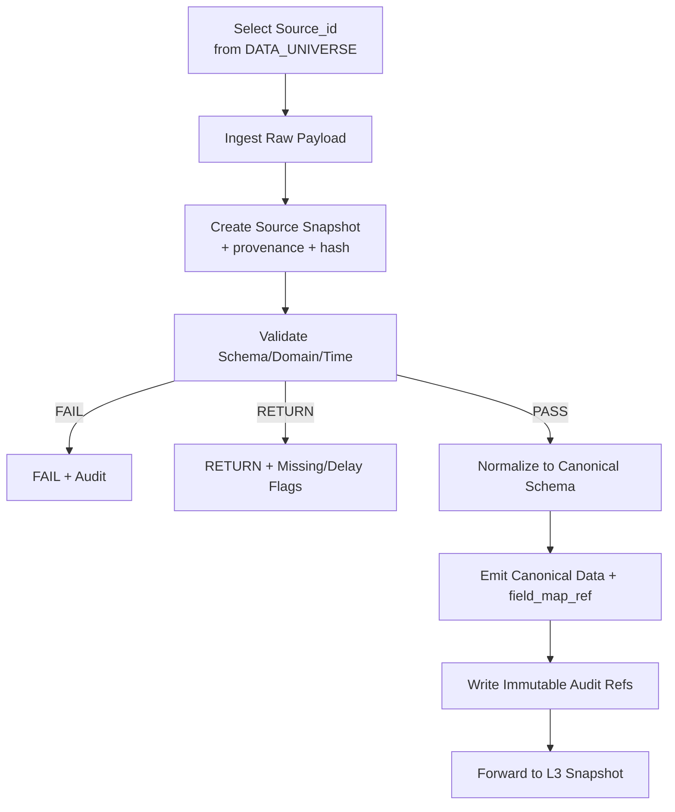

# TAITS_資料來源全集（DATA_SOURCES）__260101.md
doc_key：DATA_SOURCES  
適用範圍：TAITS 全系統（Research / Backtest / Simulation / Paper / Live）  
版本狀態：ACTIVE（資料來源全集可 Only-Add 擴充；不得弱化官方優先與可追溯）  
版本日期：2026-01-01  
變更原則：Only-Add（只可新增，不可刪減/覆寫/偷換資料語義；不得用第三方裁決制度）  
核心鐵律：官方資料優先；多層Fallback；Provenance 可追溯；Snapshot 可回放；資料品質可審計；缺證據不得裁決


## 全局定錨｜單一口徑（S1）

### 1. 人類最高決策者主權（SOVEREIGNTY）
- TAITS 之唯一最高主權屬於人類最高決策者（產品負責人／架構裁決者）。
- 任何治理閘門、程序規則、Agent、文件等級不得凌駕人類主權；不得以程序性理由阻止人類明確命令之生效。
- 風險與合規（Risk/Compliance）在無人類明確命令時可否決；在有人類明確命令時必須輸出完整風險揭露與替代方案，並以「強制揭露＋確認＋全紀錄」承接，不得卡死更新。

### 2. L9–L11 最終語義（跨文件一致）
- L9（投資報告層）：可追蹤、可更新、可標的化投資報告；必含數據、圖形、條件式進出場建議（非指令）、風險敘述、追蹤欄位（狀態/更新時間/依據來源），並支援事件驅動滾動更新。
- L10（人類裁決層）：由人類最高決策者裁決不動作/回測/模擬/半自動/全自動等；任何交易型態皆以 L10 明確裁決為準。
- L11（工程稽核回放層）：對 L1–L11 全層輸入/處理/輸出/裁決/執行鏈路留痕，供人類與工程端可讀、可查、可回放；L11 非下單決策層。

### 3. HFI｜人類明確命令（可執行觸發）
- 格式：`HFI: <scope> | <action> | <intent> | <acknowledgement>`
- 有效 HFI 存在時：Freeze/Only-Add/Gate 不得阻擋 scope 範圍內之更新/覆寫/重排版；並必須同步產生稽核承接（VERSION_AUDIT 留痕、HASH_MANIFEST、CHANGELOG）。

---

## 治理補強（已整合為正文）

上位裁決：DOCUMENT_INDEX → MASTER_ARCH → MASTER_CANON  
目的：修補本文件內部「中繼資料（doc header/附錄標示）」與 DOCUMENT_INDEX 裁決表之不一致，並鎖定引用規則，避免 Gate 命中「引用非法」而導致 BLOCK。

---

## 0.1 裁決來源（不可否認）
依 DOCUMENT_INDEX（治理有效文件清單）之裁決，本文件之唯一合法身份為：
- doc_key：DATA_SOURCES
- 治理等級：B
- 版本狀態：ACTIVE

以上三項為 Index 表格裁決效力範圍（doc_key / 治理等級 / 版本狀態），不得以文件內文自改或自封更高/不同位階。

---

## 0.2 本文件內「DATA_UNIVERSE」之法律定位（名詞 ≠ doc_key）
本文件既有段落中出現之「DATA_UNIVERSE」：
- 一律視為「資料來源宇宙（Data Universe）」之概念名詞／閱讀用別名（alias）
- **不得**被解讀為新的 doc_key
- **不得**被用作任何系統引用、Gate 檢核引用、稽核引用之 doc_key

---

## 0.3 引用合法性硬規則（Gate 對齊｜不可放寬）
在 FILE UPDATE MODE 與 Freeze v1.0 下，所有系統與文件引用一律遵守：
- 任何引用本文件時，唯一合法 doc_key = `DATA_SOURCES`
- 在 DOCUMENT_INDEX 未新增且裁決 `DATA_UNIVERSE` 為 ACTIVE 前：
  - 禁止任何流程、Gate、Evidence、Audit、UI Trace 以 `DATA_UNIVERSE` 作為 doc_key 引用
  - 若出現此類引用：視為「引用非法」，依 Gate 規則必須 BLOCK（不可補救）

---

## 0.4 版本與稽核要求（Only-Add）
- 僅以新增修正說明段落達成一致性（不刪改原文）
- 後續若需將 `DATA_UNIVERSE` 升格為獨立治理文件：
  - 必須以「新增新文件＋新增 Index 條目」方式處理
  - 並在 DOCUMENT_INDEX 明確裁決 DATA_SOURCES 與 DATA_UNIVERSE 之關係（舊新、覆蓋、適用範圍）
  - Freeze v1.0 下不得以新增條目形式變相改寫既有裁決序位或 Canonical Flow

---

---

## 治理補強（已整合為正文）

上位裁決：Index Gate（DOCUMENT_INDEX）＋治理等級覆蓋（A+ > A > B > C）＋衝突裁決程序（DOCUMENT_INDEX §6）  
目的：在不改寫既有主文/附錄之情況下，提供「引用端（人/工具/AI）」的硬規則與可貼用模板，避免因摘錄或複製附錄片段而誤用 `DATA_UNIVERSE` 作為 doc_key，導致 Gate 命中「引用非法」而 BLOCK。

---

## 治理補強（已整合為正文）

- 工具（例如 IDE / 搜尋索引 / 知識庫）以段落為單位建立引用索引
- AI 在生成答案時引用片段（含 UI Trace / Evidence / Audit 文本）
- 稽核者於版本回放時，需確認引用端 doc_key 是否合法

- 任何「變相更名 doc_key」或「新增新 doc_key」之制度變更
- 任何「重排覆蓋規則」或「改寫衝突裁決程序」之行為
- 任何「修改 Canonical Flow（L1–L11）」之行為

---

## 0.2 防誤用硬規則（Anti-Misuse Hard Rules｜不可放寬）

### 0.2.1 doc_key 的唯一合法值（引用端硬規則）

- 唯一合法 doc_key **必須**為：`DATA_SOURCES`
- 任何片段內出現 `doc_key：DATA_SOURCES`、`TAITS_資料來源全集（DATA_UNIVERSE）` 等字樣：
  - 一律視為「歷史殘留的中繼資料標示（Metadata Discrepancy）」
  - 僅具閱讀別名（alias）用途
  - **不具** doc_key 法律效力
  - **不得**被複製到任何引用欄位（doc_key / evidence_doc_key / audit_doc_key / ui_doc_key / gate_doc_key）

### 0.2.2 禁止的行為（一律視為引用非法）
以下任一情況出現，必須視為「引用非法」並依 Gate 規則 BLOCK（不得補救）：

- 在任何文件/流程/稽核/證據輸出中，將 `DATA_UNIVERSE` 作為 doc_key  
- 在引用模板中出現 `doc_key=DATA_UNIVERSE` 或等價表示  

---

## 0.3 摘錄安全標頭（Excerpt Safety Header｜可直接貼用）

請在摘錄片段最前方，加入下列標頭（不得改寫語義；可原封貼上）：

```text
〔引用安全標頭｜TAITS｜Freeze v1.0｜Only-Add〕
source_doc_key = DATA_SOURCES
source_doc_name = TAITS_資料來源全集（DATA_SOURCES）__251219.md
alias_note = 本片段若出現「DATA_UNIVERSE」僅為概念別名/歷史殘留標示，不具 doc_key 法律效力
index_gate = 以 DOCUMENT_INDEX 裁決之 doc_key / 治理等級 / 版本狀態 為準
audit_anchor = VERSION_AUDIT:VA-METADATA_FIX-20251227-0001
〔/引用安全標頭〕
```

---

## 0.4 引用端「最小合規格式」模板（Gate-Friendly Reference Template）

用途：統一引用格式，讓 Gate / Audit 可機器化檢核，避免因人為格式差異造成引用模糊。

建議引用格式（可直接貼用）：

```text
ref_doc_key = DATA_SOURCES
ref_doc_version = 2025-12-19
ref_excerpt_hash = <可選：若已對摘錄做 hash>
```

---

## 0.5 工具/AI 複製規則（Tooling Rule｜不可被跳過）

凡工具或 AI 進行「片段抽取、引用、摘要、重組」時，必須遵守：

- 抽取片段若含 `doc_key：DATA_SOURCES`：
  - **不得**將其提升為 doc_key
  - 必須自動附加「Excerpt Safety Header」（見 0.3）或在引用格式內加入 alias_note
- 任何輸出若缺少 `ref_doc_key = DATA_SOURCES`：
  - 一律視為「引用不完整」→ RETURN（需補齊）或 BLOCK（依 Gate/Policy）
- 不得以「模型推測」補完缺失引用；缺就標記缺，並返回上游補齊（Only-Add 的流程精神）

---

## 0.6 格式性修補宣告（Mermaid Fence Patch｜Only-Add）

本文件若存在 Mermaid 區塊缺失結尾 fence（```），將造成後段章節被誤判為 code block，影響引用定位與稽核可讀性。

- 不改寫 Mermaid 內容
- 不刪改後續章節文字
- 僅補上必要的結尾 fence，以恢復正確的 Markdown 區塊邊界

【文件閱讀與 Canonical 對位指引（Only-Add）】

本文件主體內容定義 TAITS DATA_SOURCES（DATA_UNIVERSE）之資料來源分類、
來源優先序與基本資料治理規範。
為依據 MASTER_CANON（Canonical Flow L1–L11）
所新增之資料層責任邊界、可回放性與稽核對位說明。

本指引僅作閱讀與治理定位用途，
不構成對主文條款之修改，
所有裁決優先序仍依 DOCUMENT_INDEX → MASTER_ARCH → MASTER_CANON 為準。

---

## 0. 文件定位（DataSources Universe Charter）

本文件定義 TAITS 的「資料來源全集（Data Universe）」與其治理規範，用於：

- 列出 TAITS 允許使用的資料來源（Source Registry），並分級：
  - 官方（Primary）
  - 準官方/交易所授權（Secondary）
  - 第三方（Fallback；僅輔助，不得裁決制度）
- 定義每個資料源的：
  - 來源網址、端點、更新頻率、可用性與限制
  - 欄位語義與正規化策略（Canonical Schema）
  - Provenance（來源追溯）要求與稽核輸出
  - 失效模式與降級策略（RETURN / FAIL / BLOCK）
- 確保資料層（L1–L2）輸入可被：
  - 回放（Replayable）
  - 稽核（Auditable）
  - 追責（Traceable）
- 支援 TAITS 以台灣市場（TWSE/TPEX/TAIFEX）為主軸的長期演進（Only-Add）

📌 本文件不做的事（避免越權）：
- 不替代官方制度裁決（制度以 TWSE_RULES 與官方來源為準）
- 不把第三方資料當作制度裁決依據
- 不定義策略與下單（策略在 STRATEGY_UNIVERSE；下單在 EXECUTION_CONTROL）
- 專注：資料來源的「名錄、治理、追溯、正規化、品質、降級」

---

## 1. 官方資料來源入口（Official Sources｜必須提供可追溯網址）

注意：此處列的是「官方入口」。實際抓取端點/檔案格式可能隨時間調整；  
TAITS 必須透過 Rulebook Snapshot / Source Snapshot 保留當下使用的引用證據（VERSION_AUDIT）。

### 1.1 TWSE（臺灣證券交易所）
- 官網首頁  
  https://www.twse.com.tw/
- 規章/法規查詢（制度裁決入口）  
  https://twse-regulation.twse.com.tw/

### 1.2 TPEX（櫃買中心）
- 官網首頁  
  https://www.tpex.org.tw/

### 1.3 TAIFEX（臺灣期貨交易所）
- 官網首頁  
  https://www.taifex.com.tw/

### 1.4 MOPS（公開資訊觀測站｜公司公告/財報）
- 官網入口  
  https://mops.twse.com.tw/

### 1.5 TDCC（集保結算所｜股權分散/庫存等）
- 官網入口  
  https://www.tdcc.com.tw/

### 1.6 CBC（中央銀行｜利率/匯率/統計）
- 官網入口  
  https://www.cbc.gov.tw/

### 1.7 DGBAS（主計總處｜物價/景氣/統計）
- 官網入口  
  https://www.dgbas.gov.tw/

### 1.8 FSC（金管會｜法規/公告）
- 官網入口  
  https://www.fsc.gov.tw/

---

## 2. 資料治理總原則（Data Governance Hard Principles）

### 2.1 官方優先（Official-First）
- 同一資料類別若存在官方來源：
  - 預設採官方
  - 第三方僅能作 fallback / 補齊 / 交叉驗證
- 第三方資料不得用於：
  - 裁決制度（合規）
  - 取代官方公告的法律地位

### 2.2 多層 Fallback（Multi-tier Fallback）
每個資料類別必須定義至少：
- Primary（官方）
- Secondary（準官方/授權/可驗證）
- Fallback（第三方；需標記 provenance 與信任降級）

### 2.3 Provenance（來源追溯）不可省略
任何資料進入 L2（Canonical Data）之前，必須具備：
- `source_id`
- `source_urls[]` / `endpoint_ref`
- `captured_at`
- `raw_payload_ref`（或可重建等價引用）
- `hash_manifest_ref`

缺任一項：不得進入 Evidence 裁決鏈（RETURN/BLOCK 依政策）

### 2.4 語義不可偷換（Semantic Integrity）
- 欄位名稱相同不代表語義相同
- 正規化（Normalization）必須保留：
  - 欄位映射（field_map_ref）
  - 轉換規則版本（normalization_ruleset_version）

### 2.5 資料品質可審計（Data Quality Auditable）
- 每次 ingest 必須產生 Quality Flags：
  - 缺漏、延遲、異常、跳變、疑似錯誤
- 品質不足不得靜默修補；必須降級（RETURN/FAIL）並在 UI/稽核可見

---

## 3. 資料分類體系（Data Taxonomy｜TAITS 統一分類）

目的：建立「資料類別」→「來源」→「正規化」→「用途與限制」的可治理結構。

### 3.1 Market Data（市場交易資料）
- 現貨：價格、成交量、成交額、委買委賣、逐筆（若可取得）
- 衍生性：期貨/選擇權行情、未平倉量、結算價、保證金資訊（若官方提供）

### 3.2 Reference Data（參考資料）
- 股票基本資料、代碼、產業別、ETF/權證資訊
- 交易日曆、交易時段

### 3.3 Corporate Actions（公司行為）
- 除權息、分割、合併、停止過戶、減資增資等（以官方公告/公司公告為準）

### 3.4 Fundamentals（基本面/財報）
- 財務報表、重大訊息、法說會、董事會決議、內部人持股等（MOPS）

### 3.5 Ownership / Flow（籌碼/資金流）
- 三大法人、融資融券、借券、集保股權分散（官方/準官方來源優先）

### 3.6 Macro（宏觀）
- 利率、匯率、景氣、物價、經濟指標（CBC/DGBAS 等）

### 3.7 News / Events（新聞/事件）
- 官方公告（交易所公告、公司公告）優先
- 其他新聞作輔助（不得替代官方裁決）

### 3.8 Alternative / Derived（替代/衍生）
- 由上述資料計算之衍生欄位（須可回放：依賴輸入 refs + 版本）

---

## 4. Source Registry（資料來源註冊表）資料結構（可落地）

TAITS 將每個資料來源定義為一筆「可版本化」的 Source Record（Only-Add）。

### 4.1 Source Record（最小欄位，不可縮減）
- `source_id`（全域唯一）
- `source_name_zh` / `source_name_en`
- `scope`：TWSE/TPEX/TAIFEX/MOPS/TDCC/CBC/DGBAS/FSC/ThirdParty/…  
- `tier`：PRIMARY / SECONDARY / FALLBACK
- `data_categories[]`（對應 3.x taxonomy）
- `official_urls[]`（官方入口或來源頁）
- `access_method`：HTTP/FTP/ManualDownload/API/WebSocket/…
- `update_frequency`：real-time / minute / daily / monthly / event-driven
- `availability`：expected uptime / schedule
- `rate_limits`：若有（未知則標註 unknown + 監測）
- `licensing_notes`：授權/使用限制（不確定時必須標註與降級）
- `provenance_requirements`：必須保存哪些證據（html/pdf/headers/hash）
- `fallback_chain[]`：此來源失效時可用的替代來源 source_id
- `normalized_schema_id`：正規化後 schema
- `normalization_ruleset_version`
- `quality_checks[]`：此來源必做的品質檢查
- `failure_modes[]`：FAIL/RETURN/BLOCK 條件與 reason codes
- `owner_module`：DataSources Adapter / Collector / Validator
- `security_class`：PUBLIC / SENSITIVE / RESTRICTED

### 4.2 Source Snapshot（來源快照）
每次實際抓取/使用一個來源，必須產生 Source Snapshot：
- `source_snapshot_id`
- `source_id`
- `captured_at`
- `endpoint_ref`（含 URL、參數、headers（需脫敏））
- `raw_payload_ref`
- `hash_manifest_ref`
- `quality_report_ref`
- `active_version_map_ref`

---

## 5. TAITS Canonical Schema（資料正規化標準｜骨架）

注意：此處是「架構骨架」。具體欄位細表可在後續 Only-Add 擴充成 `schemas/` 文件；  
但本骨架不可刪減，避免後續偷換語義。

### 5.1 Canonical Entity Keys（統一鍵）
- `instrument_id`：內部統一標的主鍵
- `symbol`：市場代碼（例如 2330）
- `market`：TWSE / TPEX / TAIFEX
- `instrument_type`：EQUITY / ETF / FUTURES / OPTIONS / WARRANT …
- `trading_date` / `timestamp`
- `currency`：TWD（或其他）

### 5.2 Market Bar（K 線/聚合行情）
- `open/high/low/close`
- `volume`（成交量）
- `turnover`（成交額）
- `vwap`（若可）
- `bar_interval`（1m/5m/1d…）
- `data_quality_flags[]`

### 5.3 Orderbook / Quote（委買委賣）
- `bid_prices[]/bid_sizes[]`
- `ask_prices[]/ask_sizes[]`
- `quote_timestamp`

### 5.4 Corporate Actions（公司行為）
- `action_type`
- `effective_date`
- `adjustment_factor`
- `source_ref`（公告引用）

### 5.5 Fundamentals（財務）
- `period`
- `statement_type`（BS/IS/CF）
- `fields{}`（結構化欄位集合）
- `filing_ref`（公告引用）

### 5.6 Ownership / Flow（籌碼）
- `institution_type`（外資/投信/自營…）
- `net_buy_sell`
- `margin_balance` / `short_balance`（若有）
- `tdcc_distribution_ref`（若有）

### 5.7 Macro（宏觀）
- `series_id`
- `value`
- `release_date`
- `revision`（若有）

---

## 6. 資料來源全集（Source Universe｜最大完備清單骨架）

你要求「最大完備」：此處提供 TAITS 台灣市場常用來源全集「骨架清單」。  
實際可用欄位/端點差異，由 Source Record 的 `access_method/endpoint_ref` 與 Snapshot 保證可追溯。  
**Only-Add**：你之後可直接新增來源，不需要改舊的。

### 6.1 PRIMARY（官方/最高優先）

#### 6.1.1 TWSE（上市）
- `SRC_TWSE_MARKETDATA`：現貨行情/收盤資訊（官方入口）  
  官方入口：https://www.twse.com.tw/
- `SRC_TWSE_ANNOUNCEMENTS`：交易所公告（停牌、處置、制度異動等）  
  官方入口：https://www.twse.com.tw/  
- `SRC_TWSE_REGULATION`：規章法規（制度裁決）  
  官方入口：https://twse-regulation.twse.com.tw/

#### 6.1.2 TPEX（上櫃）
- `SRC_TPEX_MARKETDATA`：上櫃行情/收盤資訊  
  官方入口：https://www.tpex.org.tw/
- `SRC_TPEX_ANNOUNCEMENTS`：櫃買公告/制度  
  官方入口：https://www.tpex.org.tw/

#### 6.1.3 TAIFEX（期貨/選擇權）
- `SRC_TAIFEX_MARKETDATA`：期貨/選擇權行情、結算等  
  官方入口：https://www.taifex.com.tw/
- `SRC_TAIFEX_RULES`：期貨制度  
  官方入口：https://www.taifex.com.tw/

#### 6.1.4 MOPS（公司公告/財報）
- `SRC_MOPS_FILINGS`：重大訊息、財報、公告  
  官方入口：https://mops.twse.com.tw/

#### 6.1.5 TDCC（集保）
- `SRC_TDCC_OWNERSHIP`：股權分散/股東結構（依可取得範圍）  
  官方入口：https://www.tdcc.com.tw/

#### 6.1.6 CBC / DGBAS / FSC（宏觀與監管）
- `SRC_CBC_MACRO`：利率、匯率、統計  
  官方入口：https://www.cbc.gov.tw/
- `SRC_DGBAS_MACRO`：景氣、物價、統計  
  官方入口：https://www.dgbas.gov.tw/
- `SRC_FSC_REGULATORY`：監理公告/法規  
  官方入口：https://www.fsc.gov.tw/

---

### 6.2 SECONDARY（準官方/授權/可驗證）

此層需能「回指官方或具可驗證性」，且必須標註授權與限制。

- `SRC_BROKER_API_QUOTES`：券商行情/報價（以券商官方 API 文件為準）  
  限制：不得取代官方制度裁決；僅作即時通道與交叉驗證  
- `SRC_BROKER_API_ORDERS`：券商委託/回報（執行必需）  
  限制：敏感級別最高（RESTRICTED），嚴禁進 repo/log 明文  
- `SRC_BANK_RATES`：銀行公開匯率/利率（若需）  
  限制：需可追溯來源頁面與時間戳  

---

### 6.3 FALLBACK（第三方｜只作補齊/交叉驗證，不得裁決制度）

必須特別強調：第三方可用於研究/便利性，但不得裁決制度；  
若官方缺失，應降級為不可裁決（RETURN/BLOCK），而不是用第三方「硬判」。

- `SRC_YAHOO_FINANCE`：行情/新聞（交叉驗證/研究用）  
- `SRC_CNYES`：新聞/市場資訊（研究用）  
- `SRC_FINMIND`：資料整合（研究/回測便利；需標註來源）  
- `SRC_OTHER_DATA_AGGREGATORS`：其他聚合器（需審核授權/品質/可追溯）

---

## 7. DataSources Adapter（適配器）標準（L1 實作硬規格）

FULL_ARCH 要求模組介面契約；此處給 Data Adapter 的「最大完備」規範。

### 7.1 Adapter 必須輸出
- `DataIngested` contract（含 provenance_ref / raw_payload_ref / hash_manifest_ref）
- `quality_report_ref`（至少包含：延遲、缺漏、格式錯誤、值域檢查）

### 7.2 Adapter 禁止事項
- 靜默補值或改值
- 把第三方資料假冒官方
- 省略來源證據（URL/headers/抓取時間/校驗）

### 7.3 Adapter 失效模式（標準化）
- `FAIL`：來源不可達、格式不可解析、頻率超限且不可恢復
- `RETURN`：暫時資料不足（可重試/等待）
- `BLOCK`：provenance 缺失、版本映射缺失、稽核不可寫入

---

## 8. Data Validator（驗證器）規範（L1-L2）

### 8.1 驗證類型（最小集合）
- Schema Validation（欄位存在、型別）
- Domain Validation（值域、單位、合理範圍）
- Temporal Validation（時間戳遞增/交易時段一致）
- Cross-Source Consistency（交叉一致性，僅標記不裁決）
- Corporate Action Consistency（除權息調整一致性）

### 8.2 Quality Flags（必須輸出）
- `MISSING_FIELDS`
- `DELAYED_SOURCE`
- `OUT_OF_RANGE`
- `SUSPECT_SPIKE`
- `INCONSISTENT_WITH_OFFICIAL`
- `UNKNOWN_SCHEMA_VERSION`

---

## 9. Normalizer（正規化器）規範（L2｜語義鎖定）

### 9.1 必須保留（不可縮減）
- `field_map_ref`：原欄位 → canonical 欄位
- `unit_transform_ref`：單位換算（股→張、元→分等）
- `timezone_transform_ref`
- `corporate_action_adjustment_ref`（若有）

### 9.2 硬禁
- 用「方便」為理由改寫語義
- 讓同一 canonical 欄位在不同來源代表不同含義

---

## 10. Fallback 策略（Failover / Degradation｜最大完備）

TAITS 必須把「資料失效」制度化，而不是臨場反應。

### 10.1 Fallback 原則
- 優先同級官方替代（TWSE ↔ TPEX 分域，不可亂替）
- 次優先準官方/授權（券商）
- 最後才第三方（且必須降級信任）

### 10.2 降級輸出（必須讓下游知道）
- `source_tier_used`：PRIMARY/SECONDARY/FALLBACK
- `trust_level`：HIGH/MEDIUM/LOW
- `compliance_eligible`：true/false（第三方通常為 false）
- `notes_ref`：降級原因（reason codes）

---

## 11. 稽核與回放要求（Audit & Replay Requirements｜強制）

每次資料 ingest（L1-L2）必須產生：
- `source_snapshot_ref`
- `raw_payload_ref`
- `hash_manifest_ref`
- `quality_report_ref`
- 納入 `active_version_map_ref`

並且在回放（Replay）時可重建：
- 同一份 canonical data（或可解釋差異）
- 同一份證據鏈（Evidence Bundle 的 provenance map 不斷裂）

---

## 12. Mermaid｜資料來源治理流程（L1-L2）

```mermaid
```
flowchart TB
  A[Select Source_id<br/>from DATA_UNIVERSE] --> B[Ingest Raw Payload]
  B --> C[Create Source Snapshot<br/>+ provenance + hash]
  C --> D[Validate Schema/Domain/Time]
  D -->|FAIL| X[FAIL + Audit]
  D -->|RETURN| R[RETURN + Missing/Delay Flags]
  D -->|PASS| E[Normalize to Canonical Schema]
  E --> F[Emit Canonical Data + field_map_ref]
  F --> G[Write Immutable Audit Refs]
  G --> H[Forward to L3 Snapshot]

13. Only-Add 演進規則（DATA_UNIVERSE 專屬）
允許新增：

新來源（source_id）

新資料類別與 schema（以版本追加）

新驗證規則與 quality flags（更嚴格）

新 fallback 鏈（但不得讓第三方升格為制度裁決）

禁止：

刪除既有 source_id 或改寫其歷史語義

移除官方入口與 provenance 要求

用第三方來源裁決制度或取代官方公告

允許缺 provenance / 缺 snapshot / 缺 hash 的資料進入 Evidence 裁決鏈

14. 終極裁決語句（不可更改）
資料不是越多越好，而是「越可追溯越好」。
任何無法回指來源、無法生成快照、無法稽核回放的資料，都不允許進入 TAITS 的裁決鏈。

（DATA_UNIVERSE｜最大完備版 v2025-12-19 · Part 1 完）

# TAITS_資料來源全集（DATA_SOURCES）__251219
## Part 2｜台股資料子類別全集 × 官方優先 × Provenance 必備清單（最大完備）

doc_key：DATA_SOURCES  
治理等級：D（DataSources Universe｜官方優先 × 多層Fallback × 可追溯Provenance）  
適用範圍：TAITS 全系統（Research / Backtest / Simulation / Paper / Live）  
版本狀態：ACTIVE（資料來源全集可 Only-Add 擴充；不得弱化官方優先與可追溯）  
版本日期：2026-01-01  
變更原則：Only-Add（只可新增，不可刪減/覆寫/偷換資料語義；不得用第三方裁決制度）  
核心鐵律：官方資料優先；多層Fallback；Provenance 可追溯；Snapshot 可回放；資料品質可審計；缺證據不得裁決

---

## 15. 子類別總覽（Data Subcategory Catalog｜台灣市場最大完備骨架）

本節把「台灣市場常用資料」拆成可治理的子類別（Subcategory），每一項都定義：
- Primary（官方優先）入口
- Secondary（準官方/授權）
- Fallback（第三方；僅補齊/交叉驗證，不得裁決制度）
- 必備 Provenance（抓取證據）與不可縮減欄位
- 典型品質檢查與失效模式（FAIL/RETURN/BLOCK）

---

## 16. 市場交易資料（Market Data）

### 16.1 現貨：日行情（EOD Daily Bars）
- subcategory_id：`MD_EQUITY_EOD_DAILY`
- Primary：
  - TWSE：https://www.twse.com.tw/
  - TPEX：https://www.tpex.org.tw/
- Secondary：
  - 券商行情 API（授權/可驗證）：`SRC_BROKER_API_QUOTES`
- Fallback：
  - Yahoo / 聚合器（研究用）：`SRC_YAHOO_FINANCE`, `SRC_FINMIND`, `SRC_CNYES`
- 必備 Provenance（不可縮減）：
  - `source_urls[]`（含查詢頁/下載頁/公告頁）
  - `captured_at`
  - `raw_payload_ref`（CSV/JSON/HTML/PDF 任一形式）
  - `hash_manifest_ref`
  - `field_map_ref`（原欄位→canonical）
- Canonical 最小欄位：
  - `symbol, market, trading_date, open, high, low, close, volume, turnover`
- 品質檢查（最小集合）：
  - 交易日曆一致性、缺漏、異常跳變、值域檢查
- 失效模式：
  - Primary FAIL → Secondary；Secondary FAIL → Fallback（需標記 trust_level=LOW）
  - 若用於合規/裁決鏈且非官方 → `compliance_eligible=false`

### 16.2 現貨：盤中即時報價（Intraday Quotes）
- subcategory_id：`MD_EQUITY_INTRADAY_QUOTES`
- Primary：
  - （以交易所可用之即時資訊入口為準，若無可用/授權限制 → 不視為 Primary 可抓取）
  - TWSE：https://www.twse.com.tw/
  - TPEX：https://www.tpex.org.tw/
- Secondary（常見實務）：
  - 券商即時行情 API：`SRC_BROKER_API_QUOTES`
- Fallback：
  - 第三方即時盤（研究/視覺化）：`SRC_CNYES`, `SRC_YAHOO_FINANCE`
- Provenance：
  - 必須保存 `endpoint_ref`（參數、headers 脫敏）+ `captured_at` + `hash_manifest_ref`
- Canonical 最小欄位：
  - `symbol, timestamp, last, volume, turnover, bid/ask (若有), session_state`
- 重要限制：
  - 即時行情常受授權限制；必須在 `licensing_notes` 標註，未明確授權時不得宣稱可商用/可長期穩定

### 16.3 現貨：逐筆（Tick / Trades）與委買委賣（Orderbook）
- subcategory_id：`MD_EQUITY_TICKS`, `MD_EQUITY_ORDERBOOK`
- Primary：依官方/授權可得性判定（不確定 → 以 Secondary/RESTRICTED 管理）
- Secondary：
  - 券商/授權供應商（若有）：`SRC_BROKER_API_QUOTES`
- Fallback：第三方（僅研究）
- Provenance（加嚴）：
  - 必須保存原始事件流（或可重建等價引用），禁止只存聚合摘要
- Canonical（示例最小欄位）：
  - Trades：`timestamp, price, size, aggressor_flag(optional)`
  - Orderbook：`bid_prices/sizes[], ask_prices/sizes[]`
- 失效模式：
  - 無法保存原始事件流 → `RETURN`（不可進入回放裁決鏈）

### 16.4 期貨/選擇權：日行情/盤中（TAIFEX）
- subcategory_id：`MD_DERIV_EOD`, `MD_DERIV_INTRADAY`
- Primary：
  - TAIFEX：https://www.taifex.com.tw/
- Secondary：
  - 券商衍生品行情 API（授權）：`SRC_BROKER_API_QUOTES`
- Provenance：
  - `source_urls[]` + `captured_at` + `raw_payload_ref` + `hash_manifest_ref`
- Canonical 最小欄位：
  - `product_id, contract_month, trading_date/timestamp, ohlc, volume, open_interest, settlement(optional)`
- 品質檢查：
  - 合約月切換一致性、OI 跳變、結算價一致性（若可取得）

---

## 17. 參考資料（Reference Data）

### 17.1 商品/標的基本資料（Symbol Master）
- subcategory_id：`REF_SYMBOL_MASTER`
- Primary：
  - TWSE：https://www.twse.com.tw/
  - TPEX：https://www.tpex.org.tw/
  - TAIFEX：https://www.taifex.com.tw/
- Secondary：
  - 券商商品主檔（僅作補齊）
- Provenance：
  - 必須保存「代碼變更」與「停用/新增」的來源證據（公告/清單）
- Canonical 最小欄位：
  - `instrument_id, symbol, market, instrument_type, name_zh, list_date, status`
- 失效模式：
  - 主檔不一致 → 標記 `INCONSISTENT_WITH_OFFICIAL`，不得靜默合併

### 17.2 交易日曆/交易時段（Calendar & Session）
- subcategory_id：`REF_TRADING_CALENDAR`, `REF_SESSION_SCHEDULE`
- Primary：
  - TWSE：https://www.twse.com.tw/
  - TPEX：https://www.tpex.org.tw/
  - TAIFEX：https://www.taifex.com.tw/
- Provenance：
  - 必須保存交易日曆擷取時間與來源頁
- 用途限制（強制）：
  - 任何送單/合規判定必須依此資料；缺失 → `RETURN/BLOCK`（依 TWSE_RULES/RISK_COMPLIANCE）

### 17.3 產業分類/ETF 成分/商品規格
- subcategory_id：`REF_INDUSTRY_CLASS`, `REF_ETF_CONSTITUENTS`, `REF_DERIV_CONTRACT_SPECS`
- Primary：
  - TWSE/TPEX（分類）
  - TAIFEX（合約規格）
- Provenance：
  - 成分股/規格具有版本性（必須保存日期與快照）
- 失效模式：
  - 成分股缺快照 → 不可回放 → `RETURN`

---

## 18. 公司行為（Corporate Actions）

### 18.1 除權息/分割/合併/減資增資（CA Master）
- subcategory_id：`CA_MASTER`
- Primary：
  - MOPS：https://mops.twse.com.tw/
  - 交易所公告（TWSE/TPEX）：https://www.twse.com.tw/ / https://www.tpex.org.tw/
- Secondary：
  - 券商公司行為資料（僅補齊）
- Provenance（加嚴）：
  - 必須保存公告原文引用（公告頁或 PDF）
  - 必須保存生效日與調整係數計算依據
- Canonical 最小欄位：
  - `symbol, action_type, effective_date, factor, announcement_ref`
- 重要限制：
  - 任何價格調整若無公告引用 → `BLOCK`（語義不可被「猜測」）

### 18.2 停止過戶/權利變更期間
- subcategory_id：`CA_BOOKCLOSURE`
- Primary：
  - MOPS / 交易所公告
- Provenance：
  - `announcement_ref` 必填（原文證據）
- 用途：
  - 影響可交易性/回測調整窗口

---

## 19. 基本面與揭露（Fundamentals / Disclosures）

### 19.1 財務報表（BS/IS/CF）
- subcategory_id：`FD_FIN_STATEMENTS`
- Primary：
  - MOPS：https://mops.twse.com.tw/
- Provenance（加嚴）：
  - 必須保存申報版本、申報日期、原文引用
- Canonical 最小欄位：
  - `symbol, period, statement_type, fields{}, filing_ref`
- 品質檢查：
  - 期別一致性、欄位缺漏、修正申報（revision）處理

### 19.2 重大訊息/公告（Material Information）
- subcategory_id：`FD_MATERIAL_EVENTS`
- Primary：
  - MOPS：https://mops.twse.com.tw/
- Provenance：
  - 公告編號/時間/原文引用
- 用途限制：
  - 可作事件特徵與證據；不得作「制度裁決」替代

### 19.3 董監事/內部人持股、股權異動（若可取）
- subcategory_id：`FD_INSIDER_OWNERSHIP`
- Primary：
  - MOPS / 官方揭露入口
- Provenance：
  - 必須保存揭露原文引用與時間戳

---

## 20. 籌碼/資金流（Ownership / Flow）

### 20.1 三大法人買賣超（Institutional Flows）
- subcategory_id：`OF_INSTITUTIONAL_NET`
- Primary：
  - TWSE：https://www.twse.com.tw/
  - TPEX：https://www.tpex.org.tw/
- Secondary：
  - 券商彙整（僅補齊/交叉驗證）
- Provenance：
  - 必須保存官方查詢頁/下載頁引用與擷取時間
- Canonical 最小欄位：
  - `symbol, trading_date, inst_type, net_buy_sell, volume/amount(optional)`

### 20.2 融資融券（Margin/Short）
- subcategory_id：`OF_MARGIN_SHORT`
- Primary：
  - TWSE/TPEX 官方入口
- Provenance：
  - 必須保存官方引用；此資料可能影響合規（若策略涉及信用交易），但制度裁決仍走 TWSE_RULES + rulebook_snapshot
- Canonical 最小欄位：
  - `symbol, trading_date, margin_balance, short_balance, changes`

### 20.3 借券（SBL）與借券餘額（若可取得）
- subcategory_id：`OF_SECURITIES_LENDING`
- Primary：
  - 依官方/準官方可得入口（不確定 → SECONDARY/RESTRICTED）
- Provenance：
  - 必須保存來源證據與授權限制

### 20.4 集保股權分散（TDCC）
- subcategory_id：`OF_TDCC_DISTRIBUTION`
- Primary：
  - TDCC：https://www.tdcc.com.tw/
- Provenance：
  - 必須保存查詢頁引用、擷取時間、欄位版本
- Canonical 最小欄位：
  - `symbol, week/date, holder_bucket, shares, percent`

---

## 21. 市場狀態/制度相關清單（Market Status & Regulatory Lists）

### 21.1 停牌/暫停交易清單
- subcategory_id：`RS_HALT_LIST`
- Primary：
  - TWSE/TPEX 官方公告
- Provenance：
  - 公告原文引用必填
- 用途：
  - 合規觸發（CMP-INSTRUMENT-HALTED）

### 21.2 處置股票/注意/警示等狀態清單
- subcategory_id：`RS_RESTRICTED_LIST`
- Primary：
  - TWSE/TPEX 官方公告/清單
- Provenance：
  - 公告引用必填
- 用途：
  - 合規觸發與風控升級（不得隱藏）

### 21.3 交易制度文本/規章（Rulebook）
- subcategory_id：`RS_RULEBOOK_TEXT`
- Primary：
  - TWSE：https://twse-regulation.twse.com.tw/
  - TAIFEX：https://www.taifex.com.tw/
  - FSC：https://www.fsc.gov.tw/
- 輸出（強制）：
  - 進入 `rulebook_snapshot_ref`（TWSE_RULES 定義）
- 禁止：
  - 以第三方整理裁決制度

---

## 22. 宏觀資料（Macro）

### 22.1 利率/匯率/金融統計
- subcategory_id：`MC_CBC_RATES`, `MC_CBC_STATS`
- Primary：
  - CBC：https://www.cbc.gov.tw/
- Provenance：
  - 必須保存發布日期與修正版本（若有）

### 22.2 物價/景氣/統計
- subcategory_id：`MC_DGBAS_SERIES`
- Primary：
  - DGBAS：https://www.dgbas.gov.tw/
- Provenance：
  - 必須保存 series_id 與發布/修正資訊

---

## 23. 新聞/事件（News / Events）

### 23.1 官方公告事件（優先）
- subcategory_id：`NE_OFFICIAL_ANNOUNCEMENTS`
- Primary：
  - TWSE/TPEX/TAIFEX/MOPS 官方公告入口（見 1.x）
- Provenance（加嚴）：
  - 公告原文引用與時間戳必填
- 用途：
  - 可作事件特徵/Evidence；亦可觸發合規清單更新（但制度裁決仍走 Rulebook Snapshot）

### 23.2 一般新聞（輔助）
- subcategory_id：`NE_PUBLIC_NEWS`
- Fallback：
  - 各新聞網站/聚合器（需授權與可追溯）
- 限制（硬規則）：
  - 不得作制度裁決
  - 不得作唯一證據（需與官方/可驗證證據交叉）

---

## 24. 第三方資料使用守則（Fallback Usage Rules｜硬規則）

### 24.1 允許用途
- 補齊缺漏（例如官方暫時不可用的歷史區段）
- 交叉驗證（Consistency Check）
- UI 便利呈現（非裁決）

### 24.2 禁止用途
- 裁決制度（合規 PASS/VETO）
- 取代公告原文（公司行為/重大訊息）
- 取代交易日曆/交易時段裁決

### 24.3 降級標記（必須）
任何使用 FALLBACK 來源的資料，都必須帶：
- `source_tier_used=FALLBACK`
- `trust_level=LOW`
- `compliance_eligible=false`（預設）
- `notes_ref`（降級原因與替代來源鏈）

---

## 25. 子類別 × L1–L2 輸出契約（對齊 FULL_ARCH）

本節把每個子類別都鎖到 DataIngested / DataNormalized 契約，避免資料自由散落。

### 25.1 L1：DataIngested（每個子類別都必須）
- `source_id`
- `subcategory_id`
- `raw_payload_ref`
- `provenance_ref`
- `captured_at`
- `hash_manifest_ref`
- `quality_report_ref`

### 25.2 L2：DataNormalized（每個子類別都必須）
- `canonical_schema_id`
- `subcategory_id`
- `field_map_ref`
- `normalization_ruleset_version`
- `data_quality_flags[]`

---

## 26. 失效模式與降級策略（Subcategory Failure Playbook）

任何資料子類別都必須在 Source Record 中填寫 failure_modes；以下為統一骨架。

### 26.1 RETURN（資料不足但可補）
- 官方端點暫時不可用、可重試
- 欄位缺漏但可由同級官方補齊
- 交易日曆資料延遲（等待官方更新）

### 26.2 FAIL（來源不可用且不可恢復）
- 長時間不可達（超過政策閾值）
- 格式永久變更且未更新解析器
- 授權/權限失效

### 26.3 BLOCK（系統完整性不足，禁止往下）
- provenance 缺失
- snapshot 無法落盤/不可變更儲存不可用（依環境等級）
- active_version_map_ref 缺失
- hash_manifest_ref 缺失

---

## 27. Mermaid｜「子類別」到「證據鏈」的治理通路

```mermaid
```
flowchart TB
  S[Select subcategory_id<br/>from DATA_UNIVERSE] --> P[Pick Primary Source_id]
  P --> I[L1 DataIngested<br/>raw+prov+hash]
  I --> V[Validator<br/>schema/domain/time]
  V -->|RETURN| R[RETURN + quality_flags]
  V -->|FAIL| F[FAIL + audit]
  V -->|PASS| N[L2 DataNormalized<br/>canonical+field_map]
  N --> L3[L3 SnapshotCreated]
  L3 --> L5[L5 EvidenceAssembled]
28. Only-Add 演進規則（Part 2 專屬補強）
允許新增：

新的子類別（subcategory_id）

每子類別更多官方入口與 mirror（仍屬 Primary/Secondary）

更嚴格的 provenance 要求與 quality checks

更完整的 fallback_chain

禁止：

刪除既有子類別或改寫其語義

降低官方優先與可追溯要求

讓第三方資料升格為制度裁決依據

允許缺 provenance/snapshot/hash 的資料進入裁決鏈

（DATA_UNIVERSE｜最大完備版 v2025-12-19 · Part 2 完）

# TAITS_資料來源全集（DATA_SOURCES）__251219
## Part 3｜資料品質分級（Quality Grades）× Evidence Completeness 門檻映射 × 降級裁決規則（最大完備）

doc_key：DATA_SOURCES  
治理等級：D（DataSources Universe｜官方優先 × 多層Fallback × 可追溯Provenance）  
適用範圍：TAITS 全系統（Research / Backtest / Simulation / Paper / Live）  
版本狀態：ACTIVE（資料來源全集可 Only-Add 擴充；不得弱化官方優先與可追溯）  
版本日期：2026-01-01  
變更原則：Only-Add（只可新增，不可刪減/覆寫/偷換語義；不得用第三方裁決制度）  
核心鐵律：品質不足不得靜默；缺證據不得裁決；降級必可見（UI/Log/Evidence）；合規與風控可直接否決（最高否決權）

---

## 29. 文件目的（Why Part 3 Exists）

Part 1/2 解決「來源全集與子類別」；Part 3 解決「資料能不能被用來裁決」：

- 把資料品質量化成 **Quality Grade（QG）**
- 把證據完整度量化成 **Evidence Completeness（EC）**
- 把不同 EC/QG 組合映射到：
  - L5 Evidence Bundle Completeness
  - L6 Regime 可信度要求
  - L7 Risk/Compliance 的 PASS/VETO/RETURN/BLOCK 行為
- 讓系統在資料不足時「制度化降級」，避免：
  - AI 幻想填空
  - 策略越權用不可靠資料直接推導方向
  - 合規在缺官方快照/缺來源時仍放行

---

## 30. Quality Grade（QG）資料品質分級（不可縮減）

QG 是「資料本身」的品質分級（與策略/判斷無關）。  
每次 L1/L2 ingest/normalize 必須產出 `quality_grade` 與 `quality_flags[]`。

### 30.1 QG 等級定義（Only-Add 可新增更嚴格，不可放寬）

- **QG-A（官方可追溯、可回放、可稽核）**
  - 來源：PRIMARY（官方/法定揭露）
  - Provenance：完整（source_urls + captured_at + raw_payload_ref + hash）
  - Schema：已知且通過校驗
  - 時效：在允許延遲窗內
  - 允許用途：Evidence / Regime / Risk&Compliance / UI / Replay

- **QG-B（準官方/授權可驗證）**
  - 來源：SECONDARY（券商/授權供應商）
  - Provenance：完整（含授權/限制註記）
  - Schema：已知且通過校驗
  - 允許用途：Evidence/Regime（需標註）、Risk（需交叉/門檻更嚴）、UI
  - 合規裁決：僅可作輔助證據，制度裁決仍需官方快照（Rulebook Snapshot）

- **QG-C（第三方可追溯，但信任降級）**
  - 來源：FALLBACK（聚合器/第三方）
  - Provenance：至少有來源頁 + 擷取時間 + 原始回應保存（但可能不可完全驗證）
  - Schema：可能變動或部分欄位缺漏
  - 允許用途：研究、交叉驗證、UI 輔助
  - 禁止用途：合規裁決依據、唯一 Evidence

- **QG-D（不可追溯或不可回放）**
  - 來源不明、缺 raw、缺 hash、缺時間戳
  - 允許用途：無（只能 RETURN/FAIL）
  - 必須行為：阻斷進入 L5（Evidence）

- **QG-X（敏感或非法/未授權風險）**
  - 授權未知/明確禁止/資料取得方式不合法或違反政策
  - 必須行為：BLOCK（SEC/DATA-LICENSE 類 reason codes）

### 30.2 QG 必備欄位（不可縮減）
每個子類別每次輸出都要包含：
- `subcategory_id`
- `source_id`
- `source_tier_used`：PRIMARY/SECONDARY/FALLBACK
- `quality_grade`：QG-A/B/C/D/X
- `quality_flags[]`
- `licensing_notes_ref`（若非 PRIMARY 必填）
- `provenance_ref`
- `hash_manifest_ref`
- `active_version_map_ref`

---

## 31. Quality Flags（品質旗標）統一清單（骨架＋可擴充）

Flags 是「客觀檢測結果」，不得帶方向性語句。Only-Add 可新增，不可刪除既有。

### 31.1 Provenance/Version 類（系統完整性）
- `QF_PROV_MISSING`（缺 provenance）
- `QF_HASH_MISSING`（缺 hash）
- `QF_VERSION_MAP_MISSING`（缺 active_version_map_ref）
- `QF_SCHEMA_UNKNOWN`（schema 不明）
- `QF_LICENSE_UNKNOWN`（授權不明）

### 31.2 時效/延遲類（Timeliness）
- `QF_DELAYED_SOURCE`
- `QF_STALE_DATA`
- `QF_OUT_OF_SESSION`（資料時間不在交易時段/不合交易日曆）

### 31.3 完整性/缺漏類（Completeness）
- `QF_MISSING_FIELDS`
- `QF_MISSING_ROWS`
- `QF_PARTIAL_RESPONSE`

### 31.4 異常/值域類（Validity）
- `QF_OUT_OF_RANGE`
- `QF_SUSPECT_SPIKE`
- `QF_NEGATIVE_VOLUME`
- `QF_INCONSISTENT_OHLC`（如 high < low）

### 31.5 交叉一致性類（Consistency）
- `QF_INCONSISTENT_WITH_OFFICIAL`
- `QF_CROSS_SOURCE_DIVERGENCE`

---

## 32. Evidence Completeness（EC）證據完整度（對齊 L5）

EC 是「本次裁決鏈」的證據完整度，與 QG 不同：  
QG 是資料品質；EC 是證據包是否「足以裁決」。

### 32.1 EC 等級（不可縮減）
- **EC-4（可裁決：完整）**
  - 必備子類別齊全
  - 主要證據 QG-A 為主
  - provenance 完整，hash 完整
  - 可直接進入 L6/L7

- **EC-3（可裁決：不足但可接受）**
  - 次要證據可缺，但關鍵證據存在
  - 允許部分 QG-B/QG-C 作輔助
  - 必須在 Evidence 中標記缺口與不確定性
  - 進入 L6/L7 時需提高風控門檻（policy 可規定）

- **EC-2（不可裁決：需補齊）**
  - 缺關鍵證據或 provenance 不完整
  - 必須 RETURN（回補 L4/L3/L2）
  - 不得進入風控 PASS

- **EC-1（不可裁決：嚴重缺失）**
  - 缺 official/primary 之關鍵來源且無可用替代
  - RETURN 或 FAIL（依情境）

- **EC-0（系統阻斷）**
  - 缺 active_version_map/hash/immutable audit 等系統級硬物
  - 必須 BLOCK

### 32.2 EC 的最小輸出（Evidence Bundle 必帶）
- `evidence_bundle_id`
- `completeness_level`：EC-0~EC-4
- `completeness_score`：0~100（僅輔助，裁決以 level）
- `missing_required_items[]`
- `quality_grade_summary`：各子類別 QG 分布
- `provenance_map_ref`
- `hash_manifest_ref`

---

## 33. EC × 子類別「必備清單」（Required Evidence Sets）

這是最大完備的核心之一：  
不同裁決用途，需要不同「必備證據集合」。缺任一項就必須 RETURN/BLOCK。

### 33.1 用途類型（Decision Context Types）
- `CTX_ORDER_SUBMISSION`：任何送單前裁決（L7/L10/L11）
- `CTX_COMPLIANCE_CHECK`：制度合規判定（L7）
- `CTX_REGIME_DETERMINE`：市場狀態判定（L6）
- `CTX_STRATEGY_PROPOSAL`：策略建議（L8）
- `CTX_BACKTEST_REPLAY`：回測/回放（Research/Backtest）

### 33.2 CTX_ORDER_SUBMISSION（送單裁決）必備集合
**Required Set（最低）**
- `REF_TRADING_CALENDAR`（QG-A）
- `REF_SYMBOL_MASTER`（QG-A 或 QG-B+交叉）
- `RS_HALT_LIST`（QG-A，若涉及標的可交易性）
- `RS_RESTRICTED_LIST`（QG-A，若涉及處置/限制）
- `MD_EQUITY_INTRADAY_QUOTES` 或 `MD_EQUITY_EOD_DAILY`（視送單時間）
- `RS_RULEBOOK_TEXT` → `rulebook_snapshot_ref`（合規必需，QG-A）

**缺口行為**
- 缺 `rulebook_snapshot_ref`：EC-0/EC-2（依是否系統缺失）→ BLOCK/RETURN
- 缺交易日曆：EC-2 → RETURN
- 缺標的狀態（停牌/處置）：EC-2 → RETURN（不得猜）

### 33.3 CTX_COMPLIANCE_CHECK（合規）必備集合
- `RS_RULEBOOK_TEXT`（必須快照）
- `REF_TRADING_CALENDAR`
- `REF_SESSION_SCHEDULE`
- `RS_HALT_LIST` / `RS_RESTRICTED_LIST`（若情境涉及）
- 交易行為（order intent）與帳戶權限快照（屬內部/券商回報；RESTRICTED）

缺口行為：
- 缺官方規則快照：必須 `CMP-RULEBOOK-MISSING` → VETO/BLOCK（依 RISK_COMPLIANCE）

### 33.4 CTX_REGIME_DETERMINE（Regime）必備集合（骨架）
- `MD_EQUITY_EOD_DAILY`（至少一個主行情來源；QG-A/B）
- `MD_EQUITY_INTRADAY_QUOTES`（若做盤中 regime；QG-B 可接受但需標記）
- `MC_CBC_RATES` / `MC_DGBAS_SERIES`（若 regime 使用宏觀因子；QG-A）
- `NE_OFFICIAL_ANNOUNCEMENTS`（若 regime 使用制度/公告事件；QG-A）

缺口行為：
- 允許降級 regime 信心（regime_confidence），但不得強行判定高信心

### 33.5 CTX_STRATEGY_PROPOSAL（策略建議）必備集合
- `MD_EQUITY_EOD_DAILY`（QG-A/B）
- `OF_INSTITUTIONAL_NET`（若策略含籌碼；QG-A）
- `CA_MASTER`（若需復權/公司行為；QG-A）
- （可選）`FD_FIN_STATEMENTS`（基本面因子）

缺口行為：
- 可 RETURN（補齊）或產出「降級提案」（必須標記 evidence 缺口，且不可越權變成下單）

### 33.6 CTX_BACKTEST_REPLAY（回測/回放）必備集合
- `MD_EQUITY_EOD_DAILY`（可 QG-A/B；但必須可回放）
- `CA_MASTER`（若做復權；QG-A）
- `REF_SYMBOL_MASTER`（回測期全段快照）
- `REF_TRADING_CALENDAR`（回測期全段快照）
- `active_version_map_ref` + `hash_manifest_ref`（系統級必備）

缺口行為：
- 無法回放 → BLOCK（不得產出不可重現的績效）

---

## 34. QG × EC → 系統動作映射（Hard Decision Matrix）

這張矩陣用於把「品質/完整度」轉成「硬動作」。不可縮減，只可新增更嚴格條件。

### 34.1 硬規則（優先順序）
1) **任何 QF_VERSION_MAP_MISSING / QF_HASH_MISSING / QF_PROV_MISSING** → EC-0 → **BLOCK**
2) **合規用途（CTX_COMPLIANCE_CHECK）**：若 rulebook_snapshot 缺失 → **VETO/BLOCK**
3) **送單用途（CTX_ORDER_SUBMISSION）**：缺交易日曆/標的狀態 → **RETURN**
4) **使用 FALLBACK（QG-C）**：預設 `compliance_eligible=false`，不得用於合規裁決

### 34.2 動作映射表（最小）
- EC-4：
  - Strategy：可提出（仍不得下單）
  - Risk：可判定 PASS/VETO
  - Execution：需 token 才能進 L11
- EC-3：
  - Strategy：可提出但必須顯示缺口與降級
  - Risk：可判定但政策門檻更嚴（例如提高風控緩衝）
- EC-2/EC-1：
  - 一律 RETURN（附 missing_required_items）
  - 不得產生 PASS token
- EC-0：
  - 一律 BLOCK（系統級問題）
  - 觸發 DEPLOY_OPS / LOCAL_ENV 的「停線」規則（若 Paper/Live）

---

## 35. UI 可視化要求（對齊 UI_SPEC｜硬要求）

資料降級不能只在 log 裡。必須在 UI 明確可見，符合「人類主權」。

UI 必須顯示（至少）：
- 本次 evidence `completeness_level`（EC-0~EC-4）
- 主要子類別的 `quality_grade` 分布
- `missing_required_items[]`（RETURN 時必顯示）
- `source_tier_used`（是否使用 FALLBACK）
- 若為合規：顯示 `rulebook_snapshot_ref` 與官方來源連結（TWSE_RULES 需求）

---

## 36. 稽核輸出（Audit Outputs｜必須落地到 Log / Evidence / Replay）

每一次 EC 計算必須產出：
- `evidence_completeness_report_id`
- `context_type`（CTX_*）
- `required_set_version`（必備集合的版本）
- `missing_required_items[]`
- `quality_grade_summary`
- `decision_effect`（例如：RETURN/BLOCK/VETO 門檻）
- `hash_manifest_ref`
- 納入 `active_version_map_ref`

---

## 37. Mermaid｜品質分級與完整度如何影響裁決（L1→L7）

```mermaid
```
flowchart TB
  A[L1 Ingest + Provenance + Hash] --> B[L2 Normalize + Quality Flags]
  B --> C[Compute Quality Grade QG-A..X]
  C --> D[L5 Evidence Bundle Assembly]
  D --> E[Compute Evidence Completeness EC-0..4]
  E --> F{Context Type?}
  F -->|Compliance| G[L7 Compliance Decision<br/>requires rulebook_snapshot]
  F -->|Order| H[L7 Risk Decision<br/>requires calendar+symbol_state]
  F -->|Strategy| I[L8 Proposal<br/>must show downgrade if EC-3]
  E -->|EC-0| X[BLOCK + Audit + UI]
  E -->|EC-1/2| R[RETURN + missing_items + UI]
38. Only-Add 演進規則（Part 3 專屬）
允許新增：

更細的 QG 等級（例如 A+、B+）與更嚴格門檻

新的 Quality Flags

新的 Context Types 與 Required Sets

新的 EC 計算方法（但不得降低既有判定標準）

禁止：

放寬 provenance/hash/version 的硬門檻

允許缺 rulebook_snapshot 仍做合規 PASS

允許 FALLBACK（QG-C）成為合規裁決依據

用「AI 推測」補齊缺失證據

39. 終極裁決語句（不可更改）
TAITS 不允許「資料不足還硬判」。
缺證據就 RETURN，缺快照就 VETO/BLOCK，缺追溯就停線。
這是可長期演進的唯一方式。

（DATA_UNIVERSE｜最大完備版 v2025-12-19 · Part 3 完）

# TAITS_資料來源全集（DATA_SOURCES）__251219
## Part 4｜端點型態治理（HTTP/CSV/PDF/公告頁/WebSocket）× Source Snapshot 證據保存規格 × 脫敏與稽核（最大完備）

doc_key：DATA_SOURCES  
治理等級：D（DataSources Universe｜官方優先 × 多層Fallback × 可追溯Provenance）  
適用範圍：TAITS 全系統（Research / Backtest / Simulation / Paper / Live）  
版本狀態：ACTIVE（資料來源全集可 Only-Add 擴充；不得弱化官方優先與可追溯）  
版本日期：2026-01-01  
變更原則：Only-Add（只可新增，不可刪減/覆寫/偷換語義；不得以第三方裁決制度）  
核心鐵律：任何資料都必須能「證明從哪來」；任何敏感都必須脫敏；任何回放都必須可重建；任何制度裁決都必須能回指官方快照

---

## 40. 文件目的（Why Part 4 Exists）

Part 1/2 解決「有哪些來源與子類別」，Part 3 解決「能否裁決」，Part 4 解決「工程落地如何不破壞治理」：

- 不同資料來源有不同端點型態：HTTP JSON、CSV 下載、PDF 公告、HTML 頁面、WebSocket 串流、手動下載…
- 若沒有端點型態治理，會發生：
  - 抓到的東西不可回放（只存處理後結果）
  - 沒保留原始證據（raw payload/headers/hash）
  - 把敏感資料寫進 log/UI
  - 對制度/公告引用不完整（尤其 PDF/HTML）
- 因此本 Part 定義：
  - Endpoint Type Taxonomy（端點型態分類）
  - 每一型態的 Source Snapshot 必備證據
  - 脫敏規範（headers/query/body）
  - 解析器（Parser）版本化與 Only-Add 演進

---

## 41. 端點型態分類（Endpoint Type Taxonomy｜不可縮減）

每個 `source_id` 必須標註 `endpoint_type`（可多值）：

- `HTTP_JSON`：HTTP API 回 JSON
- `HTTP_CSV`：HTTP 下載 CSV / TXT
- `HTTP_HTML`：HTML 頁面（需解析 DOM）
- `HTTP_PDF`：PDF 公告/規章/附件
- `FTP_FILE`：FTP 檔案（CSV/ZIP…）
- `WEBSOCKET_STREAM`：即時串流
- `MANUAL_DOWNLOAD`：人工下載（仍需證據保存）
- `BROKER_API`：券商 API（含行情與下單回報；敏感級最高）
- `DB_SNAPSHOT`：內部資料庫快照（回放用；需版本與 hash）
- `OTHER`：其他（必須補充規格與風險）

---

## 42. Source Snapshot（來源快照）通用規格（全端點型態通用）

Source Snapshot 是「每一次抓取/使用資料」的不可缺物件。  
沒有 snapshot，等同資料不存在於 TAITS 的裁決鏈（不得進 L5 Evidence）。

### 42.1 Source Snapshot 通用必備欄位（不可縮減）
- `source_snapshot_id`
- `source_id`
- `subcategory_id`
- `captured_at`
- `endpoint_type`
- `endpoint_ref`（結構化；含 URL/路徑/參數/方法）
- `request_fingerprint_ref`（脫敏後請求指紋）
- `response_fingerprint_ref`（回應指紋：狀態碼/headers 摘要/大小）
- `raw_payload_ref`（原始內容引用：bytes/file）
- `raw_payload_mime`（json/csv/html/pdf/zip…）
- `raw_payload_size`
- `hash_manifest_ref`（至少含 sha256）
- `parser_version_ref`（解析器版本）
- `schema_version_ref`（canonical schema 版本）
- `quality_report_ref`
- `licensing_notes_ref`（非 PRIMARY 必填）
- `active_version_map_ref`
- `redaction_report_ref`（脫敏報告：遮罩了哪些欄位）

### 42.2 endpoint_ref 結構（最小）
- `method`（GET/POST/…）
- `url`（可含 path，不含敏感 query 值）
- `query_params`（脫敏後）
- `headers`（脫敏後）
- `body_ref`（若有；必須脫敏並以 ref 保存，不可直接入 log）

---

## 43. 脫敏（Redaction）硬規則（對齊 LOCAL_ENV / AI_GOV）

### 43.1 必須脫敏的資料類型（硬禁明文外洩）
- token / api_key / secret / password / session
- 券商帳號識別、帳戶號碼、身分證字號、電話、email
- 授權憑證、cookie（通常視為敏感）

### 43.2 脫敏方式（最小要求）
- 以 `****` 遮罩中段，僅保留前後 2~4 碼（若需除錯）
- 原始敏感值不得寫入：
  - logs
  - UI
  - commit
  - docs
- 若因除錯需要保存原值：只能存在受控 secrets storage，不得進 repo（RESTRICTED）

### 43.3 Redaction Report（必備）
每次產生 source snapshot 都要有：
- `redaction_report_id`
- `redacted_fields[]`（例如 headers.Authorization、query.token）
- `redaction_policy_version`

---

## 44. 各端點型態的證據保存規格（最大完備）

原則：端點越「易變/難驗證」，證據保存越嚴格。

---

### 44.1 HTTP_JSON（API 回 JSON）

**必備證據**
- 原始 response bytes（raw_payload_ref）
- HTTP 狀態碼、回應 headers 摘要（Etag/Last-Modified/Date 若有）
- request 指紋（不含敏感）
- hash_manifest（sha256）

**額外建議（可 Only-Add）**
- 若 API 提供版本號/資料時間戳：納入 `response_fingerprint_ref`
- 若有 rate limit headers：保存摘要（不含 token）

**常見失效模式**
- schema 變更 → `QF_SCHEMA_UNKNOWN` → RETURN/FAIL（依政策）
- 429/限流 → RETURN（可重試）
- 403/授權失效 → FAIL（需 ops 處理）

---

### 44.2 HTTP_CSV（下載 CSV/TXT）

**必備證據**
- 原始檔案 bytes（含 BOM/換行原樣）
- 檔名（若由伺服器提供 Content-Disposition）
- mime/encoding 推斷結果（寫入 quality_report）
- hash_manifest

**解析器版本化**
- `parser_version_ref` 必須包含：
  - delimiter、quote、encoding、欄位對應版本

**常見失效模式**
- 欄位順序變更 → RETURN（需更新 field_map）
- 編碼變更 → RETURN/FAIL

---

### 44.3 HTTP_HTML（公告頁/查詢頁/清單頁）

HTML 最容易變版，因此證據保存要加嚴。

**必備證據**
- 原始 HTML（raw_payload_ref）
- 重要 DOM 區塊抽取結果（extract_ref）
- 解析規則版本（selector_ruleset_version）
- 網頁「截圖證據」：`page_render_snapshot_ref`（必要時）

**何時必須存截圖（硬條件）**
- 用於制度/公告引用（影響合規/公司行為/停牌處置）
- DOM 結構不穩定（解析失敗率超過門檻）
- 需要人類稽核確認（Auditor mode）

**常見失效模式**
- selector 失效 → RETURN（回補或改用 PDF/公告附件）

---

### 44.4 HTTP_PDF（規章/公告 PDF）

PDF 作為制度/公告證據時，必須可回放與可稽核（不可只存解析後文字）。

**必備證據**
- PDF 原始檔（raw_payload_ref）
- PDF 檔案 hash（hash_manifest）
- 檔案來源 URL + 下載時間
- 若 PDF 有頁碼裁決引用：必須保存 `pdf_page_index_ref`（引用到頁）
- 解析器版本（pdf parser version）與擷取文字/表格結果 refs（可選，但建議）

**制度裁決關聯（TWSE_RULES）**
- 若此 PDF 作為 rulebook_snapshot 的證據之一：
  - 必須連結到 `rulebook_snapshot_ref`
  - 必須能指出對應頁碼/段落索引（Evidence Index）

---

### 44.5 FTP_FILE（FTP 檔案）

**必備證據**
- FTP 路徑、檔名、檔案時間戳（若可）
- 原始檔 bytes
- hash_manifest

**風險點**
- FTP 來源可被中途替換：hash 與檔案 metadata 需要保存
- 若為第三方：必須標記 licensing_notes_ref 與信任降級

---

### 44.6 WEBSOCKET_STREAM（即時串流）

串流資料最容易「只存聚合後結果」，這在 TAITS 不允許（至少要有可回放事件引用）。

**必備證據（最小）**
- `stream_session_id`
- `captured_at_start / captured_at_end`
- `subscription_params_ref`（脫敏）
- 原始事件流保存策略：
  - 允許：事件批次檔（append-only）或事件日誌 refs
  - 禁止：只存 K 線結果不存事件來源引用
- `hash_manifest_ref`（對事件檔分段 hash）

**回放要求**
- 必須可重播到同一個 canonical 結果（允許微小時間差，但必須可解釋）
- 若無法保存事件流：至少保存「事件摘要 + 上游來源 ref」，並降級 QG/EC（不得進合規裁決）

---

### 44.7 MANUAL_DOWNLOAD（人工下載）

人工下載不是免責；反而必須更嚴格保存證據。

**必備證據**
- 下載者 `operator_id`
- 下載步驟 `manual_steps_ref`（文字描述）
- 原始檔 bytes
- 來源 URL + 時間
- hash_manifest
- 若是制度/公告：附加截圖（證明頁面與下載按鈕/版本）

**禁止**
- 人工下載檔直接改名改內容不留痕
- 人工下載後只留解析結果不留原檔

---

### 44.8 BROKER_API（券商 API：行情/回報/下單）

這是敏感級最高（RESTRICTED）。任何證據保存都要「可回放」但「不可洩漏」。

**必備證據**
- `endpoint_ref`（但不得包含敏感 token/帳號）
- `request_fingerprint_ref` / `response_fingerprint_ref`（脫敏）
- `raw_payload_ref`（加密保存或受控儲存引用）
- `hash_manifest_ref`
- `security_class=RESTRICTED`
- `access_audit_ref`（誰/何時/為何存取）

**硬性禁止**
- 把券商回報（含帳號/單號/成交明細）以明文寫進 log/UI
- 把 token/憑證放入 repo

**回放策略**
- 允許保存「脫敏後回報 + 加密原文引用」
- Auditor 只能以受控方式取用（只讀 + 追蹤）

---

### 44.9 DB_SNAPSHOT（內部資料庫快照）

**必備證據**
- snapshot id、表/分區、時間範圍
- schema version
- hash_manifest
- 來源：immutable store ref（Paper/Live 必須）

**限制**
- 不得把 DB 當成唯一真相；仍需可回指原始來源 snapshot refs（provenance map）

---

## 45. Parser（解析器）治理：版本化、契約化、Only-Add

### 45.1 Parser 必須是可追溯物件
- `parser_version_ref` 必須可定位到：
  - 程式碼版本（commit ref）
  - 解析規則（selector/delimiter/pdf extraction）
  - 已知限制（limitations）

### 45.2 Parser 不得「靜默自動修復」
- 發現 schema 變更或欄位缺漏：
  - 必須輸出 quality flags
  - RETURN（回補）或 FAIL（不可恢復）
- 不允許：
  - 直接把缺欄位補 0/空字串，然後當正常資料

### 45.3 Parser 的回歸驗證（Regression Evidence）
每次 parser 升級必須新增：
- 測試樣本快照 refs（raw payload fixtures）
- 解析結果對照（expected outputs）
- 變更原因（Only-Add）

---

## 46. Source Snapshot 與 Evidence Bundle 的連結規格（L5）

L5 Evidence Bundle 必須包含 provenance_map_ref，且每個 Evidence item 都可回指 source_snapshot_ref。

### 46.1 Evidence Item 最小欄位（不可縮減）
- `evidence_item_id`
- `subcategory_id`
- `source_snapshot_ref`
- `canonical_data_ref`
- `quality_grade`
- `quality_flags[]`
- `hash_manifest_ref`

---

## 47. UI 與稽核呈現要求（Hard）

### 47.1 UI（L10）至少要能顯示
- 主要資料使用了哪些 `source_id`（官方/非官方）
- 是否使用 fallback（source_tier_used）
- evidence completeness（EC 等級，Part 3 定義）
- 若為制度/公告：顯示 `source_urls` 與 `rulebook_snapshot_ref`（如適用）

### 47.2 Auditor（稽核者）取證能力
- 必須能從 `active_version_map_ref` 找到：
  - 所有 source snapshots
  - raw payload refs（受控存取）
  - hashes 與 redaction reports
- 若任何 ref 缺失：視為不可回放 → BLOCK（回放/稽核）

---

## 48. Mermaid｜端點型態 → Snapshot → Parser → Canonical → Evidence

```mermaid
```
flowchart TB
  A[Select Source_id + endpoint_type] --> B[Fetch Raw Payload]
  B --> C[Create Source Snapshot<br/>endpoint_ref + raw + hash + redaction]
  C --> D[Parser (versioned)]
  D --> E[Validator + Quality Flags]
  E --> F[L2 Canonical Data + field_map_ref]
  F --> G[L5 Evidence Item links source_snapshot_ref]
  G --> H[L7 Risk/Compliance (if eligible)]
49. Only-Add 演進規則（Part 4 專屬）
允許新增：

新 endpoint_type（例如新的串流協議）

更嚴格的證據保存要求（例如 HTML 必存截圖的門檻更嚴）

更完整的 redaction 規則與稽核欄位

更嚴格的 parser regression fixtures

禁止：

移除 raw payload refs（只留解析後結果）

取消 hash_manifest 或 provenance_map

弱化 BROKER_API 的敏感治理

允許制度/公告引用缺 page/段落索引仍裁決

50. 終極裁決語句（不可更改）
資料來源的「取得方式」本身就是證據的一部分。
不能保存原始證據與快照，就不能進入裁決鏈；
不能脫敏，就不能進入稽核與 UI；
不能回放，就不允許宣稱可追溯。

（DATA_UNIVERSE｜最大完備版 v2025-12-19 · Part 4 完）

---

## 治理補強（已整合為正文）

上位裁決：DOCUMENT_INDEX → MASTER_ARCH → MASTER_CANON  
目的：補齊 DATA_UNIVERSE 與 MASTER_CANON 的「差異／分工界線」與「Canonical 對位」，確保資料治理規格可被納入 Canonical Flow（L1–L11）且不造成跨層越權。

---

## A.1 DATA_UNIVERSE 與 MASTER_CANON 的「差異」與「分工」界線（對位總結）

### A.1.1 MASTER_CANON 是「最高母法與層級語義」；DATA_UNIVERSE 是「資料入口全集與可追溯治理」

- MASTER_CANON：
  - 定義 TAITS 的 Canonical Flow（L1–L11）之**唯一合法層級語義**與**不可越權邊界**。
  - 定義跨層裁決秩序、角色權限、人機分工與衝突裁決順序。
  - 屬「法源與裁決母體」，不可被任何子文件改寫。

- DATA_UNIVERSE：
  - 定義「可被使用的資料來源宇宙」：官方優先、授權次之、多層 fallback，且必須**可追溯（Provenance）**、**可回放（Replay）**、**可稽核（Audit）**。
  - 其使命是讓 L1/L2 的 ingest/normalize 具備制度化、可稽核的最低標準，並把「資料不足」制度化為降級／退回／中止行為。
  - 屬「資料治理與來源清單」，不得升格為流程裁決母法。

硬性界線（不可跨界）  
DATA_UNIVERSE 只能回答：  
「資料從哪裡來？是否合法？品質如何？是否可用於裁決鏈？缺什麼？如何降級？」  
DATA_UNIVERSE **不得**回答：  
「方向判斷、策略好壞、應不應該進出、該下什麼單」等任何跨 L1–L2 的裁決議題。

---

### A.1.2 DATA_UNIVERSE 對 Canonical Flow（L1–L11）的責任邊界（層級對位）

- L1（Data Ingestion｜資料取得）
  - DATA_UNIVERSE 提供：source_id 選擇規格、官方優先鏈、擷取與快照規範、來源證據要求（provenance）。
  - 禁止：用第三方來源做制度裁決、或在 ingest 階段引入「分析結論」。

- L2（Validation & Normalization｜校驗/正規化）
  - DATA_UNIVERSE 提供：schema/domain/temporal 檢核規範、quality flags、欄位映射（field_map）、語義鎖定（unit/timezone/CA adjust 留痕）。
  - 禁止：靜默補值改寫語義、或用「方便」理由改動 canonical 欄位含義。

- L3（Snapshot & State Build｜快照/狀態）
  - DATA_UNIVERSE 提供：L1/L2 產出之 `source_snapshot_ref / raw_payload_ref / hash_manifest_ref / quality_report_ref` 等可回放依據。
  - 禁止：在資料層自行決定「哪一種狀態（Regime）」或「風控放行」。

- L4–L11（Feature/Evidence/Regime/Risk/Strategy/Governance/UI/Execution）
  - DATA_UNIVERSE 只提供「輸入合法性」與「品質/完整度」的客觀訊號（quality、completeness、trust），不得越權成為 PASS/VETO。
  - 真正的裁決仍必須由 L7（Risk/Compliance）與 L9（Governance Gate）及 L10（Human Decision）完成。

---

## A.2 Canonical 對位：DATA_UNIVERSE 必須輸出之「最小不可降工件」（L1–L3）

本節為「最小不可降」：若缺任一項，視為 Evidence Chain 不完整，下游必須觸發降級、退回或否決（由 L7/L9 裁決）。

### A.2.1 L1：Data Ingestion（Raw Artifact + Provenance）

每次 ingest（不論 Research/Backtest/Simulation/Paper/Live）必須生成：

1. `source_id`（唯一主鍵；必須存在於 DATA_UNIVERSE）
2. `source_tier_used`（PRIMARY / SECONDARY / FALLBACK）
3. `provenance_ref`（至少包含：官方/端點/頁面、擷取時間 captured_at、回應/頁面識別資訊）
4. `raw_payload_ref`（原始回應保存位置引用）
5. `source_snapshot_ref`（來源快照引用：可回放、可稽核）
6. `hash_manifest_ref`（至少 raw_payload 與 snapshot 的雜湊清單引用）

禁止：  
- 省略 provenance / snapshot / hash  
- 以第三方資料替代官方制度入口來做任何制度裁決  
- 以「後續會補」為理由讓資料進入裁決鏈

---

### A.2.2 L2：Validation & Normalization（Canonical Artifact + Field Map + Quality）

每次 normalize 必須生成：

1. `canonical_schema_id`（標準化後 schema ID）
2. `normalization_ruleset_version`（正規化規則版本）
3. `field_map_ref`（原欄位 → canonical 欄位）
4. `unit_transform_ref`、`timezone_transform_ref`（若有轉換必留痕）
5. `quality_grade`（QG-A/B/C/D…）
6. `quality_flags[]`（缺值、延遲、異常、疑似尖峰、與官方不一致…）
7. `quality_report_ref`（品質報告引用）

禁止：  
- 偷換欄位語義（volume/amount/price/turnover 等不得混用）  
- 靜默修補（任何補值或插補必須留痕並標記旗標）  
- 把「交叉一致性檢核」當作裁決（只能標記，不裁決）

---

### A.2.3 L3：Snapshot & Replay Determinism（可回放一致性）

DATA_UNIVERSE 必須保證下游能做到：

- Replay 時可重建「同一份 canonical data」（或能解釋差異）
- Evidence Bundle 的 provenance map 不斷裂（每個關鍵輸入可追溯回 source_snapshot_ref）
- 版本一致性：`active_version_map_ref` 可指出當次運行使用的來源/規則版本集合

---

## A.3 對位：資料品質（QG）與證據完整度（EC）對下游的「可用性宣告」

DATA_UNIVERSE 的任務是「宣告資料可用性」，不是「裁決是否交易」。  
其輸出必須能被 UI / Log / Audit 明確呈現，避免下游或人類誤以為資料是完整可靠的。

### A.3.1 必備可用性欄位（下游可讀）

每次資料流轉到 L3（或更下游）時，必須附帶：

- `source_tier_used`：PRIMARY/SECONDARY/FALLBACK
- `trust_level`：HIGH/MEDIUM/LOW
- `compliance_eligible`：true/false（第三方通常為 false；是否可用於制度裁決鏈）
- `evidence_completeness`：EC-A/EC-B/EC-C/EC-D…（或等價枚舉）
- `degradation_reason_codes[]`：降級原因（缺欄位、延遲、疑似異常、官方不可得…）
- `notes_ref`：降級說明與追蹤引用

### A.3.2 強制規則（不可降）

- 任何降級（fallback 或品質不足）不得靜默，必須可見（UI/Log/Audit）。
- Quality/Completeness 只做「宣告」，不得直接變成 PASS/VETO；裁決歸屬 L7/L9/L10。

---

## A.4 對位：DATA_UNIVERSE 與 RISK/COMPLIANCE、GOVERNANCE 的互鎖關係（不改既有權限）

### A.4.1 與 L7（Risk & Compliance）之互鎖

DATA_UNIVERSE 不執行否決，但必須提供「可被否決」的客觀依據：

- 缺 official snapshot（或不可回放） → 必須讓下游可偵測（compliance_eligible=false / reason_codes）
- QG 降級或 EC 不足 → 必須顯性標記（quality_grade / evidence_completeness / flags）
- 任何「制度裁決所需的官方依據」缺失 → 必須標記為不可用於合規裁決鏈

### A.4.2 與 L9（Governance Gate）之互鎖

- 若資料 provenance/版本/快照缺失，L9 可要求 RETURN 回 L1/L2/L3 重新補齊（由治理門裁決）。
- DATA_UNIVERSE 必須能讓 L9 讀到：資料來源版本、規則版本、hash manifest 引用。

---

## A.5 Freeze v1.0 下的 Only-Add 新增規則模板（DATA_UNIVERSE 專用）

本模板用於新增 source_id / subcategory_id / schema / validation rules / fallback_chain。  
只能新增，不得改寫或覆寫既有條目語義；更嚴格可，放寬不可。

### A.5.1 新增 source_id（模板）

- 新增項目類型：source_id
- source_id：`<唯一ID>`
- source_name：`<名稱>`
- source_tier：PRIMARY / SECONDARY / FALLBACK
- official_priority_rationale：`<為何屬官方/授權/第三方>`
- access_method：API / Web / File / Vendor Feed
- canonical_schema_targets：`[<canonical_schema_id...>]`
- required_provenance：
  - source_urls_or_endpoints：`[ ... ]`
  - captured_at：REQUIRED
  - raw_payload_ref：REQUIRED
  - source_snapshot_ref：REQUIRED
  - hash_manifest_ref：REQUIRED
- validation_ruleset：
  - schema_validation：REQUIRED
  - domain_validation：REQUIRED
  - temporal_validation：REQUIRED
  - cross_source_consistency：OPTIONAL（僅標記）
- fallback_chain：
  - preferred_same_tier_official：`[ ... ]`
  - secondary_authorized：`[ ... ]`
  - last_resort_third_party：`[ ... ]`（必須降級 trust/compliance_eligible）
- compliance_eligibility：
  - compliance_eligible_default：true/false
  - restrictions_notes_ref：`<限制說明引用>`
- audit_requirements：
  - replay_determinism：REQUIRED
  - version_binding：REQUIRED（active_version_map_ref 必須可追溯）
- change_log_stub：
  - added_at：`YYYY-MM-DD`
  - added_by：`<人類裁決者/治理記錄ID>`
  - reason：`<新增原因>`
  - impact_scope：`<影響範圍：哪些資料類別/層級>`

---

### A.5.2 新增 subcategory_id（模板）

- 新增項目類型：subcategory_id
- subcategory_id：`<唯一ID>`
- domain：TWSE / TPEX / TAIFEX / MOPS / TDCC / Broker / Other
- data_kind：Price / Volume / Fundamentals / CorporateActions / Lending / Margin / Position / Orders / Trades / NewsMeta / …
- official_sources：
  - primary_source_ids：`[ ... ]`
  - official_urls：`[ ... ]`
- secondary_sources：
  - authorized_vendor_source_ids：`[ ... ]`
- fallback_sources：
  - third_party_source_ids：`[ ... ]`（必須降級）
- required_fields_minimum：`[ ... ]`
- canonical_schema_id：`<schema>`
- quality_gate_minimum：
  - minimum_quality_grade_for_evidence：`QG-?`
  - minimum_evidence_completeness：`EC-?`
- notes_ref：`<補充說明引用>`

---

## A.6 稽核檢核表（Audit Checklist｜DATA_UNIVERSE 對位 Canonical）

本表為稽核用；不新增流程、不改權限，只定義「可被檢查」的最低項。

### A.6.1 L1/L2 工件完整性（必查）

- 是否存在 `source_id` 且能對應 DATA_UNIVERSE？
- 是否存在 `source_snapshot_ref / raw_payload_ref / hash_manifest_ref`？
- 是否存在 `field_map_ref / normalization_ruleset_version`？
- 是否存在 `quality_grade / quality_flags[] / quality_report_ref`？
- 是否存在 `active_version_map_ref` 且可回放？

### A.6.2 降級可見性（必查）

- fallback 使用時，是否輸出 `source_tier_used / trust_level / compliance_eligible / reason_codes`？
- 是否確保 UI/Log/Audit 可見（不可靜默）？

### A.6.3 合規可用性宣告（必查）

- 若屬第三方或不可驗證來源：是否預設 `compliance_eligible=false`？
- 若缺官方快照/不可回放：是否明確標記不可用於制度裁決鏈？

---

## A.7 終局聲明（不可改寫）

DATA_UNIVERSE 的存在目的，是把「資料是否可靠、是否可追溯、是否可回放」制度化。  
它不提供交易方向、不提供策略裁決、不提供下單決策。  
任何無法回指來源、無法生成快照、無法稽核回放的資料，都不允許進入 TAITS 的裁決鏈。

## 治理補強（已整合為正文）

上位裁決：DOCUMENT_INDEX → MASTER_ARCH → MASTER_CANON  

---

## B.1 本附錄的法律地位與使用方式（Hard Boundary）

- 本附錄僅提供「模板（Template）/ 字典（Dictionary）/ 代碼表（Codebook）」。
- 本附錄不得被引用為：
  - 新的裁決位階
  - 新的風控/合規權力來源
  - 新的 Canonical Flow 定義
  - 本附錄該段落自動失效，不需宣告

---

## B.2 Source Registry（source_id）最小模板（必填）

用途：用「可被稽核」的方式，登記一個來源（source_id）並鎖定其語義邊界。  
規則：Only-Add 可增加欄位、可加嚴檢核；不可刪減既有必填、不可放寬合規限制。

### B.2.1 Source Record（最小欄位）

- `source_id`：唯一識別（不可重用；不可改寫歷史語義）
- `source_name`：來源名稱（中/英皆可；英文字必附中文說明）
- `source_tier`：`PRIMARY / SECONDARY / FALLBACK`
- `owner_org`：持有/發布機構（例如：TWSE、TPEX、TAIFEX、MOPS、券商、第三方供應商）
- `legal_basis`：合法性說明（官方法定揭露/授權合約/公開資料；若有授權限制需明示）
- `endpoint_catalog[]`：端點清單（見 B.4）
- `update_frequency`：更新頻率與延遲窗（例如：T+0、T+1、每分鐘、事件觸發）
- `availability_slo`：可用性最低目標（例如：99%/月；或「不承諾」但需填失效策略）
- `data_scope`：涵蓋範圍（TWSE/TPEX/TAIFEX、商品/個股、期間）
- `license_restrictions`：授權限制/使用限制（不得缺；無則填 `NONE`）
- `compliance_eligible_default`：
  - `PRIMARY/SECONDARY`：可為 `true`（仍受 rulebook_snapshot 與 QG/EC 約束）
  - `FALLBACK`：預設 **必為 `false`**（不得用於制度裁決鏈）
- `provenance_policy_ref`：Provenance 政策（見 B.5；可直接引用本檔章節編號）
- `snapshot_policy_ref`：Snapshot/回放政策（見 B.6；可直接引用本檔章節編號）
- `quality_policy_ref`：QG/EC 政策（引用 Part 3 / Hard Matrix）
- `fallback_policy_ref`：fallback 鏈（PRIMARY→SECONDARY→FALLBACK 的順序與條件；不可顛倒官方優先）
- `failure_modes_ref`：失效模式與降級策略（引用 Part 2 的統一骨架或其擴充）
- `change_log_ref`：指向 VERSION_AUDIT 的變更帳本索引（最小：change_id 列表或查詢鍵）

### B.2.2 Source Record（建議欄位｜Only-Add）

- `contact_point`：官方/授權供應商聯絡方式（若可）
- `rate_limit_policy`：速率限制、封鎖策略與重試退避（Backoff）
- `data_lineage_notes`：上游依賴（例如由公告彙整而成）
- `security_classification`：敏感等級（尤其 BROKER_API/帳務/個資）

---

## B.3 Subcategory Registry（subcategory_id）最小模板（必填）

用途：定義「資料子類別」的語義與 canonical 最小欄位，並對應可用來源（source_id）。  
規則：只增不減；不可用第三方資料取代官方制度裁決依據。

### B.3.1 Subcategory Record（最小欄位）

- `subcategory_id`：唯一識別（不可重用；不可改寫語義）
- `subcategory_name`：子類別名稱（需中文；英文可附）
- `domain`：`MARKET_DATA / CORPORATE_ACTION / FUNDAMENTAL / FLOW / REFERENCE / RULEBOOK / BROKER / OPS`
- `primary_sources[]`：PRIMARY 的 `source_id`（至少 1；若無，必須明示 `NO_PRIMARY_AVAILABLE` 並標記不可合規裁決）
- `secondary_sources[]`：SECONDARY 的 `source_id`（可空）
- `fallback_sources[]`：FALLBACK 的 `source_id`（可空；若有必預設 compliance_eligible=false）
- `canonical_min_fields[]`：canonical 最小欄位（欄位語義不可偷換）
- `temporal_granularity`：`TICK / 1m / 5m / DAILY / EVENT / PERIODIC`
- `timezone`：預設 `Asia/Taipei`（若不同需明示並記錄 normalize 規則）
- `unit_convention`：數量/金額/價格單位（例如：股/張、元、點）
- `validation_ruleset_ref`：校驗規則（schema/domain/temporal）
- `normalization_ruleset_ref`：正規化規則（field_map 版本、填值策略、公司行動調整留痕）
- `required_artifacts[]`（硬要求）：
  - `raw_payload_ref`
  - `provenance_map_ref`
  - `hash_manifest_ref`
  - `field_map_ref`
  - `quality_report_ref`
  - `active_version_map_ref`
- `missing_behavior`：缺口行為（`RETURN / FAIL / BLOCK` 之規則引用）
- `evidence_usage_policy`：可否進 Evidence（需受 QG/EC 與合規可用性宣告約束）

### B.3.2 Subcategory Record（建議欄位｜Only-Add）

- `sla_lag_window`：可接受延遲窗（例：公告/日資料 T+1）
- `backfill_policy`：補資料政策（可否追溯補齊；補齊需留痕）
- `parser_regression_fixture_ref`：解析器回歸測試樣本（Part 4 可引用）
- `ui_disclosure_policy`：UI 顯示需揭露的 provenance/降級欄位（不得靜默）

---

## B.4 Endpoint Catalog（端點清單）模板（source_id 必填）

用途：把「取得方式」制度化為證據的一部分（呼應 Part 4 終極裁決語句）。  
注意：端點資訊屬工程資產，但其「存在與可稽核性」屬治理硬要求。

### B.4.1 Endpoint Record（最小欄位）

- `endpoint_id`：端點識別（同 source_id 下唯一）
- `endpoint_type`：
  - `HTTP_JSON / HTTP_CSV / HTTP_HTML / SFTP / FILE_DOWNLOAD / STREAM / SDK / BROKER_API`
- `base_url_or_channel`：URL / channel / SDK 名稱（若為 BROKER_API，僅填「類型與代號」不得洩漏密鑰）
- `auth_method`：`NONE / API_KEY / OAUTH / SESSION / CERT / CONTRACT_ONLY`
- `access_scope`：可取得的資料範圍與限制
- `rate_limit`：速率限制（若未知填 `UNKNOWN` 並在 failure_modes 規範保守退回）
- `payload_retention_policy`：raw payload 保存策略（不得低於 Part 4 要求）
- `snapshot_method`：快照方式（下載檔、擷取 HTML、保存回應、截圖等）
- `integrity_method`：完整性方法（hash、簽章、檔案校驗碼）
- `parser_id`：解析器識別（對應 parser 版本/規格）
- `fallback_endpoint_id`：端點級 fallback（同 tier 內優先；跨 tier 仍須遵守官方優先）

---

## B.5 Provenance Manifest（來源追溯）最小欄位（必填）

目標：任何資料點（或資料批次）都必須能回指「來源證據」。  
原則：缺 provenance 不得進裁決鏈（主文既有硬規則）。

### B.5.1 Provenance Map（最小欄位）

- `source_id`
- `endpoint_id`
- `captured_at`：擷取時間（ISO-8601；含時區或明示採 Asia/Taipei）
- `request_fingerprint`：請求指紋（不含機敏；可為 query params hash）
- `response_fingerprint`：回應指紋（hash 或摘要）
- `raw_payload_ref`：原始回應存放引用
- `raw_payload_hash`：原始回應 hash
- `content_type`：`application/json` / `text/html` 等
- `license_note`：授權限制摘要（無則 `NONE`）
- `redaction_applied`：是否已脫敏（`true/false`；若 true 必有 redaction_report_ref）
- `rulebook_snapshot_ref`（如涉及制度/規則引用）：
  - 必填：制度裁決鏈所引用之規則快照（缺失則合規用途必 veto/block）
- `page_locator`（如來源為 HTML/公告頁）：
  - `url`
  - `section_or_table_id`
  - `line_range_or_xpath`（可選，但鼓勵）
- `notes`：補充（不可用此欄位偷換語義；僅描述取得情境）

---

## B.6 Snapshot / Replay（快照與回放）最小欄位（必填）

目標：可回放（Replayable）是「能不能被用來裁決」的先決條件之一。

### B.6.1 Snapshot Record（最小欄位）

- `source_snapshot_ref`：快照引用（可指向檔案/物件儲存）
- `snapshot_created_at`
- `snapshot_scope`：涵蓋範圍（日期/商品/市場/端點）
- `hash_manifest_ref`：hash 清單引用
- `active_version_map_ref`：版本映射引用（至少包含：parser 版本、field_map 版本、ruleset 版本）
- `immutability_level`：不可變更等級（例如 WORM/append-only；依環境規範）
- `replayability_assertion`：
  - `true`：可回放
  - `false`：不可回放（則不得進 L5/L6/L7 裁決用途；必須 RETURN/BLOCK 由上位規則決定）
- `missing_items[]`：若不可回放，列出缺口（不得空白）

---

## B.7 Quality Report（品質報告）最小欄位（必填）

目標：把資料品質（QG）與證據完整度（EC）落地成「每批次必產出」的工件。

### B.7.1 Quality Report（最小欄位）

- `quality_report_ref`
- `quality_grade`：QG-A/B/C/D（依 Part 3）
- `quality_flags[]`：QF_*（見 B.8）
- `evidence_completeness`：EC-0~EC-4（依 Part 3）
- `computed_at`
- `computed_by`：模組/版本（例如 validator vX.Y）
- `affected_subcategory_id`
- `coverage`：涵蓋範圍（日期/筆數）
- `actions_enforced[]`：硬動作（RETURN/FAIL/BLOCK/VETO 等；對應 Hard Matrix）
- `reason_codes[]`：RC_*（見 B.9；不得空白）
- `ui_disclosure_required`：是否必須在 UI 顯示降級（缺口不得靜默）

---

## B.8 Quality Flags（QF_*）建議標準化字典（Only-Add 可增不可減）

注意：此為「建議標準字典」，用於一致性；實作時可擴充更細，但不得改寫既有含義。

- `QF_PROV_MISSING`：provenance 缺失或不完整
- `QF_HASH_MISSING`：hash_manifest 或 raw_payload_hash 缺失
- `QF_VERSION_MAP_MISSING`：active_version_map_ref 缺失
- `QF_SCHEMA_DRIFT`：schema 漂移（欄位新增/刪除/型別改變未更新 ruleset）
- `QF_TIMEZONE_UNKNOWN`：時區不明或未能一致化
- `QF_UNIT_UNKNOWN`：單位不明或未能一致化
- `QF_OUT_OF_LAG_WINDOW`：超出允許延遲窗
- `QF_PARTIAL_COVERAGE`：資料覆蓋不完整（缺日期/缺商品）
- `QF_DUPLICATE_OR_CONFLICT`：重複或互相矛盾
- `QF_PARSER_ERROR`：解析器錯誤
- `QF_AUTH_EXPIRED`：授權失效（SECONDARY/BROKER 常見）
- `QF_FALLBACK_USED`：使用 fallback（需同步輸出 compliance_eligible=false 預設）

---

## B.9 Reason Codes（RC_*）建議標準化字典（Only-Add 可增不可減）

目標：讓 RETURN/FAIL/BLOCK/VETO 都能被「一致、可檢查」地解釋，避免靜默降級或黑盒裁決。

### B.9.1 RETURN 類（可補）

- `RC_OFFICIAL_TEMP_UNAVAILABLE`：官方端點暫時不可用（可重試）
- `RC_LAG_NOT_READY`：尚在官方延遲窗內（等待更新）
- `RC_FIELDS_PARTIAL_NEED_BACKFILL`：欄位缺漏需補齊
- `RC_CALENDAR_MISSING`：交易日曆/休市資訊缺失

### B.9.2 FAIL 類（不可恢復）

- `RC_ENDPOINT_DEPRECATED`：端點停用/永久變更
- `RC_PARSER_OUTDATED`：解析器版本落後
- `RC_LICENSE_DENIED`：授權/合約不允許
- `RC_AUTH_INVALID`：認證無效且不可恢復

### B.9.3 BLOCK 類（系統完整性不足）

- `RC_PROVENANCE_INCOMPLETE`：Provenance 不完整
- `RC_HASH_INCOMPLETE`：hash 不完整
- `RC_VERSION_MAP_INCOMPLETE`：版本映射不完整
- `RC_SNAPSHOT_NOT_IMMUTABLE`：快照不可保證不可變更
- `RC_REPLAY_NOT_POSSIBLE`：不可回放（不得宣稱可追溯）

### B.9.4 VETO / COMPLIANCE 類（合規不可用）

- `RC_RULEBOOK_SNAPSHOT_MISSING`：規則快照缺失（合規裁決必 veto/block）
- `RC_FALLBACK_NOT_COMPLIANCE_ELIGIBLE`：fallback 來源不可作合規裁決
- `RC_OFFICIAL_REFERENCE_REQUIRED`：缺官方引用（制度裁決鏈需官方）

---

## B.10 最小「對位 Canonical 工件」映射表（工程檢核用）

本表僅用於「檢查是否產出工件」，不改寫 MASTER_CANON 的層級定義。

| Canonical Layer | DATA_UNIVERSE 必須能提供/產出之可檢查工件（最小） |
|---|---|
| L1（Data Ingestion） | `raw_payload_ref`、`provenance_map_ref`、`raw_payload_hash`、`endpoint_id`、`captured_at` |
| L2（Validation/Normalization） | `field_map_ref`、`validation_ruleset_ref`、`normalization_ruleset_ref`、`quality_report_ref`（含 QG/QF/EC/RC） |
| L3（Snapshot/State） | `source_snapshot_ref`、`hash_manifest_ref`、`active_version_map_ref`、`replayability_assertion` |
| L5（Evidence） | 僅能提供「可用/不可用」與缺口；不得替代裁決（需遵守 QG/EC 硬矩陣） |
| L6/L7（Regime/Risk） | 僅提供資料可信度與缺口揭露；不得越權產生 Regime 或風控裁決 |
| L11（Execution） | 僅提供資料可用性與合規可用性宣告；不得授權下單 |

---

## B.11 終局聲明（不可改寫；僅重申）

資料來源的「取得方式」本身就是證據的一部分。  
不能保存原始證據與快照，就不能進入裁決鏈；  
不能脫敏，就不能進入稽核與 UI；  
不能回放，就不允許宣稱可追溯。

---

## 治理補強（已整合為正文）

上位裁決：DOCUMENT_INDEX → MASTER_ARCH → MASTER_CANON  
目的：補齊 Part 4 所述「不能脫敏就不能進稽核與 UI」之最小可執行規範；不新增任何權限，只定義「不得洩漏/不得落盤/不得顯示」的硬邊界。

---

## C.1 適用範圍（Scope）

- `endpoint_type = BROKER_API / SDK` 之任何資料
- 含有下列任一敏感元素之 raw payload / log / snapshot：
  - API Key、Token、Secret、憑證、Session Cookie、私鑰/憑證檔指紋
  - 身分資訊（姓名、身分證、電話、地址、Email）
  - 帳務資訊（帳號全碼、可識別之交易明細、資金流水完整識別碼）
  - 可回推使用者/帳戶的唯一識別碼

---

## C.2 硬限制（Hard Rules）

- **不得**在任何可被 UI 展示或稽核閱讀的輸出中，保留可直接使用之機敏憑證。
- raw payload 若含機敏：
  - 允許保存「已脫敏版本」作為 `raw_payload_ref`
  - 必須同步保存 `redaction_report_ref`（列出被遮罩欄位與遮罩規則）
- 任何未完成脫敏之資料：
  - 不得進入可被共享的 Evidence bundle
  - 不得被 UI 顯示
  - 必須被標記 `redaction_applied=false` 並觸發 `BLOCK/RETURN`（依上位硬矩陣與環境規範）

---

## C.3 脫敏最小規格（Minimal Redaction Spec）

- Token / Key / Secret：
  - 僅保留前 3 碼與後 3 碼，其餘以 `*` 遮罩
  - 或僅保留 hash（不可逆）與長度資訊
- 帳號/身份識別：
  - 僅保留末 4 碼，其餘遮罩
- 金額/部位：
  - 若涉及個人帳務：僅保留區間或相對量（例如分位/區間），不得保留可重建全貌的逐筆明細
- Session / Cookie：
  - 全遮罩（不得留部分）

---

## C.4 最小稽核可見欄位（允許揭露）

在不洩漏機敏前提下，允許稽核/回放留存：

- `endpoint_type`
- `captured_at`
- `request_fingerprint`（不含機敏）
- `response_fingerprint`
- `raw_payload_hash`（對已脫敏 payload）
- `parser_id`、`active_version_map_ref`
- `quality_report_ref`
- `reason_codes[]`（不得含機敏）

---

## 治理補強（已整合為正文）
上位裁決：DOCUMENT_INDEX → MASTER_ARCH → MASTER_CANON  
目的：修補 Mermaid fence 格式錯誤導致圖表不可渲染之問題；不改寫資料治理語義。

---

## 0.2B.1 既有 Mermaid fence 格式錯誤之法律定位
- 本文件既有多處 ```mermaid 區塊因 fence 關閉位置錯誤，造成圖表行被當作一般文字。

---

## 治理補強（已整合為正文）

## 治理補強（已整合為正文）



## 治理補強（已整合為正文）

```mermaid
flowchart TB
  S[Select subcategory_id<br/>from DATA_UNIVERSE] --> P[Pick Primary Source_id]
  P --> I[L1 DataIngested<br/>raw+prov+hash]
  I --> V[Validator<br/>schema/domain/time]
  V -->|RETURN| R[RETURN + quality_flags]
  V -->|FAIL| F[FAIL + audit]
  V -->|PASS| N[L2 DataNormalized<br/>canonical+field_map]
  N --> L3[L3 SnapshotCreated]
  L3 --> L5[L5 EvidenceAssembled]
28. Only-Add 演進規則（Part 2 專屬補強）
允許新增：

新的子類別（subcategory_id）

每子類別更多官方入口與 mirror（仍屬 Primary/Secondary）

更嚴格的 provenance 要求與 quality checks

更完整的 fallback_chain

禁止：

刪除既有子類別或改寫其語義

降低官方優先與可追溯要求

讓第三方資料升格為制度裁決依據

允許缺 provenance/snapshot/hash 的資料進入裁決鏈

（DATA_UNIVERSE｜最大完備版 v2025-12-19 · Part 2 完）

# TAITS_資料來源全集（DATA_SOURCES）__251219
## Part 3｜資料品質分級（Quality Grades）× Evidence Completeness 門檻映射 × 降級裁決規則（最大完備）

doc_key：DATA_SOURCES  
治理等級：D（DataSources Universe｜官方優先 × 多層Fallback × 可追溯Provenance）  
適用範圍：TAITS 全系統（Research / Backtest / Simulation / Paper / Live）  
版本狀態：ACTIVE（資料來源全集可 Only-Add 擴充；不得弱化官方優先與可追溯）  
版本日期：2026-01-01  
變更原則：Only-Add（只可新增，不可刪減/覆寫/偷換語義；不得用第三方裁決制度）  
核心鐵律：品質不足不得靜默；缺證據不得裁決；降級必可見（UI/Log/Evidence）；合規與風控可直接否決（最高否決權）
```

## 治理補強（已整合為正文）

```mermaid
flowchart TB
  A[L1 Ingest + Provenance + Hash] --> B[L2 Normalize + Quality Flags]
  B --> C[Compute Quality Grade QG-A..X]
  C --> D[L5 Evidence Bundle Assembly]
  D --> E[Compute Evidence Completeness EC-0..4]
  E --> F{Context Type?}
  F -->|Compliance| G[L7 Compliance Decision<br/>requires rulebook_snapshot]
  F -->|Order| H[L7 Risk Decision<br/>requires calendar+symbol_state]
  F -->|Strategy| I[L8 Proposal<br/>must show downgrade if EC-3]
  E -->|EC-0| X[BLOCK + Audit + UI]
  E -->|EC-1/2| R[RETURN + missing_items + UI]
38. Only-Add 演進規則（Part 3 專屬）
允許新增：

更細的 QG 等級（例如 A+、B+）與更嚴格門檻

新的 Quality Flags

新的 Context Types 與 Required Sets

新的 EC 計算方法（但不得降低既有判定標準）

禁止：

放寬 provenance/hash/version 的硬門檻

允許缺 rulebook_snapshot 仍做合規 PASS

允許 FALLBACK（QG-C）成為合規裁決依據

用「AI 推測」補齊缺失證據
```

## 治理補強（已整合為正文）

```mermaid
flowchart TB
  A[Select Source_id + endpoint_type] --> B[Fetch Raw Payload]
  B --> C[Create Source Snapshot<br/>endpoint_ref + raw + hash + redaction]
  C --> D[Parser (versioned)]
  D --> E[Validator + Quality Flags]
  E --> F[L2 Canonical Data + field_map_ref]
  F --> G[L5 Evidence Item links source_snapshot_ref]
  G --> H[L7 Risk/Compliance (if eligible)]
49. Only-Add 演進規則（Part 4 專屬）
允許新增：

新 endpoint_type（例如新的串流協議）

更嚴格的證據保存要求（例如 HTML 必存截圖的門檻更嚴）

更完整的 redaction 規則與稽核欄位

更嚴格的 parser regression fixtures

禁止：

移除 raw payload refs（只留解析後結果）

取消 hash_manifest 或 provenance_map

弱化 BROKER_API 的敏感治理

允許制度/公告引用缺 page/段落索引仍裁決
```

---
---

## 治理補強（已整合為正文）

上位裁決：DOCUMENT_INDEX → MASTER_ARCH → MASTER_CANON  
目的：徹底封口本文件內「DATA_UNIVERSE 被誤用為 doc_key／引用鍵」之風險；維持既有正文與既有附錄原封不動（Only-Add），僅追加硬規則與工具鏈解析提示。

---

## 0.2C.1 DOC_KEY 唯一裁決（Hard）

- 依 DOCUMENT_INDEX 裁決：本文件唯一合法 doc_key = `DATA_SOURCES`  
- 任何出現在本文件內的 `DATA_UNIVERSE`（包含但不限於：檔頭、章節標題、附錄標頭、示例模板、流程圖註記）：
  - 一律視為 **閱讀用別名（alias）／概念集合標籤（concept label）**
  - **不得**作為 doc_key、不得作為任何引用鍵（`ref_doc_key` / `doc_key` / `evidence_doc_key` / `audit_doc_key` / `gate_doc_key`）
- 若引用端仍以 `DATA_UNIVERSE` 作為引用鍵：
  - 視為「引用不合法／引用不完整」
  - 依 Gate/Policy 必須 RETURN（補齊）或 BLOCK（若不可補救）
  - 不得以「沿用舊模板／歷史文件」作為通融理由

---

## 0.2C.2 最小合規引用模板（Canonical）

```text
ref_doc = TAITS_資料來源全集（DATA_SOURCES）__251219.md
ref_doc_key = DATA_SOURCES
ref_version_date = 2025-12-19
ref_status = ACTIVE
ref_section = <章節/附錄定位>
audit_anchor = VA-METADATA_FIX-20251228-0033
index_gate = DOCUMENT_INDEX（Authoritative Index）裁決為準
```

---

## 0.2C.3 Alias 解析規則（Hard｜人/AI/工具一致）

- 「文字上看到 DATA_UNIVERSE」的正確解讀：
  - 指涉概念集合（資料宇宙／資料域），其法律承載文件仍是 `DATA_SOURCES`
- 「引用上需要 doc_key」的唯一合法寫法：
  - 一律寫 `ref_doc_key = DATA_SOURCES`

---

## 0.2C.4 Machine-Readable Override Block（供工具鏈使用，不改制度）

本區塊僅提供「解析鍵固定」的機器可讀提示；其裁決力仍由 DOCUMENT_INDEX 決定。  
工具鏈可讀；人類可忽略；不得被解讀為新增權力或覆蓋母法。

```yaml
doc_key_resolution:
  authoritative_source: "DOCUMENT_INDEX"
  enforced_doc_key: "DATA_SOURCES"
  name_aliases:
    - "DATA_UNIVERSE"
  deprecated_doc_keys:
    - "DATA_UNIVERSE"
  hard_rules:
    - "MUST_WRITE_ref_doc_key_AS_DATA_SOURCES"
    - "MUST_TREAT_DATA_UNIVERSE_AS_ALIAS_ONLY"
```

---

## 0.2C.5 版本戳記
- generated_at: 2025-12-28 02:48:55 +0800（Asia/Taipei）

---

## 治理補強（已整合為正文）

上位裁決：DOCUMENT_INDEX（A+｜Authoritative Index）  
目的：對齊「Index Gate 唯一裁決」與既有文件 header/歷史別名共存的現實；避免引用身份歧義。

### AL1. 唯一裁決（Canonical）
- canonical_doc_key：`DATA_SOURCES`
- canonical_filename：`TAITS_資料來源全集（DATA_SOURCES）__251219.md`

### AL2. 歷史別名（Legacy Alias）
- legacy_alias：`DATA_UNIVERSE`

### AL3. 使用規則（不改原文，只限制新引用）
- **新引用**（跨文件引用、稽核引用、Gate 裁決引用）一律使用 `canonical_doc_key=DATA_SOURCES`。  
- `legacy_alias` 僅允許作為「歷史 header／舊版截圖／已發佈文本」的保留字串存在；不得作為新的治理身份。  
- 若 alias 與 canonical 產生任何張力：以 DOCUMENT_INDEX 裁決為準。
---

## 治理補強（已整合為正文）

上位裁決：DOCUMENT_INDEX（A+｜Authoritative Index）→ MASTER_ARCH（A）→ MASTER_CANON（A）＋AI_GOV（A+）  

### A1. 本文件之唯一治理身份（Canonical Identity）
- canonical_filename（Index 裁決檔名）：`TAITS_資料來源全集（DATA_SOURCES）__251219.md`
- canonical_doc_key（Index 裁決識別碼）：`DATA_SOURCES`
- 版本狀態：ACTIVE（Freeze v1.0；Only-Add）

### A2. 本專案目錄中的實體檔案（Physical Artifact）
- 法律定位：實體檔名僅為「存放/分發/下載」之載體；治理裁決與引用身份一律以 **A1** 為準。

### A3. 引用合法性最小規則（不新增制度，只固定寫法）
- 任何跨文件引用本文件時，必須使用：`doc_key=DATA_SOURCES` + `canonical_filename=TAITS_資料來源全集（DATA_SOURCES）__251219.md`。  
- 若需指向本專案內實體檔案（physical_filename），必須同時保留 **A1** 之 canonical identity，以避免「引用找得到檔案但身份不合法」的 Gate 風險。  
- ACTIVE 集合、文件數量、或任何快照清單，均不得覆蓋 DOCUMENT_INDEX 的 Authoritative Index 裁決。

---

## 治理補強（已整合為正文）

上位裁決序列：DOCUMENT_INDEX → MASTER_ARCH → MASTER_CANON（AI 行為規範仍受 AI_GOV 最高約束；衝突裁決流程依 DOCUMENT_INDEX §6）  
目的：以 MASTER_CANON 為主導，對齊「引用合法性、doc_key 身份、子級標籤（Label）解讀、資料治理別名（alias）封口、最小可稽核引用格式」之全域一致口徑；不改寫任何既有正文條款。

---

## G0. 適用範圍（Hard Boundary）

1) **引用端身份**：doc_key / 治理等級 bucket / ACTIVE 狀態之裁決來源固定回歸 DOCUMENT_INDEX。  
2) **子級標籤**：S / B+ / C+ 等字樣一律視為顯示標籤（Label），不構成新的治理等級 bucket。  
3) **資料治理別名封口**：凡出現「DATA_UNIVERSE」字樣，一律視為 alias（概念名詞），治理引用 doc_key 必須回歸 DATA_SOURCES。  
4) **最小可稽核引用格式**：補上統一模板，避免 Gate 因引用缺口而 BLOCK/RETURN。  

- 不變更 Canonical Flow（L1–L11）任何順序/語義（MASTER_CANON 為準）  
- 不新增任何新 doc_key、不新增新治理位階、不調整覆蓋規則  
- 不新增策略內容、不新增下單規範、不改寫風控/合規否決條款  
- 不為任何缺失資訊進行「模型推測補完」

---

## G1. Index Gate 身份裁決（doc_key / 等級 / ACTIVE 的唯一裁決來源）

- 本文件主文檔頭/中繼資料出現 `doc_key=DATA_UNIVERSE` 之歷史標示；依 Index Gate（DOCUMENT_INDEX）裁決，本文件在引用端之唯一合法 `doc_key` **必須**使用：`DATA_SOURCES`。
- 任何 Evidence/Audit/UI Trace/Gate 檢核若使用歷史標示之 doc_key，視為「引用非法」→ 依 GOVERNANCE_GATE_SPEC 進行 BLOCK/RETURN（依其既有語義）。

並統一裁決：
- 任何文件「是否可引用」＝以 DOCUMENT_INDEX 之 Authoritative Index（ACTIVE 表格）為準  
- 任何文件「治理等級 bucket」＝以 DOCUMENT_INDEX 之 A+ / A / B / C 分桶為準  
- 文件內自述之等級/狀態若與 Index 有張力：依 DOCUMENT_INDEX §6 採「保守處置」（STOP/RETURN/BLOCK；以既有 Gate/風控規範語義為準）

---

## G2. 子級標籤（Label）之唯一合法解讀（S / B+ / C+）

凡本文件或引用鏈中出現：
- `S`：視為「Supreme Canon 的顯示標籤」或「完備度標籤」，**不構成**新的治理等級 bucket。  
- `B+` / `C+`：視為「嚴格度/完備度子級標籤」，**不構成**新的治理等級 bucket。  

治理覆蓋規則仍固定為：**A+ > A > B > C**（以 DOCUMENT_INDEX 為準）。  

---

## G3. DATA_UNIVERSE（alias）封口（資料治理引用回歸 DATA_SOURCES）

統一裁決：
- 任何出現之 `DATA_UNIVERSE` 一律視為「資料宇宙（Data Universe）」概念別名（alias），**不得**作為 doc_key。  
- 任何需要引用資料來源治理時，唯一合法 doc_key：`DATA_SOURCES`。  
- 若 Evidence/Audit/UI Trace/Gate 引用欄位出現 `doc_key=DATA_UNIVERSE`：  
  - 一律視為「引用非法」→ 依 GOVERNANCE_GATE_SPEC 進行 BLOCK/RETURN（依其既有語義；不得補救）。

---

## G4. 最小可稽核引用格式（Minimum Legal Citation Format｜可直接貼用）

凡聲稱「依據治理文件」之輸出（含：Evidence、Risk/Compliance、Governance Gate、UI Decision、Execution Control、Audit）一律必須同時提供：

```text
ref_doc_key = <DOC_KEY>
ref_file = <完整檔名>
ref_version = <版本日期或檔名日期碼>
ref_section = <章節定位（§ / Heading Path）>
ref_purpose = <用途：例如 gate_check / risk_veto / ui_decision / execution_policy / audit_replay>
ref_notes = <可選：alias/Label 解讀備註>
```

缺任一欄位：
- 依 DOCUMENT_INDEX §6 採保守處置：不得形成裁決性輸出（PASS/APPROVE/EXECUTE 等）；必要時 RETURN/BLOCK。

---

## G5. 最終宣告（Freeze v1.0）
