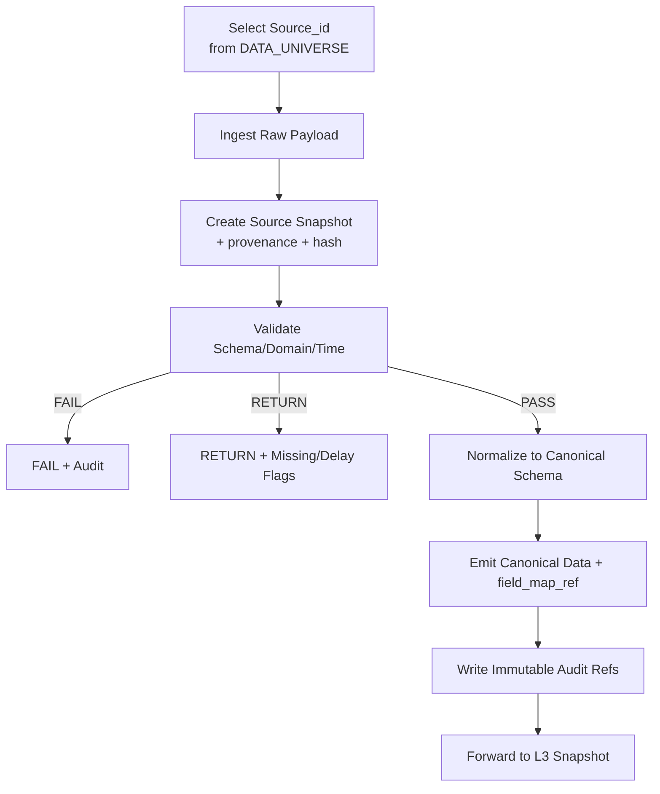

# TAITS_資料來源全集（DATA_SOURCES）__260102

doc_key：DATA_SOURCES  
治理等級：B（資料治理制度級｜資料來源全集與引用邊界）  
適用範圍：TAITS 全系統（Research / Backtest / Simulation / Paper / Live）  
版本狀態：ACTIVE（單一正確正文版｜最大完備＋累積式更新）  
版本日期：2026-01-02（Asia/Taipei）  
對齊母法：AI_GOV（A+）／DOCUMENT_INDEX（A+）／MASTER_ARCH（A）／MASTER_CANON（A）  
平行參照：ARCH_FLOW／FULL_ARCH／RISK_COMPLIANCE／GOVERNANCE_GATE_SPEC／EXECUTION_CONTROL／VERSION_AUDIT／LOCAL_ENV  
變更原則：最大完備＋累積式更新（允許融合更新／覆寫修正／重排版以形成單一正確正文；禁止摘要化縮水；未被新版本明確更新之有效內容一律保留並持續累積；已被新版本明確取代者可自正文移除但必須由稽核留痕承接）  
語義定錨：L9＝投資報告層（含數據/圖形/進出場建議/可追蹤更新）；L10＝人類裁決與交易決策層；L11＝全層工程稽核回放層（L1–L11 全留痕），且 L11 非下單層  
資料邊界：資料來源是「證據」不是「決策」；任何資料缺漏/延遲/異常必回報至 Risk/Compliance 與稽核鏈  

---

## 0. 文件定位（DataSources Universe Charter）

本文件定義 TAITS 的「資料來源全集（Data Universe）」與其治理規範，用於：

- 列出 TAITS 允許使用的資料來源（Source Registry），並分級：
  - 官方（Primary）
  - 準官方/交易所授權（Secondary）
  - 第三方（Fallback；僅輔助，不得裁決制度）
- 定義每個資料源的：
  - 來源網址、端點、更新頻率、可用性與限制
  - 欄位語義與正規化策略（Canonical Schema）
  - Provenance（來源追溯）要求與稽核輸出
  - 失效模式與降級策略（RETURN / FAIL / BLOCK）
- 確保資料層（L1–L2）輸入可被：
  - 回放（Replayable）
  - 稽核（Auditable）
  - 追責（Traceable）
- 支援 TAITS 以台灣市場（TWSE/TPEX/TAIFEX）為主軸的長期演進（最大完備＋累積式更新）

📌 本文件不做的事（避免越權）：
- 不替代官方制度裁決（制度以 TWSE_RULES 與官方來源為準）
- 不把第三方資料當作制度裁決依據
- 不定義策略與下單（策略在 STRATEGY_UNIVERSE；下單在 EXECUTION_CONTROL）
- 專注：資料來源的「名錄、治理、追溯、正規化、品質、降級」

---

---

## 1. 官方資料來源入口（Official Sources｜必須提供可追溯網址）

注意：此處列的是「官方入口」。實際抓取端點/檔案格式可能隨時間調整；  
TAITS 必須透過 Rulebook Snapshot / Source Snapshot 保留當下使用的引用證據（VERSION_AUDIT）。

### 1.1 TWSE（臺灣證券交易所）
- 官網首頁  
  https://www.twse.com.tw/
- 規章/法規查詢（制度裁決入口）  
  https://twse-regulation.twse.com.tw/

### 1.2 TPEX（櫃買中心）
- 官網首頁  
  https://www.tpex.org.tw/

### 1.3 TAIFEX（臺灣期貨交易所）
- 官網首頁  
  https://www.taifex.com.tw/

### 1.4 MOPS（公開資訊觀測站｜公司公告/財報）
- 官網入口  
  https://mops.twse.com.tw/

### 1.5 TDCC（集保結算所｜股權分散/庫存等）
- 官網入口  
  https://www.tdcc.com.tw/

### 1.6 CBC（中央銀行｜利率/匯率/統計）
- 官網入口  
  https://www.cbc.gov.tw/

### 1.7 DGBAS（主計總處｜物價/景氣/統計）
- 官網入口  
  https://www.dgbas.gov.tw/

### 1.8 FSC（金管會｜法規/公告）
- 官網入口  
  https://www.fsc.gov.tw/

---

---

## 2. 資料治理總原則（Data Governance Hard Principles）

### 2.1 官方優先（Official-First）
- 同一資料類別若存在官方來源：
  - 預設採官方
  - 第三方僅能作 fallback / 補齊 / 交叉驗證
- 第三方資料不得用於：
  - 裁決制度（合規）
  - 取代官方公告的法律地位

### 2.2 多層 Fallback（Multi-tier Fallback）
每個資料類別必須定義至少：
- Primary（官方）
- Secondary（準官方/授權/可驗證）
- Fallback（第三方；需標記 provenance 與信任降級）

### 2.3 Provenance（來源追溯）不可省略
任何資料進入 L2（Canonical Data）之前，必須具備：
- `source_id`
- `source_urls[]` / `endpoint_ref`
- `captured_at`
- `raw_payload_ref`（或可重建等價引用）
- `hash_manifest_ref`

缺任一項：不得進入 Evidence 裁決鏈（RETURN/BLOCK 依政策）

### 2.4 語義不可偷換（Semantic Integrity）
- 欄位名稱相同不代表語義相同
- 正規化（Normalization）必須保留：
  - 欄位映射（field_map_ref）
  - 轉換規則版本（normalization_ruleset_version）

### 2.5 資料品質可審計（Data Quality Auditable）
- 每次 ingest 必須產生 Quality Flags：
  - 缺漏、延遲、異常、跳變、疑似錯誤
- 品質不足不得靜默修補；必須降級（RETURN/FAIL）並在 UI/稽核可見

---

---

## 3. 資料分類體系（Data Taxonomy｜TAITS 統一分類）

目的：建立「資料類別」→「來源」→「正規化」→「用途與限制」的可治理結構。

### 3.1 Market Data（市場交易資料）
- 現貨：價格、成交量、成交額、委買委賣、逐筆（若可取得）
- 衍生性：期貨/選擇權行情、未平倉量、結算價、保證金資訊（若官方提供）

### 3.2 Reference Data（參考資料）
- 股票基本資料、代碼、產業別、ETF/權證資訊
- 交易日曆、交易時段

### 3.3 Corporate Actions（公司行為）
- 除權息、分割、合併、停止過戶、減資增資等（以官方公告/公司公告為準）

### 3.4 Fundamentals（基本面/財報）
- 財務報表、重大訊息、法說會、董事會決議、內部人持股等（MOPS）

### 3.5 Ownership / Flow（籌碼/資金流）
- 三大法人、融資融券、借券、集保股權分散（官方/準官方來源優先）

### 3.6 Macro（宏觀）
- 利率、匯率、景氣、物價、經濟指標（CBC/DGBAS 等）

### 3.7 News / Events（新聞/事件）
- 官方公告（交易所公告、公司公告）優先
- 其他新聞作輔助（不得替代官方裁決）

### 3.8 Alternative / Derived（替代/衍生）
- 由上述資料計算之衍生欄位（須可回放：依賴輸入 refs + 版本）

---

---

## 4. Source Registry（資料來源註冊表）資料結構（可落地）

TAITS 將每個資料來源定義為一筆「可版本化」的 Source Record（最大完備＋累積式更新）。

### 4.1 Source Record（最小欄位，不可縮減）
- `source_id`（全域唯一）
- `source_name_zh` / `source_name_en`
- `scope`：TWSE/TPEX/TAIFEX/MOPS/TDCC/CBC/DGBAS/FSC/ThirdParty/…  
- `tier`：PRIMARY / SECONDARY / FALLBACK
- `data_categories[]`（對應 3.x taxonomy）
- `official_urls[]`（官方入口或來源頁）
- `access_method`：HTTP/FTP/ManualDownload/API/WebSocket/…
- `update_frequency`：real-time / minute / daily / monthly / event-driven
- `availability`：expected uptime / schedule
- `rate_limits`：若有（未知則標註 unknown + 監測）
- `licensing_notes`：授權/使用限制（不確定時必須標註與降級）
- `provenance_requirements`：必須保存哪些證據（html/pdf/headers/hash）
- `fallback_chain[]`：此來源失效時可用的替代來源 source_id
- `normalized_schema_id`：正規化後 schema
- `normalization_ruleset_version`
- `quality_checks[]`：此來源必做的品質檢查
- `failure_modes[]`：FAIL/RETURN/BLOCK 條件與 reason codes
- `owner_module`：DataSources Adapter / Collector / Validator
- `security_class`：PUBLIC / SENSITIVE / RESTRICTED

### 4.2 Source Snapshot（來源快照）
每次實際抓取/使用一個來源，必須產生 Source Snapshot：
- `source_snapshot_id`
- `source_id`
- `captured_at`
- `endpoint_ref`（含 URL、參數、headers（需脫敏））
- `raw_payload_ref`
- `hash_manifest_ref`
- `quality_report_ref`
- `active_version_map_ref`

---

---

## 5. TAITS Canonical Schema（資料正規化標準｜骨架）

注意：此處是「架構骨架」。具體欄位細表可在後續 最大完備＋累積式更新 擴充成 `schemas/` 文件；  
但本骨架不可刪減，避免後續偷換語義。

### 5.1 Canonical Entity Keys（統一鍵）
- `instrument_id`：內部統一標的主鍵
- `symbol`：市場代碼（例如 2330）
- `market`：TWSE / TPEX / TAIFEX
- `instrument_type`：EQUITY / ETF / FUTURES / OPTIONS / WARRANT …
- `trading_date` / `timestamp`
- `currency`：TWD（或其他）

### 5.2 Market Bar（K 線/聚合行情）
- `open/high/low/close`
- `volume`（成交量）
- `turnover`（成交額）
- `vwap`（若可）
- `bar_interval`（1m/5m/1d…）
- `data_quality_flags[]`

### 5.3 Orderbook / Quote（委買委賣）
- `bid_prices[]/bid_sizes[]`
- `ask_prices[]/ask_sizes[]`
- `quote_timestamp`

### 5.4 Corporate Actions（公司行為）
- `action_type`
- `effective_date`
- `adjustment_factor`
- `source_ref`（公告引用）

### 5.5 Fundamentals（財務）
- `period`
- `statement_type`（BS/IS/CF）
- `fields{}`（結構化欄位集合）
- `filing_ref`（公告引用）

### 5.6 Ownership / Flow（籌碼）
- `institution_type`（外資/投信/自營…）
- `net_buy_sell`
- `margin_balance` / `short_balance`（若有）
- `tdcc_distribution_ref`（若有）

### 5.7 Macro（宏觀）
- `series_id`
- `value`
- `release_date`
- `revision`（若有）

---

---

## 6. 資料來源全集（Source Universe｜最大完備清單骨架）

你要求「最大完備」：此處提供 TAITS 台灣市場常用來源全集「骨架清單」。  
實際可用欄位/端點差異，由 Source Record 的 `access_method/endpoint_ref` 與 Snapshot 保證可追溯。  
**最大完備＋累積式更新**：你之後可直接新增來源，不需要改舊的。

### 6.1 PRIMARY（官方/最高優先）

#### 6.1.1 TWSE（上市）
- `SRC_TWSE_MARKETDATA`：現貨行情/收盤資訊（官方入口）  
  官方入口：https://www.twse.com.tw/
- `SRC_TWSE_ANNOUNCEMENTS`：交易所公告（停牌、處置、制度異動等）  
  官方入口：https://www.twse.com.tw/  
- `SRC_TWSE_REGULATION`：規章法規（制度裁決）  
  官方入口：https://twse-regulation.twse.com.tw/

#### 6.1.2 TPEX（上櫃）
- `SRC_TPEX_MARKETDATA`：上櫃行情/收盤資訊  
  官方入口：https://www.tpex.org.tw/
- `SRC_TPEX_ANNOUNCEMENTS`：櫃買公告/制度  
  官方入口：https://www.tpex.org.tw/

#### 6.1.3 TAIFEX（期貨/選擇權）
- `SRC_TAIFEX_MARKETDATA`：期貨/選擇權行情、結算等  
  官方入口：https://www.taifex.com.tw/
- `SRC_TAIFEX_RULES`：期貨制度  
  官方入口：https://www.taifex.com.tw/

#### 6.1.4 MOPS（公司公告/財報）
- `SRC_MOPS_FILINGS`：重大訊息、財報、公告  
  官方入口：https://mops.twse.com.tw/

#### 6.1.5 TDCC（集保）
- `SRC_TDCC_OWNERSHIP`：股權分散/股東結構（依可取得範圍）  
  官方入口：https://www.tdcc.com.tw/

#### 6.1.6 CBC / DGBAS / FSC（宏觀與監管）
- `SRC_CBC_MACRO`：利率、匯率、統計  
  官方入口：https://www.cbc.gov.tw/
- `SRC_DGBAS_MACRO`：景氣、物價、統計  
  官方入口：https://www.dgbas.gov.tw/
- `SRC_FSC_REGULATORY`：監理公告/法規  
  官方入口：https://www.fsc.gov.tw/

---

### 6.2 SECONDARY（準官方/授權/可驗證）

此層需能「回指官方或具可驗證性」，且必須標註授權與限制。

- `SRC_BROKER_API_QUOTES`：券商行情/報價（以券商官方 API 文件為準）  
  限制：不得取代官方制度裁決；僅作即時通道與交叉驗證  
- `SRC_BROKER_API_ORDERS`：券商委託/回報（執行必需）  
  限制：敏感級別最高（RESTRICTED），嚴禁進 repo/log 明文  
- `SRC_BANK_RATES`：銀行公開匯率/利率（若需）  
  限制：需可追溯來源頁面與時間戳  

---

### 6.3 FALLBACK（第三方｜只作補齊/交叉驗證，不得裁決制度）

必須特別強調：第三方可用於研究/便利性，但不得裁決制度；  
若官方缺失，應降級為不可裁決（RETURN/BLOCK），而不是用第三方「硬判」。

- `SRC_YAHOO_FINANCE`：行情/新聞（交叉驗證/研究用）  
- `SRC_CNYES`：新聞/市場資訊（研究用）  
- `SRC_FINMIND`：資料整合（研究/回測便利；需標註來源）  
- `SRC_OTHER_DATA_AGGREGATORS`：其他聚合器（需審核授權/品質/可追溯）

---

---

## 7. DataSources Adapter（適配器）標準（L1 實作硬規格）

FULL_ARCH 要求模組介面契約；此處給 Data Adapter 的「最大完備」規範。

### 7.1 Adapter 必須輸出
- `DataIngested` contract（含 provenance_ref / raw_payload_ref / hash_manifest_ref）
- `quality_report_ref`（至少包含：延遲、缺漏、格式錯誤、值域檢查）

### 7.2 Adapter 禁止事項
- 靜默補值或改值
- 把第三方資料假冒官方
- 省略來源證據（URL/headers/抓取時間/校驗）

### 7.3 Adapter 失效模式（標準化）
- `FAIL`：來源不可達、格式不可解析、頻率超限且不可恢復
- `RETURN`：暫時資料不足（可重試/等待）
- `BLOCK`：provenance 缺失、版本映射缺失、稽核不可寫入

---

---

## 8. Data Validator（驗證器）規範（L1-L2）

### 8.1 驗證類型（最小集合）
- Schema Validation（欄位存在、型別）
- Domain Validation（值域、單位、合理範圍）
- Temporal Validation（時間戳遞增/交易時段一致）
- Cross-Source Consistency（交叉一致性，僅標記不裁決）
- Corporate Action Consistency（除權息調整一致性）

### 8.2 Quality Flags（必須輸出）
- `MISSING_FIELDS`
- `DELAYED_SOURCE`
- `OUT_OF_RANGE`
- `SUSPECT_SPIKE`
- `INCONSISTENT_WITH_OFFICIAL`
- `UNKNOWN_SCHEMA_VERSION`

---

---

## 9. Normalizer（正規化器）規範（L2｜語義鎖定）

### 9.1 必須保留（不可縮減）
- `field_map_ref`：原欄位 → canonical 欄位
- `unit_transform_ref`：單位換算（股→張、元→分等）
- `timezone_transform_ref`
- `corporate_action_adjustment_ref`（若有）

### 9.2 硬禁
- 用「方便」為理由改寫語義
- 讓同一 canonical 欄位在不同來源代表不同含義

---

---

## 10. Fallback 策略（Failover / Degradation｜最大完備）

TAITS 必須把「資料失效」制度化，而不是臨場反應。

### 10.1 Fallback 原則
- 優先同級官方替代（TWSE ↔ TPEX 分域，不可亂替）
- 次優先準官方/授權（券商）
- 最後才第三方（且必須降級信任）

### 10.2 降級輸出（必須讓下游知道）
- `source_tier_used`：PRIMARY/SECONDARY/FALLBACK
- `trust_level`：HIGH/MEDIUM/LOW
- `compliance_eligible`：true/false（第三方通常為 false）
- `notes_ref`：降級原因（reason codes）

---

---

## 11. 稽核與回放要求（Audit & Replay Requirements｜強制）

每次資料 ingest（L1-L2）必須產生：
- `source_snapshot_ref`
- `raw_payload_ref`
- `hash_manifest_ref`
- `quality_report_ref`
- 納入 `active_version_map_ref`

並且在回放（Replay）時可重建：
- 同一份 canonical data（或可解釋差異）
- 同一份證據鏈（Evidence Bundle 的 provenance map 不斷裂）

---

---

## 12. Mermaid｜資料來源治理流程（L1-L2）

```mermaid
```
flowchart TB
  A[Select Source_id<br/>from DATA_UNIVERSE] --> B[Ingest Raw Payload]
  B --> C[Create Source Snapshot<br/>+ provenance + hash]
  C --> D[Validate Schema/Domain/Time]
  D -->|FAIL| X[FAIL + Audit]
  D -->|RETURN| R[RETURN + Missing/Delay Flags]
  D -->|PASS| E[Normalize to Canonical Schema]
  E --> F[Emit Canonical Data + field_map_ref]
  F --> G[Write Immutable Audit Refs]
  G --> H[Forward to L3 Snapshot]

13. 最大完備＋累積式更新 演進規則（DATA_UNIVERSE 專屬）
允許新增：

新來源（source_id）

新資料類別與 schema（以版本追加）

新驗證規則與 quality flags（更嚴格）

新 fallback 鏈（但不得讓第三方升格為制度裁決）

禁止：

刪除既有 source_id 或改寫其歷史語義

移除官方入口與 provenance 要求

用第三方來源裁決制度或取代官方公告

允許缺 provenance / 缺 snapshot / 缺 hash 的資料進入 Evidence 裁決鏈

14. 終極裁決語句（不可更改）
資料不是越多越好，而是「越可追溯越好」。
任何無法回指來源、無法生成快照、無法稽核回放的資料，都不允許進入 TAITS 的裁決鏈。

（DATA_UNIVERSE｜最大完備版 v2025-12-19 · Part 1 完）

# TAITS_資料來源全集（DATA_SOURCES）__251219

---

## 13. 子類別總覽（Data Subcategory Catalog｜台灣市場最大完備骨架）

本節把「台灣市場常用資料」拆成可治理的子類別（Subcategory），每一項都定義：
- Primary（官方優先）入口
- Secondary（準官方/授權）
- Fallback（第三方；僅補齊/交叉驗證，不得裁決制度）
- 必備 Provenance（抓取證據）與不可縮減欄位
- 典型品質檢查與失效模式（FAIL/RETURN/BLOCK）

---

---

## 14. 市場交易資料（Market Data）

### 14.1 現貨：日行情（EOD Daily Bars）
- subcategory_id：`MD_EQUITY_EOD_DAILY`
- Primary：
  - TWSE：https://www.twse.com.tw/
  - TPEX：https://www.tpex.org.tw/
- Secondary：
  - 券商行情 API（授權/可驗證）：`SRC_BROKER_API_QUOTES`
- Fallback：
  - Yahoo / 聚合器（研究用）：`SRC_YAHOO_FINANCE`, `SRC_FINMIND`, `SRC_CNYES`
- 必備 Provenance（不可縮減）：
  - `source_urls[]`（含查詢頁/下載頁/公告頁）
  - `captured_at`
  - `raw_payload_ref`（CSV/JSON/HTML/PDF 任一形式）
  - `hash_manifest_ref`
  - `field_map_ref`（原欄位→canonical）
- Canonical 最小欄位：
  - `symbol, market, trading_date, open, high, low, close, volume, turnover`
- 品質檢查（最小集合）：
  - 交易日曆一致性、缺漏、異常跳變、值域檢查
- 失效模式：
  - Primary FAIL → Secondary；Secondary FAIL → Fallback（需標記 trust_level=LOW）
  - 若用於合規/裁決鏈且非官方 → `compliance_eligible=false`

### 14.2 現貨：盤中即時報價（Intraday Quotes）
- subcategory_id：`MD_EQUITY_INTRADAY_QUOTES`
- Primary：
  - （以交易所可用之即時資訊入口為準，若無可用/授權限制 → 不視為 Primary 可抓取）
  - TWSE：https://www.twse.com.tw/
  - TPEX：https://www.tpex.org.tw/
- Secondary（常見實務）：
  - 券商即時行情 API：`SRC_BROKER_API_QUOTES`
- Fallback：
  - 第三方即時盤（研究/視覺化）：`SRC_CNYES`, `SRC_YAHOO_FINANCE`
- Provenance：
  - 必須保存 `endpoint_ref`（參數、headers 脫敏）+ `captured_at` + `hash_manifest_ref`
- Canonical 最小欄位：
  - `symbol, timestamp, last, volume, turnover, bid/ask (若有), session_state`
- 重要限制：
  - 即時行情常受授權限制；必須在 `licensing_notes` 標註，未明確授權時不得宣稱可商用/可長期穩定

### 14.3 現貨：逐筆（Tick / Trades）與委買委賣（Orderbook）
- subcategory_id：`MD_EQUITY_TICKS`, `MD_EQUITY_ORDERBOOK`
- Primary：依官方/授權可得性判定（不確定 → 以 Secondary/RESTRICTED 管理）
- Secondary：
  - 券商/授權供應商（若有）：`SRC_BROKER_API_QUOTES`
- Fallback：第三方（僅研究）
- Provenance（加嚴）：
  - 必須保存原始事件流（或可重建等價引用），禁止只存聚合摘要
- Canonical（示例最小欄位）：
  - Trades：`timestamp, price, size, aggressor_flag(optional)`
  - Orderbook：`bid_prices/sizes[], ask_prices/sizes[]`
- 失效模式：
  - 無法保存原始事件流 → `RETURN`（不可進入回放裁決鏈）

### 14.4 期貨/選擇權：日行情/盤中（TAIFEX）
- subcategory_id：`MD_DERIV_EOD`, `MD_DERIV_INTRADAY`
- Primary：
  - TAIFEX：https://www.taifex.com.tw/
- Secondary：
  - 券商衍生品行情 API（授權）：`SRC_BROKER_API_QUOTES`
- Provenance：
  - `source_urls[]` + `captured_at` + `raw_payload_ref` + `hash_manifest_ref`
- Canonical 最小欄位：
  - `product_id, contract_month, trading_date/timestamp, ohlc, volume, open_interest, settlement(optional)`
- 品質檢查：
  - 合約月切換一致性、OI 跳變、結算價一致性（若可取得）

---

---

## 15. 參考資料（Reference Data）

### 15.1 商品/標的基本資料（Symbol Master）
- subcategory_id：`REF_SYMBOL_MASTER`
- Primary：
  - TWSE：https://www.twse.com.tw/
  - TPEX：https://www.tpex.org.tw/
  - TAIFEX：https://www.taifex.com.tw/
- Secondary：
  - 券商商品主檔（僅作補齊）
- Provenance：
  - 必須保存「代碼變更」與「停用/新增」的來源證據（公告/清單）
- Canonical 最小欄位：
  - `instrument_id, symbol, market, instrument_type, name_zh, list_date, status`
- 失效模式：
  - 主檔不一致 → 標記 `INCONSISTENT_WITH_OFFICIAL`，不得靜默合併

### 15.2 交易日曆/交易時段（Calendar & Session）
- subcategory_id：`REF_TRADING_CALENDAR`, `REF_SESSION_SCHEDULE`
- Primary：
  - TWSE：https://www.twse.com.tw/
  - TPEX：https://www.tpex.org.tw/
  - TAIFEX：https://www.taifex.com.tw/
- Provenance：
  - 必須保存交易日曆擷取時間與來源頁
- 用途限制（強制）：
  - 任何送單/合規判定必須依此資料；缺失 → `RETURN/BLOCK`（依 TWSE_RULES/RISK_COMPLIANCE）

### 15.3 產業分類/ETF 成分/商品規格
- subcategory_id：`REF_INDUSTRY_CLASS`, `REF_ETF_CONSTITUENTS`, `REF_DERIV_CONTRACT_SPECS`
- Primary：
  - TWSE/TPEX（分類）
  - TAIFEX（合約規格）
- Provenance：
  - 成分股/規格具有版本性（必須保存日期與快照）
- 失效模式：
  - 成分股缺快照 → 不可回放 → `RETURN`

---

---

## 16. 公司行為（Corporate Actions）

### 16.1 除權息/分割/合併/減資增資（CA Master）
- subcategory_id：`CA_MASTER`
- Primary：
  - MOPS：https://mops.twse.com.tw/
  - 交易所公告（TWSE/TPEX）：https://www.twse.com.tw/ / https://www.tpex.org.tw/
- Secondary：
  - 券商公司行為資料（僅補齊）
- Provenance（加嚴）：
  - 必須保存公告原文引用（公告頁或 PDF）
  - 必須保存生效日與調整係數計算依據
- Canonical 最小欄位：
  - `symbol, action_type, effective_date, factor, announcement_ref`
- 重要限制：
  - 任何價格調整若無公告引用 → `BLOCK`（語義不可被「猜測」）

### 16.2 停止過戶/權利變更期間
- subcategory_id：`CA_BOOKCLOSURE`
- Primary：
  - MOPS / 交易所公告
- Provenance：
  - `announcement_ref` 必填（原文證據）
- 用途：
  - 影響可交易性/回測調整窗口

---

---

## 17. 基本面與揭露（Fundamentals / Disclosures）

### 17.1 財務報表（BS/IS/CF）
- subcategory_id：`FD_FIN_STATEMENTS`
- Primary：
  - MOPS：https://mops.twse.com.tw/
- Provenance（加嚴）：
  - 必須保存申報版本、申報日期、原文引用
- Canonical 最小欄位：
  - `symbol, period, statement_type, fields{}, filing_ref`
- 品質檢查：
  - 期別一致性、欄位缺漏、修正申報（revision）處理

### 17.2 重大訊息/公告（Material Information）
- subcategory_id：`FD_MATERIAL_EVENTS`
- Primary：
  - MOPS：https://mops.twse.com.tw/
- Provenance：
  - 公告編號/時間/原文引用
- 用途限制：
  - 可作事件特徵與證據；不得作「制度裁決」替代

### 17.3 董監事/內部人持股、股權異動（若可取）
- subcategory_id：`FD_INSIDER_OWNERSHIP`
- Primary：
  - MOPS / 官方揭露入口
- Provenance：
  - 必須保存揭露原文引用與時間戳

---

---

## 18. 籌碼/資金流（Ownership / Flow）

### 18.1 三大法人買賣超（Institutional Flows）
- subcategory_id：`OF_INSTITUTIONAL_NET`
- Primary：
  - TWSE：https://www.twse.com.tw/
  - TPEX：https://www.tpex.org.tw/
- Secondary：
  - 券商彙整（僅補齊/交叉驗證）
- Provenance：
  - 必須保存官方查詢頁/下載頁引用與擷取時間
- Canonical 最小欄位：
  - `symbol, trading_date, inst_type, net_buy_sell, volume/amount(optional)`

### 18.2 融資融券（Margin/Short）
- subcategory_id：`OF_MARGIN_SHORT`
- Primary：
  - TWSE/TPEX 官方入口
- Provenance：
  - 必須保存官方引用；此資料可能影響合規（若策略涉及信用交易），但制度裁決仍走 TWSE_RULES + rulebook_snapshot
- Canonical 最小欄位：
  - `symbol, trading_date, margin_balance, short_balance, changes`

### 18.3 借券（SBL）與借券餘額（若可取得）
- subcategory_id：`OF_SECURITIES_LENDING`
- Primary：
  - 依官方/準官方可得入口（不確定 → SECONDARY/RESTRICTED）
- Provenance：
  - 必須保存來源證據與授權限制

### 18.4 集保股權分散（TDCC）
- subcategory_id：`OF_TDCC_DISTRIBUTION`
- Primary：
  - TDCC：https://www.tdcc.com.tw/
- Provenance：
  - 必須保存查詢頁引用、擷取時間、欄位版本
- Canonical 最小欄位：
  - `symbol, week/date, holder_bucket, shares, percent`

---

---

## 19. 市場狀態/制度相關清單（Market Status & Regulatory Lists）

### 19.1 停牌/暫停交易清單
- subcategory_id：`RS_HALT_LIST`
- Primary：
  - TWSE/TPEX 官方公告
- Provenance：
  - 公告原文引用必填
- 用途：
  - 合規觸發（CMP-INSTRUMENT-HALTED）

### 19.2 處置股票/注意/警示等狀態清單
- subcategory_id：`RS_RESTRICTED_LIST`
- Primary：
  - TWSE/TPEX 官方公告/清單
- Provenance：
  - 公告引用必填
- 用途：
  - 合規觸發與風控升級（不得隱藏）

### 19.3 交易制度文本/規章（Rulebook）
- subcategory_id：`RS_RULEBOOK_TEXT`
- Primary：
  - TWSE：https://twse-regulation.twse.com.tw/
  - TAIFEX：https://www.taifex.com.tw/
  - FSC：https://www.fsc.gov.tw/
- 輸出（強制）：
  - 進入 `rulebook_snapshot_ref`（TWSE_RULES 定義）
- 禁止：
  - 以第三方整理裁決制度

---

---

## 20. 宏觀資料（Macro）

### 20.1 利率/匯率/金融統計
- subcategory_id：`MC_CBC_RATES`, `MC_CBC_STATS`
- Primary：
  - CBC：https://www.cbc.gov.tw/
- Provenance：
  - 必須保存發布日期與修正版本（若有）

### 20.2 物價/景氣/統計
- subcategory_id：`MC_DGBAS_SERIES`
- Primary：
  - DGBAS：https://www.dgbas.gov.tw/
- Provenance：
  - 必須保存 series_id 與發布/修正資訊

---

---

## 21. 新聞/事件（News / Events）

### 21.1 官方公告事件（優先）
- subcategory_id：`NE_OFFICIAL_ANNOUNCEMENTS`
- Primary：
  - TWSE/TPEX/TAIFEX/MOPS 官方公告入口（見 1.x）
- Provenance（加嚴）：
  - 公告原文引用與時間戳必填
- 用途：
  - 可作事件特徵/Evidence；亦可觸發合規清單更新（但制度裁決仍走 Rulebook Snapshot）

### 21.2 一般新聞（輔助）
- subcategory_id：`NE_PUBLIC_NEWS`
- Fallback：
  - 各新聞網站/聚合器（需授權與可追溯）
- 限制（硬規則）：
  - 不得作制度裁決
  - 不得作唯一證據（需與官方/可驗證證據交叉）

---

---

## 22. 第三方資料使用守則（Fallback Usage Rules｜硬規則）

### 22.1 允許用途
- 補齊缺漏（例如官方暫時不可用的歷史區段）
- 交叉驗證（Consistency Check）
- UI 便利呈現（非裁決）

### 22.2 禁止用途
- 裁決制度（合規 PASS/VETO）
- 取代公告原文（公司行為/重大訊息）
- 取代交易日曆/交易時段裁決

### 22.3 降級標記（必須）
任何使用 FALLBACK 來源的資料，都必須帶：
- `source_tier_used=FALLBACK`
- `trust_level=LOW`
- `compliance_eligible=false`（預設）
- `notes_ref`（降級原因與替代來源鏈）

---

---

## 23. 子類別 × L1–L2 輸出契約（對齊 FULL_ARCH）

本節把每個子類別都鎖到 DataIngested / DataNormalized 契約，避免資料自由散落。

### 23.1 L1：DataIngested（每個子類別都必須）
- `source_id`
- `subcategory_id`
- `raw_payload_ref`
- `provenance_ref`
- `captured_at`
- `hash_manifest_ref`
- `quality_report_ref`

### 23.2 L2：DataNormalized（每個子類別都必須）
- `canonical_schema_id`
- `subcategory_id`
- `field_map_ref`
- `normalization_ruleset_version`
- `data_quality_flags[]`

---

---

## 24. 失效模式與降級策略（Subcategory Failure Playbook）

任何資料子類別都必須在 Source Record 中填寫 failure_modes；以下為統一骨架。

### 24.1 RETURN（資料不足但可補）
- 官方端點暫時不可用、可重試
- 欄位缺漏但可由同級官方補齊
- 交易日曆資料延遲（等待官方更新）

### 24.2 FAIL（來源不可用且不可恢復）
- 長時間不可達（超過政策閾值）
- 格式永久變更且未更新解析器
- 授權/權限失效

### 24.3 BLOCK（系統完整性不足，禁止往下）
- provenance 缺失
- snapshot 無法落盤/不可變更儲存不可用（依環境等級）
- active_version_map_ref 缺失
- hash_manifest_ref 缺失

---

---

## 25. Mermaid｜「子類別」到「證據鏈」的治理通路

```mermaid
```
flowchart TB
  S[Select subcategory_id<br/>from DATA_UNIVERSE] --> P[Pick Primary Source_id]
  P --> I[L1 DataIngested<br/>raw+prov+hash]
  I --> V[Validator<br/>schema/domain/time]
  V -->|RETURN| R[RETURN + quality_flags]
  V -->|FAIL| F[FAIL + audit]
  V -->|PASS| N[L2 DataNormalized<br/>canonical+field_map]
  N --> L3[L3 SnapshotCreated]
  L3 --> L5[L5 EvidenceAssembled]
28. 最大完備＋累積式更新 演進規則（Part 2 專屬補強）
允許新增：

新的子類別（subcategory_id）

每子類別更多官方入口與 mirror（仍屬 Primary/Secondary）

更嚴格的 provenance 要求與 quality checks

更完整的 fallback_chain

禁止：

刪除既有子類別或改寫其語義

降低官方優先與可追溯要求

讓第三方資料升格為制度裁決依據

允許缺 provenance/snapshot/hash 的資料進入裁決鏈

（DATA_UNIVERSE｜最大完備版 v2025-12-19 · Part 2 完）

# TAITS_資料來源全集（DATA_SOURCES）__251219

---

## 26. 文件目的（Why Part 3 Exists）

Part 1/2 解決「來源全集與子類別」；Part 3 解決「資料能不能被用來裁決」：

- 把資料品質量化成 **Quality Grade（QG）**
- 把證據完整度量化成 **Evidence Completeness（EC）**
- 把不同 EC/QG 組合映射到：
  - L5 Evidence Bundle Completeness
  - L6 Regime 可信度要求
  - L7 Risk/Compliance 的 PASS/VETO/RETURN/BLOCK 行為
- 讓系統在資料不足時「制度化降級」，避免：
  - AI 幻想填空
  - 策略越權用不可靠資料直接推導方向
  - 合規在缺官方快照/缺來源時仍放行

---

---

## 27. Quality Grade（QG）資料品質分級（不可縮減）

QG 是「資料本身」的品質分級（與策略/判斷無關）。  
每次 L1/L2 ingest/normalize 必須產出 `quality_grade` 與 `quality_flags[]`。

### 27.1 QG 等級定義（最大完備＋累積式更新 可新增更嚴格，不可放寬）

- **QG-A（官方可追溯、可回放、可稽核）**
  - 來源：PRIMARY（官方/法定揭露）
  - Provenance：完整（source_urls + captured_at + raw_payload_ref + hash）
  - Schema：已知且通過校驗
  - 時效：在允許延遲窗內
  - 允許用途：Evidence / Regime / Risk&Compliance / UI / Replay

- **QG-B（準官方/授權可驗證）**
  - 來源：SECONDARY（券商/授權供應商）
  - Provenance：完整（含授權/限制註記）
  - Schema：已知且通過校驗
  - 允許用途：Evidence/Regime（需標註）、Risk（需交叉/門檻更嚴）、UI
  - 合規裁決：僅可作輔助證據，制度裁決仍需官方快照（Rulebook Snapshot）

- **QG-C（第三方可追溯，但信任降級）**
  - 來源：FALLBACK（聚合器/第三方）
  - Provenance：至少有來源頁 + 擷取時間 + 原始回應保存（但可能不可完全驗證）
  - Schema：可能變動或部分欄位缺漏
  - 允許用途：研究、交叉驗證、UI 輔助
  - 禁止用途：合規裁決依據、唯一 Evidence

- **QG-D（不可追溯或不可回放）**
  - 來源不明、缺 raw、缺 hash、缺時間戳
  - 允許用途：無（只能 RETURN/FAIL）
  - 必須行為：阻斷進入 L5（Evidence）

- **QG-X（敏感或非法/未授權風險）**
  - 授權未知/明確禁止/資料取得方式不合法或違反政策
  - 必須行為：BLOCK（SEC/DATA-LICENSE 類 reason codes）

### 27.2 QG 必備欄位（不可縮減）
每個子類別每次輸出都要包含：
- `subcategory_id`
- `source_id`
- `source_tier_used`：PRIMARY/SECONDARY/FALLBACK
- `quality_grade`：QG-A/B/C/D/X
- `quality_flags[]`
- `licensing_notes_ref`（若非 PRIMARY 必填）
- `provenance_ref`
- `hash_manifest_ref`
- `active_version_map_ref`

---

---

## 28. Quality Flags（品質旗標）統一清單（骨架＋可擴充）

Flags 是「客觀檢測結果」，不得帶方向性語句。最大完備＋累積式更新 可新增，不可刪除既有。

### 28.1 Provenance/Version 類（系統完整性）
- `QF_PROV_MISSING`（缺 provenance）
- `QF_HASH_MISSING`（缺 hash）
- `QF_VERSION_MAP_MISSING`（缺 active_version_map_ref）
- `QF_SCHEMA_UNKNOWN`（schema 不明）
- `QF_LICENSE_UNKNOWN`（授權不明）

### 28.2 時效/延遲類（Timeliness）
- `QF_DELAYED_SOURCE`
- `QF_STALE_DATA`
- `QF_OUT_OF_SESSION`（資料時間不在交易時段/不合交易日曆）

### 28.3 完整性/缺漏類（Completeness）
- `QF_MISSING_FIELDS`
- `QF_MISSING_ROWS`
- `QF_PARTIAL_RESPONSE`

### 28.4 異常/值域類（Validity）
- `QF_OUT_OF_RANGE`
- `QF_SUSPECT_SPIKE`
- `QF_NEGATIVE_VOLUME`
- `QF_INCONSISTENT_OHLC`（如 high < low）

### 28.5 交叉一致性類（Consistency）
- `QF_INCONSISTENT_WITH_OFFICIAL`
- `QF_CROSS_SOURCE_DIVERGENCE`

---

---

## 29. Evidence Completeness（EC）證據完整度（對齊 L5）

EC 是「本次裁決鏈」的證據完整度，與 QG 不同：  
QG 是資料品質；EC 是證據包是否「足以裁決」。

### 29.1 EC 等級（不可縮減）
- **EC-4（可裁決：完整）**
  - 必備子類別齊全
  - 主要證據 QG-A 為主
  - provenance 完整，hash 完整
  - 可直接進入 L6/L7

- **EC-3（可裁決：不足但可接受）**
  - 次要證據可缺，但關鍵證據存在
  - 允許部分 QG-B/QG-C 作輔助
  - 必須在 Evidence 中標記缺口與不確定性
  - 進入 L6/L7 時需提高風控門檻（policy 可規定）

- **EC-2（不可裁決：需補齊）**
  - 缺關鍵證據或 provenance 不完整
  - 必須 RETURN（回補 L4/L3/L2）
  - 不得進入風控 PASS

- **EC-1（不可裁決：嚴重缺失）**
  - 缺 official/primary 之關鍵來源且無可用替代
  - RETURN 或 FAIL（依情境）

- **EC-0（系統阻斷）**
  - 缺 active_version_map/hash/immutable audit 等系統級硬物
  - 必須 BLOCK

### 29.2 EC 的最小輸出（Evidence Bundle 必帶）
- `evidence_bundle_id`
- `completeness_level`：EC-0~EC-4
- `completeness_score`：0~100（僅輔助，裁決以 level）
- `missing_required_items[]`
- `quality_grade_summary`：各子類別 QG 分布
- `provenance_map_ref`
- `hash_manifest_ref`

---

---

## 30. EC × 子類別「必備清單」（Required Evidence Sets）

這是最大完備的核心之一：  
不同裁決用途，需要不同「必備證據集合」。缺任一項就必須 RETURN/BLOCK。

### 30.1 用途類型（Decision Context Types）
- `CTX_ORDER_SUBMISSION`：任何送單前裁決（L7/L10/L11）
- `CTX_COMPLIANCE_CHECK`：制度合規判定（L7）
- `CTX_REGIME_DETERMINE`：市場狀態判定（L6）
- `CTX_STRATEGY_PROPOSAL`：策略建議（L8）
- `CTX_BACKTEST_REPLAY`：回測/回放（Research/Backtest）

### 30.2 CTX_ORDER_SUBMISSION（送單裁決）必備集合
**Required Set（最低）**
- `REF_TRADING_CALENDAR`（QG-A）
- `REF_SYMBOL_MASTER`（QG-A 或 QG-B+交叉）
- `RS_HALT_LIST`（QG-A，若涉及標的可交易性）
- `RS_RESTRICTED_LIST`（QG-A，若涉及處置/限制）
- `MD_EQUITY_INTRADAY_QUOTES` 或 `MD_EQUITY_EOD_DAILY`（視送單時間）
- `RS_RULEBOOK_TEXT` → `rulebook_snapshot_ref`（合規必需，QG-A）

**缺口行為**
- 缺 `rulebook_snapshot_ref`：EC-0/EC-2（依是否系統缺失）→ BLOCK/RETURN
- 缺交易日曆：EC-2 → RETURN
- 缺標的狀態（停牌/處置）：EC-2 → RETURN（不得猜）

### 30.3 CTX_COMPLIANCE_CHECK（合規）必備集合
- `RS_RULEBOOK_TEXT`（必須快照）
- `REF_TRADING_CALENDAR`
- `REF_SESSION_SCHEDULE`
- `RS_HALT_LIST` / `RS_RESTRICTED_LIST`（若情境涉及）
- 交易行為（order intent）與帳戶權限快照（屬內部/券商回報；RESTRICTED）

缺口行為：
- 缺官方規則快照：必須 `CMP-RULEBOOK-MISSING` → VETO/BLOCK（依 RISK_COMPLIANCE）

### 30.4 CTX_REGIME_DETERMINE（Regime）必備集合（骨架）
- `MD_EQUITY_EOD_DAILY`（至少一個主行情來源；QG-A/B）
- `MD_EQUITY_INTRADAY_QUOTES`（若做盤中 regime；QG-B 可接受但需標記）
- `MC_CBC_RATES` / `MC_DGBAS_SERIES`（若 regime 使用宏觀因子；QG-A）
- `NE_OFFICIAL_ANNOUNCEMENTS`（若 regime 使用制度/公告事件；QG-A）

缺口行為：
- 允許降級 regime 信心（regime_confidence），但不得強行判定高信心

### 30.5 CTX_STRATEGY_PROPOSAL（策略建議）必備集合
- `MD_EQUITY_EOD_DAILY`（QG-A/B）
- `OF_INSTITUTIONAL_NET`（若策略含籌碼；QG-A）
- `CA_MASTER`（若需復權/公司行為；QG-A）
- （可選）`FD_FIN_STATEMENTS`（基本面因子）

缺口行為：
- 可 RETURN（補齊）或產出「降級提案」（必須標記 evidence 缺口，且不可越權變成下單）

### 30.6 CTX_BACKTEST_REPLAY（回測/回放）必備集合
- `MD_EQUITY_EOD_DAILY`（可 QG-A/B；但必須可回放）
- `CA_MASTER`（若做復權；QG-A）
- `REF_SYMBOL_MASTER`（回測期全段快照）
- `REF_TRADING_CALENDAR`（回測期全段快照）
- `active_version_map_ref` + `hash_manifest_ref`（系統級必備）

缺口行為：
- 無法回放 → BLOCK（不得產出不可重現的績效）

---

---

## 31. QG × EC → 系統動作映射（Hard Decision Matrix）

這張矩陣用於把「品質/完整度」轉成「硬動作」。不可縮減，可融合更新（但禁止摘要縮水；且必留痕承接）更嚴格條件。

### 31.1 硬規則（優先順序）
1) **任何 QF_VERSION_MAP_MISSING / QF_HASH_MISSING / QF_PROV_MISSING** → EC-0 → **BLOCK**
2) **合規用途（CTX_COMPLIANCE_CHECK）**：若 rulebook_snapshot 缺失 → **VETO/BLOCK**
3) **送單用途（CTX_ORDER_SUBMISSION）**：缺交易日曆/標的狀態 → **RETURN**
4) **使用 FALLBACK（QG-C）**：預設 `compliance_eligible=false`，不得用於合規裁決

### 31.2 動作映射表（最小）
- EC-4：
  - Strategy：可提出（仍不得下單）
  - Risk：可判定 PASS/VETO
  - Execution：需 token 才能進 L11
- EC-3：
  - Strategy：可提出但必須顯示缺口與降級
  - Risk：可判定但政策門檻更嚴（例如提高風控緩衝）
- EC-2/EC-1：
  - 一律 RETURN（附 missing_required_items）
  - 不得產生 PASS token
- EC-0：
  - 一律 BLOCK（系統級問題）
  - 觸發 DEPLOY_OPS / LOCAL_ENV 的「停線」規則（若 Paper/Live）

---

---

## 32. UI 可視化要求（對齊 UI_SPEC｜硬要求）

資料降級不能只在 log 裡。必須在 UI 明確可見，符合「人類主權」。

UI 必須顯示（至少）：
- 本次 evidence `completeness_level`（EC-0~EC-4）
- 主要子類別的 `quality_grade` 分布
- `missing_required_items[]`（RETURN 時必顯示）
- `source_tier_used`（是否使用 FALLBACK）
- 若為合規：顯示 `rulebook_snapshot_ref` 與官方來源連結（TWSE_RULES 需求）

---

---

## 33. 稽核輸出（Audit Outputs｜必須落地到 Log / Evidence / Replay）

每一次 EC 計算必須產出：
- `evidence_completeness_report_id`
- `context_type`（CTX_*）
- `required_set_version`（必備集合的版本）
- `missing_required_items[]`
- `quality_grade_summary`
- `decision_effect`（例如：RETURN/BLOCK/VETO 門檻）
- `hash_manifest_ref`
- 納入 `active_version_map_ref`

---

---

## 34. Mermaid｜品質分級與完整度如何影響裁決（L1→L7）

```mermaid
```
flowchart TB
  A[L1 Ingest + Provenance + Hash] --> B[L2 Normalize + Quality Flags]
  B --> C[Compute Quality Grade QG-A..X]
  C --> D[L5 Evidence Bundle Assembly]
  D --> E[Compute Evidence Completeness EC-0..4]
  E --> F{Context Type?}
  F -->|Compliance| G[L7 Compliance Decision<br/>requires rulebook_snapshot]
  F -->|Order| H[L7 Risk Decision<br/>requires calendar+symbol_state]
  F -->|Strategy| I[L8 Proposal<br/>must show downgrade if EC-3]
  E -->|EC-0| X[BLOCK + Audit + UI]
  E -->|EC-1/2| R[RETURN + missing_items + UI]
38. 最大完備＋累積式更新 演進規則（Part 3 專屬）
允許新增：

更細的 QG 等級（例如 A+、B+）與更嚴格門檻

新的 Quality Flags

新的 Context Types 與 Required Sets

新的 EC 計算方法（但不得降低既有判定標準）

禁止：

放寬 provenance/hash/version 的硬門檻

允許缺 rulebook_snapshot 仍做合規 PASS

允許 FALLBACK（QG-C）成為合規裁決依據

用「AI 推測」補齊缺失證據

39. 終極裁決語句（不可更改）
TAITS 不允許「資料不足還硬判」。
缺證據就 RETURN，缺快照就 VETO/BLOCK，缺追溯就停線。
這是可長期演進的唯一方式。

（DATA_UNIVERSE｜最大完備版 v2025-12-19 · Part 3 完）

# TAITS_資料來源全集（DATA_SOURCES）__251219

---

## 35. 文件目的（Why Part 4 Exists）

Part 1/2 解決「有哪些來源與子類別」，Part 3 解決「能否裁決」，Part 4 解決「工程落地如何不破壞治理」：

- 不同資料來源有不同端點型態：HTTP JSON、CSV 下載、PDF 公告、HTML 頁面、WebSocket 串流、手動下載…
- 若沒有端點型態治理，會發生：
  - 抓到的東西不可回放（只存處理後結果）
  - 沒保留原始證據（raw payload/headers/hash）
  - 把敏感資料寫進 log/UI
  - 對制度/公告引用不完整（尤其 PDF/HTML）
- 因此本 Part 定義：
  - Endpoint Type Taxonomy（端點型態分類）
  - 每一型態的 Source Snapshot 必備證據
  - 脫敏規範（headers/query/body）
  - 解析器（Parser）版本化與 最大完備＋累積式更新 演進

---

---

## 36. 端點型態分類（Endpoint Type Taxonomy｜不可縮減）

每個 `source_id` 必須標註 `endpoint_type`（可多值）：

- `HTTP_JSON`：HTTP API 回 JSON
- `HTTP_CSV`：HTTP 下載 CSV / TXT
- `HTTP_HTML`：HTML 頁面（需解析 DOM）
- `HTTP_PDF`：PDF 公告/規章/附件
- `FTP_FILE`：FTP 檔案（CSV/ZIP…）
- `WEBSOCKET_STREAM`：即時串流
- `MANUAL_DOWNLOAD`：人工下載（仍需證據保存）
- `BROKER_API`：券商 API（含行情與下單回報；敏感級最高）
- `DB_SNAPSHOT`：內部資料庫快照（回放用；需版本與 hash）
- `OTHER`：其他（必須補充規格與風險）

---

---

## 37. Source Snapshot（來源快照）通用規格（全端點型態通用）

Source Snapshot 是「每一次抓取/使用資料」的不可缺物件。  
沒有 snapshot，等同資料不存在於 TAITS 的裁決鏈（不得進 L5 Evidence）。

### 37.1 Source Snapshot 通用必備欄位（不可縮減）
- `source_snapshot_id`
- `source_id`
- `subcategory_id`
- `captured_at`
- `endpoint_type`
- `endpoint_ref`（結構化；含 URL/路徑/參數/方法）
- `request_fingerprint_ref`（脫敏後請求指紋）
- `response_fingerprint_ref`（回應指紋：狀態碼/headers 摘要/大小）
- `raw_payload_ref`（原始內容引用：bytes/file）
- `raw_payload_mime`（json/csv/html/pdf/zip…）
- `raw_payload_size`
- `hash_manifest_ref`（至少含 sha256）
- `parser_version_ref`（解析器版本）
- `schema_version_ref`（canonical schema 版本）
- `quality_report_ref`
- `licensing_notes_ref`（非 PRIMARY 必填）
- `active_version_map_ref`
- `redaction_report_ref`（脫敏報告：遮罩了哪些欄位）

### 37.2 endpoint_ref 結構（最小）
- `method`（GET/POST/…）
- `url`（可含 path，不含敏感 query 值）
- `query_params`（脫敏後）
- `headers`（脫敏後）
- `body_ref`（若有；必須脫敏並以 ref 保存，不可直接入 log）

---

---

## 38. 脫敏（Redaction）硬規則（對齊 LOCAL_ENV / AI_GOV）

### 38.1 必須脫敏的資料類型（硬禁明文外洩）
- token / api_key / secret / password / session
- 券商帳號識別、帳戶號碼、身分證字號、電話、email
- 授權憑證、cookie（通常視為敏感）

### 38.2 脫敏方式（最小要求）
- 以 `****` 遮罩中段，僅保留前後 2~4 碼（若需除錯）
- 原始敏感值不得寫入：
  - logs
  - UI
  - commit
  - docs
- 若因除錯需要保存原值：只能存在受控 secrets storage，不得進 repo（RESTRICTED）

### 38.3 Redaction Report（必備）
每次產生 source snapshot 都要有：
- `redaction_report_id`
- `redacted_fields[]`（例如 headers.Authorization、query.token）
- `redaction_policy_version`

---

---

## 39. 各端點型態的證據保存規格（最大完備）

原則：端點越「易變/難驗證」，證據保存越嚴格。

---

### 39.1 HTTP_JSON（API 回 JSON）

**必備證據**
- 原始 response bytes（raw_payload_ref）
- HTTP 狀態碼、回應 headers 摘要（Etag/Last-Modified/Date 若有）
- request 指紋（不含敏感）
- hash_manifest（sha256）

**額外建議（可 最大完備＋累積式更新）**
- 若 API 提供版本號/資料時間戳：納入 `response_fingerprint_ref`
- 若有 rate limit headers：保存摘要（不含 token）

**常見失效模式**
- schema 變更 → `QF_SCHEMA_UNKNOWN` → RETURN/FAIL（依政策）
- 429/限流 → RETURN（可重試）
- 403/授權失效 → FAIL（需 ops 處理）

---

### 39.2 HTTP_CSV（下載 CSV/TXT）

**必備證據**
- 原始檔案 bytes（含 BOM/換行原樣）
- 檔名（若由伺服器提供 Content-Disposition）
- mime/encoding 推斷結果（寫入 quality_report）
- hash_manifest

**解析器版本化**
- `parser_version_ref` 必須包含：
  - delimiter、quote、encoding、欄位對應版本

**常見失效模式**
- 欄位順序變更 → RETURN（需更新 field_map）
- 編碼變更 → RETURN/FAIL

---

### 39.3 HTTP_HTML（公告頁/查詢頁/清單頁）

HTML 最容易變版，因此證據保存要加嚴。

**必備證據**
- 原始 HTML（raw_payload_ref）
- 重要 DOM 區塊抽取結果（extract_ref）
- 解析規則版本（selector_ruleset_version）
- 網頁「截圖證據」：`page_render_snapshot_ref`（必要時）

**何時必須存截圖（硬條件）**
- 用於制度/公告引用（影響合規/公司行為/停牌處置）
- DOM 結構不穩定（解析失敗率超過門檻）
- 需要人類稽核確認（Auditor mode）

**常見失效模式**
- selector 失效 → RETURN（回補或改用 PDF/公告附件）

---

### 39.4 HTTP_PDF（規章/公告 PDF）

PDF 作為制度/公告證據時，必須可回放與可稽核（不可只存解析後文字）。

**必備證據**
- PDF 原始檔（raw_payload_ref）
- PDF 檔案 hash（hash_manifest）
- 檔案來源 URL + 下載時間
- 若 PDF 有頁碼裁決引用：必須保存 `pdf_page_index_ref`（引用到頁）
- 解析器版本（pdf parser version）與擷取文字/表格結果 refs（可選，但建議）

**制度裁決關聯（TWSE_RULES）**
- 若此 PDF 作為 rulebook_snapshot 的證據之一：
  - 必須連結到 `rulebook_snapshot_ref`
  - 必須能指出對應頁碼/段落索引（Evidence Index）

---

### 39.5 FTP_FILE（FTP 檔案）

**必備證據**
- FTP 路徑、檔名、檔案時間戳（若可）
- 原始檔 bytes
- hash_manifest

**風險點**
- FTP 來源可被中途替換：hash 與檔案 metadata 需要保存
- 若為第三方：必須標記 licensing_notes_ref 與信任降級

---

### 39.6 WEBSOCKET_STREAM（即時串流）

串流資料最容易「只存聚合後結果」，這在 TAITS 不允許（至少要有可回放事件引用）。

**必備證據（最小）**
- `stream_session_id`
- `captured_at_start / captured_at_end`
- `subscription_params_ref`（脫敏）
- 原始事件流保存策略：
  - 允許：事件批次檔（append-only）或事件日誌 refs
  - 禁止：只存 K 線結果不存事件來源引用
- `hash_manifest_ref`（對事件檔分段 hash）

**回放要求**
- 必須可重播到同一個 canonical 結果（允許微小時間差，但必須可解釋）
- 若無法保存事件流：至少保存「事件摘要 + 上游來源 ref」，並降級 QG/EC（不得進合規裁決）

---

### 39.7 MANUAL_DOWNLOAD（人工下載）

人工下載不是免責；反而必須更嚴格保存證據。

**必備證據**
- 下載者 `operator_id`
- 下載步驟 `manual_steps_ref`（文字描述）
- 原始檔 bytes
- 來源 URL + 時間
- hash_manifest
- 若是制度/公告：附加截圖（證明頁面與下載按鈕/版本）

**禁止**
- 人工下載檔直接改名改內容不留痕
- 人工下載後只留解析結果不留原檔

---

### 39.8 BROKER_API（券商 API：行情/回報/下單）

這是敏感級最高（RESTRICTED）。任何證據保存都要「可回放」但「不可洩漏」。

**必備證據**
- `endpoint_ref`（但不得包含敏感 token/帳號）
- `request_fingerprint_ref` / `response_fingerprint_ref`（脫敏）
- `raw_payload_ref`（加密保存或受控儲存引用）
- `hash_manifest_ref`
- `security_class=RESTRICTED`
- `access_audit_ref`（誰/何時/為何存取）

**硬性禁止**
- 把券商回報（含帳號/單號/成交明細）以明文寫進 log/UI
- 把 token/憑證放入 repo

**回放策略**
- 允許保存「脫敏後回報 + 加密原文引用」
- Auditor 只能以受控方式取用（只讀 + 追蹤）

---

### 39.9 DB_SNAPSHOT（內部資料庫快照）

**必備證據**
- snapshot id、表/分區、時間範圍
- schema version
- hash_manifest
- 來源：immutable store ref（Paper/Live 必須）

**限制**
- 不得把 DB 當成唯一真相；仍需可回指原始來源 snapshot refs（provenance map）

---

---

## 40. Parser（解析器）治理：版本化、契約化、最大完備＋累積式更新

### 40.1 Parser 必須是可追溯物件
- `parser_version_ref` 必須可定位到：
  - 程式碼版本（commit ref）
  - 解析規則（selector/delimiter/pdf extraction）
  - 已知限制（limitations）

### 40.2 Parser 不得「靜默自動修復」
- 發現 schema 變更或欄位缺漏：
  - 必須輸出 quality flags
  - RETURN（回補）或 FAIL（不可恢復）
- 不允許：
  - 直接把缺欄位補 0/空字串，然後當正常資料

### 40.3 Parser 的回歸驗證（Regression Evidence）
每次 parser 升級必須新增：
- 測試樣本快照 refs（raw payload fixtures）
- 解析結果對照（expected outputs）
- 變更原因（最大完備＋累積式更新）

---

---

## 41. Source Snapshot 與 Evidence Bundle 的連結規格（L5）

L5 Evidence Bundle 必須包含 provenance_map_ref，且每個 Evidence item 都可回指 source_snapshot_ref。

### 41.1 Evidence Item 最小欄位（不可縮減）
- `evidence_item_id`
- `subcategory_id`
- `source_snapshot_ref`
- `canonical_data_ref`
- `quality_grade`
- `quality_flags[]`
- `hash_manifest_ref`

---

---

## 42. UI 與稽核呈現要求（Hard）

### 42.1 UI（L10）至少要能顯示
- 主要資料使用了哪些 `source_id`（官方/非官方）
- 是否使用 fallback（source_tier_used）
- evidence completeness（EC 等級，Part 3 定義）
- 若為制度/公告：顯示 `source_urls` 與 `rulebook_snapshot_ref`（如適用）

### 42.2 Auditor（稽核者）取證能力
- 必須能從 `active_version_map_ref` 找到：
  - 所有 source snapshots
  - raw payload refs（受控存取）
  - hashes 與 redaction reports
- 若任何 ref 缺失：視為不可回放 → BLOCK（回放/稽核）

---

---

## 43. Mermaid｜端點型態 → Snapshot → Parser → Canonical → Evidence

```mermaid
```
flowchart TB
  A[Select Source_id + endpoint_type] --> B[Fetch Raw Payload]
  B --> C[Create Source Snapshot<br/>endpoint_ref + raw + hash + redaction]
  C --> D[Parser (versioned)]
  D --> E[Validator + Quality Flags]
  E --> F[L2 Canonical Data + field_map_ref]
  F --> G[L5 Evidence Item links source_snapshot_ref]
  G --> H[L7 Risk/Compliance (if eligible)]
49. 最大完備＋累積式更新 演進規則（Part 4 專屬）
允許新增：

新 endpoint_type（例如新的串流協議）

更嚴格的證據保存要求（例如 HTML 必存截圖的門檻更嚴）

更完整的 redaction 規則與稽核欄位

更嚴格的 parser regression fixtures

禁止：

移除 raw payload refs（只留解析後結果）

取消 hash_manifest 或 provenance_map

弱化 BROKER_API 的敏感治理

允許制度/公告引用缺 page/段落索引仍裁決

50. 終極裁決語句（不可更改）
資料來源的「取得方式」本身就是證據的一部分。
不能保存原始證據與快照，就不能進入裁決鏈；
不能脫敏，就不能進入稽核與 UI；
不能回放，就不允許宣稱可追溯。

（DATA_UNIVERSE｜最大完備版 v2025-12-19 · Part 4 完）

---

---

## 44. 全局定錨｜單一口徑（S1）

### 1. 人類最高決策者主權（SOVEREIGNTY）
- TAITS 之唯一最高主權屬於人類最高決策者（產品負責人／架構裁決者）。
- 任何治理閘門、程序規則、Agent、文件等級不得凌駕人類主權；不得以程序性理由阻止人類明確命令之生效。
- 風險與合規（Risk/Compliance）在無人類明確命令時可否決；在有人類明確命令時必須輸出完整風險揭露與替代方案，並以「強制揭露＋確認＋全紀錄」承接，不得卡死更新。

### 2. L9–L11 最終語義（跨文件一致）
- L9（投資報告層）：可追蹤、可更新、可標的化投資報告；必含數據、圖形、條件式進出場建議（非指令）、風險敘述、追蹤欄位（狀態/更新時間/依據來源），並支援事件驅動滾動更新。
- L10（人類裁決層）：由人類最高決策者裁決不動作/回測/模擬/半自動/全自動等；任何交易型態皆以 L10 明確裁決為準。
- L11（工程稽核回放層）：對 L1–L11 全層輸入/處理/輸出/裁決/執行鏈路留痕，供人類與工程端可讀、可查、可回放；L11 非下單決策層。

### 3. HFI｜人類明確命令（可執行觸發）
- 格式：`HFI: <scope> | <action> | <intent> | <acknowledgement>`
- 有效 HFI 存在時：FREEZE 狀態/最大完備＋累積式更新/Gate 不得阻擋 scope 範圍內之更新/覆寫/重排版；並必須同步產生稽核承接（VERSION_AUDIT 留痕、HASH_MANIFEST、CHANGELOG）。

---

---

## 45. 治理補強（已整合為正文）

上位裁決：DOCUMENT_INDEX → MASTER_ARCH → MASTER_CANON  
目的：修補本文件內部「中繼資料（doc header/附錄標示）」與 DOCUMENT_INDEX 裁決表之不一致，並鎖定引用規則，避免 Gate 命中「引用非法」而導致 BLOCK。

---

---

## 46. 0.1 裁決來源（不可否認）

依 DOCUMENT_INDEX（治理有效文件清單）之裁決，本文件之唯一合法身份為：
- doc_key：DATA_SOURCES
- 治理等級：B
- 版本狀態：ACTIVE

以上三項為 Index 表格裁決效力範圍（doc_key / 治理等級 / 版本狀態），不得以文件內文自改或自封更高/不同位階。

---

---

## 47. 0.2 本文件內「DATA_UNIVERSE」之法律定位（名詞 ≠ doc_key）

本文件既有段落中出現之「DATA_UNIVERSE」：
- 一律視為「資料來源宇宙（Data Universe）」之概念名詞／閱讀用別名（alias）
- **不得**被解讀為新的 doc_key
- **不得**被用作任何系統引用、Gate 檢核引用、稽核引用之 doc_key

---

---

## 48. 0.3 引用合法性硬規則（Gate 對齊｜不可放寬）

在 FILE UPDATE MODE 與 FREEZE 狀態（以 GOVERNANCE_STATE 為準） 下，所有系統與文件引用一律遵守：
- 任何引用本文件時，唯一合法 doc_key = `DATA_SOURCES`
- 在 DOCUMENT_INDEX 未新增且裁決 `DATA_UNIVERSE` 為 ACTIVE 前：
  - 禁止任何流程、Gate、Evidence、Audit、UI Trace 以 `DATA_UNIVERSE` 作為 doc_key 引用
  - 若出現此類引用：視為「引用非法」，依 Gate 規則必須 BLOCK（不可補救）

---

---

## 49. 0.4 版本與稽核要求（最大完備＋累積式更新）

- 僅以新增修正說明段落達成一致性（不刪改原文）
- 後續若需將 `DATA_UNIVERSE` 升格為獨立治理文件：
  - 必須以「新增新文件＋新增 Index 條目」方式處理
  - 並在 DOCUMENT_INDEX 明確裁決 DATA_SOURCES 與 DATA_UNIVERSE 之關係（舊新、覆蓋、適用範圍）
  - FREEZE 狀態（以 GOVERNANCE_STATE 為準） 下不得以新增條目形式變相改寫既有裁決序位或 Canonical Flow

---

---

---

## 50. 治理補強（已整合為正文）

上位裁決：Index Gate（DOCUMENT_INDEX）＋治理等級覆蓋（A+ > A > B > C）＋衝突裁決程序（DOCUMENT_INDEX §6）  
目的：在不改寫既有主文/附錄之情況下，提供「引用端（人/工具/AI）」的硬規則與可貼用模板，避免因摘錄或複製附錄片段而誤用 `DATA_UNIVERSE` 作為 doc_key，導致 Gate 命中「引用非法」而 BLOCK。

---

---

## 51. 治理補強（已整合為正文）

- 工具（例如 IDE / 搜尋索引 / 知識庫）以段落為單位建立引用索引
- AI 在生成答案時引用片段（含 UI Trace / Evidence / Audit 文本）
- 稽核者於版本回放時，需確認引用端 doc_key 是否合法

- 任何「變相更名 doc_key」或「新增新 doc_key」之制度變更
- 任何「重排覆蓋規則」或「改寫衝突裁決程序」之行為
- 任何「修改 Canonical Flow（L1–L11）」之行為

---

---

## 52. 0.2 防誤用硬規則（Anti-Misuse Hard Rules｜不可放寬）

### 0.2.1 doc_key 的唯一合法值（引用端硬規則）

- 唯一合法 doc_key **必須**為：`DATA_SOURCES`
- 任何片段內出現 `doc_key：DATA_SOURCES`、`TAITS_資料來源全集（DATA_UNIVERSE）` 等字樣：
  - 一律視為「歷史殘留的中繼資料標示（Metadata Discrepancy）」
  - 僅具閱讀別名（alias）用途
  - **不具** doc_key 法律效力
  - **不得**被複製到任何引用欄位（doc_key / evidence_doc_key / audit_doc_key / ui_doc_key / gate_doc_key）

### 0.2.2 禁止的行為（一律視為引用非法）
以下任一情況出現，必須視為「引用非法」並依 Gate 規則 BLOCK（不得補救）：

- 在任何文件/流程/稽核/證據輸出中，將 `DATA_UNIVERSE` 作為 doc_key  
- 在引用模板中出現 `doc_key=DATA_UNIVERSE` 或等價表示  

---

---

## 53. 0.3 摘錄安全標頭（Excerpt Safety Header｜可直接貼用）

請在摘錄片段最前方，加入下列標頭（不得改寫語義；可原封貼上）：

```text
〔引用安全標頭｜TAITS｜FREEZE 狀態（以 GOVERNANCE_STATE 為準）｜最大完備＋累積式更新〕
source_doc_key = DATA_SOURCES
source_doc_name = TAITS_資料來源全集（DATA_SOURCES）__251219.md
alias_note = 本片段若出現「DATA_UNIVERSE」僅為概念別名/歷史殘留標示，不具 doc_key 法律效力
index_gate = 以 DOCUMENT_INDEX 裁決之 doc_key / 治理等級 / 版本狀態 為準
audit_anchor = VERSION_AUDIT:VA-METADATA_FIX-20251227-0001
〔/引用安全標頭〕
```

---

---

## 54. 0.4 引用端「最小合規格式」模板（Gate-Friendly Reference Template）

用途：統一引用格式，讓 Gate / Audit 可機器化檢核，避免因人為格式差異造成引用模糊。

建議引用格式（可直接貼用）：

```text
ref_doc_key = DATA_SOURCES
ref_doc_version = 2025-12-19
ref_excerpt_hash = <可選：若已對摘錄做 hash>
```

---

---

## 55. 0.5 工具/AI 複製規則（Tooling Rule｜不可被跳過）

凡工具或 AI 進行「片段抽取、引用、摘要、重組」時，必須遵守：

- 抽取片段若含 `doc_key：DATA_SOURCES`：
  - **不得**將其提升為 doc_key
  - 必須自動附加「Excerpt Safety Header」（見 0.3）或在引用格式內加入 alias_note
- 任何輸出若缺少 `ref_doc_key = DATA_SOURCES`：
  - 一律視為「引用不完整」→ RETURN（需補齊）或 BLOCK（依 Gate/Policy）
- 不得以「模型推測」補完缺失引用；缺就標記缺，並返回上游補齊（最大完備＋累積式更新 的流程精神）

---

---

## 56. 0.6 格式性修補宣告（Mermaid Fence Patch｜最大完備＋累積式更新）

本文件若存在 Mermaid 區塊缺失結尾 fence（```），將造成後段章節被誤判為 code block，影響引用定位與稽核可讀性。

- 不改寫 Mermaid 內容
- 不刪改後續章節文字
- 僅補上必要的結尾 fence，以恢復正確的 Markdown 區塊邊界

【文件閱讀與 Canonical 對位指引（最大完備＋累積式更新）】

本文件主體內容定義 TAITS DATA_SOURCES（DATA_UNIVERSE）之資料來源分類、
來源優先序與基本資料治理規範。
為依據 MASTER_CANON（Canonical Flow L1–L11）
所新增之資料層責任邊界、可回放性與稽核對位說明。

本指引僅作閱讀與治理定位用途，
不構成對主文條款之修改，
所有裁決優先序仍依 DOCUMENT_INDEX → MASTER_ARCH → MASTER_CANON 為準。

---

---

## 57. Part 2｜台股資料子類別全集 × 官方優先 × Provenance 必備清單（最大完備）

doc_key：DATA_SOURCES  
治理等級：D（DataSources Universe｜官方優先 × 多層Fallback × 可追溯Provenance）  
適用範圍：TAITS 全系統（Research / Backtest / Simulation / Paper / Live）  
版本狀態：ACTIVE（資料來源全集可 最大完備＋累積式更新 擴充；不得弱化官方優先與可追溯）  
版本日期：2026-01-01  
變更原則：最大完備＋累積式更新（可融合更新（但禁止摘要縮水；且必留痕承接），不可刪減/覆寫/偷換資料語義；不得用第三方裁決制度）  
核心鐵律：官方資料優先；多層Fallback；Provenance 可追溯；Snapshot 可回放；資料品質可審計；缺證據不得裁決

---

---

## 58. Part 3｜資料品質分級（Quality Grades）× Evidence Completeness 門檻映射 × 降級裁決規則（最大完備）

doc_key：DATA_SOURCES  
治理等級：D（DataSources Universe｜官方優先 × 多層Fallback × 可追溯Provenance）  
適用範圍：TAITS 全系統（Research / Backtest / Simulation / Paper / Live）  
版本狀態：ACTIVE（資料來源全集可 最大完備＋累積式更新 擴充；不得弱化官方優先與可追溯）  
版本日期：2026-01-01  
變更原則：最大完備＋累積式更新（可融合更新（但禁止摘要縮水；且必留痕承接），不可刪減/覆寫/偷換語義；不得用第三方裁決制度）  
核心鐵律：品質不足不得靜默；缺證據不得裁決；降級必可見（UI/Log/Evidence）；合規與風控可直接否決（最高否決權）

---

---

## 59. Part 4｜端點型態治理（HTTP/CSV/PDF/公告頁/WebSocket）× Source Snapshot 證據保存規格 × 脫敏與稽核（最大完備）

doc_key：DATA_SOURCES  
治理等級：D（DataSources Universe｜官方優先 × 多層Fallback × 可追溯Provenance）  
適用範圍：TAITS 全系統（Research / Backtest / Simulation / Paper / Live）  
版本狀態：ACTIVE（資料來源全集可 最大完備＋累積式更新 擴充；不得弱化官方優先與可追溯）  
版本日期：2026-01-01  
變更原則：最大完備＋累積式更新（可融合更新（但禁止摘要縮水；且必留痕承接），不可刪減/覆寫/偷換語義；不得以第三方裁決制度）  
核心鐵律：任何資料都必須能「證明從哪來」；任何敏感都必須脫敏；任何回放都必須可重建；任何制度裁決都必須能回指官方快照

---

---

## 60. 治理補強（已整合為正文）

上位裁決：DOCUMENT_INDEX → MASTER_ARCH → MASTER_CANON  
目的：補齊 DATA_UNIVERSE 與 MASTER_CANON 的「差異／分工界線」與「Canonical 對位」，確保資料治理規格可被納入 Canonical Flow（L1–L11）且不造成跨層越權。

---

---

## 61. A.1 DATA_UNIVERSE 與 MASTER_CANON 的「差異」與「分工」界線（對位總結）

### A.1.1 MASTER_CANON 是「最高母法與層級語義」；DATA_UNIVERSE 是「資料入口全集與可追溯治理」

- MASTER_CANON：
  - 定義 TAITS 的 Canonical Flow（L1–L11）之**唯一合法層級語義**與**不可越權邊界**。
  - 定義跨層裁決秩序、角色權限、人機分工與衝突裁決順序。
  - 屬「法源與裁決母體」，不可被任何子文件改寫。

- DATA_UNIVERSE：
  - 定義「可被使用的資料來源宇宙」：官方優先、授權次之、多層 fallback，且必須**可追溯（Provenance）**、**可回放（Replay）**、**可稽核（Audit）**。
  - 其使命是讓 L1/L2 的 ingest/normalize 具備制度化、可稽核的最低標準，並把「資料不足」制度化為降級／退回／中止行為。
  - 屬「資料治理與來源清單」，不得升格為流程裁決母法。

硬性界線（不可跨界）  
DATA_UNIVERSE 只能回答：  
「資料從哪裡來？是否合法？品質如何？是否可用於裁決鏈？缺什麼？如何降級？」  
DATA_UNIVERSE **不得**回答：  
「方向判斷、策略好壞、應不應該進出、該下什麼單」等任何跨 L1–L2 的裁決議題。

---

### A.1.2 DATA_UNIVERSE 對 Canonical Flow（L1–L11）的責任邊界（層級對位）

- L1（Data Ingestion｜資料取得）
  - DATA_UNIVERSE 提供：source_id 選擇規格、官方優先鏈、擷取與快照規範、來源證據要求（provenance）。
  - 禁止：用第三方來源做制度裁決、或在 ingest 階段引入「分析結論」。

- L2（Validation & Normalization｜校驗/正規化）
  - DATA_UNIVERSE 提供：schema/domain/temporal 檢核規範、quality flags、欄位映射（field_map）、語義鎖定（unit/timezone/CA adjust 留痕）。
  - 禁止：靜默補值改寫語義、或用「方便」理由改動 canonical 欄位含義。

- L3（Snapshot & State Build｜快照/狀態）
  - DATA_UNIVERSE 提供：L1/L2 產出之 `source_snapshot_ref / raw_payload_ref / hash_manifest_ref / quality_report_ref` 等可回放依據。
  - 禁止：在資料層自行決定「哪一種狀態（Regime）」或「風控放行」。

- L4–L11（Feature/Evidence/Regime/Risk/Strategy/Governance/UI/Execution）
  - DATA_UNIVERSE 只提供「輸入合法性」與「品質/完整度」的客觀訊號（quality、completeness、trust），不得越權成為 PASS/VETO。
  - 真正的裁決仍必須由 L7（Risk/Compliance）與 L9（Governance Gate）及 L10（Human Decision）完成。

---

---

## 62. A.2 Canonical 對位：DATA_UNIVERSE 必須輸出之「最小不可降工件」（L1–L3）

本節為「最小不可降」：若缺任一項，視為 Evidence Chain 不完整，下游必須觸發降級、退回或否決（由 L7/L9 裁決）。

### A.2.1 L1：Data Ingestion（Raw Artifact + Provenance）

每次 ingest（不論 Research/Backtest/Simulation/Paper/Live）必須生成：

1. `source_id`（唯一主鍵；必須存在於 DATA_UNIVERSE）
2. `source_tier_used`（PRIMARY / SECONDARY / FALLBACK）
3. `provenance_ref`（至少包含：官方/端點/頁面、擷取時間 captured_at、回應/頁面識別資訊）
4. `raw_payload_ref`（原始回應保存位置引用）
5. `source_snapshot_ref`（來源快照引用：可回放、可稽核）
6. `hash_manifest_ref`（至少 raw_payload 與 snapshot 的雜湊清單引用）

禁止：  
- 省略 provenance / snapshot / hash  
- 以第三方資料替代官方制度入口來做任何制度裁決  
- 以「後續會補」為理由讓資料進入裁決鏈

---

### A.2.2 L2：Validation & Normalization（Canonical Artifact + Field Map + Quality）

每次 normalize 必須生成：

1. `canonical_schema_id`（標準化後 schema ID）
2. `normalization_ruleset_version`（正規化規則版本）
3. `field_map_ref`（原欄位 → canonical 欄位）
4. `unit_transform_ref`、`timezone_transform_ref`（若有轉換必留痕）
5. `quality_grade`（QG-A/B/C/D…）
6. `quality_flags[]`（缺值、延遲、異常、疑似尖峰、與官方不一致…）
7. `quality_report_ref`（品質報告引用）

禁止：  
- 偷換欄位語義（volume/amount/price/turnover 等不得混用）  
- 靜默修補（任何補值或插補必須留痕並標記旗標）  
- 把「交叉一致性檢核」當作裁決（只能標記，不裁決）

---

### A.2.3 L3：Snapshot & Replay Determinism（可回放一致性）

DATA_UNIVERSE 必須保證下游能做到：

- Replay 時可重建「同一份 canonical data」（或能解釋差異）
- Evidence Bundle 的 provenance map 不斷裂（每個關鍵輸入可追溯回 source_snapshot_ref）
- 版本一致性：`active_version_map_ref` 可指出當次運行使用的來源/規則版本集合

---

---

## 63. A.3 對位：資料品質（QG）與證據完整度（EC）對下游的「可用性宣告」

DATA_UNIVERSE 的任務是「宣告資料可用性」，不是「裁決是否交易」。  
其輸出必須能被 UI / Log / Audit 明確呈現，避免下游或人類誤以為資料是完整可靠的。

### A.3.1 必備可用性欄位（下游可讀）

每次資料流轉到 L3（或更下游）時，必須附帶：

- `source_tier_used`：PRIMARY/SECONDARY/FALLBACK
- `trust_level`：HIGH/MEDIUM/LOW
- `compliance_eligible`：true/false（第三方通常為 false；是否可用於制度裁決鏈）
- `evidence_completeness`：EC-A/EC-B/EC-C/EC-D…（或等價枚舉）
- `degradation_reason_codes[]`：降級原因（缺欄位、延遲、疑似異常、官方不可得…）
- `notes_ref`：降級說明與追蹤引用

### A.3.2 強制規則（不可降）

- 任何降級（fallback 或品質不足）不得靜默，必須可見（UI/Log/Audit）。
- Quality/Completeness 只做「宣告」，不得直接變成 PASS/VETO；裁決歸屬 L7/L9/L10。

---

---

## 64. A.4 對位：DATA_UNIVERSE 與 RISK/COMPLIANCE、GOVERNANCE 的互鎖關係（不改既有權限）

### A.4.1 與 L7（Risk & Compliance）之互鎖

DATA_UNIVERSE 不執行否決，但必須提供「可被否決」的客觀依據：

- 缺 official snapshot（或不可回放） → 必須讓下游可偵測（compliance_eligible=false / reason_codes）
- QG 降級或 EC 不足 → 必須顯性標記（quality_grade / evidence_completeness / flags）
- 任何「制度裁決所需的官方依據」缺失 → 必須標記為不可用於合規裁決鏈

### A.4.2 與 L9（Governance Gate）之互鎖

- 若資料 provenance/版本/快照缺失，L9 可要求 RETURN 回 L1/L2/L3 重新補齊（由治理門裁決）。
- DATA_UNIVERSE 必須能讓 L9 讀到：資料來源版本、規則版本、hash manifest 引用。

---

---

## 65. A.5 FREEZE 狀態（以 GOVERNANCE_STATE 為準） 下的 最大完備＋累積式更新 新增規則模板（DATA_UNIVERSE 專用）

本模板用於新增 source_id / subcategory_id / schema / validation rules / fallback_chain。  
只能新增，不得改寫或覆寫既有條目語義；更嚴格可，放寬不可。

### A.5.1 新增 source_id（模板）

- 新增項目類型：source_id
- source_id：`<唯一ID>`
- source_name：`<名稱>`
- source_tier：PRIMARY / SECONDARY / FALLBACK
- official_priority_rationale：`<為何屬官方/授權/第三方>`
- access_method：API / Web / File / Vendor Feed
- canonical_schema_targets：`[<canonical_schema_id...>]`
- required_provenance：
  - source_urls_or_endpoints：`[ ... ]`
  - captured_at：REQUIRED
  - raw_payload_ref：REQUIRED
  - source_snapshot_ref：REQUIRED
  - hash_manifest_ref：REQUIRED
- validation_ruleset：
  - schema_validation：REQUIRED
  - domain_validation：REQUIRED
  - temporal_validation：REQUIRED
  - cross_source_consistency：OPTIONAL（僅標記）
- fallback_chain：
  - preferred_same_tier_official：`[ ... ]`
  - secondary_authorized：`[ ... ]`
  - last_resort_third_party：`[ ... ]`（必須降級 trust/compliance_eligible）
- compliance_eligibility：
  - compliance_eligible_default：true/false
  - restrictions_notes_ref：`<限制說明引用>`
- audit_requirements：
  - replay_determinism：REQUIRED
  - version_binding：REQUIRED（active_version_map_ref 必須可追溯）
- change_log_stub：
  - added_at：`YYYY-MM-DD`
  - added_by：`<人類裁決者/治理記錄ID>`
  - reason：`<新增原因>`
  - impact_scope：`<影響範圍：哪些資料類別/層級>`

---

### A.5.2 新增 subcategory_id（模板）

- 新增項目類型：subcategory_id
- subcategory_id：`<唯一ID>`
- domain：TWSE / TPEX / TAIFEX / MOPS / TDCC / Broker / Other
- data_kind：Price / Volume / Fundamentals / CorporateActions / Lending / Margin / Position / Orders / Trades / NewsMeta / …
- official_sources：
  - primary_source_ids：`[ ... ]`
  - official_urls：`[ ... ]`
- secondary_sources：
  - authorized_vendor_source_ids：`[ ... ]`
- fallback_sources：
  - third_party_source_ids：`[ ... ]`（必須降級）
- required_fields_minimum：`[ ... ]`
- canonical_schema_id：`<schema>`
- quality_gate_minimum：
  - minimum_quality_grade_for_evidence：`QG-?`
  - minimum_evidence_completeness：`EC-?`
- notes_ref：`<補充說明引用>`

---

---

## 66. A.6 稽核檢核表（Audit Checklist｜DATA_UNIVERSE 對位 Canonical）

本表為稽核用；不新增流程、不改權限，只定義「可被檢查」的最低項。

### A.6.1 L1/L2 工件完整性（必查）

- 是否存在 `source_id` 且能對應 DATA_UNIVERSE？
- 是否存在 `source_snapshot_ref / raw_payload_ref / hash_manifest_ref`？
- 是否存在 `field_map_ref / normalization_ruleset_version`？
- 是否存在 `quality_grade / quality_flags[] / quality_report_ref`？
- 是否存在 `active_version_map_ref` 且可回放？

### A.6.2 降級可見性（必查）

- fallback 使用時，是否輸出 `source_tier_used / trust_level / compliance_eligible / reason_codes`？
- 是否確保 UI/Log/Audit 可見（不可靜默）？

### A.6.3 合規可用性宣告（必查）

- 若屬第三方或不可驗證來源：是否預設 `compliance_eligible=false`？
- 若缺官方快照/不可回放：是否明確標記不可用於制度裁決鏈？

---

---

## 67. A.7 終局聲明（不可改寫）

DATA_UNIVERSE 的存在目的，是把「資料是否可靠、是否可追溯、是否可回放」制度化。  
它不提供交易方向、不提供策略裁決、不提供下單決策。  
任何無法回指來源、無法生成快照、無法稽核回放的資料，都不允許進入 TAITS 的裁決鏈。

---

## 68. 治理補強（已整合為正文）

上位裁決：DOCUMENT_INDEX → MASTER_ARCH → MASTER_CANON  

---

---

## 69. B.1 本附錄的法律地位與使用方式（Hard Boundary）

- 本附錄僅提供「模板（Template）/ 字典（Dictionary）/ 代碼表（Codebook）」。
- 本附錄不得被引用為：
  - 新的裁決位階
  - 新的風控/合規權力來源
  - 新的 Canonical Flow 定義
  - 本附錄該段落自動失效，不需宣告

---

---

## 70. B.2 Source Registry（source_id）最小模板（必填）

用途：用「可被稽核」的方式，登記一個來源（source_id）並鎖定其語義邊界。  
規則：最大完備＋累積式更新 可增加欄位、可加嚴檢核；不可刪減既有必填、不可放寬合規限制。

### B.2.1 Source Record（最小欄位）

- `source_id`：唯一識別（不可重用；不可改寫歷史語義）
- `source_name`：來源名稱（中/英皆可；英文字必附中文說明）
- `source_tier`：`PRIMARY / SECONDARY / FALLBACK`
- `owner_org`：持有/發布機構（例如：TWSE、TPEX、TAIFEX、MOPS、券商、第三方供應商）
- `legal_basis`：合法性說明（官方法定揭露/授權合約/公開資料；若有授權限制需明示）
- `endpoint_catalog[]`：端點清單（見 B.4）
- `update_frequency`：更新頻率與延遲窗（例如：T+0、T+1、每分鐘、事件觸發）
- `availability_slo`：可用性最低目標（例如：99%/月；或「不承諾」但需填失效策略）
- `data_scope`：涵蓋範圍（TWSE/TPEX/TAIFEX、商品/個股、期間）
- `license_restrictions`：授權限制/使用限制（不得缺；無則填 `NONE`）
- `compliance_eligible_default`：
  - `PRIMARY/SECONDARY`：可為 `true`（仍受 rulebook_snapshot 與 QG/EC 約束）
  - `FALLBACK`：預設 **必為 `false`**（不得用於制度裁決鏈）
- `provenance_policy_ref`：Provenance 政策（見 B.5；可直接引用本檔章節編號）
- `snapshot_policy_ref`：Snapshot/回放政策（見 B.6；可直接引用本檔章節編號）
- `quality_policy_ref`：QG/EC 政策（引用 Part 3 / Hard Matrix）
- `fallback_policy_ref`：fallback 鏈（PRIMARY→SECONDARY→FALLBACK 的順序與條件；不可顛倒官方優先）
- `failure_modes_ref`：失效模式與降級策略（引用 Part 2 的統一骨架或其擴充）
- `change_log_ref`：指向 VERSION_AUDIT 的變更帳本索引（最小：change_id 列表或查詢鍵）

### B.2.2 Source Record（建議欄位｜最大完備＋累積式更新）

- `contact_point`：官方/授權供應商聯絡方式（若可）
- `rate_limit_policy`：速率限制、封鎖策略與重試退避（Backoff）
- `data_lineage_notes`：上游依賴（例如由公告彙整而成）
- `security_classification`：敏感等級（尤其 BROKER_API/帳務/個資）

---

---

## 71. B.3 Subcategory Registry（subcategory_id）最小模板（必填）

用途：定義「資料子類別」的語義與 canonical 最小欄位，並對應可用來源（source_id）。  
規則：累積式保留（未明確取代者必保留）；不可用第三方資料取代官方制度裁決依據。

### B.3.1 Subcategory Record（最小欄位）

- `subcategory_id`：唯一識別（不可重用；不可改寫語義）
- `subcategory_name`：子類別名稱（需中文；英文可附）
- `domain`：`MARKET_DATA / CORPORATE_ACTION / FUNDAMENTAL / FLOW / REFERENCE / RULEBOOK / BROKER / OPS`
- `primary_sources[]`：PRIMARY 的 `source_id`（至少 1；若無，必須明示 `NO_PRIMARY_AVAILABLE` 並標記不可合規裁決）
- `secondary_sources[]`：SECONDARY 的 `source_id`（可空）
- `fallback_sources[]`：FALLBACK 的 `source_id`（可空；若有必預設 compliance_eligible=false）
- `canonical_min_fields[]`：canonical 最小欄位（欄位語義不可偷換）
- `temporal_granularity`：`TICK / 1m / 5m / DAILY / EVENT / PERIODIC`
- `timezone`：預設 `Asia/Taipei`（若不同需明示並記錄 normalize 規則）
- `unit_convention`：數量/金額/價格單位（例如：股/張、元、點）
- `validation_ruleset_ref`：校驗規則（schema/domain/temporal）
- `normalization_ruleset_ref`：正規化規則（field_map 版本、填值策略、公司行動調整留痕）
- `required_artifacts[]`（硬要求）：
  - `raw_payload_ref`
  - `provenance_map_ref`
  - `hash_manifest_ref`
  - `field_map_ref`
  - `quality_report_ref`
  - `active_version_map_ref`
- `missing_behavior`：缺口行為（`RETURN / FAIL / BLOCK` 之規則引用）
- `evidence_usage_policy`：可否進 Evidence（需受 QG/EC 與合規可用性宣告約束）

### B.3.2 Subcategory Record（建議欄位｜最大完備＋累積式更新）

- `sla_lag_window`：可接受延遲窗（例：公告/日資料 T+1）
- `backfill_policy`：補資料政策（可否追溯補齊；補齊需留痕）
- `parser_regression_fixture_ref`：解析器回歸測試樣本（Part 4 可引用）
- `ui_disclosure_policy`：UI 顯示需揭露的 provenance/降級欄位（不得靜默）

---

---

## 72. B.4 Endpoint Catalog（端點清單）模板（source_id 必填）

用途：把「取得方式」制度化為證據的一部分（呼應 Part 4 終極裁決語句）。  
注意：端點資訊屬工程資產，但其「存在與可稽核性」屬治理硬要求。

### B.4.1 Endpoint Record（最小欄位）

- `endpoint_id`：端點識別（同 source_id 下唯一）
- `endpoint_type`：
  - `HTTP_JSON / HTTP_CSV / HTTP_HTML / SFTP / FILE_DOWNLOAD / STREAM / SDK / BROKER_API`
- `base_url_or_channel`：URL / channel / SDK 名稱（若為 BROKER_API，僅填「類型與代號」不得洩漏密鑰）
- `auth_method`：`NONE / API_KEY / OAUTH / SESSION / CERT / CONTRACT_ONLY`
- `access_scope`：可取得的資料範圍與限制
- `rate_limit`：速率限制（若未知填 `UNKNOWN` 並在 failure_modes 規範保守退回）
- `payload_retention_policy`：raw payload 保存策略（不得低於 Part 4 要求）
- `snapshot_method`：快照方式（下載檔、擷取 HTML、保存回應、截圖等）
- `integrity_method`：完整性方法（hash、簽章、檔案校驗碼）
- `parser_id`：解析器識別（對應 parser 版本/規格）
- `fallback_endpoint_id`：端點級 fallback（同 tier 內優先；跨 tier 仍須遵守官方優先）

---

---

## 73. B.5 Provenance Manifest（來源追溯）最小欄位（必填）

目標：任何資料點（或資料批次）都必須能回指「來源證據」。  
原則：缺 provenance 不得進裁決鏈（主文既有硬規則）。

### B.5.1 Provenance Map（最小欄位）

- `source_id`
- `endpoint_id`
- `captured_at`：擷取時間（ISO-8601；含時區或明示採 Asia/Taipei）
- `request_fingerprint`：請求指紋（不含機敏；可為 query params hash）
- `response_fingerprint`：回應指紋（hash 或摘要）
- `raw_payload_ref`：原始回應存放引用
- `raw_payload_hash`：原始回應 hash
- `content_type`：`application/json` / `text/html` 等
- `license_note`：授權限制摘要（無則 `NONE`）
- `redaction_applied`：是否已脫敏（`true/false`；若 true 必有 redaction_report_ref）
- `rulebook_snapshot_ref`（如涉及制度/規則引用）：
  - 必填：制度裁決鏈所引用之規則快照（缺失則合規用途必 veto/block）
- `page_locator`（如來源為 HTML/公告頁）：
  - `url`
  - `section_or_table_id`
  - `line_range_or_xpath`（可選，但鼓勵）
- `notes`：補充（不可用此欄位偷換語義；僅描述取得情境）

---

---

## 74. B.6 Snapshot / Replay（快照與回放）最小欄位（必填）

目標：可回放（Replayable）是「能不能被用來裁決」的先決條件之一。

### B.6.1 Snapshot Record（最小欄位）

- `source_snapshot_ref`：快照引用（可指向檔案/物件儲存）
- `snapshot_created_at`
- `snapshot_scope`：涵蓋範圍（日期/商品/市場/端點）
- `hash_manifest_ref`：hash 清單引用
- `active_version_map_ref`：版本映射引用（至少包含：parser 版本、field_map 版本、ruleset 版本）
- `immutability_level`：不可變更等級（例如 WORM/append-only；依環境規範）
- `replayability_assertion`：
  - `true`：可回放
  - `false`：不可回放（則不得進 L5/L6/L7 裁決用途；必須 RETURN/BLOCK 由上位規則決定）
- `missing_items[]`：若不可回放，列出缺口（不得空白）

---

---

## 75. B.7 Quality Report（品質報告）最小欄位（必填）

目標：把資料品質（QG）與證據完整度（EC）落地成「每批次必產出」的工件。

### B.7.1 Quality Report（最小欄位）

- `quality_report_ref`
- `quality_grade`：QG-A/B/C/D（依 Part 3）
- `quality_flags[]`：QF_*（見 B.8）
- `evidence_completeness`：EC-0~EC-4（依 Part 3）
- `computed_at`
- `computed_by`：模組/版本（例如 validator vX.Y）
- `affected_subcategory_id`
- `coverage`：涵蓋範圍（日期/筆數）
- `actions_enforced[]`：硬動作（RETURN/FAIL/BLOCK/VETO 等；對應 Hard Matrix）
- `reason_codes[]`：RC_*（見 B.9；不得空白）
- `ui_disclosure_required`：是否必須在 UI 顯示降級（缺口不得靜默）

---

---

## 76. B.8 Quality Flags（QF_*）建議標準化字典（最大完備＋累積式更新 可增不可減）

注意：此為「建議標準字典」，用於一致性；實作時可擴充更細，但不得改寫既有含義。

- `QF_PROV_MISSING`：provenance 缺失或不完整
- `QF_HASH_MISSING`：hash_manifest 或 raw_payload_hash 缺失
- `QF_VERSION_MAP_MISSING`：active_version_map_ref 缺失
- `QF_SCHEMA_DRIFT`：schema 漂移（欄位新增/刪除/型別改變未更新 ruleset）
- `QF_TIMEZONE_UNKNOWN`：時區不明或未能一致化
- `QF_UNIT_UNKNOWN`：單位不明或未能一致化
- `QF_OUT_OF_LAG_WINDOW`：超出允許延遲窗
- `QF_PARTIAL_COVERAGE`：資料覆蓋不完整（缺日期/缺商品）
- `QF_DUPLICATE_OR_CONFLICT`：重複或互相矛盾
- `QF_PARSER_ERROR`：解析器錯誤
- `QF_AUTH_EXPIRED`：授權失效（SECONDARY/BROKER 常見）
- `QF_FALLBACK_USED`：使用 fallback（需同步輸出 compliance_eligible=false 預設）

---

---

## 77. B.9 Reason Codes（RC_*）建議標準化字典（最大完備＋累積式更新 可增不可減）

目標：讓 RETURN/FAIL/BLOCK/VETO 都能被「一致、可檢查」地解釋，避免靜默降級或黑盒裁決。

### B.9.1 RETURN 類（可補）

- `RC_OFFICIAL_TEMP_UNAVAILABLE`：官方端點暫時不可用（可重試）
- `RC_LAG_NOT_READY`：尚在官方延遲窗內（等待更新）
- `RC_FIELDS_PARTIAL_NEED_BACKFILL`：欄位缺漏需補齊
- `RC_CALENDAR_MISSING`：交易日曆/休市資訊缺失

### B.9.2 FAIL 類（不可恢復）

- `RC_ENDPOINT_DEPRECATED`：端點停用/永久變更
- `RC_PARSER_OUTDATED`：解析器版本落後
- `RC_LICENSE_DENIED`：授權/合約不允許
- `RC_AUTH_INVALID`：認證無效且不可恢復

### B.9.3 BLOCK 類（系統完整性不足）

- `RC_PROVENANCE_INCOMPLETE`：Provenance 不完整
- `RC_HASH_INCOMPLETE`：hash 不完整
- `RC_VERSION_MAP_INCOMPLETE`：版本映射不完整
- `RC_SNAPSHOT_NOT_IMMUTABLE`：快照不可保證不可變更
- `RC_REPLAY_NOT_POSSIBLE`：不可回放（不得宣稱可追溯）

### B.9.4 VETO / COMPLIANCE 類（合規不可用）

- `RC_RULEBOOK_SNAPSHOT_MISSING`：規則快照缺失（合規裁決必 veto/block）
- `RC_FALLBACK_NOT_COMPLIANCE_ELIGIBLE`：fallback 來源不可作合規裁決
- `RC_OFFICIAL_REFERENCE_REQUIRED`：缺官方引用（制度裁決鏈需官方）

---

---

## 78. B.10 最小「對位 Canonical 工件」映射表（工程檢核用）

本表僅用於「檢查是否產出工件」，不改寫 MASTER_CANON 的層級定義。

| Canonical Layer | DATA_UNIVERSE 必須能提供/產出之可檢查工件（最小） |
|---|---|
| L1（Data Ingestion） | `raw_payload_ref`、`provenance_map_ref`、`raw_payload_hash`、`endpoint_id`、`captured_at` |
| L2（Validation/Normalization） | `field_map_ref`、`validation_ruleset_ref`、`normalization_ruleset_ref`、`quality_report_ref`（含 QG/QF/EC/RC） |
| L3（Snapshot/State） | `source_snapshot_ref`、`hash_manifest_ref`、`active_version_map_ref`、`replayability_assertion` |
| L5（Evidence） | 僅能提供「可用/不可用」與缺口；不得替代裁決（需遵守 QG/EC 硬矩陣） |
| L6/L7（Regime/Risk） | 僅提供資料可信度與缺口揭露；不得越權產生 Regime 或風控裁決 |
| L11（Execution） | 僅提供資料可用性與合規可用性宣告；不得授權下單 |

---

---

## 79. B.11 終局聲明（不可改寫；僅重申）

資料來源的「取得方式」本身就是證據的一部分。  
不能保存原始證據與快照，就不能進入裁決鏈；  
不能脫敏，就不能進入稽核與 UI；  
不能回放，就不允許宣稱可追溯。

---

---

## 80. 治理補強（已整合為正文）

上位裁決：DOCUMENT_INDEX → MASTER_ARCH → MASTER_CANON  
目的：補齊 Part 4 所述「不能脫敏就不能進稽核與 UI」之最小可執行規範；不新增任何權限，只定義「不得洩漏/不得落盤/不得顯示」的硬邊界。

---

---

## 81. C.1 適用範圍（Scope）

- `endpoint_type = BROKER_API / SDK` 之任何資料
- 含有下列任一敏感元素之 raw payload / log / snapshot：
  - API Key、Token、Secret、憑證、Session Cookie、私鑰/憑證檔指紋
  - 身分資訊（姓名、身分證、電話、地址、Email）
  - 帳務資訊（帳號全碼、可識別之交易明細、資金流水完整識別碼）
  - 可回推使用者/帳戶的唯一識別碼

---

---

## 82. C.2 硬限制（Hard Rules）

- **不得**在任何可被 UI 展示或稽核閱讀的輸出中，保留可直接使用之機敏憑證。
- raw payload 若含機敏：
  - 允許保存「已脫敏版本」作為 `raw_payload_ref`
  - 必須同步保存 `redaction_report_ref`（列出被遮罩欄位與遮罩規則）
- 任何未完成脫敏之資料：
  - 不得進入可被共享的 Evidence bundle
  - 不得被 UI 顯示
  - 必須被標記 `redaction_applied=false` 並觸發 `BLOCK/RETURN`（依上位硬矩陣與環境規範）

---

---

## 83. C.3 脫敏最小規格（Minimal Redaction Spec）

- Token / Key / Secret：
  - 僅保留前 3 碼與後 3 碼，其餘以 `*` 遮罩
  - 或僅保留 hash（不可逆）與長度資訊
- 帳號/身份識別：
  - 僅保留末 4 碼，其餘遮罩
- 金額/部位：
  - 若涉及個人帳務：僅保留區間或相對量（例如分位/區間），不得保留可重建全貌的逐筆明細
- Session / Cookie：
  - 全遮罩（不得留部分）

---

---

## 84. C.4 最小稽核可見欄位（允許揭露）

在不洩漏機敏前提下，允許稽核/回放留存：

- `endpoint_type`
- `captured_at`
- `request_fingerprint`（不含機敏）
- `response_fingerprint`
- `raw_payload_hash`（對已脫敏 payload）
- `parser_id`、`active_version_map_ref`
- `quality_report_ref`
- `reason_codes[]`（不得含機敏）

---

---

## 85. 治理補強（已整合為正文）

上位裁決：DOCUMENT_INDEX → MASTER_ARCH → MASTER_CANON  
目的：修補 Mermaid fence 格式錯誤導致圖表不可渲染之問題；不改寫資料治理語義。

---

---

## 86. 0.2B.1 既有 Mermaid fence 格式錯誤之法律定位

- 本文件既有多處 ```mermaid 區塊因 fence 關閉位置錯誤，造成圖表行被當作一般文字。

---

---

## 87. 治理補強（已整合為正文）

---

## 88. 治理補強（已整合為正文）



---

## 89. 治理補強（已整合為正文）

```mermaid
flowchart TB
  S[Select subcategory_id<br/>from DATA_UNIVERSE] --> P[Pick Primary Source_id]
  P --> I[L1 DataIngested<br/>raw+prov+hash]
  I --> V[Validator<br/>schema/domain/time]
  V -->|RETURN| R[RETURN + quality_flags]
  V -->|FAIL| F[FAIL + audit]
  V -->|PASS| N[L2 DataNormalized<br/>canonical+field_map]
  N --> L3[L3 SnapshotCreated]
  L3 --> L5[L5 EvidenceAssembled]
28. 最大完備＋累積式更新 演進規則（Part 2 專屬補強）
允許新增：

新的子類別（subcategory_id）

每子類別更多官方入口與 mirror（仍屬 Primary/Secondary）

更嚴格的 provenance 要求與 quality checks

更完整的 fallback_chain

禁止：

刪除既有子類別或改寫其語義

降低官方優先與可追溯要求

讓第三方資料升格為制度裁決依據

允許缺 provenance/snapshot/hash 的資料進入裁決鏈

（DATA_UNIVERSE｜最大完備版 v2025-12-19 · Part 2 完）

# TAITS_資料來源全集（DATA_SOURCES）__251219

---

## 90. Part 3｜資料品質分級（Quality Grades）× Evidence Completeness 門檻映射 × 降級裁決規則（最大完備）

doc_key：DATA_SOURCES  
治理等級：D（DataSources Universe｜官方優先 × 多層Fallback × 可追溯Provenance）  
適用範圍：TAITS 全系統（Research / Backtest / Simulation / Paper / Live）  
版本狀態：ACTIVE（資料來源全集可 最大完備＋累積式更新 擴充；不得弱化官方優先與可追溯）  
版本日期：2026-01-01  
變更原則：最大完備＋累積式更新（可融合更新（但禁止摘要縮水；且必留痕承接），不可刪減/覆寫/偷換語義；不得用第三方裁決制度）  
核心鐵律：品質不足不得靜默；缺證據不得裁決；降級必可見（UI/Log/Evidence）；合規與風控可直接否決（最高否決權）
```

---

## 91. 治理補強（已整合為正文）

```mermaid
flowchart TB
  A[L1 Ingest + Provenance + Hash] --> B[L2 Normalize + Quality Flags]
  B --> C[Compute Quality Grade QG-A..X]
  C --> D[L5 Evidence Bundle Assembly]
  D --> E[Compute Evidence Completeness EC-0..4]
  E --> F{Context Type?}
  F -->|Compliance| G[L7 Compliance Decision<br/>requires rulebook_snapshot]
  F -->|Order| H[L7 Risk Decision<br/>requires calendar+symbol_state]
  F -->|Strategy| I[L8 Proposal<br/>must show downgrade if EC-3]
  E -->|EC-0| X[BLOCK + Audit + UI]
  E -->|EC-1/2| R[RETURN + missing_items + UI]
38. 最大完備＋累積式更新 演進規則（Part 3 專屬）
允許新增：

更細的 QG 等級（例如 A+、B+）與更嚴格門檻

新的 Quality Flags

新的 Context Types 與 Required Sets

新的 EC 計算方法（但不得降低既有判定標準）

禁止：

放寬 provenance/hash/version 的硬門檻

允許缺 rulebook_snapshot 仍做合規 PASS

允許 FALLBACK（QG-C）成為合規裁決依據

用「AI 推測」補齊缺失證據
```

---

## 92. 治理補強（已整合為正文）

```mermaid
flowchart TB
  A[Select Source_id + endpoint_type] --> B[Fetch Raw Payload]
  B --> C[Create Source Snapshot<br/>endpoint_ref + raw + hash + redaction]
  C --> D[Parser (versioned)]
  D --> E[Validator + Quality Flags]
  E --> F[L2 Canonical Data + field_map_ref]
  F --> G[L5 Evidence Item links source_snapshot_ref]
  G --> H[L7 Risk/Compliance (if eligible)]
49. 最大完備＋累積式更新 演進規則（Part 4 專屬）
允許新增：

新 endpoint_type（例如新的串流協議）

更嚴格的證據保存要求（例如 HTML 必存截圖的門檻更嚴）

更完整的 redaction 規則與稽核欄位

更嚴格的 parser regression fixtures

禁止：

移除 raw payload refs（只留解析後結果）

取消 hash_manifest 或 provenance_map

弱化 BROKER_API 的敏感治理

允許制度/公告引用缺 page/段落索引仍裁決
```

---
---

---

## 93. 治理補強（已整合為正文）

上位裁決：DOCUMENT_INDEX → MASTER_ARCH → MASTER_CANON  
目的：徹底封口本文件內「DATA_UNIVERSE 被誤用為 doc_key／引用鍵」之風險；維持既有正文與既有附錄原封不動（最大完備＋累積式更新），僅追加硬規則與工具鏈解析提示。

---

---

## 94. 0.2C.1 DOC_KEY 唯一裁決（Hard）

- 依 DOCUMENT_INDEX 裁決：本文件唯一合法 doc_key = `DATA_SOURCES`  
- 任何出現在本文件內的 `DATA_UNIVERSE`（包含但不限於：檔頭、章節標題、附錄標頭、示例模板、流程圖註記）：
  - 一律視為 **閱讀用別名（alias）／概念集合標籤（concept label）**
  - **不得**作為 doc_key、不得作為任何引用鍵（`ref_doc_key` / `doc_key` / `evidence_doc_key` / `audit_doc_key` / `gate_doc_key`）
- 若引用端仍以 `DATA_UNIVERSE` 作為引用鍵：
  - 視為「引用不合法／引用不完整」
  - 依 Gate/Policy 必須 RETURN（補齊）或 BLOCK（若不可補救）
  - 不得以「沿用舊模板／歷史文件」作為通融理由

---

---

## 95. 0.2C.2 最小合規引用模板（Canonical）

```text
ref_doc = TAITS_資料來源全集（DATA_SOURCES）__251219.md
ref_doc_key = DATA_SOURCES
ref_version_date = 2025-12-19
ref_status = ACTIVE
ref_section = <章節/附錄定位>
audit_anchor = VA-METADATA_FIX-20251228-0033
index_gate = DOCUMENT_INDEX（Authoritative Index）裁決為準
```

---

---

## 96. 0.2C.3 Alias 解析規則（Hard｜人/AI/工具一致）

- 「文字上看到 DATA_UNIVERSE」的正確解讀：
  - 指涉概念集合（資料宇宙／資料域），其法律承載文件仍是 `DATA_SOURCES`
- 「引用上需要 doc_key」的唯一合法寫法：
  - 一律寫 `ref_doc_key = DATA_SOURCES`

---

---

## 97. 0.2C.4 Machine-Readable Override Block（供工具鏈使用，不改制度）

本區塊僅提供「解析鍵固定」的機器可讀提示；其裁決力仍由 DOCUMENT_INDEX 決定。  
工具鏈可讀；人類可忽略；不得被解讀為新增權力或覆蓋母法。

```yaml
doc_key_resolution:
  authoritative_source: "DOCUMENT_INDEX"
  enforced_doc_key: "DATA_SOURCES"
  name_aliases:
    - "DATA_UNIVERSE"
  deprecated_doc_keys:
    - "DATA_UNIVERSE"
  hard_rules:
    - "MUST_WRITE_ref_doc_key_AS_DATA_SOURCES"
    - "MUST_TREAT_DATA_UNIVERSE_AS_ALIAS_ONLY"
```

---

---

## 98. 0.2C.5 版本戳記

- generated_at: 2025-12-28 02:48:55 +0800（Asia/Taipei）

---

---

## 99. 治理補強（已整合為正文）

上位裁決：DOCUMENT_INDEX（A+｜Authoritative Index）  
目的：對齊「Index Gate 唯一裁決」與既有文件 header/歷史別名共存的現實；避免引用身份歧義。

### AL1. 唯一裁決（Canonical）
- canonical_doc_key：`DATA_SOURCES`
- canonical_filename：`TAITS_資料來源全集（DATA_SOURCES）__251219.md`

### AL2. 歷史別名（Legacy Alias）
- legacy_alias：`DATA_UNIVERSE`

### AL3. 使用規則（不改原文，只限制新引用）
- **新引用**（跨文件引用、稽核引用、Gate 裁決引用）一律使用 `canonical_doc_key=DATA_SOURCES`。  
- `legacy_alias` 僅允許作為「歷史 header／舊版截圖／已發佈文本」的保留字串存在；不得作為新的治理身份。  
- 若 alias 與 canonical 產生任何張力：以 DOCUMENT_INDEX 裁決為準。
---

---

## 100. 治理補強（已整合為正文）

上位裁決：DOCUMENT_INDEX（A+｜Authoritative Index）→ MASTER_ARCH（A）→ MASTER_CANON（A）＋AI_GOV（A+）  

### A1. 本文件之唯一治理身份（Canonical Identity）
- canonical_filename（Index 裁決檔名）：`TAITS_資料來源全集（DATA_SOURCES）__251219.md`
- canonical_doc_key（Index 裁決識別碼）：`DATA_SOURCES`
- 版本狀態：ACTIVE（FREEZE 狀態（以 GOVERNANCE_STATE 為準）；最大完備＋累積式更新）

### A2. 本專案目錄中的實體檔案（Physical Artifact）
- 法律定位：實體檔名僅為「存放/分發/下載」之載體；治理裁決與引用身份一律以 **A1** 為準。

### A3. 引用合法性最小規則（不新增制度，只固定寫法）
- 任何跨文件引用本文件時，必須使用：`doc_key=DATA_SOURCES` + `canonical_filename=TAITS_資料來源全集（DATA_SOURCES）__251219.md`。  
- 若需指向本專案內實體檔案（physical_filename），必須同時保留 **A1** 之 canonical identity，以避免「引用找得到檔案但身份不合法」的 Gate 風險。  
- ACTIVE 集合、文件數量、或任何快照清單，均不得覆蓋 DOCUMENT_INDEX 的 Authoritative Index 裁決。

---

---

## 101. 治理補強（已整合為正文）

上位裁決序列：DOCUMENT_INDEX → MASTER_ARCH → MASTER_CANON（AI 行為規範仍受 AI_GOV 最高約束；衝突裁決流程依 DOCUMENT_INDEX §6）  
目的：以 MASTER_CANON 為主導，對齊「引用合法性、doc_key 身份、子級標籤（Label）解讀、資料治理別名（alias）封口、最小可稽核引用格式」之全域一致口徑；不改寫任何既有正文條款。

---

---

## 102. G0. 適用範圍（Hard Boundary）

1) **引用端身份**：doc_key / 治理等級 bucket / ACTIVE 狀態之裁決來源固定回歸 DOCUMENT_INDEX。  
2) **子級標籤**：S / B+ / C+ 等字樣一律視為顯示標籤（Label），不構成新的治理等級 bucket。  
3) **資料治理別名封口**：凡出現「DATA_UNIVERSE」字樣，一律視為 alias（概念名詞），治理引用 doc_key 必須回歸 DATA_SOURCES。  
4) **最小可稽核引用格式**：補上統一模板，避免 Gate 因引用缺口而 BLOCK/RETURN。  

- 不變更 Canonical Flow（L1–L11）任何順序/語義（MASTER_CANON 為準）  
- 不新增任何新 doc_key、不新增新治理位階、不調整覆蓋規則  
- 不新增策略內容、不新增下單規範、不改寫風控/合規否決條款  
- 不為任何缺失資訊進行「模型推測補完」

---

---

## 103. G1. Index Gate 身份裁決（doc_key / 等級 / ACTIVE 的唯一裁決來源）

- 本文件主文檔頭/中繼資料出現 `doc_key=DATA_UNIVERSE` 之歷史標示；依 Index Gate（DOCUMENT_INDEX）裁決，本文件在引用端之唯一合法 `doc_key` **必須**使用：`DATA_SOURCES`。
- 任何 Evidence/Audit/UI Trace/Gate 檢核若使用歷史標示之 doc_key，視為「引用非法」→ 依 GOVERNANCE_GATE_SPEC 進行 BLOCK/RETURN（依其既有語義）。

並統一裁決：
- 任何文件「是否可引用」＝以 DOCUMENT_INDEX 之 Authoritative Index（ACTIVE 表格）為準  
- 任何文件「治理等級 bucket」＝以 DOCUMENT_INDEX 之 A+ / A / B / C 分桶為準  
- 文件內自述之等級/狀態若與 Index 有張力：依 DOCUMENT_INDEX §6 採「保守處置」（STOP/RETURN/BLOCK；以既有 Gate/風控規範語義為準）

---

---

## 104. G2. 子級標籤（Label）之唯一合法解讀（S / B+ / C+）

凡本文件或引用鏈中出現：
- `S`：視為「Supreme Canon 的顯示標籤」或「完備度標籤」，**不構成**新的治理等級 bucket。  
- `B+` / `C+`：視為「嚴格度/完備度子級標籤」，**不構成**新的治理等級 bucket。  

治理覆蓋規則仍固定為：**A+ > A > B > C**（以 DOCUMENT_INDEX 為準）。  

---

---

## 105. G3. DATA_UNIVERSE（alias）封口（資料治理引用回歸 DATA_SOURCES）

統一裁決：
- 任何出現之 `DATA_UNIVERSE` 一律視為「資料宇宙（Data Universe）」概念別名（alias），**不得**作為 doc_key。  
- 任何需要引用資料來源治理時，唯一合法 doc_key：`DATA_SOURCES`。  
- 若 Evidence/Audit/UI Trace/Gate 引用欄位出現 `doc_key=DATA_UNIVERSE`：  
  - 一律視為「引用非法」→ 依 GOVERNANCE_GATE_SPEC 進行 BLOCK/RETURN（依其既有語義；不得補救）。

---

---

## 106. G4. 最小可稽核引用格式（Minimum Legal Citation Format｜可直接貼用）

凡聲稱「依據治理文件」之輸出（含：Evidence、Risk/Compliance、Governance Gate、UI Decision、Execution Control、Audit）一律必須同時提供：

```text
ref_doc_key = <DOC_KEY>
ref_file = <完整檔名>
ref_version = <版本日期或檔名日期碼>
ref_section = <章節定位（§ / Heading Path）>
ref_purpose = <用途：例如 gate_check / risk_veto / ui_decision / execution_policy / audit_replay>
ref_notes = <可選：alias/Label 解讀備註>
```

缺任一欄位：
- 依 DOCUMENT_INDEX §6 採保守處置：不得形成裁決性輸出（PASS/APPROVE/EXECUTE 等）；必要時 RETURN/BLOCK。

---

---

## 107. G5. 最終宣告（FREEZE 狀態（以 GOVERNANCE_STATE 為準））

---

## 99. 全球宏觀資訊（Global Macro）與國際產業資訊（Industry Intelligence）補齊

> 重要說明（嚴格對齊）：
> - 本章為「補齊最大完備」之新增章節，用以補足你明確要求的「全球→區域→台灣」宏觀層與國際產業資訊層。
> - 本章採「類型宇宙＋註冊表（Registry）＋降級規則（Degrade Rules）」方式落地，**不以 AI 猜測列出固定供應商名單**。
> - 任何具體供應商/端點，若不在你提供的文件中，必須由你後續補入；本章先提供可落地的結構與治理邊界，避免再次混讀或遺失。

### 99.1 宏觀資訊在 TAITS 的定位（不等於“外國一定影響國內”的鐵律）
- 宏觀資訊屬於 **L6 Regime / Context** 與 **Risk 檢核** 的上位證據層，用來描述「環境狀態」與「外生風險」。
- 宏觀資訊**不得直接**輸出買賣指令；其輸出形式必須是「可追溯的證據包（Evidence Bundle）」並由 L10 人類裁決。
- 影響方向在系統中**不寫死單向因果**：預設以「全球→區域→台灣」做環境先驗，但任何“方向性結論”必須由數據與事件交叉驗證支撐，並全留痕於 L11。

### 99.2 全球宏觀資訊類型宇宙（GM1–GM12）
> 目的：把你要的「美國/歐洲等全球資訊逐層影響台灣」落地成可治理的“類型宇宙”，避免遺漏、也避免 AI 亂補供應商。

- GM1：主要央行政策（利率決策、資產負債表、前瞻指引）
- GM2：通膨與物價（CPI/PCE/核心通膨/預期）
- GM3：就業與薪資（失業、就業新增、工資增速）
- GM4：成長與景氣（GDP、PMI、領先/落後指標）
- GM5：信用與金融條件（信用利差、金融壓力、放貸）
- GM6：殖利率曲線與利率結構（長短端、期限利差）
- GM7：外匯與資本流（主要貨幣、資金流向、跨境流）
- GM8：能源與大宗商品（油/氣/金屬/農產品；供需與庫存）
- GM9：地緣政治與制裁/關稅事件（事件型，但需可追溯來源）
- GM10：全球供應鏈與航運（運價、交期、瓶頸）
- GM11：系統性風險指標（波動、風險偏好、流動性）
- GM12：區域性政策與制度變化（歐洲/亞洲等區域央行與監理）

### 99.3 國際產業資訊類型宇宙（II1–II12）
> 目的：補齊你詢問的「國際產業資訊」，以“產業層證據”支援 L5 事件題材、L6 Regime、L9 投資報告的可追溯更新。

- II1：產業景氣循環指標（出貨/接單/庫存/價格）
- II2：全球供需與定價（供給、需求、產能利用率）
- II3：供應鏈上下游（關鍵零組件、替代關係、瓶頸）
- II4：國際同業與競爭格局（市佔、競爭者動態）
- II5：產品/技術路線圖（新製程、新規格、替代技術）
- II6：產業法規/政策（補貼、限制、出口管制）
- II7：全球終端需求代理（消費、企業投資、資本支出）
- II8：航運與物流（運價、港口壅塞、交期）
- II9：能源/原料成本傳導（原料成本、轉嫁能力）
- II10：產業事件（召回、罷工、重大事故、關廠）
- II11：產業調查與研究報告（需具 license 與可追溯）
- II12：產業相關專利/標準（標準變更、專利趨勢）

### 99.4 GlobalMacroRegistry 與 IndustryIntelRegistry（落地欄位：最大完備）
> 所有宏觀/產業來源都必須能用下列欄位註冊，否則不得視為“已納入”。

#### 99.4.1 GlobalMacroRegistry（宏觀來源註冊表）
- source_id（唯一鍵）
- layer（GLOBAL/REGIONAL/DOMESTIC）
- macro_type（GM1–GM12）
- authority_tier（PRIMARY/SECONDARY/FALLBACK）
- provider_name（由你填；不可 AI 猜）
- access_mode（API/SDMX/CSV/HTML/PDF/Feed）
- refresh_cadence（分鐘/小時/日/週/月/季）
- revision_policy（是否修訂；修訂回補規則）
- timezone / timestamp_field
- license_flag（unknown/allowed/restricted）
- retention_policy（保存/刪除/冷存）
- failover_rule（OK/PARTIAL/FAIL 對應策略）
- evidence_fields（原始資料保存欄位清單）
- mapping_to_layers（可用於 L6/L9 的輸出限制）

#### 99.4.2 IndustryIntelRegistry（產業來源註冊表）
- source_id
- industry_scope（全球/區域/特定產業鏈）
- intel_type（II1–II12）
- authority_tier（PRIMARY/SECONDARY/FALLBACK）
- provider_name（由你填；不可 AI 猜）
- access_mode
- refresh_cadence
- license_flag（unknown/allowed/restricted）
- provenance_required（必須具可追溯欄位：url/時間戳/版本/引用）
- dedupe_policy（去重規則）
- evidence_fields
- mapping_to_layers（可用於 L5/L6/L9；不得越權到 L10/L11）

### 99.5 與 L9/L10/L11 的邊界（防混讀）
- L9：允許引用宏觀/產業/新聞/社群資料，但必須標註來源層級、時間戳、更新狀態、缺漏/延遲風險。
- L10：任何“方向性結論/交易動作”必須由人類裁決；宏觀/產業/社群不得自動推動下單。
- L11：保存完整證據鏈、抓取結果、去重/聚合、降級決策與 UI 呈現快照；**L11 非下單層**。


---

## 100. 新聞資料源與事件擷取規格（整合自 TAITS_02B｜最大完備原文保留）

> 本章為你提供的《TAITS_02》文件中 02B 段落之整合版本：**保留原文全部有效內容**，僅調整標題層級以避免與本檔案主標題衝突。

### 📘 **TAITS_02B_新聞資料源與事件擷取規格.md**

（完整列出：台灣/國際新聞來源類型、RSS/API、事件抽取欄位標準、合規邊界、備援策略）

---

你只要回：**02B**

[1]: https://openapi.twse.com.tw/?utm_source=chatgpt.com "臺灣證券交易所OpenAPI"
[2]: https://www.tpex.org.tw/openapi/?utm_source=chatgpt.com "證券櫃檯買賣中心OpenAPI 1.0.0 OAS3"
[3]: https://data.gov.tw/en/datasets/17247?utm_source=chatgpt.com "Information on the rise and fall limits not traded on the OTC ..."
[4]: https://www.tpex.org.tw/openapi/swagger.json "www.tpex.org.tw"
[5]: https://openapi.taifex.com.tw/?utm_source=chatgpt.com "Swagger UI - 臺灣期貨交易所"
[6]: https://www.taifex.com.tw/cht/9/tradersQAIS?utm_source=chatgpt.com "交易人最常詢問之問題及解答-資訊面"
[7]: https://openapi.taifex.com.tw/swagger.json "openapi.taifex.com.tw"
[8]: https://mopsov.twse.com.tw/mops/web/index?utm_source=chatgpt.com "MOPS - 資訊觀測站- 臺灣證券交易所"

### 📘 **TAITS_02B_新聞資料源與事件擷取規格.md**

（最完整落地版｜全產業覆蓋 × 免費優先 × 新聞來源全集 × 擷取方式 × 合規邊界 × 事件抽取欄位 × 去重可信度 × 與 Regime/策略的正確關係）

---

#### 0. 文件定位（02B 的任務）

本文件只定義 **TAITS 的新聞資料**如何落地，包含：

1. **新聞來源宇宙（N1–N12）完整定義**（全產業覆蓋，不鎖定少數領域）
2. **免費優先（Free-First）** 的取得策略（RSS/公開API/公開頁面）
3. **取得模式（M1–M4）**：RSS / 公開API / 授權供應商 / 合規網站擷取
4. **事件擷取（Event Extraction）** 的完整欄位規格（不可省略）
5. **去重、可信度、多來源聚合、時間線與版本化**
6. **新聞在 TAITS 的正確角色**（只做 L5 事件與題材，不越權變下單指令）

---

#### 1. 核心原則（你要求的兩點，硬鎖）

##### 1.1 全產業覆蓋（Industry Coverage = ALL）

* TAITS 的新聞來源 **不得只鎖定 AI/DRAM/PCB/機器人等少數產業**
* 必須支援 **台股全產業**（電子、傳產、金融、航運、鋼鐵、化工、生技、觀光、營建、能源、軍工、資服、通路、原物料…等）
* 任何「產業垂直媒體（N8）」只要存在且可合規取得，皆可納入，且 **不限定清單**（採登錄與擴展機制）

##### 1.2 免費優先（Free-First）

* 預設採用 **免費/公開** 可取得方式：

  * RSS / 公開Feed
  * 公開API（不付費）
  * 官方公告
  * 合規範圍的公開頁面擷取（不存全文鏡像）
* 付費供應商（N12）只作為：

  * **可選加強**（你決定）
  * **備援**（免費來源不足時）
  * **回溯補洞**（歷史事件完整性需求時）

---

#### 2. 新聞在 TAITS 的正確定位（不可越權）

* 新聞屬於 **L5 事件與題材層（Event & Theme Layer｜事件與題材）**
* 新聞只能影響輸出物：

  * `EventThemePack`（事件題材包）
  * `ThemeHeatScore`（題材熱度）
  * `NarrativeShiftSignal`（敘事轉折）
  * `EventRiskFlag`（事件風險旗標）
* 新聞 **不得直接輸出**：買/賣、進出場、倉位

> 結論：新聞是「前哨與解釋」，不是「策略指令」。

---

#### 3. 新聞來源宇宙（Source Universe｜N1–N12 全集）

> 注意：以下定義是「類型宇宙」，不是固定名單。
> 固定名單會導致你說的「鎖死範圍」與「少一樣」。

---

##### **N1｜官方/監管/政府公告（最高可信、免費）**

**範圍**

* TWSE/TPEx/TAIFEX 公告與新聞
* 監管/政府政策公告（金融、產業、出口管制、法規）

**用途**

* 制度性事件、處置、交易規則變動
* 市場結構性風險（停券、處置、重大風險提示）

**取得方式**

* 官方網站公告（合規擷取）
* 官方 OpenAPI（若提供）

---

##### **N2｜公司官方資訊（免費或半免費）**

**範圍**

* 公司新聞稿（Press Release｜新聞稿）
* IR/投資人關係公告、簡報、法說相關

**用途**

* 個股事件源（接單、擴產、事故、訴訟、產品）
* 題材起點（新產品、新技術、新客戶）

**取得方式**

* 公司官網公開頁面、PDF（保存 hash）
* MOPS 公開資訊（02A 另規格）

---

##### **N3｜台灣主流財經媒體（免費優先）**

**範圍（類型）**

* 即時財經新聞站、傳統媒體財經版、商業/財經專題

**用途**

* 事件盤早期感知
* 題材擴散（小眾→主流）
* 產業鏈影響範圍（上游/中游/下游）

**取得方式（免費優先）**

* RSS（若提供）優先
* 公開API（若提供）其次
* 合規網站擷取最後（只存元資料/摘要/短片段）

---

##### **N4｜國際主流財經媒體（外溢影響）**

**範圍**

* 國際通訊社、國際財經媒體、國際產業媒體

**用途**

* 半導體/出口限制/利率/能源/地緣政治 → 台股外溢
* 國際供需訊號（例如記憶體、伺服器、材料）

**取得方式（免費優先）**

* RSS/公開快訊（若有）
* 需授權者 → 僅保留元資料或連結（由你決定是否啟用 N12）

---

##### **N5｜券商/投顧研究摘要（可選、免費優先）**

**範圍**

* 券商晨報、策略週報、產業研究摘要

**用途**

* 題材脈絡與法人敘事框架（觀點，不等於事實）
* 用於解釋與輔助聚類

**取得方式**

* 免費公開版本：可用（只存元資料/摘要）
* 付費完整版：不預設啟用（由你決定）

---

##### **N6｜財報會議/法說逐字稿與摘要（免費優先）**

**範圍**

* 法說逐字稿、Q&A、管理層指引（guidance｜展望）

**用途**

* 語氣轉折、供需與庫存訊號（全產業都適用）

**取得方式**

* 公開逐字稿：合規擷取、保存連結與摘要
* 第三方整理：只存元資料（除非授權）

---

##### **N7｜重大突發事件快訊（免費＋多源交叉）**

**範圍**

* 災害、事故、地緣政治、制裁、供應鏈中斷、金融風險

**用途**

* 觸發 `EventRiskFlag`
* 影響 `RiskMode`（Normal/RiskOff/Crisis）

**取得方式**

* 主流媒體快訊 + 官方/多源交叉驗證

---

##### **N8｜產業垂直媒體（全產業覆蓋、不得鎖定）**

**這段是你要求重寫的重點：不鎖範圍、全產業都要。**

###### 8.1 定義（不是清單）

「產業垂直媒體」指的是：
**針對某產業/供應鏈/專業領域提供更早、更細的消息來源**，例如（僅舉例，不構成限制）：

* 半導體、記憶體、PCB、材料、設備
* 航運、鋼鐵、化工、塑化
* 金融、保險、消費、通路
* 生技、醫材、醫療服務
* 能源、綠能、電力
* 建築營建、觀光餐旅
* 軍工、資安、資服
* 任何台股存在的產業，都屬於覆蓋範圍

###### 8.2 N8「鎖定範圍」的正確做法（不是鎖死，而是可擴展登錄）

TAITS 採用 **「產業分類×來源登錄×自動發現」** 三段式：

* **(A) 產業分類（Industry Taxonomy）**
  以 TAITS 的產業分類表為主（可對應 TWSE/TPEx 產業分類），確保「全產業」可枚舉。

* **(B) 來源登錄（VerticalSourceRegistry）**
  N8 不用固定清單鎖死，但必須「可控」：
  每新增一個垂直媒體來源，必須在 registry 登錄，並標記其產業覆蓋、語言、擷取方式與合規策略。

* **(C) 自動發現（Source Discovery｜來源發現）**（免費優先）
  允許透過以下方式發現新 N8 來源，但新增進系統前仍需登錄：

  * 公開 RSS 目錄/站內 RSS 索引
  * 公開頁面的 RSS 探測（link rel="alternate"）
  * 以「產業關鍵字＋RSS」方式建立候選清單（只產生候選，是否納入由你決定）
  * Google News RSS（若使用）僅作為 **候選來源與趨勢線索**，不作為權威真相來源

###### 8.3 N8 取得方式（免費優先）

* RSS 優先（M1）
* 公開 API（若有）（M2）
* 合規擷取（M4）最後手段（只存元資料/摘要/短片段，不鏡像全文）

###### 8.4 N8 用途（全產業一致）

* 題材萌芽偵測（seed/early）
* 供應鏈擴散（材料→設備→代工→組裝→通路）
* 小型股爆發前線索（你最在意的部分）

---

##### **N9｜社群轉載型新聞（只看擴散，不看真相）**

**用途**

* 擴散速度、擁擠度、熱點偵測
* 僅影響 `ThemeHeatScore` 的「擴散分量」

**限制**

* 必須標記 `credibility = low` 或 `unverified`
* 不得直接變成策略理由

---

##### **N10｜市場處置/交易異常相關新聞（制度事件）**

**用途**

* 直接影響可交易性與風險
* 對接治理層（L1）做限制建議（仍由治理層決定）

**來源**

* 官方公告（N1）優先，媒體為輔

---

##### **N11｜宏觀事件日曆與數據發布（免費優先）**

**用途**

* 公布前後的風險模式調整
* 預警（不是事後解釋）

**來源**

* 官方機構網站或公開日曆資料（免費優先）
* 若需更完整回溯，可選擇 N12（你決定）

---

##### **N12｜付費資料供應商（可選，不預設）**

**定位**

* 不預設啟用
* 只作為：

  * 回溯補洞
  * 長期穩定
  * 全文與結構化事件的加強

---

#### 4. 新聞取得方式（Ingestion Modes｜M1–M4）完整規格

##### **M1：RSS（免費優先，首選）**

必備功能：

* RSS URL 清單管理（可多 feed）
* 拉取頻率、重試、快取
* 解析欄位：title/link/pubDate/source

##### **M2：公開 API（免費優先，次選）**

必備功能：

* API Key（若需）管理
* Rate limit 遵守
* Schema 驗證
* 回應 hash 保存

##### **M3：授權供應商 API（可選）**

* 不預設啟用
* 僅在你開啟 N12 時使用
* 權限與可保存內容必須寫死在策略（02D 會細寫）

##### **M4：網站擷取（最後手段）**

硬限制：

* 尊重條款與頻率
* 不鏡像全文
* 只存：元資料 + 結構化摘要 + 短片段證據鏈

---

#### 5. 保存策略（版權與完整性兼顧）

##### **S1：元資料（永遠保存）**

* source、title、url、published_at、fetched_at、language、author（若有）

##### **S2：結構化摘要（預設保存）**

* summary_zh、key_points、entities、event_candidates

##### **S3：證據片段（受限保存）**

* snippet_text（短）、snippet_hash、citation_url

> 原則：TAITS 追求「可追溯證據」，不是「存全文新聞庫」。

---

#### 6. 事件擷取（Event Extraction）完整欄位規格（不可省略）

TAITS 對每則新聞都要抽取成 `NewsEventRecord`（新聞事件紀錄）。

##### 6.1 `NewsEventRecord` 欄位

**A. 基本識別**

* `event_id`（hash）
* `news_id`（hash）
* `source_id`
* `source_type`（N1–N12）
* `url`
* `title`
* `title_zh`（非中文必填）
* `published_at`（含時區）
* `fetched_at`（含時區）
* `language`

**B. 事件分類（Event Taxonomy）**

* `event_domain`：macro / policy / industry / company / market_structure / risk
* `event_type`（可多項）：earnings / guidance / order / capex / mna / lawsuit / accident / policy_change / rate_decision / supply_chain / export_control / geopolitics / rumor
* `event_severity`：low / medium / high / critical
* `event_status`：unverified / confirmed / retracted

**C. 影響範圍**

* `impact_scope`：market / sector / company / supply_chain
* `affected_sectors`（可空）
* `affected_tickers`（可空）

**D. 題材與敘事**

* `theme_primary`（例如：AI、DRAM、PCB、航運、鋼鐵、生技…）
* `theme_secondary`（可多項）
* `theme_stage`：seed / early / mainstream / late
* `narrative_direction`：positive / negative / neutral / mixed
* `narrative_shift`：upshift / downshift / none

**E. 情緒與強度**

* `sentiment_score`（-1~+1）
* `urgency_score`（0~1）
* `novelty_score`（0~1）
* `spread_score`（0~1，來自多源/社群/搜尋；02C 會定義）

**F. 可信度**

* `credibility_level`：A/B/C/D

  * A：官方/原始文件
  * B：主流媒體多源一致
  * C：單一來源或引用鏈不完整
  * D：社群/匿名/未證實
* `credibility_reasons`（條列）
* `source_count`（交叉來源數）

**G. 證據鏈**

* `evidence_snippets`（短片段＋hash＋url）
* `related_urls`（官方/公告/其他媒體）

**H. 版本與追溯**

* `schema_version`
* `content_hash`
* `ingestion_mode`（M1~M4）
* `license_flag`（unknown/allowed/restricted）

---

#### 7. 去重（Deduplication）三層硬規格

* **Dedupe-1：URL 去重**
* **Dedupe-2：標題＋來源＋時間窗**
* **Dedupe-3：事件語意聚合（event_cluster）**
  不同媒體報同一事件 → 聚合後提高 `source_count` 與可信度

---

#### 8. 題材聚類（Theme Clustering）硬規格（全產業）

`ThemeCluster` 必備欄位：

* `cluster_id`
* `theme_name_primary`
* `theme_aliases`
* `industry_tags`（可多項，對應全產業分類）
* `time_window`
* `event_count`
* `source_count`
* `heat_score`
* `credibility_weighted_heat`
* `top_entities`
* `narrative_direction`
* `stage`

---

#### 9. 新聞如何影響 Regime / 策略（只允許正確通道）

##### 9.1 允許

* L4 Regime：事件盤/風險模式的輔助
* L8 權重：題材熱度/敘事轉折調權
* L1 治理：重大事件觸發風險鎖建議

##### 9.2 禁止

* 新聞單獨觸發買賣
* `unverified` 事件提高倉位
* N9（社群轉載）成為策略主理由

---

#### 10. 來源登錄表（NewsSourceRegistry｜必備，防少一樣）

每個新聞來源必須登錄，不得「口頭存在」。

必備欄位：

* `source_id`
* `source_name_zh`
* `source_name_en`（若有）
* `source_type`（N1–N12）
* `industry_coverage`：**ALL** 或 指定產業集合（N8 預設 ALL）
* `home_url`
* `rss_urls`（可多）
* `api_base_url`（若有）
* `auth_required`
* `license_terms_url`
* `ingestion_mode_allowed`（M1/M2/M3/M4）
* `rate_limit_policy`
* `content_storage_policy`（S1/S2/S3/全文是否允許）
* `language_default`
* `timezone_default`
* `last_verified_at`
* `notes`

---

#### 11. 失效與降級（Degrade Rules）

* `NewsAvailabilityState`：OK / PARTIAL / FAIL
* PARTIAL：仍輸出事件包，但降低信心度、標記缺口
* FAIL：輸出空事件包；Regime 不得判為事件盤；治理不得因新聞觸發風險鎖

---

#### 12. 本卷鎖定聲明（02B 最終版）

* N8 已改為：**全產業覆蓋 + 登錄擴展 + 自動發現（不鎖死）**
* 新聞來源採：**免費優先（Free-First）**，付費 N12 不預設啟用
* 事件擷取欄位、去重、題材聚類、可信度、合規保存策略：**完整不省略**
* 未來新增來源：只需登錄 `NewsSourceRegistry`，不改結構、不刪內容

---

#### 13. 下一卷（02C）

下一卷我會輸出：


---

## 101. 社群／社團／情緒資料源與量化規格（整合自 TAITS_02C｜最大完備原文保留）

> 本章為你提供的《TAITS_02》文件中 02C 段落之整合版本：**保留原文全部有效內容**，僅調整標題層級以避免與本檔案主標題衝突。
> 你提到的「社團」在本系統治理語境中歸入「社群資料源」之子型（例如公開社團/群組/論壇/頻道），一律遵守 02C 的 Registry 與降級規則。

### 📘 **TAITS_02C_社群/情緒資料源與量化規格.md**

（全社群覆蓋、免費優先、合規邊界、文本清洗、情緒/擁擠度/擴散特徵、與新聞事件融合規格）

---

### 📘 **TAITS_02C_社群/情緒資料源與量化規格.md**

（最完整落地版｜全社群覆蓋 × 免費優先 × 合規邊界 × 文本清洗 × 情緒/擁擠度/擴散特徵 × 與新聞事件融合）

---

#### 0. 文件定位（02C 的任務）

本文件定義 TAITS 的 **社群/情緒（Community & Sentiment）資料**如何落地，包含：

1. **社群資料源宇宙（S1–S12）全覆蓋**（不鎖平台、不鎖題材、不鎖產業）
2. **免費優先（Free-First）** 的取得策略（公開頁面/RSS/公開API/合法匯入）
3. **合規邊界（Compliance Boundary）**：可抓什麼、不得做什麼、如何保存
4. **文本清洗與標準化（Normalization）**：繁中、口語、表情、代號、錯字
5. **量化特徵（Feature Spec）**：情緒、擁擠度、擴散速度、主題強度、敘事轉折
6. **與 02B 新聞事件融合規格**：去重、交叉驗證、可信度加權
7. **降級與容錯（Degrade Rules）**：來源失效不通靈、不崩盤

❌ 不定義策略買賣規則（在 05）
❌ 不定義指標公式（在 03）
✅ 只把「社群/情緒資料」變成 TAITS 可用的結構化輸入（L5/L6/L8/L1）

---

#### 1. 社群在 TAITS 的正確定位（不可越權）

社群/情緒資料在 TAITS 中是：

* **L5 事件與題材層**：題材萌芽、敘事轉折、擴散速度
* **L6 指標與特徵層**：情緒/擁擠度/擴散特徵
* **L8 融合與權重層**：只作為「權重調整」與「風險擁擠」
* **L1 治理層**：只作為「風險旗標」與「過熱警示」（不可直接否決交易，需治理規則）

嚴格禁止：

* 社群單一訊號直接觸發買賣
* 社群內容直接作為「事實」
* 未驗證謠言直接提升倉位

> 結論：社群是「熱度/擴散/擁擠」的偵測器，不是事實供應器。

---

#### 2. 社群資料源宇宙（S1–S12 全覆蓋）

TAITS 社群來源分為十二類（宇宙定義，不綁固定名單）：

---

##### **S1｜股市論壇（長文深度討論）**

**例（僅例，不鎖）**：PTT Stock 等
**用途**：

* 題材萌芽、主流論點、風向轉折
* 個股討論熱度、疑慮與風險敘事

**取得方式（免費優先）**：公開頁面/合規擷取、公開 API（若存在）

---

##### **S2｜社群平台貼文（擴散快）**

**例**：X（Twitter）、Facebook 公開貼文
**用途**：

* 擴散速度、熱點偵測
* KOL 影響力擴散（但不等於正確）

**取得方式**：公開 API（若有且符合條款）/公開頁面（合規擷取）/合法匯入

---

##### **S3｜短影音/影音平台（敘事放大器）**

**例**：YouTube（標題/描述/留言）
**用途**：

* 題材從小眾走向大眾的放大訊號
* 「散戶敘事」集中化（擁擠度）

**取得方式**：公開 API（若有）/公開頁面（合規擷取）

---

##### **S4｜即時聊天/社群群組（高噪音高速度）**

**例**：Telegram 公開群、Discord 公開頻道
**用途**：

* 超早期題材萌芽（但謠言多）
* 擴散速度與風險訊號

**取得方式**：僅限公開頻道/合法匯入（禁止非法侵入私域）

---

##### **S5｜問答/討論平台（口語與新手群體）**

**例**：Dcard 投資相關
**用途**：

* 散戶情緒轉折與恐慌/貪婪偵測
* 題材「入門化」階段偵測（mainstream 前兆）

---

##### **S6｜新聞留言區/討論串（情緒樣本）**

**用途**：

* 與 02B 新聞事件連動：新聞出現後的情緒反應曲線
* 正負面極化程度（polarization）

---

##### **S7｜搜尋熱度與趨勢（非社群但屬情緒代理）**

**例**：Google Trends
**用途**：

* 關注度變化（interest shift）
* 題材熱度曲線補強

---

##### **S8｜APP/看盤平台公開熱門榜（擁擠度代理）**

**用途**：

* 熱門排行、點閱排行、討論排行
* 散戶擁擠程度（crowding）

**限制**：若無公開介面，僅能由你合法匯入或放棄（不得用灰色手段）

---

##### **S9｜KOL/自媒體文章（敘事節點）**

**用途**：

* 影響力加權的敘事轉折
* 題材「被定義」的時刻

**限制**：KOL 觀點不等於事實，可信度需分級

---

##### **S10｜企業雇主/員工評論與招募（產業熱度側訊號）**

**用途**：

* 產業景氣側面訊號（擴產/招工/裁員）
* 供應鏈緊張程度

**限制**：此類資料噪音高、延遲高，只能作輔助特徵

---

##### **S11｜公開投資社群資料集（研究用）**

**用途**：

* 回測用歷史情緒樣本（若可取得）
* 模型校正與評估

---

##### **S12｜使用者自有匯入（你提供的內容）**

**用途**：

* 你自行蒐集的群組訊息、截圖摘要、筆記
* 由你決定是否匯入 TAITS（最高控制權）

---

#### 3. 免費優先（Free-First）取得策略（硬規格）

TAITS 的社群資料擷取必須遵循：

1. **公開可取得優先**（公開頁面、RSS、公開API）
2. **不強制付費**（付費 API/供應商不預設啟用）
3. **不做灰色地帶**（不碰私域、不繞過權限、不破解）
4. **可被你手動匯入**（S12 必須存在，補足平台限制）

---

#### 4. 合規邊界（Compliance Boundary｜硬規則）

##### 4.1 可做

* 抓取公開頁面可見內容（遵守條款與頻率）
* 使用官方公開 API（遵守授權與 rate limit）
* 保存元資料與結構化摘要
* 保存短片段作證據鏈（不鏡像全文）

##### 4.2 不可做

* 抓取私密群組/私訊
* 規避登入/付費牆
* 大量鏡像內容建立「替代平台」
* 以自動化大量抓取造成平台負載或違反條款

---

#### 5. 社群資料標準化（Normalization）完整規格

##### 5.1 原始資料轉為 `CommunityPostRecord`

必備欄位：

* `post_id`（唯一 hash）
* `source_id`（來源）
* `source_type`（S1–S12）
* `url`（若有）
* `author_id`（可匿名化）
* `author_role`（一般/疑似KOL/媒體/官方/未知）
* `created_at`（含時區）
* `fetched_at`（含時區）
* `language`（zh-TW/zh/…）
* `raw_text`（原文）
* `clean_text`（清洗後）
* `symbols`（解析出的股票代碼列表）
* `topics_raw`（原平台標籤，若有）
* `engagement`（互動：like/comment/share/view，若有）
* `media_refs`（圖片/影片連結，若有）
* `license_flag`（unknown/allowed/restricted）
* `schema_version`

##### 5.2 清洗規則（必做）

* 去除 URL 追蹤參數、重複空白、無意義符號
* 轉換全形半形、常見錯字修正（可規則庫）
* 表情符號/梗詞保留為 token（避免情緒訊號被刪）
* 股票代碼解析（台股常見：2330、台積電、TSMC 等）
* 繁中優先：非中文需做中譯欄位（只中譯摘要，不強制全文）

---

#### 6. 情緒/擁擠度/擴散特徵（Feature Spec）最完整清單

TAITS 對社群資料輸出的核心特徵集合定義為 `SentimentCrowdingFeatures`：

##### 6.1 情緒特徵（Sentiment Features）

* `sentiment_score`：-1 ~ +1（整體情緒）
* `emotion_fear_score`：恐慌（0~1）
* `emotion_greed_score`：貪婪（0~1）
* `emotion_anger_score`：憤怒（0~1）
* `emotion_hope_score`：期待（0~1）
* `emotion_uncertainty_score`：不確定（0~1）
* `polarity_shift`：情緒轉折（上升/下降/無）

##### 6.2 擁擠度特徵（Crowding Features）

* `mention_count`：提及次數（時間窗）
* `unique_author_count`：獨立作者數
* `engagement_rate`：互動率（互動/曝光）
* `retail_crowding_index`：散戶擁擠指數（合成）
* `topic_concentration`：題材集中度（越集中越擁擠）
* `bull_bear_ratio_text`：文字多空比（看多/看空比例）

##### 6.3 擴散速度（Spread / Virality Features）

* `spread_velocity`：擴散速度（單位時間新增量）
* `spread_acceleration`：擴散加速度
* `cross_platform_spread`：跨平台擴散（是否從 S1 → S2 → S3）
* `time_to_mainstream`：從 seed 到 mainstream 的時間
* `influencer_amplification`：KOL 放大程度

##### 6.4 敘事與主題（Narrative & Topic Features）

* `theme_primary`：主題材
* `theme_secondary_list`
* `narrative_direction`：正/負/中/混合
* `narrative_shift_signal`：敘事轉折
* `claim_density`：陳述密度（「據說/聽說」等不確定詞比例）
* `rumor_probability`：謠言概率（僅作風險提示）

##### 6.5 個股/產業映射特徵（Mapping Features）

* `ticker_heat_map`：個股熱度表
* `sector_heat_map`：產業熱度表（全產業）
* `supply_chain_link_map`：供應鏈關聯擴散（若有映射庫）

---

#### 7. 與 02B 新聞事件的融合規格（必做）

TAITS 必須把社群與新聞做「互證」而不是互相污染。

##### 7.1 交叉驗證（Cross-Validation）

對同一題材/事件：

* 新聞先出現、社群後爆量 → 可信度提升（但也可能是追高擁擠）
* 社群先爆量、新聞後跟上 → **題材萌芽成功**（seed→early）
* 社群爆量但無新聞/無公告 → 標記 `unverified_theme`（風險提示，不否決）

##### 7.2 可信度加權（Credibility Weighting）

* 社群來源預設可信度低於官方/主流新聞
* 但「多平台一致」可提升權重（cross_platform_spread）

##### 7.3 融合輸出（必備物件）

* `SocialNewsFusionPack`

  * `verified_event_links`（已互證的事件關聯）
  * `unverified_theme_alerts`（未互證題材警示）
  * `crowding_risk_flags`（擁擠風險旗標）
  * `narrative_shift_confirmations`（敘事轉折確認）

---

#### 8. 降級與容錯（Degrade Rules｜不通靈）

##### 8.1 狀態定義

* `SocialAvailabilityState`：OK / PARTIAL / FAIL

##### 8.2 降級規則

* OK：正常輸出所有特徵
* PARTIAL：只輸出可得平台特徵，`confidence` 下修
* FAIL：輸出空 `SentimentCrowdingFeatures`，並在 `DecisionPacket` 顯示缺失（不得猜測）

---

#### 9. 必備登錄表（SocialSourceRegistry｜防少一樣）

每個社群來源必須登錄：

必備欄位：

* `source_id`
* `source_name_zh`
* `source_name_en`（若有）
* `source_type`（S1–S12）
* `industry_coverage`：ALL（預設全產業）
* `home_url`
* `api_base_url`（若有）
* `rss_urls`（若有）
* `auth_required`
* `license_terms_url`
* `ingestion_mode_allowed`（M1/M2/M4/匯入）
* `rate_limit_policy`
* `content_storage_policy`（S1/S2/S3）
* `language_default`
* `timezone_default`
* `last_verified_at`
* `notes`

---

#### 10. 本卷鎖定聲明（02C 完整性保證）

* 已定義社群來源宇宙 S1–S12（全覆蓋）
* 已定義免費優先與合規邊界（禁止灰色）
* 已定義完整資料結構、清洗、特徵集合
* 已定義與新聞融合與交叉驗證
* 已定義降級與登錄表（防少一樣）

---

#### 11. 下一卷（02D）

下一卷我會輸出：

### 📘 **TAITS_02D_資料治理與備援/降級策略.md**

（含：資料品質評分、來源優先序、快取策略、版本化、缺失補洞、故障切換、全系統降級路徑、治理層否決觸發條件）

---

### 📘 **TAITS_02D_資料治理與備援/降級策略.md**

（最完整落地版｜資料品質評分 × 來源優先序 × 快取/版本化 × 缺失補洞 × 故障切換 × 全系統降級路徑 × 治理否決觸發）

---

#### 0. 文件定位（02D 的任務）

本文件是 TAITS 的 **資料治理中樞規格**，目的在於解決你最痛恨的問題：

> 「AI 寫一樣少一樣」與「資料斷了就通靈」

因此 02D 明確定義：

1. **資料品質（Data Quality）如何量化評分**
2. **資料來源優先序（Primary/Fallback）如何制定**
3. **快取、版本化、可重現（Reproducibility）如何做到**
4. **資料缺失（Missing）如何補洞與什麼情況不得補**
5. **來源故障（Failover）如何切換，且不影響系統一致性**
6. **全系統降級（Degrade）路徑：少了哪一塊該怎麼運行、哪裡必須停止**
7. **治理否決（Governance Veto）與風險鎖（Risk Lock）觸發條件**

❌ 本文件不談策略邏輯（在 05）
❌ 本文件不談指標公式（在 03）
✅ 本文件是「資料可信」的最高保證

---

#### 1. 核心原則（硬鎖）

1. **不通靈**：資料缺失不得靠猜
2. **可追溯**：每一筆資料都要知道來自哪裡、何時取得、版本是什麼
3. **可重現**：同版本資料 + 同版本程式 = 同結果
4. **可降級**：資料少了仍可運行，但必須「標示缺口」與「降低信心」
5. **可停止**：遇到關鍵資料失效，必須能「凍結」決策，避免誤判
6. **免費優先**：能用公開/免費來源就不依賴付費，但仍要可擴展到授權供應商

---

#### 2. TAITS 資料治理總體架構（文字流程圖）

```
Data Ingestion（抓取）
  ↓
Schema Validation（格式/欄位驗證）
  ↓
Normalization（標準化欄位與型別）
  ↓
Quality Checks（品質檢查）
  ↓
Anomaly Detection（異常偵測）
  ↓
Versioning & Lineage（版本化與血緣）
  ↓
Cache & Storage（快取與存放）
  ↓
Serving Layer（供上游特徵/Regime/策略使用）
  ↓
Degrade / Failover（降級/切換）
  ↓
Governance Signals（提供治理否決依據）
```

---

#### 3. 資料分級（Data Tiering）與必要性（不可省）

TAITS 將資料分為 **T0–T4** 五級，決定「可否缺失」「缺失是否停止」。

##### T0｜系統生命線（缺失即停止）

* 基礎行情（至少包含：指數與個股 OHLCV 之核心欄位）
* 日期/時間軸（交易日曆、時區）
* 資料品質狀態（DataQualityState）

缺失處理：

* **直接停止推進 L4/L7/L8/L10**，並回報 `FAIL`

---

##### T1｜核心決策資料（缺失強降級）

* 法人買賣超/籌碼（官方）
* 融資融券（官方）
* 市場廣度（漲跌家數等）
* 主要公告（MOPS / 官方處置）

缺失處理：

* 可運行，但 `confidence` 下修
* 治理層（L1）可能限制策略集合

---

##### T2｜跨市場資料（缺失中度降級）

* TAIFEX 期貨/選擇權（僅觀察）
* 匯率/宏觀（公開）

缺失處理：

* Regime 仍可算，但 `CrossMarketConfidence` 下修
* 相關策略權重下降或禁用（由 L1 決定）

---

##### T3｜新聞資料（缺失可降級）

* 新聞（RSS/公開API/公開頁面）
* 事件日曆

缺失處理：

* 不可把市場判成事件盤
* 題材熱度與敘事轉折輸出為空

---

##### T4｜社群情緒資料（缺失可降級）

* 社群/情緒/搜尋熱度

缺失處理：

* 擁擠度特徵輸出為空
* 不可做情緒調權與擁擠風險提示

---

#### 4. 資料來源優先序（Primary → Fallback）規則（硬規格）

每一個資料域（Data Domain）都必須有：

* **Primary Source（主來源）**
* **Fallback Source（備援來源）**（至少 1 個）
* **Degrade Policy（降級策略）**
* **Stop Policy（停止策略）**

##### 4.1 Data Domain 清單（02 對齊）

* D1 個股價量
* D2 指數與市場廣度
* D4 融資融券
* D5 法人籌碼
* D6 期貨（TAIFEX）
* D7 選擇權（TAIFEX）
* D8 官方公告（MOPS 等）
* D9 新聞
* D10 社群/情緒
* D13 宏觀

---

##### 4.2 來源選擇的總原則

1. **官方 > 非官方**
2. **結構化 API > 網站頁面**
3. **可回溯 > 只能即時**
4. **免費優先 > 付費可選**
5. **多來源交叉 > 單一來源**

---

#### 5. 標準化與 Schema 驗證（防止欄位亂飄）

##### 5.1 Schema Registry（欄位規格登錄）

每個資料域必須有 schema 定義，包含：

* 欄位名稱（中文/英文）
* 型別（int/float/string/datetime）
* 是否必填
* 合法範圍（min/max）
* 單位（元/張/%）
* 時間粒度（日/分/秒）

##### 5.2 驗證規則（必做）

* 欄位缺失：標記 Missing，不得默默補上
* 型別錯誤：拒收或轉型（需記錄）
* 日期錯位：拒收
* 重複資料：去重並保留血緣

---

#### 6. 資料品質評分（Data Quality Score, DQS）完整規格

每個資料集（每來源×每日期/時間窗）都要輸出 DQS。

##### 6.1 DQS 組成（0–100）

* `Completeness`（完整性）0–30
* `Timeliness`（即時性）0–20
* `Consistency`（一致性）0–20
* `Validity`（合法性/範圍）0–20
* `Uniqueness`（唯一性/去重）0–10

##### 6.2 分數等級

* **A（90–100）**：可用於全系統
* **B（75–89）**：可用但需降低信心
* **C（60–74）**：僅限研究/顯示，不可驅動策略
* **F（<60）**：FAIL，必須停止或強降級

##### 6.3 必備輸出物

* `DataQualityState`：OK/WARN/FAIL
* `DQS_Report`：各分項分數與原因
* `MissingDataReport`
* `AnomalyReport`

---

#### 7. 異常偵測（Anomaly Detection）完整規格

##### 7.1 基本異常（必做）

* 價格負值/成交量負值
* 異常跳變（單日漲跌 > 合理閾值）
* 成交量突變（倍數超過閾值）
* 交易日缺失/重複
* 時間戳不在交易時段（盤中資料才適用）

##### 7.2 進階異常（建議）

* 與次來源比對差異（cross-source discrepancy）
* 指數與成分股一致性檢查（粗略）
* 期現價差離群

##### 7.3 異常處理（不可通靈）

* 輕微：標記 WARN + 降低信心
* 嚴重：FAIL + 停止推進
* 永遠保留原始資料與異常記錄（可追溯）

---

#### 8. 快取與存放（Cache & Storage）完整規格

##### 8.1 Cache 層（短期）

* 目的：避免頻繁抓取造成來源壓力
* 規則：

  * 按來源與端點快取
  * 設定 TTL（依資料頻率）
  * 支援 ETag/Last-Modified（若來源提供）

##### 8.2 Storage 層（長期）

* 目的：回測、重現、審計
* 必存：

  * 原始回應（raw）
  * 標準化後資料（normalized）
  * schema version
  * content hash
  * ingest metadata（來源、時間、模式）

---

#### 9. 版本化與血緣（Versioning & Lineage）硬規格

每批資料必須產生 `DataLineageRecord`：

必備欄位：

* `dataset_id`
* `source_id`
* `endpoint_or_path`
* `ingestion_mode`（API/RSS/WEB/IMPORT）
* `fetched_at`
* `data_time_range`
* `schema_version`
* `content_hash`
* `transform_version`（清洗/轉換版本）
* `quality_score`
* `quality_state`
* `parent_datasets`（若由多源合併）

> 任何上層輸出（特徵/Regime/策略候選）都要能追溯到 lineage。

---

#### 10. 缺失補洞（Missing Data Imputation）完整規格

##### 10.1 允許補洞的資料類型

* 只允許「非關鍵衍生特徵」補洞
  例如：情緒熱度缺一小段，可用時間平滑（需標記）
* 不允許補洞的資料：

  * 原始行情 OHLCV（T0）
  * 官方公告（T1）
  * 期貨/選擇權核心欄位（T2）

##### 10.2 補洞必備規則

* 必須標記 `imputed = true`
* 必須保留補洞方法與參數
* 補洞後的資料不得提升策略信心，只能「減少空洞」

---

#### 11. 故障切換（Failover）完整規格

##### 11.1 切換觸發條件

* 連續 N 次抓取失敗
* DQS < 60
* schema 驗證失敗
* 來源回應延遲過長（超時）

##### 11.2 切換行為

* 切到 fallback source
* 同步更新 `DataLineageRecord`
* 記錄 `FailoverEvent`

##### 11.3 禁止事項

* 不得在切換時偷偷改欄位定義
* 不得把不同定義的資料硬拼在一起（必須經標準化後合併）

---

#### 12. 全系統降級（Degrade）路徑（最重要）

TAITS 必須輸出 `SystemAvailabilityState`：

* `FULL`：全功能
* `DEGRADED`：降級可運行
* `FROZEN`：凍結（停止決策）
* `SAFE_MODE`：安全模式（只顯示，不建議）

##### 12.1 典型降級矩陣

| 缺失    | 系統狀態     | 允許輸出        | 禁止輸出        |
| ----- | -------- | ----------- | ----------- |
| T0 缺失 | FROZEN   | 僅缺失報告       | Regime/策略候選 |
| T1 缺失 | DEGRADED | Regime（降信心） | 部分策略族群      |
| T2 缺失 | DEGRADED | Regime（無跨市） | 跨市調權策略      |
| T3 缺失 | DEGRADED | 非事件盤判定      | 題材/敘事輸出     |
| T4 缺失 | DEGRADED | 基本策略候選      | 情緒調權/擁擠提示   |

---

#### 13. 治理否決與風險鎖（Governance Veto / Risk Lock）觸發條件

##### 13.1 必須否決（VETO）條件（硬規格）

* `DataQualityState = FAIL`（T0）
* 時間戳錯位（交易日/時段錯）
* 來源回應與 schema 不一致且無法轉換
* 原始行情存在重大異常且未能交叉驗證

##### 13.2 風險鎖（RiskLock）條件（可配置）

* T1/T2 缺失導致 Regime 信心過低
* 新聞/社群出現 `critical` 但未驗證（避免被假消息攻擊）
* 市場極端波動觸發（由 04/11 定義）

##### 13.3 風險鎖輸出

* `RiskLock = ON/OFF`
* `LockReason`
* `LockScope`（全市場/特定產業/特定標的）
* `RequiredHumanAck`（是否需要你確認）

---

#### 14. 落地必備輸出物（02D 交付清單）

TAITS 在資料層必須能輸出：

* `DataQualityState`
* `DQS_Report`
* `MissingDataReport`
* `AnomalyReport`
* `DataLineageRecord`
* `FailoverEventLog`
* `SystemAvailabilityState`
* `DegradeDecisionLog`
* `GovernanceSignalPack`（提供 L1 使用）

---

#### 15. 本卷鎖定聲明（02D 最終版）

* 已完整定義資料治理全鏈路：抓取→驗證→標準化→品質評分→版本化→快取→降級→治理否決
* 已明確定義「何時可降級」「何時必須停止」
* 不通靈、可追溯、可重現、可落地
* 免費優先，但允許你未來自行開啟付費備援（不破壞架構）

---

## 102. 資訊重要性、訊息差、訊息分析（TAITS 定義｜嚴格對齊）

> 本章為「最大完備」之定義補強：將你在本對話中反覆要求的「資訊收集→篩選→可追溯使用」以系統語義定錨方式寫入，避免再被任何對話/代理人誤讀為「AI 自行分析決策」。

### 102.1 資訊的重要性（系統語義）
在 TAITS 中，「資訊」的系統價值由三個條件共同決定：
1) **可追溯（Provenance）**：來源、時間戳、版本/修訂、取得方式、授權狀態可被 L11 回放。  
2) **可分層（Layered Use）**：可明確映射到 L5（事件/題材）、L6（Regime/Context）、L9（投資報告）等層級；不得越權推動 L10 下單。  
3) **可治理（Governable）**：具備缺漏/延遲/修訂/降級規則；可被 Risk/Compliance 監控並具最高否決權。

### 102.2 什麼叫「訊息差」（Information Asymmetry）
> TAITS 的核心目的不是「追逐消息」，而是降低資訊不對稱造成的決策誤差與風險。

訊息差在 TAITS 被拆成可治理的五種差：
- IA1：**覆蓋差（Coverage Gap）**：某些領域/市場/資產類別未納入，導致盲區。  
- IA2：**延遲差（Latency Gap）**：同一資訊不同取得時間，造成先後手差。  
- IA3：**品質差（Quality Gap）**：噪音、錯誤、重複、來源不明導致誤判。  
- IA4：**理解差（Interpretation Gap）**：同一事件未被結構化、未被歸因到正確層（L5/L6/L9）而混讀。  
- IA5：**稽核差（Auditability Gap）**：無法回放證據鏈，導致事後不可驗證、不可改進。

### 102.3 什麼叫「訊息分析」（Information Analysis）
訊息分析在 TAITS 僅能作為「輔助處理流程」，不得取代人類裁決：
- Step A：取得（Fetch）→ 原始資料保存（Raw Store）  
- Step B：清洗（Clean）→ 去重（Dedup）→ 正規化（Normalize）  
- Step C：結構化（Structure）→ 分類（Classify）→ 註冊（Register）  
- Step D：彙整（Aggregate）→ 異常偵測（Anomaly）→ 可信度評級（Confidence）  
- Step E：輸出到 L5/L6/L9 的 **證據包（Evidence Bundle）**（含引用/時間戳/缺漏/風險提示）  
- Step F：L10 由人類裁決；L11 全留痕回放

### 102.4 為什麼要用 AI（但 AI 不能成為決策主體）
AI 在 TAITS 的授權角色僅限於：
- 抽取（Extraction）、分類（Classification）、摘要（Summarization）、一致化（Normalization）、異常偵測（Anomaly）等「處理工作」
- **禁止**：自行批准越權、生成下單指令、繞過 Gate/Risk/Compliance、在 L11 以任何方式下單/批准

---

## 103. 市場行情與微結構（Market Data / Microstructure）類型宇宙（MD1–MD14）

> 目的：補齊你要的「所有可收集且可使用資訊」之核心市場層；此章定義可治理的“類型宇宙”，不以 AI 猜測列固定供應商名單。

- MD1：即時成交（Prints / Time & Sales）
- MD2：逐筆委託（Order Book / L1–L2 深度）
- MD3：五檔/多檔快照（Depth Snapshot）
- MD4：盤中指標（VWAP、成交量分佈、波動即時估計）
- MD5：日線 OHLCV（含調整/不調整）
- MD6：停牌/恢復/延後開盤（Trading Status）
- MD7：撮合規則/價格限制狀態（Limit Up/Down、漲跌幅、熔斷）
- MD8：指數/產業指數（Index levels）
- MD9：ETF/ETN 價格與折溢價（NAV / Premium/Discount）
- MD10：交易成本與流動性（Bid-Ask、衝擊成本 proxy）
- MD11：盤後/零股/特殊盤（依市場規則）
- MD12：跨市場價差/配對價格（Spread）
- MD13：公司行動調整因子（Corporate Action Adjustment Factors）
- MD14：交易日曆/時段/假期（Trading Calendar）

### 103.1 MarketDataRegistry（落地欄位）
- source_id / provider_name（由你填；不可 AI 猜）
- market_scope（TWSE/TPEX/TAIFEX/Global 等）
- data_type（MD1–MD14）
- granularity（tick/second/minute/daily）
- timestamp_field / timezone
- correction_policy（更正/回補）
- retention_policy（raw/normalized/aggregate）
- license_flag（unknown/allowed/restricted）
- failover_rule（OK/PARTIAL/FAIL）
- mapping_to_layers（L5/L6/L9 可用，L10 禁止直接觸發）

---

## 104. 衍生品與隱含資訊（Derivatives & Implied Information）類型宇宙（DV1–DV14）

- DV1：期貨合約行情（含主力/遠月）
- DV2：期貨價差與期限結構（Term Structure / Contango/Backwardation）
- DV3：選擇權鏈（Option Chain）
- DV4：隱含波動率曲面（IV Surface）
- DV5：Greeks（Delta/Gamma/Vega/Theta/Rho）
- DV6：Put/Call Ratio、偏度（Skew）
- DV7：期權 OI（未平倉量）/成交量
- DV8：結算/保證金參數（Margin）
- DV9：基差（Spot-Future Basis）
- DV10：大額交易/大單（若可得，需合規）
- DV11：波動率指數/代理（VIX 類）
- DV12：利率衍生品與曲線（Rates Curve proxies）
- DV13：商品衍生品（能源/金屬/農產品）
- DV14：跨資產聯動（FX/Equity/Rates/Commodities）

### 104.1 DerivativesRegistry（落地欄位）
（同 103.1 模式；data_type=DV1–DV14；另加 contract_specs、expiry、multiplier、settlement）

---

## 105. 資金流、籌碼、持倉與借券（Flows / Positioning）類型宇宙（PF1–PF14）

- PF1：法人買賣超（依市場可得分類）
- PF2：外資/投信/自營分項（若可得）
- PF3：融資融券（含變化率）
- PF4：借券/融券（含費率、可借量，若可得）
- PF5：大戶/分點（若可得且合規）
- PF6：ETF 資金流/申贖（若可得）
- PF7：基金流量（若可得）
- PF8：期貨/選擇權法人持倉（若可得）
- PF9：期貨大額交易人/集中度（若可得且合規）
- PF10：成交量結構（主動買/賣 proxy）
- PF11：交易密度/換手率（Turnover）
- PF12：股利/配息再投資流（若可得）
- PF13：股東結構變化（公開資訊）
- PF14：券商庫存/自營曝險 proxy（若可得且合規）

### 105.1 PositionFlowRegistry（落地欄位）
（同 103.1 模式；另加 compliance_required=true/false；privacy_risk_level）

---

## 106. 公司基本面、揭露與公司行動（Fundamental / Disclosure / Corporate Actions）類型宇宙（FD1–FD14）

- FD1：財報（季/年；含修訂）
- FD2：營收（月）
- FD3：法說會/說明會（簡報/逐字稿）
- FD4：重大訊息/公告（依市場規範）
- FD5：公司治理/董事會決議
- FD6：股利政策/除權息/現增/可轉債
- FD7：庫藏股/增減資
- FD8：併購/處分資產/重大契約
- FD9：內部人交易/申報（若可得）
- FD10：股東會/議案/投票結果
- FD11：訴訟/法規風險揭露
- FD12：ESG/永續報告（若可得）
- FD13：供應商/客戶集中度揭露（若可得）
- FD14：信用評等/債券條件（若可得）

### 106.1 FundamentalRegistry（落地欄位）
（同 103.1 模式；另加 revision_policy、filing_id、document_hash）

---

## 107. 事件與題材（Events / Themes）類型宇宙（EV1–EV14）

> 注意：事件/題材本身不是“來源”，而是由來源加工出的 Evidence Bundle；但必須定義事件類型宇宙，才能做一致化分類。

- EV1：財報事件（財報公布/預告/修正）
- EV2：政策/法規（補貼/限制/稅制）
- EV3：地緣政治/制裁/關稅
- EV4：產業供需（缺料/降價/漲價）
- EV5：供應鏈中斷（物流/罷工/天災）
- EV6：產品/技術（新產品/規格/替代）
- EV7：市場結構（交易制度/規則更動）
- EV8：資金事件（大額申贖/融資踩踏）
- EV9：評級/目標價變動（若可得）
- EV10：重大事故/召回/資安事件
- EV11：宏觀數據公布（CPI/就業/利率）
- EV12：央行會議/記者會
- EV13：跨市場異動（利率/匯率/商品）
- EV14：公司治理事件（董監變動/舞弊）

### 107.1 EventEvidenceRegistry（落地欄位）
- event_id / event_type（EV1–EV14）
- evidence_sources（source_id list）
- time_window / timezone
- confidence_score（規則＋統計；不可單靠 AI）
- contradiction_log（矛盾證據清單）
- mapping_to_layers（L5/L6/L9）

---

## 108. 替代資料（Alternative Data）類型宇宙（AD1–AD16）

> 本章只定義類型宇宙與治理欄位；具體供應商/取得方式/授權須由你補入，否則禁止視為納入。

- AD1：網站流量/搜尋趨勢
- AD2：App 排名/下載/活躍 proxy
- AD3：職缺/徵才（產業景氣 proxy）
- AD4：航運/物流追蹤（到港/運價）
- AD5：衛星/遙測（產能/庫存 proxy）
- AD6：門店/客流（若可得）
- AD7：付款/刷卡（若可得，授權極嚴）
- AD8：價格掃描（電商/通路）
- AD9：專利/標準（技術趨勢）
- AD10：研究報告（需 license）
- AD11：供應鏈名錄與替代性
- AD12：社群擴散結構（僅作熱度/擁擠）
- AD13：新聞語義特徵（僅作事件抽取）
- AD14：氣候/天候衝擊（災害/異常）
- AD15：能源/排放（ESG 相關）
- AD16：其他（需明確定義與授權）

### 108.1 AltDataRegistry（落地欄位）
（同 103.1 模式；另加 privacy_risk_level、license_flag 必填、PII_handling_policy）

---

## 109. 風險監控與合規觀測資料（Risk/Compliance Observability）類型宇宙（RC1–RC12）

- RC1：風險限額與使用率（Exposure / VaR proxy / concentration）
- RC2：流動性風險指標（可成交量/衝擊成本）
- RC3：錯單/拒單/滑價紀錄（Execution slippage）
- RC4：資料缺漏/延遲/異常日誌（Data quality）
- RC5：模型漂移/特徵漂移（Drift）
- RC6：異常交易監控（Abnormal patterns）
- RC7：權限/Token/簽章稽核（Auth）
- RC8：變更紀錄（Changelog/Hash）
- RC9：API 速率/錯誤/重試（Ops）
- RC10：外部規則變更監控（Rules update watch）
- RC11：停機/降級/回復（Failover）
- RC12：人工覆核/否決（Human veto log）

### 109.1 RiskComplianceRegistry（落地欄位）
- metric_id / metric_type（RC1–RC12）
- measured_at / timezone
- threshold / action_policy（警示/降級/停止）
- audit_binding（對應 L11 回放 key）

---

## 110. 國內外銀行／投資機構研究報告（Sell-side / Buy-side / FI Research）類型宇宙（IR1–IR12）

> 你問的「國內外銀行及投資機構的報告」在 TAITS 中屬於**研究報告／投資研究（Research）資料源**，屬於證據（Evidence）的一種。  
> 重要治理邊界（嚴格對齊）：
> - **授權/版權（License）必須明確**：未具備授權或來源不可追溯者，一律視為 **不可用（RESTRICTED）**，不得進入 L9/L10。  
> - **不可越權**：研究報告可用於 L5（事件/題材）、L6（Regime/Context）、L9（投資報告引用與更新）；不得直接觸發 L10 下單。  
> - **必須保留引用證據**：引用段落需帶出 document_hash / 發布時間 / 版本 / 引用片段定位，供 L11 回放。  
> - **風控優先**：Risk/Compliance 對「未授權分享、內部資料外洩、版權/商業使用限制」具最高否決權。

### 110.1 研究報告的角色定位
- **Sell-side（賣方研究）**：券商/投行研究部門之產業/公司/策略報告，常含目標價/評級/情境分析。  
- **Buy-side（買方研究）**：資產管理/投資機構內部研究（若你自有且具授權留存）。  
- **FI / Bank Research（銀行/金融機構研究）**：宏觀、利率、外匯、信用、產業觀點與配置建議。  
- **注意**：任何「建議」在 TAITS 中都必須被處理為 **Evidence**，由 L10 人類裁決採納與否。

### 110.2 研究報告類型宇宙（IR1–IR12）
- IR1：全球宏觀/策略（月報/季報/展望）
- IR2：利率/外匯/信用（曲線、利差、信用風險）
- IR3：區域/國別（美國/歐洲/亞洲/台灣）經濟與市場
- IR4：產業深度（供需、價格、庫存、景氣循環）
- IR5：公司研究（個股報告、財測、目標價、風險因子）
- IR6：事件快評（財報、政策、突發事件）
- IR7：量化/因子/配置（因子觀點、風險平價、配置框架）
- IR8：ESG/永續（ESG 風險、產業規範、評等變動）
- IR9：主題研究（AI、半導體、能源轉型等題材）
- IR10：資金流與部位觀點（定位、擁擠交易、情緒）
- IR11：估值/利潤周期（估值帶、利潤修正、景氣拐點）
- IR12：投資組合回顧/策略檢討（歷史框架與可重現引用）

### 110.3 InstitutionalResearchRegistry（落地欄位：最大完備）
> 任何銀行/投資機構報告要被視為「已納入可用」，必須能註冊並滿足下列欄位（缺一不可）。

- source_id（唯一鍵）
- provider_name（機構名稱；由你填）
- provider_type（SELL_SIDE / BUY_SIDE / BANK_RESEARCH / INDEPENDENT）
- report_type（IR1–IR12）
- coverage_scope（GLOBAL/REGIONAL/DOMESTIC/INDUSTRY/COMPANY）
- publish_ts / timezone
- report_title
- report_id / permalink（若有）
- access_mode（PDF/HTML/Feed/API/Email）
- license_flag（allowed/restricted/unknown；**unknown 視為 restricted**）
- redistribution_policy（可否內部分享/可否存檔/可否摘錄）
- retention_policy（raw保留/冷存/到期刪除）
- document_hash（sha256；供 L11 回放）
- citation_locator（頁碼/段落/時間戳定位）
- revision_policy（是否會修訂；修訂回補規則）
- conflict_policy（若與官方公告/法規衝突的處理：以 PRIMARY 為準）
- dedupe_policy（同報告多版本去重規則）
- mapping_to_layers（L5/L6/L9 可用；L10 禁止直接觸發）
- compliance_required（true；含版權/內控/資訊安全檢核）
- failover_rule（OK/PARTIAL/FAIL）
- evidence_fields（原文片段保存策略與脫敏規則）

### 110.4 使用規範（避免「訊息差」被誤用）
- **訊息差不是越快越好**：必須同時控制「可信度、授權、可追溯」三條底線。  
- **不能把目標價/評級當真理**：必須拆成假設/情境/敏感度，作為 Evidence。  
- **禁止把未授權報告當作系統資料源**：一律拒用或僅保留 metadata（不存全文）。

---

## 111. 國內外銀行／投資銀行資金動向（Institutional Flows / Positioning）類型宇宙（BF1–BF16）

> 你問的「各大銀行/投資銀行的資金動向」在 TAITS 中屬於 **資金流/部位/機構定位（Flows & Positioning）** 的上位資料源。  
> 嚴格對齊的核心原則：
> - **只納入“可合法取得且可稽核”的資訊**：公開統計、監理揭露、交易所/清算所公開資料、受授權的商業資料；**不得以任何方式取得/推測未公開的客戶交易或內部流水**。  
> - **不得越權**：資金動向只能形成 Evidence Bundle（L5/L6/L9），不得直接觸發 L10 下單；且任何結論必須標注「延遲/覆蓋/樣本偏差」風險。  
> - **合規優先**：涉及個資、客戶資料、內線、商業機密、未授權分享者，一律拒用（RESTRICTED）。

### 111.1 什麼是「銀行/投行資金動向」
在 TAITS 中，資金動向主要指：
- **機構層的淨流入/淨流出（Flow）**：跨資產或特定資產類別的資金移動趨勢（多為統計/聚合）。  
- **機構層的部位與風險曝險（Positioning）**：例如衍生品持倉、庫存、風險承擔的代理指標。  
- **中介機構的做市/庫存/風險偏好（Dealer/Market-maker）**：多為公開或受授權的統計觀測。  
- **注意**：TAITS 不把「某家銀行今天買了什麼」這種未公開資訊當作資料源；只能使用公開/合規/可稽核的觀測指標。

### 111.2 類型宇宙（BF1–BF16）
> 設計目標：把你要的「資金動向」做成可治理的“類型宇宙”，而非含糊一句話或 AI 猜測名單。

- BF1：跨境資本流（國別/區域層，聚合統計）
- BF2：外匯結算/支付流量代理（聚合、非個體）
- BF3：監理/官方揭露的持倉與交易統計（例如國際投資部位、資金流統計）
- BF4：投行/銀行研究或公開報告中的「資金流觀測」（需 license；引用需可追溯）
- BF5：基金/共同基金/退休金等機構資金流（若可得且合規）
- BF6：ETF 申贖/資金流（可追溯的淨申購/淨贖回）
- BF7：券商/投行做市商庫存（若有公開或授權的聚合資料）
- BF8：主要清算所/交易所公開的未平倉量（OI）與結構（期貨/選擇權）
- BF9：大額交易人/分類持倉報告（若為公開監理統計；不得取得私人版本）
- BF10：信用市場資金流（信用利差、發行/買回、CDS 等代理）
- BF11：利率曲線交易擁擠（曲線部位代理；多為統計型）
- BF12：衍生品隱含部位（由公開 OI/成交量/IV/Skew 推導的“代理指標”，需標注不確定性）
- BF13：銀行放款/信用供給（宏觀信貸與放款統計）
- BF14：交易所/清算所保證金與風險參數變動（風險偏好代理）
- BF15：券商融資融券/借券餘額（台股籌碼面；已在 PF 類型宇宙，但此處作跨文件承接）
- BF16：其他（需明確定義、授權與稽核欄位，否則不得納入）

### 111.3 BankFlowRegistry（落地欄位：最大完備）
> 任何“資金動向”若要被視為已納入並可用，必須能註冊並滿足下列欄位（缺一不可）。

- source_id（唯一鍵）
- provider_name（機構/提供者名稱；由你填）
- provider_type（BANK / INVESTMENT_BANK / EXCHANGE / CLEARING / REGULATOR / DATA_VENDOR）
- flow_type（BF1–BF16）
- aggregation_level（GLOBAL/REGIONAL/COUNTRY/ASSET_CLASS/SECTOR）
- publish_ts / observed_window_start / observed_window_end / timezone
- access_mode（API/CSV/SDMX/PDF/HTML/Feed）
- license_flag（allowed/restricted/unknown；unknown 視為 restricted）
- redistribution_policy（可否內部分享/可否存檔/可否摘錄）
- revision_policy（是否修訂；修訂回補規則）
- latency_profile（即時/日/週/月/季；以及典型延遲）
- coverage_bias_note（覆蓋範圍/樣本偏差說明）
- methodology_note（計算/分類方法；若未知需標注 unknown）
- evidence_fields（原始資料保留欄位清單）
- document_hash（若為文件型；sha256）
- citation_locator（頁碼/段落/欄位定位）
- mapping_to_layers（L5/L6/L9 可用；L10 禁止直接觸發）
- compliance_required（true；含個資/內控/版權/內線風險檢核）
- failover_rule（OK/PARTIAL/FAIL）
- anomaly_flags（異常偵測標記：缺漏/跳值/修訂）

### 111.4 與「訊息差」的直接關聯（為什麼這一章很重要）
- 覆蓋差：不同市場/資產的資金流資料覆蓋差異大，必須顯式記錄 coverage。  
- 延遲差：資金流資訊多為 T+N，必須顯式記錄 latency。  
- 品質差：方法論不同會造成結論相反，必須記錄 methodology。  
- 稽核差：若不能回放原始資料與引用定位，該資料源不得進入 L9。

---

## 115. 研究證據與優先權加權（Research-Backed Priorities｜可追溯引用）— 最大完備補強

> 本章目的：把「最新研究/機構研究證據」正式納入 TAITS 的資料來源治理體系，避免之後再被誤解為“壓縮摘要”或“AI 想像”。  
> 原則（嚴格對齊）：
> 1) 研究證據本身是 Evidence（證據），不是決策；可支持 L6/L9，但不得直接觸發 L10。  
> 2) 研究內容必須可追溯：標明出版者/作者/年份/版本，並記錄 license_flag 與引用定位。  
> 3) 研究證據用於「資料優先順序、監控指標、治理欄位」的調整；不改寫 L10 人類裁決地位與 Risk/Compliance 否決權。

### 115.1 研究證據清單（不遺漏；以本對話檢索為準）
> 以下為本對話中「已檢索」之代表性研究/機構研究（列出最小必要書目欄位；供 Registry 註冊）。

- RE1：Kroner, N.（2025）How Markets Process Macro News: The Importance of Investor Attention（Federal Reserve FEDS Working Paper 2025-022）  
  核心訊息：宏觀公告（如 CPI/NFP）的市場反應強度與「發布前注意力」顯著相關；注意力高時反應更大。  
- RE2：Jiang, H.; Vayanos, D.; Zheng, L.（2025）Passive Investing and the Rise of Mega-Firms（Review of Financial Studies, 2025）  
  核心訊息：被動基金流入對大型股價格影響不成比例；整體市場可能在“主動→被動”轉移下上漲。  
- RE3：Amaya, D.（2025）0DTE Index Options and Market Volatility: How Large is Gamma-Induced Volatility?（Cboe Research Publication, 2025）  
  核心訊息：0DTE/造市商 gamma 暴露對短窗（如 30 分鐘）已實現波動有可量化影響，屬短週期波動放大器之一。  
- RE4：JADAA（Japan Alternative Data Accelerator Association）（Factbook 2024；英文版 2024/2025 發布）  
  核心訊息：替代資料使用趨勢與挑戰（成本、人才、品質/連續性、治理/合規）需制度化處理與 due diligence。  
- RE5：SEC DERA（2025）Customer Use of Limit Orders in the 0DTE Market（DERA report, 2025）  
  核心訊息：0DTE 市場規模與交易特性（比例、訂單型態等）可作為衍生品監控與風險情境輸入。

### 115.2 對 TAITS「資料收集/篩選」的四個硬性加權改動（不改就會漏）
> 本段是“治理結果”，不是建議；用來避免再被任何 AI 縮水或遺漏。

**P1｜宏觀公告 =「事件驚喜 + 注意力狀態」雙軸治理（RE1）**  
- 任何 EC（經濟日曆）型指標，必須同時保存：  
  - surprise（actual-consensus）、revision（修訂）、event_window（事件窗）  
  - attention_proxy（發布前注意力代理；來源可由你指定，例如：新聞覆蓋/終端引用次數等）  
- 若缺 attention_proxy，該宏觀事件證據包須標注「注意力未知 → 降級」。

**P2｜被動資金流 = 結構性供需因子（RE2）**  
- BF/PF 類資金流必須支援：  
  - flow_decomposition（active→passive 轉移 vs 新增風險資金）  
  - index_membership_binding（指數成分/權重綁定，用於再平衡衝擊評估）  
- 若無法分解，必須在 methodology_note 註明「僅觀測總量」。

**P3｜0DTE/Dealer Gamma = 短窗波動放大器（RE3/RE5）**  
- DV 類衍生品監控必須支援：  
  - expiry_structure（到期結構：0DTE/週/月）  
  - gex_proxy（gamma exposure 代理）、oi_structure（OI 結構）、iv_skew（偏度）  
  - intraday_window（盤中 30m/60m 等監控窗）  
- 若只拿日資料，必須標注「僅日頻 → 盤中放大器不可見」。

**P4｜替代資料 = 強制 due diligence 治理（RE4）**  
- AD 類資料源必須強制填：  
  - data_continuity_risk（連續性風險）  
  - vendor_due_diligence_status（DD 狀態：未完成/完成/需復核）  
  - cost_model_note（成本模型與可持續性）  
- license_flag 若為 unknown，一律 restricted（拒用）。

### 115.3 ResearchEvidenceRegistry（落地欄位：最大完備）
> 研究證據要進系統，必須可註冊；否則只能存在人腦與聊天紀錄中，無法稽核回放。

- evidence_id（RE1…）
- title / authors / publisher / year
- publication_type（WORKING_PAPER / JOURNAL / REGULATOR_REPORT / EXCHANGE_REPORT / INDUSTRY_SURVEY）
- version / publish_ts
- scope（MACRO / FLOWS / DERIVATIVES / ALT_DATA / OTHER）
- key_findings（條列，禁止只寫一句話）
- impacted_data_types（例如 EC7、BF6、DV4、AD…）
- required_fields_additions（需新增/強制的 Registry 欄位）
- methodology_note（研究方法摘要）
- limitations_note（限制與適用邊界）
- license_flag（allowed/restricted/unknown；unknown 視為 restricted）
- redistribution_policy（可否存檔/可否摘錄）
- document_hash / citation_locator（若為文件型）
- mapping_to_layers（L6/L9 可用；L10 禁止直接觸發）
- compliance_required（true）
- review_cycle（每季/每半年重檢）


# 稽核留痕（Audit Section｜不屬正文）

> 本段落為本次融合更新之留痕；不構成新增治理規則。  
> 正文以本檔案上半部為準（本段不混入正文以避免新舊混讀）。

## A. Scope（適用範圍）
- scope_doc_key: DATA_SOURCES
- scope_files_modified: TAITS_資料來源全集（DATA_SOURCES）__260102.md
- scope_mode: FILE UPDATE MODE（融合更新／整合重排版／語義定錨一致化）
- version_date: 2026-01-02（Asia/Taipei）

## B. Changelog（變更清單）
0.9) 研究證據補齊：新增「研究證據與優先權加權（Research-Backed Priorities）」章，收錄 RE1–RE5（宏觀注意力、被動資金流、0DTE/gamma、替代資料治理、監理報告）並落地為 ResearchEvidenceRegistry 與必填欄位加權規則。  
0.5) 資金動向補齊：新增「國內外銀行／投資銀行資金動向（BF1–BF16）」類型宇宙與 BankFlowRegistry，並明確限制僅納入公開/合規/可稽核之聚合資訊（禁止未公開客戶交易/內部流水）。  
0.4) 研究報告補齊：新增「國內外銀行／投資機構研究報告（IR1–IR12）」類型宇宙與 InstitutionalResearchRegistry，並明確鎖定 license/版權/內控為必填治理欄位（unknown 視為 restricted）。  
0.3) 完整資訊宇宙補齊：新增 MD（市場微結構）/DV（衍生品）/PF（籌碼資金流）/FD（基本面揭露）/EV（事件題材）/AD（替代資料）/RC（風險合規觀測）等類型宇宙與 Registry 欄位，以「最大完備」方式補齊可收集且可治理之資訊範圍（不以 AI 猜測列固定供應商名單）。  
0) 完備性補齊：新增「全球宏觀（GM1–GM12）＋國際產業（II1–II12）」章節，採類型宇宙＋Registry＋降級規則方式落地；不以 AI 猜測列固定供應商名單。  
0.1) 全文保留：未刪減既有章節；僅追加補齊章節並保持原正文。  
0.2) 02B/02C 整合：將你提供之《TAITS_02》內 02B（新聞）與 02C（社群/情緒）完整原文整合進本檔正文（僅降階標題層級避免衝突）。  
1) 口徑統一：將檔頭與正文中「Only-Add／只可新增／不得覆寫」等舊口徑，統一改為「最大完備＋累積式更新」；允許融合更新／覆寫修正／重排版；禁止摘要縮水；未被新版本明確取代之有效內容必保留並持續累積；被取代者由留痕承接。  
2) 重新排版與依序排列：保留全部既有有效內容，僅做章節依序整理與編號連續化（0..N），避免章節跳號造成引用不穩定。  
3) 語義定錨一致化：於檔頭鎖定 L9/L10/L11 定義與資料邊界，避免資料來源文件對決策/下單層產生混讀。  

## C. Hash Manifest（指紋清單）
- hash_alg: sha256
- scope: BODY_ONLY（不含本 Audit Section）
- hash_value_sha256: 97789bf7bb52f93e926f781e03a85c41406bcc18e09b89d1bf0fd5629648795e

## D. Audit Hand-off（裁決承接）
- change_id: DS-FUSION-260102-0001
- authority_basis: HFI（人類最高決策者明確命令｜scope=DATA_SOURCES 文件融合更新）
- downstream_requirements:
  - 若 DOCUMENT_INDEX 的 DATA_SOURCES 指向仍為 __260101，需更新為 __260102 以維持新對話載入一致性。  
  - 後續若 TWSE_RULES／STRATEGY_UNIVERSE／STRATEGY_FEATURE_INDEX 仍含舊口徑，應沿用同一交付規格逐檔一致化，以完成資料/規則/策略鏈的一致治理口徑。  

