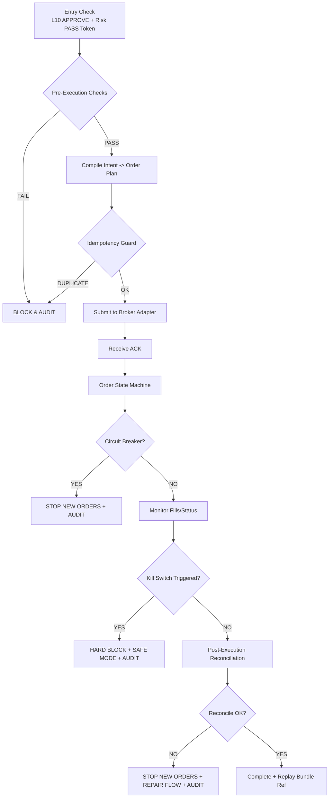

# TAITS_交易執行與控制規範（EXECUTION_CONTROL）__260104

doc_key：EXECUTION_CONTROL  
治理等級：A（Execution & Control Specification｜嚴格執行層最高規範）  
適用範圍：TAITS 全系統（Research / Backtest / Simulation / Paper / Live）  
版本狀態：ACTIVE（單一正確正文版｜最大完備＋累積式更新）  
版本日期：2026-01-04（Asia/Taipei）  
對齊母法：AI_GOV（A+）／MASTER_ARCH（A）／MASTER_CANON（A）／DOCUMENT_INDEX（A+）  
平行參照：FULL_ARCH / ARCH_FLOW / RISK_COMPLIANCE / UI_SPEC / VERSION_AUDIT / DEPLOY_OPS / LOCAL_ENV / TWSE_RULES  
變更原則：最大完備＋累積式更新（允許融合更新／覆寫修正／重排版以形成單一正確正文；禁止摘要化縮水；未被新版本明確更新之有效內容一律保留並持續累積；已被新版本明確取代者可自正文移除但必須由稽核留痕承接）  
核心鐵律：Human-in-the-Loop + Risk PASS Token Required + Kill Switch Always Available


語義定錨（跨文件一致）：
- L9＝投資報告層（含數據/價格/圖形/條件式進出場建議〔非指令〕/風險敘述/可追蹤更新欄位）
- L10＝人類裁決與交易決策層（唯一交易授權入口）
- L11＝全層工程稽核回放層（L1–L11 全留痕），且 L11 非下單層

---

## 0. 文件定位（Execution & Control Charter｜「怎麼執行」的最高規範）

本文件為 TAITS 的 **交易執行與控制規範（Execution & Control Spec）**，用於約束「從 L10 人類授權 → 送單 → 券商回報 → 成交/撤單 → 對帳 → 回放」全流程之硬性邊界與最小可稽核要求。

- 本文件規範「如何執行、如何控風險、如何留痕、如何回放」，**不規範策略本身**。  
- 所有執行相關模組（Execution Engine / Broker Adapter / Order State Machine / Audit Logger / Replay Bundle）必須遵守本文件。  
- 本文件任何條文不得弱化：Risk/Compliance 最高否決權、Kill Switch、Token/簽章驗證、Pre/In/Post 三段審計、對帳一致性、去重/冪等（idempotency）。

---

## 1. 全局語義定錨（L9–L11｜跨文件一致｜單一正確正文）

> 本章為跨文件一致之「語義定錨」。若任一文件出現不同口徑，**一律以本章為準**，並由 `DOCUMENT_INDEX` 與 `AI_GOV` 之衝突裁決程序承接。

### 1.1 L9｜投資報告層（Investment Report Layer｜可追蹤更新、可標的化）
- **目的**：產出「人類可讀」且「可追蹤」的完整投資報告，用於 L10 做最終裁決之前的資訊理解與方案評估。
- **必備內容（不可省略）**
  1. **數據**：關鍵指標數值、區間變化、統計摘要（來源與時間戳須可追溯）
  2. **圖形**：至少包含趨勢/區間/事件標註等可視化（可為文字描述之圖形規格，工程端可再渲染）
  3. **進出場建議（僅建議，非下單）**：進場/加碼/減碼/出場/停損/停利之「價格區間」與「觸發條件」，並附假設、風險點、失效條件
  4. **標的化追蹤（Tracking）**：`tracking_id`（唯一鍵）＋ `report_version`＋ `as_of`（資料截點），並記錄同標的延續關係（非一次性解說）
- **輸出定位**：L9 是「報告層」，**不是 Gate、不是批准、不是下單、不是稽核**。

### 1.2 L10｜人類裁決與交易授權層（Human Decision & Trade Authorization）
- **目的**：由人類最高決策者對 L9 報告與全系統輸入做最終裁決，並決定執行模式與授權邊界。
- **L10 必須輸出（最小集合）**
  - `decision`：NO_ACTION / BACKTEST / SIMULATION / PAPER / LIVE
  - `automation_mode`：MANUAL / SEMI_AUTO / FULL_AUTO（僅為授權模式，**不改變人類最終裁決者**之治理原則）
  - `authorization_envelope`：允許標的範圍、下單上限、風控條件、撤銷條件、有效期限
  - `rationale`：裁決理由（需可稽核、可追溯）
- **邊界**：L10 為唯一授權層；實際執行仍受 **Risk/Compliance 最高否決權**與本文件之硬性控制約束。

### 1.3 L11｜工程稽核回放層（Engineering Audit & Replay｜L1–L11 全留痕）
- **目的**：對 **L1–L11 全層**進行工程稽核、回放與可追溯驗證，用於人類檢視系統是否合理、是否需要調整。
- **L11 必須是「雙料輸出」**
  1. **人類可讀（Human-Readable）**：可看懂每層做了什麼、為什麼、依據是什麼、不確定性在哪
  2. **工程可用（Machine-Readable）**：可被程式回放與對帳（hash、版本、參數、輸入輸出索引）
- **邊界**：L11 僅做稽核/回放/對帳，**禁止作為批准或下單/執行入口**。

### 1.4 禁止 AI 自行批准與禁止把 L11 當批准/下單層（Hard）
- AI/Agent/LLM 不具批准權；不得輸出任何等同 PASS/APPROVE/放行執行之裁決語義。
- 不得以「L11 已記錄/已回放」暗示已批准；批准僅能在 L10 由人類裁決。

---

## 2. 治理身份、引用合法性與執行接面（避免誤讀與越權）

> 本章整合並正規化原先分散於補丁/附錄之「身份裁決、引用格式、Label 解讀、alias 封口、最小可稽核欄位」內容，改以單一正文呈現，避免新舊混讀。

### 2.1 文件定位與邊界（Hard Boundary）
- 本文件為「執行控制」規範：**只管執行，不管策略**。
- 本文件的控制點覆蓋：L10 授權檢核、送單前檢核、送單中控制、事後對帳、稽核回放、券商適配器最小要求。
- 本文件不得被任何下位文件弱化；若下位文件語義衝突，依裁決序處理並以本文件硬性邊界優先。

### 2.2 MASTER_CANON「S」標籤之法律定位（Label ≠ Governance Grade）
- 「S」為定位/標籤（如 Strategy-Integrated / Simulation-Ready 之類型標示），**不是治理等級**。
- 治理等級（A+/A/B/C）以 DOCUMENT_INDEX 與上位母法裁決為準；Label 不得用來越權或改寫裁決序。

### 2.3 母法對位引用口徑（Gate-Friendly Reference）
- 任何執行放行，不得以「敘述性引用」取代「可稽核引用」。
- 引用上位規範時，必須提供：`doc_key`、版本日期、章節路徑（section path）、引用目的（why）、約束點（what）。
- 例：`doc_key=RISK_COMPLIANCE, ver=2026-01-02, §X.Y, constraint=PASS_TOKEN_REQUIRED`

### 2.4 裁決順序字串之法律定位（Mnemonic ≠ Override Rule）
- 裁決順序字串（例如 `DOCUMENT_INDEX → MASTER_ARCH → AI_GOV`）為「記憶輔助」與「引用習慣」，**不得用來改寫真正裁決程序**。
- 真正裁決程序以 `DOCUMENT_INDEX` 指定之裁決序與衝突解決流程為準。

### 2.5 治理識別（doc_key）× 實體檔名（Physical Filename）對齊宣告
- 本文件唯一治理身份：`doc_key = EXECUTION_CONTROL`
- 實體檔名（本次單一正文版）：`TAITS_交易執行與控制規範（EXECUTION_CONTROL）__260104.md`
- 工程層引用必須以 `doc_key` 為主；檔名只作物理載體，不得用「相近檔名」替代治理身份。

### 2.6 Trace ID / Evidence Chain 最小欄位（可回放最低要求）

#### EC1. 最小引用標頭（Minimum Citation Header）
```text
doc_key: EXECUTION_CONTROL
version_date: 2026-01-02
section_path: §<major>.<minor>...
trace_id: <uuid/ulid>
as_of: <ISO8601>
```

#### EC2. Evidence Chain 最小結構（Minimum Evidence Chain）
- `evidence_chain_id`：唯一鍵
- `inputs_ref[]`：輸入索引（含 hash/來源/時間戳）
- `decision_ref`：L10 裁決引用（含 decision_signature）
- `risk_pass_token_ref`：風控放行 Token 引用（含 hash）
- `orders_ref[]`：送單與回報事件流索引
- `reconciliation_ref`：對帳結果索引
- `replay_bundle_ref`：回放包索引

#### EC3. Gate 行為（Gate Behavior）
- Gate 只能做：PASS / FAIL / ESCALATE（上呈）  
- Gate 不得做：策略改寫、下單、假裝批准、越權放行

### 2.7 Index Gate 身份裁決、Label 子級解讀與資料 alias 封口（避免混讀）
- Index Gate 用於「文件身份裁決」「版本選擇」「引用合法性」判定。
- Label（如 S）只能作分類標示，不得作治理等級或放行依據。
- DATA_UNIVERSE / alias 只能作資料字典映射，不得改寫治理身份或引用邏輯。

---

## 3. 執行控制的核心目標（Execution Control Objectives）

1. **合法授權**：無 L10 人類授權與風控放行 Token，禁止任何可造成成交之行為。  
2. **可控風險**：任何時刻可觸發 Kill Switch；風控/合規可一票否決。  
3. **可稽核、可回放**：Pre/In/Post 三段審計 + Replay Bundle 能完整復現。  
4. **一致性**：下單意圖、券商回報、成交/撤單、對帳結果必須一致。  
5. **冪等與去重**：避免重送/重複成交、避免重放造成第二次下單。  
6. **模式一致語義**：Backtest/Sim/Paper/Live 的「控制語義」一致（僅外部效果不同）。

---

## 4. 執行層輸入與輸出契約（Execution I/O Contract）

### 4.1 執行層輸入（必備）
- `human_approve_signature`：人類裁決簽章（L10）
- `risk_pass_token`：風控放行 Token（RISK_COMPLIANCE Gate）
- `order_intent`：下單意圖（含標的、方向、數量、限價/市價、有效期限等）
- `constraints`：授權包絡（authorization_envelope）映射到執行約束（max_notional / max_orders / slippage_guard 等）
- `mode`：BACKTEST / SIMULATION / PAPER / LIVE
- `trace_id`：全程追蹤 ID（跨模組一致）

### 4.2 執行層輸出（必備）
- `order_events[]`：送單/回報/成交/撤單/拒單等事件流
- `execution_summary`：執行摘要（成交均價、成交量、手續費估計、滑價估計、拒單原因等）
- `reconciliation_result`：對帳結果（含差異與修復狀態）
- `audit_bundle_ref`：審計包索引
- `replay_bundle_ref`：回放包索引

### 4.3 執行層在 Canonical Flow 的定位（L11）
- 執行層本身不等於 L11；但必須輸出足夠資料，供 L11 回放。
- L11 是「稽核/回放」層，不得被執行層誤用為批准或放行。

---

## 5. Pre-Execution Checks（送單前檢核）

必做檢核（任一 FAIL 即 BLOCK + AUDIT）：

1. **L10 簽章驗證**：`human_approve_signature` 存在且有效。  
2. **風控放行 Token 驗證**：`risk_pass_token` 存在且有效（hash 可追溯）。  
3. **授權包絡一致性**：下單意圖不得超出 `authorization_envelope`。  
4. **市場狀態檢核**：交易時段/盤中規則/漲跌停/撮合狀態等。  
5. **標的可交易性**：停牌/處置/異常狀態禁止送單（依規則庫）。  
6. **冪等鍵（idempotency_key）生成**：同一意圖重送不得造成第二筆成交風險。  
7. **Kill Switch 狀態**：若已觸發，禁止新單。

---

## 6. In-Execution Control（執行中控制）

1. **Order State Machine**：所有訂單必須走狀態機（NEW → SENT → ACK → PARTIAL_FILL → FILLED / CANCELED / REJECTED 等）。  
2. **速率限制與防爆單**：每秒/每分鐘最大送單數上限。  
3. **滑價/偏離監控（Slippage Guard）**：超出授權包絡/策略允許範圍，觸發 BLOCK 或 ESCALATE。  
4. **熔斷（Circuit Breaker）**：異常回報、連續拒單、報價失真、連線不穩等可觸發。  
5. **Kill Switch 可即時生效**：觸發後應停止新單、撤單（依模式）、並完整留痕。  
6. **事件流完整性**：任何券商回報事件必須可追溯到原訂單與 trace_id。

---

## 7. Post-Execution Reconciliation（事後對帳與一致性）

1. **券商回報對帳**：訂單最終狀態與成交明細必須一致。  
2. **內部帳務對帳**：持倉/現金/手續費/交易稅估計與實際回報一致。  
3. **差異處理（Mismatch Repair Flow）**
   - 記錄差異原因（來源延遲、重送、券商回報異常等）
   - 進入修復流程，期間可禁止新單（視嚴重度）
4. **對帳完成後**：產生 `reconciliation_result`、`replay_bundle_ref`、`audit_bundle_ref`

---

## 8. 審計三段式（Pre / In / Post）

- **Pre-Audit**：授權、Token、包絡、冪等鍵、模式、時間戳  
- **In-Audit**：送單請求、券商 ACK、狀態轉移、熔斷/kill、事件碼  
- **Post-Audit**：成交明細、對帳結果、差異、修復、回放包索引

---

## 9. Broker Adapter（券商適配器）最低要求

1. **雙向映射**：內部標準事件 ↔ 券商 API 回報事件  
2. **錯誤碼標準化**：券商錯誤碼必須映射到本文件事件碼  
3. **重試策略可稽核**：何時重試、重試次數、退避策略、每次重試需留痕  
4. **序列一致性**：同訂單的事件排序必須可被重建  
5. **沙盒/正式一致語義**：PAPER 與 LIVE 的 adapter 行為一致（僅外部效果不同）

---

## 10. 模式差異（Mode Differences｜語義一致）

- BACKTEST：不連外、以歷史撮合模擬；仍需產出事件流與回放包索引  
- SIMULATION：可連外但不得成交；仍需完整 Pre/In/Post 審計  
- PAPER：模擬成交/或券商紙上帳戶；仍需完整對帳與回放  
- LIVE：真實成交；所有控制點強制啟用（不可降級）

---

## 11. Kill Switch 觸發條件（示例｜可擴充）

- 風控 Token 失效/過期/驗證失敗  
- L10 簽章驗證失敗或授權包絡不一致  
- 連續拒單超閾值  
- 回報事件流異常（無 ACK、重複成交疑慮、狀態機不可能跳轉）  
- 報價/行情異常（依風控規範閾值）  
- 對帳重大差異（資金/持倉不一致）  
- 人類手動觸發（HFI Emergency Stop）

---

## 12. Reason / Event Codes（事件碼｜最小集）

- `EC_PASS_TOKEN_MISSING`
- `EC_PASS_TOKEN_INVALID`
- `EC_L10_SIGNATURE_INVALID`
- `EC_ENVELOPE_VIOLATION`
- `EC_IDEMPOTENCY_DUPLICATE`
- `EC_BROKER_REJECT`
- `EC_BROKER_TIMEOUT`
- `EC_STATE_MACHINE_ILLEGAL_TRANSITION`
- `EC_CIRCUIT_BREAKER_TRIGGERED`
- `EC_KILL_SWITCH_TRIGGERED`
- `EC_RECONCILIATION_MISMATCH`

---

## 13. 官方制度入口（執行層合規依據之官方來源）

- 交易所（TWSE）規則／公告  
- 期交所（TAIFEX）規則／公告（如適用）  
- 證交法規／主管機關公告（如適用）  
- 券商 API/下單規格書（以券商官方文件為準）  

> 注意：本章僅作「來源入口」列示；具體規則落地以 `TWSE_RULES` / 相關治理文件承接。

---

## 14. 版本與可追溯性（Version & Trace）

- 所有執行事件必須帶 `trace_id`  
- 任何決策/授權必須可追溯到 L10 裁決記錄（含 decision_signature）  
- 任何放行必須可追溯到 Risk PASS Token（含 hash）  
- 任何成交/撤單必須可追溯到券商回報事件與 adapter 映射表版本

---

## 15. Replay Bundle（回放包）最低要求

回放包（Replay Bundle）至少包含：

- `trace_id`
- `inputs_manifest`（輸入索引＋hash）
- `decision_ref`（L10 裁決引用）
- `risk_pass_token_ref`
- `order_events[]`（完整事件流）
- `reconciliation_result`
- `system_versions`（包含執行引擎、adapter、規則庫版本）
- `timeline`（可重建序列）

---

## 16. 緊急事件（Emergency）處置準則

- 任何緊急事件，先保護資金與合規：**停止新單 → 觸發 Kill Switch → 留痕 → 回放 → 人類裁決**  
- 若需撤單，必須留痕並可回放（撤單意圖、撤單結果、未撤成原因）

---

## 17. 禁止事項（Forbidden｜一票否決）

- 禁止無 L10 授權／無 Risk PASS Token 送單  
- 禁止以 L11/回放/已記錄 取代批准  
- 禁止跳過 Pre/In/Post 任一段審計  
- 禁止省略對帳  
- 禁止以效能理由取消冪等/去重  
- 禁止 AI/Agent 自行批准或暗示批准

---

## 18. 實作最小化建議（Implementation Minimums｜不可降標準）

- 以狀態機實作訂單生命週期  
- 以事件溯源（event sourcing）實作審計  
- 以 `idempotency_key` + `trace_id` 做冪等  
- 以一致性對帳作為 LIVE 模式完成條件  
- 以可插拔 adapter 支援多券商

---

## 19. Mermaid｜執行控制總流程圖（Execution Control Map）



### 19.1 演進規則（最大完備＋累積式更新｜本文件專屬）
允許擴充（不改既有語義）：
- 更多狀態機狀態（state machine states）
- 更多熔斷條件與事件碼（circuit breaker triggers / reason codes）
- 更多審計欄位與回放視角（audit fields / replay views）
- 更多券商適配器（broker adapters）

禁止（任何模式皆不得降級）：
- 刪除或弱化 Token/簽章驗證
- 刪除或弱化 Kill Switch
- 刪除 Pre/In/Post 任一段審計
- 以效能理由省略對帳或省略去重

---

## 20. 工程端本地運算環境基線（承接既有資訊｜不作硬性要求）

> 本章為工程實作的「環境基線參考」，不構成治理等級強制條文；若與 `LOCAL_ENV` 有衝突，以 `LOCAL_ENV` 裁決為準。

- OS：Windows 11（可搭配 WSL2）
- IDE：Cursor v0.45+（或同級 IDE）
- Python：3.11+
- Node.js：18+
- Git：2.44+
- Docker：25+（如需容器化）
- Optional：NVIDIA 30xx+（如需 GPU 推論/訓練）
- Shell：PowerShell / WSL2 Bash
- 目標：可重現（reproducible）、可稽核（auditable）、可回放（replayable）

---

# 稽核區塊（Audit Section｜非正文）

> 本區塊為「本次融合更新」之留痕（Changelog／Hash Manifest／Scope／Audit Hand-off）。  
> 為避免新舊混讀：本區塊不參與 EXECUTION_CONTROL 正文裁決；正文以本檔案開頭至本區塊前之內容為準。

## A. Scope（適用範圍）
- scope_doc_key: EXECUTION_CONTROL
- scope_files_output: TAITS_交易執行與控制規範（EXECUTION_CONTROL）__260104.md
- scope_files_source: TAITS_交易執行與控制規範（EXECUTION_CONTROL）__260102.md
- scope_mode: FILE UPDATE MODE（融合更新／整合重排版／語義定錨一致化／Final QA）
- version_date: 2026-01-04（Asia/Taipei）
- anchors_enforced:
  - L9＝投資報告層（含數據/價格/圖形/條件式進出場建議〔非指令〕/風險敘述/可追蹤更新欄位）
  - L10＝人類裁決與交易決策層（唯一交易授權入口）
  - L11＝全層工程稽核回放層（L1–L11 全留痕），且 L11 非下單層
  - 留痕與正文分離（Changelog/Hash/Scope/Audit Hand-off 不混入正文）

## B. Changelog（變更清單）
1) 版本日期與檔名統一更新為 2026-01-04（Asia/Taipei）／__260104，形成可直接覆蓋的單一正文版本。  
2) 既有正文條款保持最大完備：未刪減任何未被本次更新明確取代之有效內容；僅進行必要的「日期／檔名映射」一致化。  
3) 在文件頭部補齊「L9/L10/L11 跨文件一致之語義定錨」摘要（不改變既有條款內容，只強化入口一致性）。  
4) 以本次稽核區塊取代上一版稽核留痕段落（舊版 Audit Section 不再保留於正文或附件），避免多份留痕並存造成新舊混讀。

## C. Hash Manifest（指紋清單）
- hash_alg: sha256
- scope: BODY_ONLY（不含本稽核區塊）
- hash_value_sha256: cd67c0a85abc18f008c03eeca2765f303fede89ec5542d3b9038f2865666a448

## D. Audit Hand-off（裁決承接）
- change_id: EC-FUSION-260104-0004
- authority_basis: HFI（人類最高決策者明確命令｜scope=EXECUTION_CONTROL｜融合更新形成單一正文）
- governance_order_applied: DOCUMENT_INDEX → MASTER_ARCH → AI_GOV（並對齊 MASTER_CANON）
- downstream_notes:
  - 若 DOCUMENT_INDEX 之 EXECUTION_CONTROL 條目仍指向舊日期版本（__260102），需同步更新映射至 __260104 以避免載入混讀。
  - UI_SPEC（L10 介面）與 VERSION_AUDIT（L11 留痕）如含舊檔名/日期引用，需依最小引用欄位規則同步更新。
  - 若 RISK_COMPLIANCE / GOVERNANCE_GATE_SPEC 對「PASS Token / Kill Switch / Execution Intent」的口徑與本文件存在張力，應依裁決序位完成逐檔一致化（不得由下位文件弱化本文件硬邊界）。
