# TAITS_全系統架構總覽（FULL_ARCH）

## 文件頭（Document Header）
- doc_key：FULL_ARCH
- 治理等級：B（治理／制度級｜全系統架構總覽）
- 適用範圍：TAITS 全系統（Research / Backtest / Simulation / Paper / Live / Live-Shadow）
- 基線日期：2026-01-08（Asia/Taipei）
- 版本日期：2026-01-08（Asia/Taipei）
- 治理裁決序位：DOCUMENT_INDEX → MASTER_ARCH → AI_GOV
- Canonical Flow（L1–L11）定義來源：doc_key=MASTER_CANON 為唯一正文來源（本檔僅作架構對位與介面契約，不重複層級定義）

## 0. 文件定位（System Architecture Overview｜最大完備）

本文件為 **TAITS 全系統架構總覽圖譜（System Architecture Map）**，目的在於：

- 以「模組化視角」描述 TAITS 的整體系統構成
- 說清楚「每一模組的角色、邊界、輸入/輸出、通訊限制」
- 建立「橫向模組 × 縱向層級」的共同語言，供：
  - 工程實作
  - Agent 佈署（Agent 是操作單位，不是策略）
  - 資料流/事件流設計
  - UI 組裝與決策追溯
  - 稽核與回放

📌 本文件不做的事（避免越權）：
- 不定義 Canonical Flow 順序（由 MASTER_CANON / ARCH_FLOW 定義）
- 不定義制度鐵律（由 MASTER_ARCH 定義）
- 不定義否決條文全集（由 RISK_COMPLIANCE 定義）
- 不定義券商下單細節（由 EXECUTION_CONTROL 定義）

---
## 1. TAITS 架構總原則（Architecture Hard Principles）

### 雙維度架構（Cross-Dimension Architecture）
TAITS 採用：
- **縱向（流程層）**：L1–L11 Canonical Flow（不可跳步）
- **橫向（系統模組）**：Data / State / Analysis / Evidence / Regime / Risk&Compliance / Strategy&Research / Governance / UI / Execution&Control / Infrastructure

✅ 任何模組必須同時歸屬：
- 一個「橫向模組域（Domain）」
- 一個或多個「縱向層級（Layer: L1–L11）」  
且 **不得越權跨層產出**。

### 三條邊界鐵律（不可違反）
1) **策略 ≠ 下單**（Strategy 永遠不直連 Execution）  
2) **Agent ≠ 策略**（Agent 是操作單位，不能暗自串出隱性策略鏈）  
3) **AI ≠ 唯一真理**（AI 只能輔助，不得升格為裁決主體；裁決主體為人類 + 風控合規否決權）

### 否決鏈（Veto Chain）不可破壞
- Risk/Compliance 可跨層否決
- Governance Gate 可退回補齊
- UI 必須可視化否決與原因碼
- Execution 必須驗證 Risk PASS Token（否則阻斷）

---

## 2. 全系統「橫向模組域」總覽（Domains Overview｜最大完備）

這裡列的是 **模組域（Domain）**，不是單一服務；每個 Domain 下可再拆子模組（最大完備＋累積式更新）。

### Data Domain（資料域）
**角色定位**：系統感知器官（唯一資料入口與治理）  
**典型子模組**：
- DataSources Adapter（資料源適配器）
- Data Collector（收集器）
- Data Validator（驗證器）
- Data Normalizer（正規化器）
- Corporate Actions Processor（除權息/分割/合併處理）
- Calendar & Session Service（交易日曆/交易時段）

### State & Snapshot Domain（狀態快照域）
**角色定位**：將「當下市場與系統狀態」固化為可回放快照  
**典型子模組**：
- Market Snapshot Builder
- State Cache（狀態快取）
- Snapshot Store（快照落盤）
- Replay Loader（回放載入）

### Analysis Domain（分析域）
**角色定位**：資料 → 可解釋特徵（只描述，不產出方向）  
**典型子模組**：
- Feature Engine（特徵引擎）
- Indicator Engine（指標引擎）
- Statistical Engine（統計引擎）
- Structure Engine（結構/型態/纏論結構容器：作為結構描述，不是下單指令）

### Evidence Domain（證據域）
**角色定位**：把多來源資訊組裝成可審計的 Evidence Bundle  
**典型子模組**：
- Evidence Bundle Assembler
- Provenance Mapper（來源追溯映射）
- Conflict Marker（衝突標記：不裁決，只標記）
- Evidence Completeness Scorer（完整度量）

### Regime Domain（市場狀態域）
**角色定位**：裁定市場狀態（Regime）並產出可交易/不可交易約束  
**典型子模組**：
- Regime Engine
- Regime Policy Map（Regime→允許策略類型映射）
- Regime Change Log（狀態變化紀錄）

### Risk & Compliance Domain（風控合規域）
**角色定位**：全系統最高否決 Gate（PASS/VETO）  
**典型子模組**：
- Risk Exposure Analyzer
- Liquidity & Slippage Checker
- Compliance Rules Engine（規則快照）
- Risk PASS Token Issuer/Verifier
- Veto Reason Code Mapper

### Strategy & Research Domain（策略研究域）
**角色定位**：產生「假設、建議、情境」，永不直連下單  
**典型子模組**：
- Strategy Library（策略庫：白名單治理）
- Universe Selector（標的池）
- Backtest Engine（回測）
- Simulation Engine（模擬）
- Scenario Generator（情境器）

### Governance Domain（治理域）
**角色定位**：流程守門（完整性檢查、退回補齊、禁止跳層）  
**典型子模組**：
- Flow Validator（跳層檢測）
- Evidence Completeness Gate（證據門檻）
- Policy/Version Consistency Gate（版本一致性）
- Governance Decision Recorder（治理審計）

### UI & Explainability Domain（介面與可解釋域）
**角色定位**：人與系統唯一交界面（L10 人類裁決入口）  
**典型子模組**：
- Decision Workbench（決策工作台）
- Visualization Engine（視覺化）
- Explainability Engine（可解釋呈現）
- Replay Viewer（回放檢視）
- Trace Recorder（UI Trace）

### Execution & Control Domain（執行控制域）
**角色定位**：在合規前提下執行；可即時中止；不可繞過 Gate  
**典型子模組**：
- Execution Orchestrator
- Intent Compiler
- Broker Adapter（券商介面）
- Order State Machine
- Idempotency / De-dup Guard
- Channel Health Monitor
- Circuit Breaker
- Kill Switch Controller
- Reconciliation Engine（對帳）

### Infrastructure Domain（基礎設施域）
**角色定位**：支撐全系統的底層能力（不可變更審計/佈署/監控/儲存）  
**典型子模組**：
- Storage / Database（含不可變更儲存）
- Message Bus / Queue（事件匯流排）
- Logging / Metrics / Tracing
- Secrets & Key Management（敏感隔離）
- Version Ledger（版本帳本）
- Access Control（RBAC）

---

## 3. 橫向模組域 × L1–L11 對位表（Module × Layer Mapping）

Canonical Flow 定義在 MASTER_CANON / ARCH_FLOW；此處做「架構對位」，確保不跳層、不越權。

| L層 | 層級名稱 | 主要 Domain | 核心輸入 | 核心輸出 | 禁止事項（摘要） |
|---|---|---|---|---|---|
| L1 | Data Source | Data | 官方/授權資料 | Raw Data | 非官方裁決制度 |
| L2 | Normalization | Data | Raw Data | Canonical Data | 偷換欄位語義 |
| L3 | Snapshot/State | State | Canonical Data | Snapshot/State | 只在記憶體存在 |
| L4 | Analysis | Analysis | Snapshot/State | Feature/Structure | 產生交易方向 |
| L5 | Evidence | Evidence | Feature + State | Evidence Bundle | 只留摘要不留追溯 |
| L6 | Regime | Regime | Evidence | Regime State | Regime 未定就放行 |
| L7 | Risk/Compliance | Risk&Compliance | Evidence/Regime/Account | PASS/VETO + Token | 以績效辯護 |
| L8 | Strategy/Research | Strategy&Research | PASS + Evidence/Regime | Proposal/Scenario | 直連下單 |
| L9 | 投資報告（Investment Report） | Report | 上游輸出（引用） | 投資報告 Artifact（引用；細節以 MASTER_CANON 為準） | 不得以 L9 取代 L10 裁決 |
| L10 | 人類裁決與交易授權（Human Decision & Authorization） | UI | 全部上游輸出（引用） | 裁決紀錄 + UI Trace（引用；細節以 MASTER_CANON / UI_SPEC 為準） | 不得自動批准／不得繞過風控與治理 |
| L11 | 全層工程稽核回放（Engineering Audit & Replay） | Audit | 全鏈路輸入/輸出引用 | 回放包 Replay Bundle（引用；細節以 MASTER_CANON / VERSION_AUDIT 為準） | 不得作為下單或執行入口 |

---

## 4. 核心資料流（High-Level Data Flow｜最大完備）

### 主幹資料流（不含退回）
```mermaid
flowchart TB
  D1[Data Domain<br/>L1-L2] --> S1[State/Snapshot<br/>L3]
  S1 --> A1[Analysis Domain<br/>L4]
  A1 --> E1[Evidence Domain<br/>L5]
  E1 --> R1[Regime Domain<br/>L6]
  R1 --> RC[Risk & Compliance<br/>L7]
  RC -->|PASS| SR[Strategy & Research<br/>L8]
  RC -->|VETO| STOP1[STOP]
  SR --> REP[Investment Report<br/>L9]
  REP --> GOV[Governance Gate Check<br/>(non-layer)]
  GOV -->|PASS| UI[UI Human Decision<br/>L10]
  GOV -->|RETURN| A1
  UI -->|APPROVE| EXE[Execution & Control]
  EXE --> AUD[L11 Audit Replay<br/>(non-order)]
  UI -->|REJECT| STOP2[STOP]
```

### 4.2 否決鏈與阻斷（Veto/Block）
- L7 VETO：流程立即 STOP（不得進入 L8+）
- L9 RETURN：退回補齊（不得跳層）
- Execution Control BLOCK：若 Token/通道/審計缺失，執行控制必須阻斷並回報 UI（L11 僅承接回放留痕）
### 4.3 事件匯流排（Event Bus）與訊息契約（Message Contracts）
本節是「最大完備」的重要差異：把模組間通訊規格拉齊，避免黑箱串接與隱性策略。

#### 事件類型（最小集合，可擴充）
- DataIngested

- DataNormalized

- SnapshotCreated

- FeaturesComputed

- EvidenceAssembled

- RegimeDetermined

- RiskGateDecided（PASS/VETO）

- StrategyProposed

- GovernanceChecked（PASS/RETURN）

- HumanDecisionRecorded（APPROVE/REJECT）

- ExecutionIntentCreated

- OrderSubmitted / OrderAcked / OrderFilled / OrderRejected

- KillSwitchTriggered

- CircuitBreakerTriggered

- ReconciliationCompleted

- ReplayBundleAssembled

#### 4.3.2 訊息契約硬性欄位（每個事件都必須）
- correlation_id

- event_id

- event_type

- timestamp

- producer_module

- active_version_map_ref

- input_refs[] / output_refs[]（可回放引用）

- hash_manifest_ref（完整性）

### 4.4 儲存與不可變更稽核（Storage & Immutable Audit）（Storage & Immutable Audit）
#### 儲存分層（推薦最小集合）
Hot Store：即時快取（State Cache）

Warm Store：可查詢的歷史（Features/Evidence 索引）

Cold Store：不可變更審計物（WORM/Append-only（僅追加寫入；審計物不可覆寫））

Ledger Store：版本帳本（Version Ledger）

#### 不可變更（Immutable）硬要求
Evidence / Risk Gate / UI Trace / Execution Logs / Replay Bundle：

必須 Append-only（僅追加寫入；審計物不可覆寫）

必須可校驗 hash

禁止回填與覆寫（最大完備＋累積式更新）

## 5. 資料來源與引用口徑（Data Source Governance Reference）

本文件僅在「架構層」宣告資料來源治理之引用口徑，避免各模組域自行定義來源清單或引入混讀。

### 唯一資料來源全集（引用規則）
- 任何資料來源之清單、端點、欄位定義、合法性與授權條件，**一律以 doc_key=DATA_SOURCES 為唯一正文來源**。
- 本文件與其他治理文件如需引用資料來源，僅能以「source_id（資料源主鍵）」與「provenance_ref（來源追溯引用）」連結，**不得在本文件重複列舉來源全集**。

### 架構層最小要求（不得省略）
- L1/L2 之 Data Domain 事件與 Artifact **必須攜帶 provenance_ref**（來源、端點、時間戳、回應摘要/校驗）。
- 任一跨模組事件（Event）必須攜帶 active_version_map_ref 與 hash_manifest_ref，以維持「可回放、可稽核」之架構底座。

## 6. 模組介面契約（Module Interface Contracts｜全域硬規格）

本節是 FULL_ARCH 的「最大完備核心」：  
任何模組在跨 Domain 溝通時，必須使用結構化契約（Contract），不得以自由文字、臨時欄位、私下串接形成黑箱。

### Contract 的共同硬性欄位（所有跨模組輸入/輸出都必須）
- `correlation_id`：全鏈路關聯鍵（L1–L11 同一條）
- `session_id`：UI 會話鍵（有人類介入時必須）
- `layer_id`：L1–L11
- `domain`：Data/State/Analysis/Evidence/Regime/Risk/Strategy/Gov/UI/Exec/Infra
- `module_id`：產出模組
- `timestamp_utc`
- `active_version_map_ref`：版本映射引用（缺 = SYS-VERSION → 阻斷）
- `input_refs[]`：輸入引用（含 provenance）
- `output_refs[]`：輸出引用
- `hash_manifest_ref`：完整性校驗（缺 = SYS-HASH/SYS-AUDIT → 阻斷）
- `status`：SUCCESS / FAIL / RETURN / VETO / BLOCK
- `reason_codes[]`：非 SUCCESS 必填（不可空）

### Agent 綁定與權限宣告（Binding Requirements｜架構層硬規格）
每個 Agent 必須在啟動時向系統註冊（Agent Registry），並以結構化欄位宣告其**可作為的邊界**。此規格屬架構層「可落地硬要求」，用於 RBAC、路由、稽核與責任歸屬；不構成 Canonical Layer（L1–L11）之定義。

每個 Agent 必須宣告：
- `agent_id`：唯一識別
- `domain`：所屬 Domain（Data / State / Analysis / Evidence / Regime / Risk / Strategy / Gov / UI / Exec / Infra）
- `layer_id`：所屬 Layer（L1–L11；層級語義以 doc_key=MASTER_CANON 為唯一正文來源）
- `artifact_rw`：可讀/可寫之 Artifact 類型與範圍（最小權限；白名單制）
- `deny_scopes`：禁止存取範圍（例如：不得觸碰任何 Execution API、不得讀取 Secrets/Keys、不得寫入 Risk Gate 或 Version Ledger）
- `run_mode`：允許之運行模式（DRY_RUN / PAPER / LIVE 僅能由人類裁決授權後生效；Agent 不得自我升格）

架構硬要求：
- **Execution 介面**必須由 Exec Domain 的專屬服務承接；任何非 Exec Agent 不得直接呼叫下單/撤單介面。
- **Gate 決議狀態**（PASS / VETO / RETURN）必須由 Governance/Risk Domain 的機制輸出；任何自由文字不得冒充裁決結果。
- **跨層回寫**必須被阻斷：Agent 僅能產出其宣告層級允許之 Artifact，且不得回寫改變上游層之事實/證據。

### 禁止事項（Contract 層硬禁）
- 禁止只傳「摘要」而不保留可追溯引用（provenance 斷裂）
- 禁止跨層回寫（層級邊界由系統強制；不得以任何方式回寫改變上游層之事實/證據）
- 禁止私下新增未版控欄位作裁決依據（必須走 最大完備＋累積式更新 + VERSION_AUDIT）

---

## 7. 各 Domain 最小輸入/輸出契約（Minimum IO Contracts）

下列為「最小可落地」的 Contract 模板（可擴充不可縮減）。

Schema 以「欄位級」定義，工程實作可用 JSON/Proto/Parquet 等，但語義不得改。

### 7.1 Data Domain（L1–L2）契約

#### 7.1.1 `DataIngested`（L1）
**輸入**：官方/授權資料端點  
**輸出**：Raw Data Artifact + Provenance

必備欄位（除 6.1 共同硬性欄位外）：
- `source_id`（資料源主鍵，需存在於 DATA_SOURCES（source registry））
- `source_type`（TWSE/TAIFEX/MOPS/TDCC/券商/第三方…）
- `fetch_window`（start/end）
- `raw_payload_ref`
- `provenance_ref`（官方網址/端點/回應頭/時間戳）

禁止：
- 以非官方裁決制度（若需要制度判定，必須引用 TWSE_RULES + 官方入口）
- 省略 provenance_ref

#### 7.1.2 `DataNormalized`（L2）
**輸入**：Raw Data  
**輸出**：Canonical Data（欄位標準化）

必備欄位：
- `canonical_schema_id`
- `normalization_ruleset_version`
- `field_map_ref`（原欄位→標準欄位）
- `quality_flags[]`（缺值、異常、延遲）

禁止：
- 偷換欄位語義（例如把成交量當成交額）
- 靜默修補（任何補值必須留痕）

---

### 7.2 State & Snapshot Domain（L3）契約

#### 7.2.1 `SnapshotCreated`（L3）
**輸入**：Canonical Data  
**輸出**：Snapshot（可回放）

必備欄位：
- `snapshot_id`
- `market_time`（交易所時間）
- `trading_session_state`（可交易/不可交易/盤後等）
- `snapshot_store_ref`（必須落盤，不得只在記憶體）
- `replay_loader_ref`（可載入入口）

禁止：
- 不落盤
- Snapshot 與 version map 不一致

---

### 7.3 Analysis Domain（L4）契約

#### 7.3.1 `FeaturesComputed`（L4）
**輸入**：Snapshot/State  
**輸出**：Feature Set + Structure Descriptors

必備欄位：
- `feature_set_id`
- `feature_schema_version`
- `indicator_set_ref`
- `structure_descriptor_ref`（若有纏論/型態結構，必須以「結構描述」形式輸出）
- `feature_quality_flags[]`

硬禁（非常重要）：
- 不得產生交易方向（不得輸出 BUY/SELL/target position）
- 不得繞過 Evidence 組裝（L5）

---

### 7.4 Evidence Domain（L5）契約

#### 7.4.1 `EvidenceAssembled`（L5）
**輸入**：Feature Set + State  
**輸出**：Evidence Bundle（可稽核）

必備欄位：
- `evidence_bundle_id`
- `evidence_items[]`（每一項含：來源 ref、時間戳、hash、類型）
- `provenance_map_ref`（來源追溯映射）
- `conflict_flags[]`（衝突標記，不裁決）
- `completeness_score`（完整度分數/等級）
- `completeness_missing_items[]`（缺口清單）

禁止：
- 只留摘要不留 item refs
- 以 AI 文本替代 evidence_items（AI 只能輔助描述，不能成為唯一證據）

---

### 7.5 Regime Domain（L6）契約

#### 7.5.1 `RegimeDetermined`（L6）
**輸入**：Evidence Bundle  
**輸出**：Regime State（適用性約束）

必備欄位：
- `regime_state_id`
- `regime_label`
- `regime_confidence`
- `allowed_strategy_classes[]`（允許策略類型）
- `blocked_strategy_classes[]`（禁入類型）
- `regime_change_log_ref`

禁止：
- Regime 不明確卻放行（應降級或觸發風控升級）

---

### 7.6 Risk & Compliance Domain（L7）契約

#### 7.6.1 `RiskGateDecided`（L7）
**輸入**：Evidence + Regime + Account + Rulebook Snapshot  
**輸出**：PASS/VETO（二元）+ Token（PASS 時）

必備欄位：
- `risk_decision_id`
- `risk_gate_decision`（PASS/VETO）
- `veto_reason_codes[]`（VETO 必填）
- `policy_version`
- `rulebook_snapshot_ref`（制度快照引用）
- `risk_pass_token_ref`（PASS 必填）
- `risk_evidence_snapshot_ref`（必填）

禁止：
- 用績效辯護
- 用模糊語句替代 VETO
- 缺 token 仍放行

---

### 7.7 Strategy & Research Domain（L8）契約

#### 7.7.1 `StrategyProposed`（L8）
**輸入**：Risk PASS + Evidence/Regime  
**輸出**：Proposal（假設/情境/限制）

必備欄位：
- `proposal_id`
- `strategy_ids[]`（白名單策略 ID；必須存在 STRATEGY_UNIVERSE）
- `scenario_ref`
- `assumptions_ref`
- `limitations_ref`
- `expected_behavior_ref`（行為描述，不得是下單指令）
- `proposal_confidence`（允許，但不得作裁決）

硬禁：
- 不得產生下單指令
- 不得把特徵直接等同方向（特徵≠方向）

---

### 7.8 Governance Gate（非 Canonical Layer）契約

#### 7.8.1 `GovernanceChecked`（治理閘門產物｜非 Canonical Layer）
**輸入**：Proposal + 全鏈路審計引用  
**輸出**：PASS/RETURN（供 L10 進入前之治理閘門判定；不構成 L 層）

必備欄位：
- `governance_report_id`
- `governance_status`（PASS/RETURN）
- `missing_items[]`（RETURN 必填）
- `flow_integrity_checks_ref`
- `version_consistency_checks_ref`
- `evidence_completeness_checks_ref`

禁止：
- 允許例外捷徑
- RETURN 不提供缺口清單

---

### 7.9 UI Domain（L10）契約

#### 7.9.1 `HumanDecisionRecorded`（L10）
**輸入**：Risk PASS/VETO + Gov PASS/RETURN + Evidence/Regime/Proposal  
**輸出**：APPROVE/REJECT/ABORT + UI Trace

必備欄位：
- `human_decision_id`
- `human_decision`（APPROVE/REJECT/ABORT）
- `user_id`
- `ui_trace_ref`
- `decision_signature`
- `decision_reason_ref`（可選，但不得取代風控 reason codes）

禁止：
- 自動批准
- VETO/RETURN 狀態仍允許 APPROVE

---

### 7.10 Execution & Control Domain（非 Canonical Layer）契約

#### 7.10.1 `ExecutionIntentCreated`（Pre-Execution）
**輸入**：APPROVE + Risk Token  
**輸出**：Execution Intent Draft（尚未送券商）

必備欄位：
- `intent_id`
- `idempotency_key`
- `intent_hash`
- `risk_pass_token_ref`（再次驗證）
- `channel_health_snapshot_ref`
- `kill_switch_status`
- `pre_execution_log_ref`

#### 7.10.2 `OrderLifecycleEvents`（In-Execution）
- `OrderSubmitted` / `OrderAcked` / `OrderFilled` / `OrderRejected` / `OrderCanceled`
必備欄位：
- `order_id`
- `broker_order_id`（若有）
- `state_transition_ref`
- `latency_metrics_ref`

#### 7.10.3 `ReconciliationCompleted`（Post-Execution｜非 Canonical Layer）
必備欄位：
- `reconciliation_report_id`
- `reconcile_status`（OK/NOT_OK）
- `post_trade_snapshot_ref`
- `post_execution_log_ref`
- `replay_bundle_ref`

禁止：
- 無 token 送單
- 無對帳繼續送新單
- 靜默重送/靜默改單

---

## 8. 端到端 Trace（E2E Trace）範本（可直接落地審計）

這裡提供「一筆交易/一次裁決」從 L1 到 L11 的最小可回放追溯清單。  
TAITS 實作時，任何缺項都應被視為 SYS-AUDIT / SYS-VERSION 類阻斷。

### E2E Trace Manifest（最小集合）
- `correlation_id`
- `active_version_map_ref`
- L1：`raw_payload_ref` + `provenance_ref`
- L2：`canonical_data_ref` + `field_map_ref`
- L3：`snapshot_store_ref`
- L4：`feature_set_ref` + `structure_descriptor_ref`
- L5：`evidence_bundle_ref` + `provenance_map_ref` + `completeness_score`
- L6：`regime_state_ref`
- L7：`risk_gate_decision_ref` + `policy_version` + `rulebook_snapshot_ref` + `risk_pass_token_ref(PASS)`
- L8：`strategy_proposal_ref`
- L9：`investment_report_ref`（alias：`governance_report_ref`；保留相容性）
- L10：`ui_trace_ref` + `human_decision_ref` + `decision_signature`
- L11：`pre_execution_log_ref` + `order_lifecycle_refs[]` + `post_execution_log_ref` + `reconciliation_report_ref` + `replay_bundle_ref`
- `hash_manifest_ref`（全鏈路 hash 清單）

### Mermaid｜E2E Trace 骨架圖
```mermaid
flowchart TB
  L1[L1 DataIngested] --> L2[L2 DataNormalized]
  L2 --> L3[L3 SnapshotCreated]
  L3 --> L4[L4 FeaturesComputed]
  L4 --> L5[L5 EvidenceAssembled]
  L5 --> L6[L6 RegimeDetermined]
  L6 --> L7[L7 RiskGateDecided]
  L7 -->|PASS| L8[L8 StrategyProposed]
  L7 -->|VETO| STOP[STOP + Audit]
  L8 --> L9[L9 InvestmentReportPublished]
  L9 -->|RETURN| L5
  L9 --> GOV[Governance Gate Check (non-layer)]
  GOV -->|PASS| L10[L10 HumanDecisionRecorded]
  GOV -->|RETURN| L5
  GOV -->|VETO| STOP
  L10 -->|REJECT| STOP
  L10 -->|APPROVE| EC[Execution Control: OrderLifecycle + Reconcile]
  EC --> L11[L11 AuditReplayBundleStored (non-order)]

```

## 9. 安全與權限邊界（Security & RBAC）
### 權限最小集合（對齊 UI_SPEC）
- Viewer：只讀
- Operator：操作回放/查詢，不可 APPROVE
- Trader：可在 PASS 狀態 APPROVE
- Admin：管理設定，但可覆寫修正（但必留痕）風控否決

### 敏感資訊隔離
金鑰/憑證不得進 Repo（對齊 LOCAL_ENV / DEPLOY_OPS）

任何會觸碰券商的憑證：

只能在 Execution Domain 的受控環境中使用

且必須可審計（誰用、何時用、用於何 correlation_id）

## 10. 部署拓樸（Deployment Topologies｜架構層總覽）
具體上線流程與 Runbook 由 DEPLOY_OPS 定義；此處提供架構層必須支援的拓樸型態（最大完備＋累積式更新）。

### 單機拓樸（Local / Research）
Data + Analysis + Evidence + Regime + Strategy + UI 在同機

Execution 可關閉或使用模擬通道

### 分層服務拓樸（Paper / Live）
Data/State/Analysis：可獨立擴展

Risk/Compliance：獨立服務（高可用）

Execution：獨立服務（最小權限、最嚴隔離）

UI：獨立前端（只讀多、決策少、全留 trace）

### 隔離原則（必須）
Execution 與 Secrets/Keys 需最高隔離

Risk Gate 與 Version Ledger 需高可靠與不可變更

## 11. Mermaid｜「橫向模組域」總覽圖（System Map）

```mermaid
flowchart LR
  subgraph DATA[Data Domain]
    DS[DataSources Adapter]
    DC[Collector]
    DV[Validator]
    DN[Normalizer]
    CA[Corp Actions]
    CAL[Calendar/Session]
  end

  subgraph STATE[State & Snapshot]
    SS[Snapshot Builder]
    SC[State Cache]
    ST[Snapshot Store]
    RP[Replay Loader]
  end

  subgraph ANALYSIS[Analysis]
    FE[Feature Engine]
    IE[Indicator Engine]
    SE[Stat Engine]
    STX[Structure Engine]
  end

  subgraph EVID[Evidence]
    EB[Evidence Assembler]
    PM[Provenance Map]
    CM[Conflict Marker]
    EC[Completeness Scorer]
  end

  subgraph REG[Regime]
    RE[Regime Engine]
    RM[Regime Policy Map]
    RL[Regime Change Log]
  end

  subgraph RISK[Risk & Compliance]
    RA[Exposure Analyzer]
    LQ[Liquidity/Slippage]
    CR[Compliance Rules]
    TK[PASS Token]
    VC[Veto Codes]
  end

  subgraph STR[Strategy & Research]
    SL[Strategy Library]
    US[Universe Selector]
    BT[Backtest]
    SIM[Simulation]
    SG[Scenario]
  end

  subgraph GOV[Governance]
    FV[Flow Validator]
    VG[Version Gate]
    EG[Evidence Gate]
    GR[Governance Recorder]
  end

  subgraph UI[UI & Explainability]
    DW[Decision Workbench]
    VX[Visualization]
    EX[Explainability]
    TR[Trace Recorder]
    RV[Replay Viewer]
  end

  subgraph EXE[Execution & Control]
    OR[Orchestrator]
    IC[Intent Compiler]
    BA[Broker Adapter]
    SM[Order State Machine]
    ID[Idempotency Guard]
    CH[Channel Health]
    CB[Circuit Breaker]
    KS[Kill Switch]
    RC2[Reconciliation]
  end

  subgraph INFRA[Infrastructure]
    BUS[Event Bus]
    LOG[Logs/Metrics/Tracing]
    IMM[Immutable Store]
    LED[Version Ledger]
    IAM[RBAC/IAM]
    SEC[Secrets/KMS]
  end

  DATA --> STATE --> ANALYSIS --> EVID --> REG --> RISK --> STR --> GOV --> UI --> EXE
  INFRA --- DATA
  INFRA --- STATE
  INFRA --- ANALYSIS
  INFRA --- EVID
  INFRA --- REG
  INFRA --- RISK
  INFRA --- STR
  INFRA --- GOV
  INFRA --- UI
  INFRA --- EXE
```

## 12. 失效模式（Failure Modes）與阻斷/退回策略（最大完備）
本節把「系統會怎麼壞」制度化：
每一個 Domain 必須能明確定義 FAIL/RETURN/VETO/BLOCK 的處置，避免黑箱。

### Data Domain 失效模式
資料抓取失敗（網路/端點）

狀態：FAIL（不可用）

動作：退回/重試（依 DEPLOY_OPS），必須留審計

官方資料延遲或缺漏

狀態：RETURN（若可等待）或 FAIL（若超時）

動作：標記 quality_flags，禁止靜默補值

Provenance 缺失

狀態：BLOCK（SYS-PROV）

動作：不得往下游傳遞

### Snapshot/State 失效模式
Snapshot 未落盤

狀態：BLOCK（SYS-AUDIT）

動作：停止流程（不可「先跑再說」）

時間不同步（交易日/交易時段判定錯）

狀態：BLOCK（SYS-TIME）

動作：停止並提示 UI

### Analysis 失效模式
Feature 計算缺值/異常

狀態：RETURN（回到 L3/L2 補資料）或 FAIL

動作：必須標記 feature_quality_flags

分析模組輸出方向性指令（越權）

狀態：BLOCK（GOV-FLOW / GOV-SCOPE）

動作：隔離該模組輸出並留痕

### Evidence 失效模式
Evidence Completeness 低於門檻

狀態：RETURN（補齊清單）

動作：回到 L4/L3 取得缺口資料

Provenance 斷裂

狀態：BLOCK（SYS-PROV）

Evidence 衝突（conflict_flags）

狀態：SUCCESS（但必須帶 conflict_flags）或 RETURN（若政策要求必須解衝突）

動作：不得隱藏衝突

### Regime 失效模式
Regime 低信心或不明確

狀態：RETURN（要求更多證據）或交由風控升級（MKT-REGIME-02）

Regime 判定不可交易

狀態：交由 L7 觸發 VETO（或直接標記禁入）

### Risk/Compliance 失效模式（最高敏感）
規則快照缺失 / 版本不可追溯

狀態：VETO（CMP-VERSION / SYS-VERSION）

Token 生成/驗證失敗

狀態：VETO（SYS-VERIFY）

流動性/滑價/曝險超標

狀態：VETO（LIQ/EXE/PTF 類 reason codes）

### Strategy/Research 失效模式
Proposal 引用未白名單策略

狀態：RETURN（GOV-DOC/STR-INDEX 類）

Proposal 試圖直接下單（越權）

狀態：BLOCK（GOV-FLOW）

### Governance 失效模式
發現跳層或缺審計

狀態：RETURN（可補）或 BLOCK（不可補，如缺不可變更審計）

Index 不一致（引用不存在 doc_key）

狀態：BLOCK（GOV-DOC）

### UI 失效模式
UI Trace 不可寫入不可變更儲存

狀態：BLOCK（SYS-AUDIT）→ 禁止 APPROVE

VETO/RETURN 狀態仍可按 APPROVE

狀態：嚴重違規（GOV-SCOPE）→ 必須阻斷並稽核

### Execution 失效模式
通道不健康、Kill Switch 不可用

狀態：BLOCK（EXE-CHANNEL / EXE-KILL）

對帳不一致

狀態：BLOCK（停止送新單）+ 修復流程

重複下單風險

狀態：BLOCK（EXE-DUP）+ 稽核

## 13. FULL_ARCH × UI_SPEC × RISK_COMPLIANCE 交叉一致性檢核清單（Audit Checklist）
這一節是「避免你說的差很多」的核心：用清單把一致性硬鎖住。
實作/文件重寫時，必須逐條滿足（可新增，不可刪除）。

### 風控否決可視化（UI 必須做到）
 UI 有固定 Risk/Compliance Panel（不可被隱藏/折疊到看不到）

 VETO 必須硬顯示 VETO 與 veto_reason_codes[]

 VETO 狀態 APPROVE 必須 disabled（不可繞過）

 PASS 必須顯示 policy_version 與 risk_pass_token_status

### Token 驗證鏈（Risk → Exec 必須做到）
 Execution 送單前必驗證 token（缺即阻斷）

 token 必綁 correlation_id、policy_version、input_hash_ref

 token 驗證失敗必出現 reason code 並回報 UI

### Trace / Audit 完整性（Version/Audit 必須做到）
 任一 Flow 必有 active_version_map_ref

 任一 PASS/APPROVE/EXEC 必可回放（Replay Bundle 具備）

 缺審計物視為未發生（阻斷）

### Strategy 不可越權（Strategy ≠ Order）
 Strategy/Research 只輸出 proposal/scenario/limitations

 任一策略/Agent 不得直接呼叫 Broker Adapter

 發現越權必 BLOCK 並留痕（不可「先跑」）

### 層級不可跳步（L1–L11）
 Governance Gate 有跳層檢測與缺口清單

 RETURN 必能導引回補齊處（UI 有跳轉/提示）

## 14. 模組邊界與通訊限制（Boundary & Comms Rules）
### 禁止「層間回寫」的具體定義
L11 的成交結果可以更新「帳戶狀態快照」與「審計物」

但不得回寫：

L4 的特徵定義（語義層）

L5 的證據內容（不得改證據）

L6 的 Regime 結論（只能新增新的 regime 判定，不能改寫舊結論）

L8 的策略邏輯（只能在新版本提出改進）

### 允許的回饋（Feedback）型態（最大完備＋累積式更新）
允許新增「事後評估報告」作為新 Evidence（下一輪流程使用）

允許新增「模型監控」報告作為新 Artifact（但不得直接變更裁決）

## 15. FULL_ARCH 的結構化輸出範本（可直接當工程規格附件）
若你要把 FULL_ARCH 變成「工程落地表格」，以下是最小模板（每個模組都要填）。

### Module Spec Template（每模組一份）
module_id

domain

layer_binding（L?）

responsibilities（做什麼）

non_responsibilities（不做什麼）

inputs[]（Contract IDs）

outputs[]（Contract IDs）

persistence（是否必落盤/不可變更）

audit_artifacts[]

failure_modes[]（FAIL/RETURN/VETO/BLOCK）

security_scope（可讀/可寫/禁止）

only_add_rules（可新增什麼/不可改什麼）

## 16. 演進原則（可新增不可刪減｜FULL_ARCH 專屬）

本節約束本文件之「擴充」方式，避免架構邊界被削弱或被偷換職責。

允許（可新增）：
- 新增 Domain 子模組。
- 將現有模組拆分為更細的子模組（不得改寫原模組職責；如需遷移，必須保留相容層與回放承接）。
- 新增事件類型與訊息欄位（不得刪除既有欄位；既有欄位若停用，需以 `deprecated` 註記並保留回放解碼能力）。
- 新增部署拓樸（例如 HA、跨區）。

禁止（不可削弱）：
- 合併或刪除 L1–L11 的層級對位。
- 削弱 Risk/Compliance 否決鏈。
- 讓 Strategy / Agent 直接連線或繞過治理鏈路接觸 Execution。
- 將 AI 升格為「架構裁決模組」或以任何形式取代人類裁決。

## 稽核區塊（Audit Section｜非正文）
### 1) 變更清單（Changelog）
- NORMALIZE：移除子章節錯誤編號（僅保留頂層章節編號），避免跳號與引用錯位。
- NORMALIZE：移除 AI 允許/禁止清單與跨文件治理重述；AI 權限邊界由 doc_key=AI_GOV 承載，本檔僅保留架構層可落地的 Agent Registry/Binding 與 RBAC 約束。
- NORMALIZE：正文去補丁、去重、去混讀；修正章節編號與結構一致性。
- NORMALIZE：刪除「資料宇宙/別名/助記順位」類治理補強段落；改為架構層引用口徑（doc_key=DATA_SOURCES）。
- NORMALIZE：L1–L11 層級定義與權級說明不在本檔重複；本檔僅保留「架構對位」並以 MASTER_CANON / UI_SPEC / VERSION_AUDIT 作為細節引用依據。
- NORMALIZE：修正 Mermaid 圖塊為標準 ` ```mermaid ` 區塊，避免渲染失敗。
- 稽核：重算 BODY_SHA256。

### 2) 指紋清單（Hash Manifest）
- HASH_METHOD：SHA-256（UTF-8，LF）
- BODY_SHA256：e565c8f01ed140944087a43b2383090e1fe99db760e4bf448aba4f7971b90234
### 3) 覆蓋範圍（Scope）
- 本次覆蓋僅限「正文正常化」：去補丁、去重、章節結構重排與一致化；不新增個股/投資建議內容，不改寫 MASTER_CANON 之 Canonical Flow 主幹語義。
- 本檔定位：B｜架構總覽（System Architecture Overview），輸出僅限架構對位、資料流/事件流、介面契約、失效模式、交叉一致性檢核。

### 4) 稽核交接（Audit Hand-off）
- 交接狀態：READY_FOR_REVIEW
- 驗收責任：產品負責人／架構裁決者
- 驗收要點：正文乾淨、無重複、無混讀、L1–L11 不被本檔重複定義、稽核四件套齊全且 Hash 可重算一致