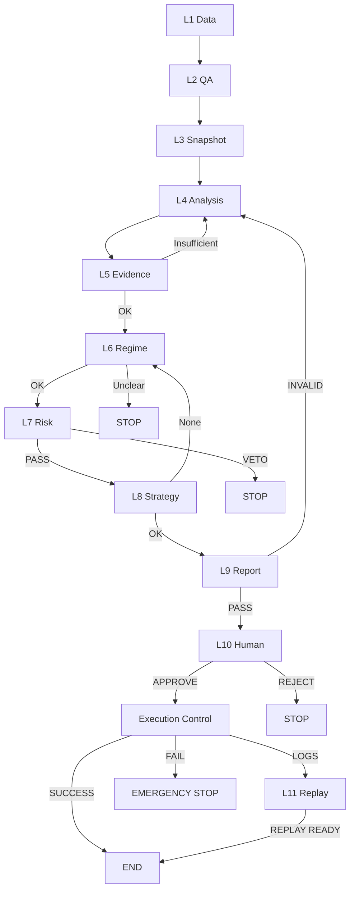

# TAITS_系統架構與流程細化說明（ARCH_FLOW）

## 文件頭（Document Header）
- doc_key：ARCH_FLOW  
- 治理等級：B（制度/規格/架構細化）  
- 基線日期：2026-01-10（Asia/Taipei）  
- 版本日期：2026-01-10（Asia/Taipei）  
- 治理裁決序位：DOCUMENT_INDEX → MASTER_ARCH → AI_GOV  
- Canonical Flow（L1–L11）唯一正文來源：doc_key=MASTER_CANON  

---

## 0. 文件定位（Architecture Flow Specification）

本文件為 TAITS 的「系統架構與流程細化說明（ARCH_FLOW）」：
- 用於把 FULL_ARCH（模組總覽）細化成可落地的跨模組流程、資料流、事件流與治理閘門落點。
- 用於逐段描述 Canonical Flow（L1–L11）在工程實作上的「節點、輸入、輸出、Gate、留痕」。
- 本文件不取代 MASTER_CANON 的 Canonical 定義；僅做工程落地的流程細化。
- 本文件不產生投資建議、不產生策略推薦。

本文件以制度化方式定義：
1) 流程觸發（Trigger）  
2) 各層責任邊界（做什麼／不做什麼）  
3) 中斷、退回、否決與緊急中止之語義  
4) 跨運行模式的一致性（Research / Backtest / Simulation / Paper / Live）  
5) 審計、回放、版本一致性之最低不可降標準  

嚴格遵守：
- L1–L11 不可跳步
- 流程 ≠ 策略；流程 ≠ 下單
- 任何中斷必須可解釋、可回放
- Risk / Compliance 具最高否決權
- Human-in-the-Loop 不可被替代

---

## 1. Canonical Flow 的不變核心（五大流程公理）

1) **單向性（Forward-only）**：只能前進或中斷；不存在隱性回寫或偷偷修正。  
2) **層級隔離（Layer Isolation）**：每層只處理該層責任；任何越權即違規。  
3) **證據先於判斷（Evidence First）**：無 Evidence 不得進入 Regime / Risk / Strategy。  
4) **否決優先於建議（Veto > Proposal）**：任一否決立即生效；績效不得辯護。  
5) **人類裁決不可被模擬**：L10 僅由人類完成；AI 不得取得最終裁決權。  

---

## 2. Canonical Flow 總覽（L1–L11｜不可跳步）

```text
L1  Data Ingestion（資料取得）
L2  Validation & Normalization（校驗/正規化）
L3  Snapshot & State Build（快照/狀態建構）
L4  Feature / Indicator / Structure Extraction（特徵/指標/結構）
L5  Evidence Bundle Assembly（證據包）
L6  Regime Determination（市場狀態）
L7  Risk & Compliance Gate（最高否決）
L8  Strategy Proposal Generation（策略建議）
L9  Investment Report（投資報告）
L10 UI Decision & Explain（人機決策/可解釋）
L11 Audit Replay（全層工程稽核回放）
```

跨層總禁止：
- 層間回寫（Back-write）
- 跳層（Skipping）
- 策略直連執行
- AI 自主化（以文本輸出冒充裁決/授權）
- Annotation 升格

---

## 3. 流程狀態轉移矩陣（State Transition Matrix｜最大完備）

| Layer | 輸入狀態 | 成功輸出 | 失敗狀態 | 失敗去向 |
|---|---|---|---|---|
| L1 | NoData | RawDataReady | SourceFail | STOP |
| L2 | RawDataReady | CanonicalReady | QAFail | STOP |
| L3 | CanonicalReady | SnapshotReady | SnapshotFail | STOP |
| L4 | SnapshotReady | FeatureReady | AnalysisFail | STOP |
| L5 | FeatureReady | EvidenceReady | EvidenceInsufficient | RETURN L4 |
| L6 | EvidenceReady | RegimeReady | RegimeUnclear | STOP |
| L7 | RegimeReady | RiskPass | RiskVeto | STOP |
| L8 | RiskPass | StrategyReady | NoStrategy | RETURN L6 |
| L9 | StrategyReady | ReportReady | ReportInvalid | RETURN L4 |
| L10 | ReportReady | HumanApprove | HumanReject | STOP |
| L11 | HumanApprove | ReplayReady | AuditFail | STOP |

---

## 4. 中斷類型（Interrupt Taxonomy）

### 4.1 類型
- **Hard Stop**：Risk Veto / Compliance Violation  
- **Soft Return**：Evidence 不足 / Strategy 不適用 / Flow 不完整  
- **Emergency Stop**：Execution 異常 / 系統錯誤 / 人工 Kill Switch  

### 4.2 最小審計要求
任何中斷必留：
- 中斷層級（Layer）
- 原因碼（Reason Code）
- Evidence Snapshot（或其引用）
- Version Reference

---

## 5. 多模式一致性（Mode Consistency）

### 5.1 允許變動
- 資料來源（歷史/即時）
- 時間推進（模擬/真實）
- Execution 開關（真實/模擬）

### 5.2 禁止變動
- L1–L11 順序
- Risk / Governance Gate
- Human Decision 存在性
- 審計密度

---

## 6. 全域 Hard Gates（總表）

| Gate | 觸發 | 處置 |
|---|---|---|
| Human Sovereignty | 無人值守 | BLOCK |
| Evidence Replay | 不可回放 | BLOCK |
| Regime Precondition | 不符/衝突 | DOWNGRADE / BLOCK |
| Risk Veto | 任一疑慮 | VETO |
| Strategy≠Execution | 含方向/下單 | BLOCK |
| Governance Completeness | 缺審計 | RETURN |

---

## 7. L1–L11 逐層流程產物與禁止事項（工程細化｜不改寫定義）

### L1｜Data Ingestion（資料取得）
- 輸出：raw_snapshot_id / source_provenance  
- 禁止：推論、清洗、方向化  
- 失敗：ABORT（L1_FETCH_FAIL）

### L2｜Validation & Normalization（校驗/正規化）
- 輸出：validated_snapshot_id / validation_report  
- 禁止：以估算掩蓋缺口  
- 失敗：ABORT（L2_SCHEMA_FAIL）

### L3｜Snapshot & State Build（快照/狀態建構）
- 輸出：market_snapshot / replay_anchor  
- 禁止：只存在記憶體（不可回放）  
- 失敗：ABORT（L3_STATE_INTEGRITY_FAIL）

### L4｜Feature / Indicator / Structure Extraction（特徵/指標/結構）
- 輸出：feature_vector / structure_state  
- 禁止：方向化 / 非白名單 Feature / Annotation 升格  
- 失敗：ABORT（L4_ILLEGAL_FEATURE）

### L5｜Evidence Bundle Assembly（證據包）
- 輸出：evidence_bundle_id / completeness_score  
- 禁止：以推測補證據  
- 失敗：RETURN 或 ABORT（L5_EVIDENCE_INCOMPLETE）

### L6｜Regime Determination（市場狀態）
- 輸出：regime_state / confidence / conflict_flag  
- 禁止：由策略反推  
- 失敗：ABORT（L6_REGIME_UNDEFINED）

### L7｜Risk & Compliance Gate（最高否決）
- 輸出：PASS / VETO / DOWNGRADE / AVOID + reason codes  
- 禁止：績效辯護  
- 失敗：VETO（最高）

### L8｜Strategy Proposal Generation（策略建議）
- 輸出：proposal（非指令）  
- 禁止：價格/數量/下單（不得輸出可直接送單之指令或參數）  
- 失敗：ABORT（L8_OUTPUT_VIOLATION）

### L9｜Investment Report（投資報告）
- 輸出：investment_report（含數據/圖形/條件式進出場建議〔非指令〕/風險敘述/追蹤欄位）  
- 必含：report_id / report_timestamp / data_refs / price_snapshot / chart_refs / risk_disclosure / update_fields  
- 檢核：完整性與一致性檢核依 GOVERNANCE_GATE_SPEC 裁決（本檔不另立層級或順位）  
- 禁止：將報告視為裁決/批准層；以報告內容直接觸發下單；放行缺證據/缺風控揭露  
- 失敗：RETURN（回寫至 L4/L5/L6 依缺口類型）或 BLOCK（需人工介入）

### L10｜UI Decision & Explain（人機決策/可解釋）
- 輸出：decision_trace / risk_disclosure  
- 禁止：誘導下單 / 隱藏否決  
- 失敗：STOP

### L11｜Audit Replay（全層工程稽核回放）
- 輸出：replay_bundle_ref / audit_index / trace_manifest（含 L1–L11 引用與執行控制引用）  
- 禁止：把 L11 當批准/下單/送單層；缺 replay 卻宣稱已執行；以 console log 取代正式稽核物  
- 失敗：STOP（AuditFail｜視同未可追溯，不得進入任何實盤路徑）

### 附：Execution Control（受控執行｜模組，非 Canonical Layer）
- 啟動條件：僅能由人類裁決授權後啟動（依 MASTER_CANON 層級邊界承接）  
- 產物：execution_log / kill_switch_state / order_router_trace  
- 交付：其結果必須被 L11 引用收錄（可回放、可追溯）

---

## 8. 審計（Audit）總則｜「無紀錄＝未發生」

- 覆蓋 L1–L11、所有中斷、所有模式。
- 不得以 Console Log 取代正式審計物。

### 8.1 Mandatory Audit Fields（最小集）
- correlation_id / session_id / layer_id / module_id  
- timestamp_utc / version_ref  
- input_hash / output_hash / status / reason_codes  

### 8.2 層級專屬（引用鍵）
- L3：snapshot_id  
- L5：evidence_id / provenance_map  
- L6：regime_label / confidence  
- L7：policy_version / veto_reason_codes  
- L10：user_id / ui_trace  
- L11：order_id_map / kill_switch_events（若存在 execution）

---

## 9. 回放（Replay）規範

Replay Bundle（最小集合）：
- documents_active_map  
- evidence_bundle  
- regime_state  
- risk_decision  
- human_decision（若有）  
- execution_logs（若有）  
- all_hashes  

一致性要求：相同 Bundle → 相同結論；否則視為污染。

---

## 10. 版本一致性（Version Alignment）

- 所有輸出必綁 version_ref。  
- 新版不得破壞舊 Replay。  

與 VERSION_AUDIT 分工：
- ARCH_FLOW 定義「在哪裡引用版本」  
- VERSION_AUDIT 管理「如何追溯/回退」  

---

## 11. Mermaid（含退回/否決）



---

## 12. FULL_ARCH 對位

- FULL_ARCH：定義「有什麼層/模組」  
- ARCH_FLOW：定義「如何按序運作」  
- 任一不對位 → 非法

---

## 13. 最大完備演進規則

允許：
- 新增子流程（例如：L4.1、L7.2）
- 新增中斷原因碼
- 新增模式（例如：Sandbox）

禁止：
- 刪除/合併 L1–L11
- 改寫中斷語義
- 以效能為由省略審計

## 稽核區塊（Audit Section｜非正文）

### 1) Changelog（變更清單）
- 2026-01-10｜FINAL_QA_NORMALIZE｜正文重排與格式一致化：補齊文件頭（治理等級/基線日期/裁決序位）；修正章節層級與編號一致性；統一表格、列表、縮排與換行格式；維持最大完備（僅去重與結構重排）；並明確承接「Canonical Flow（L1–L11）唯一正文來源=MASTER_CANON」，本檔不改寫定義。

### 2) Hash Manifest（指紋清單）
- BODY_SHA256（UTF-8, LF）：69a5e9ea72abb8eed4b289b7c27f4fee2a79976e0931f498521cc7fa3d6bf364

### 3) Scope（適用範圍）
- doc_key：ARCH_FLOW
- 本次變更範圍：全文排版/結構與去混讀修正；不新增層級、不改寫 Canonical 定義。

### 4) Audit Hand-off（裁決承接）
- 承接者：TAITS Governance Owner（人類最高決策者）
- 承接依據：本檔 Changelog + BODY_SHA256
