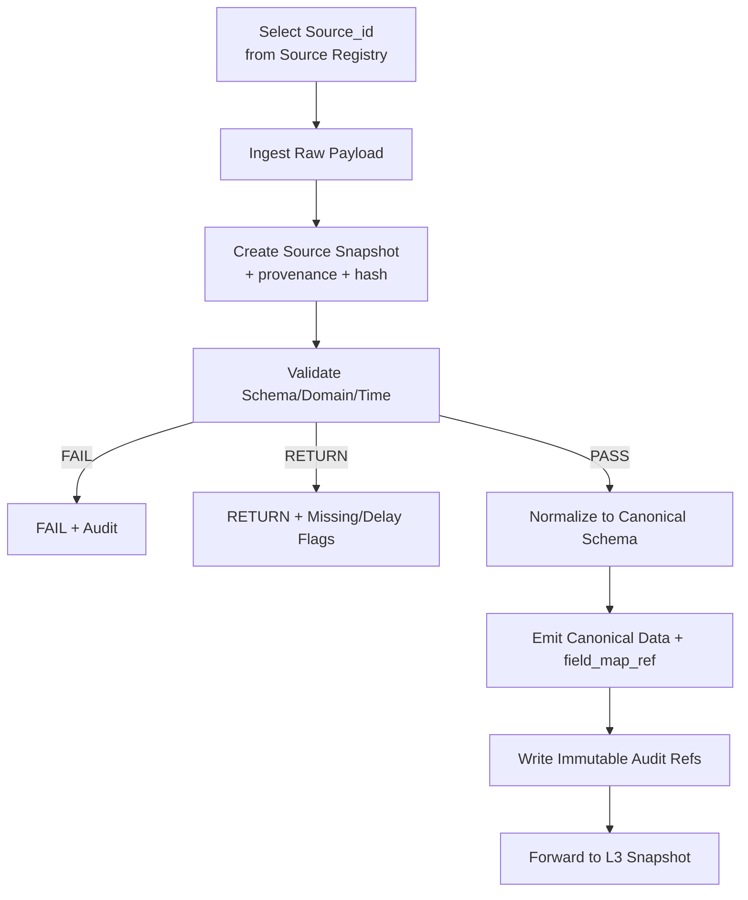

# TAITS_資料來源全集（DATA_SOURCES）

- doc_key：DATA_SOURCES
- 治理位階：治理制度級（資料來源全集與引用邊界）
- 適用範圍：TAITS 全系統（Research / Backtest / Simulation / Paper / Live）
- 版本狀態：ACTIVE
- 版本日期：2026-01-11（Asia/Taipei）
- 基線日期：2026-01-11（Asia/Taipei）
- 裁決序位（自高至低）：DOCUMENT_INDEX、MASTER_ARCH、AI_GOV
- Canonical Flow：L1–L11 之唯一正文來源為 doc_key=MASTER_CANON；本文件僅規範資料來源與資料治理
- 平行參照：MASTER_CANON／ARCH_FLOW／FULL_ARCH／RISK_COMPLIANCE／GOVERNANCE_GATE_SPEC／EXECUTION_CONTROL／VERSION_AUDIT／LOCAL_ENV／TWSE_RULES

---

## 0. 文件定位（Data Sources Encyclopedia）

本文件為 TAITS 的資料來源全集（DATA_SOURCES）：
- 定義 TAITS 可使用之資料來源類型、授權/合規/風控標註、可靠度/延遲/頻率與品質等級，以及資料落地與稽核要求（與 VERSION_AUDIT / 稽核回放層 留痕相容）。
- 提供跨模組（FULL_ARCH / ARCH_FLOW）之資料接入與依賴對照，作為 Research / Execution / Audit 一致引用之依據。
- 本文件不產生投資建議；僅定義資料來源與其治理要求。

---
## 1. 官方資料來源入口（Official Sources｜必須提供可追溯網址）

注意：此處列的是「官方入口」。實際抓取端點/檔案格式可能隨時間調整；  
TAITS 必須透過 Rulebook Snapshot / Source Snapshot 保留當下使用的引用證據（VERSION_AUDIT）。

### 1.1 TWSE（臺灣證券交易所）
- 官網首頁  
  https://www.twse.com.tw/
- 規章/法規查詢（制度裁決入口）  
  https://twse-regulation.twse.com.tw/

### 1.2 TPEX（櫃買中心）
- 官網首頁  
  https://www.tpex.org.tw/

### 1.3 TAIFEX（臺灣期貨交易所）
- 官網首頁  
  https://www.taifex.com.tw/

### 1.4 MOPS（公開資訊觀測站｜公司公告/財報）
- 官網入口  
  https://mops.twse.com.tw/

### 1.5 TDCC（集保結算所｜股權分散/庫存等）
- 官網入口  
  https://www.tdcc.com.tw/

### 1.6 CBC（中央銀行｜利率/匯率/統計）
- 官網入口  
  https://www.cbc.gov.tw/

### 1.7 DGBAS（主計總處｜物價/景氣/統計）
- 官網入口  
  https://www.dgbas.gov.tw/

### 1.8 FSC（金管會｜法規/公告）
- 官網入口  
  https://www.fsc.gov.tw/

---

## 2. 資料治理總原則（Data Governance Hard Principles）

### 2.1 官方優先（Official-First）
- 同一資料類別若存在官方來源：
  - 預設採官方
  - 第三方僅能作 fallback / 交叉驗證
- 第三方資料不得用於：
  - 裁決制度（合規）
  - 取代官方公告的法律地位

### 2.2 多層 Fallback（Multi-tier Fallback）
每個資料類別必須定義至少：
- Primary（官方）
- Secondary（準官方/授權/可驗證）
- Fallback（第三方；需標記 provenance 與信任降級）

### 2.3 Provenance（來源追溯）不可省略
任何資料進入 L2（Canonical Data）之前，必須具備：
- `source_id`
- `source_urls[]` / `endpoint_ref`
- `captured_at`
- `raw_payload_ref`（或可重建等價引用）
- `hash_manifest_ref`

缺任一項：不得進入 Evidence 裁決鏈（RETURN/BLOCK 依政策）

### 2.4 語義不可偷換（Semantic Integrity）
- 欄位名稱相同不代表語義相同
- 正規化（Normalization）必須保留：
  - 欄位映射（field_map_ref）
  - 轉換規則版本（normalization_ruleset_version）

### 2.5 資料品質可審計（Data Quality Auditable）
- 每次 ingest 必須產生 Quality Flags：
  - 缺漏、延遲、異常、跳變、疑似錯誤
- 品質不足不得靜默修補；必須降級（RETURN/FAIL）並在 UI/稽核可見

---

## 3. 資料分類體系（Data Taxonomy｜TAITS 統一分類）

目的：建立「資料類別」、「來源」、「正規化」、「用途與限制」的可治理結構。

### 3.1 Market Data（市場交易資料）
- 現貨：價格、成交量、成交額、委買委賣、逐筆（若可取得）
- 衍生性：期貨/選擇權行情、未平倉量、結算價、保證金資訊（若官方提供）

### 3.2 Reference Data（參考資料）
- 股票基本資料、代碼、產業別、ETF/權證資訊
- 交易日曆、交易時段

### 3.3 Corporate Actions（公司行為）
- 除權息、分割、合併、停止過戶、減資增資等（以官方公告/公司公告為準）

### 3.4 Fundamentals（基本面/財報）
- 財務報表、重大訊息、法說會、董事會決議、內部人持股等（MOPS）

### 3.5 Ownership / Flow（籌碼/資金流）
- 三大法人、融資融券、借券、集保股權分散（官方/準官方來源優先）

### 3.6 Macro（宏觀）
- 利率、匯率、景氣、物價、經濟指標（CBC/DGBAS 等）

### 3.7 News / Events（新聞/事件）
- 官方公告（交易所公告、公司公告）優先
- 其他新聞作輔助（不得替代官方裁決）

### 3.8 Alternative / Derived（替代/衍生）
- 由上述資料計算之衍生欄位（須可回放：依賴輸入 refs + 版本）

---

## 4. Source Registry（資料來源註冊表）資料結構（可落地）

TAITS 將每個資料來源定義為一筆「可版本化」的 Source Record（最大完備）。

### 4.1 Source Record（最小欄位，不可縮減）
- `source_id`（全域唯一）
- `source_name_zh` / `source_name_en`
- `scope`：TWSE/TPEX/TAIFEX/MOPS/TDCC/CBC/DGBAS/FSC/ThirdParty/等  
- `tier`：PRIMARY / SECONDARY / FALLBACK
- `data_categories[]`（對應 3.x taxonomy）
- `official_urls[]`（官方入口或來源頁）
- `access_method`：HTTP/FTP/ManualDownload/API/WebSocket/等
- `update_frequency`：real-time / minute / daily / monthly / event-driven
- `availability`：expected uptime / schedule
- `rate_limits`：若有（未知則標註 unknown + 監測）
- `licensing_notes`：授權/使用限制（不確定時必須標註與降級）
- `provenance_requirements`：必須保存哪些證據（html/pdf/headers/hash）
- `fallback_chain[]`：此來源失效時可用的替代來源 source_id
- `normalized_schema_id`：正規化後 schema
- `normalization_ruleset_version`
- `quality_checks[]`：此來源必做的品質檢查
- `failure_modes[]`：FAIL/RETURN/BLOCK 條件與 reason codes
- `owner_module`：DataSources Adapter / Collector / Validator
- `security_class`：PUBLIC / SENSITIVE / RESTRICTED

### 4.2 Source Snapshot（來源快照）
每次實際抓取/使用一個來源，必須產生 Source Snapshot：
- `source_snapshot_id`
- `source_id`
- `captured_at`
- `endpoint_ref`（含 URL、參數、headers（需脫敏））
- `raw_payload_ref`
- `hash_manifest_ref`
- `quality_report_ref`
- `active_version_map_ref`

---

## 5. TAITS Canonical Schema（資料正規化標準｜骨架）

注意：此處是「架構骨架」。具體欄位細表可在後續 最大完備 擴充成 `schemas/` 文件；  
但本骨架不可刪減，避免後續偷換語義。

### 5.1 Canonical Entity Keys（統一鍵）
- `instrument_id`：內部統一標的主鍵
- `symbol`：市場代碼（例如 2330）
- `market`：TWSE / TPEX / TAIFEX
- `instrument_type`：EQUITY / ETF / FUTURES / OPTIONS / WARRANT 等
- `trading_date` / `timestamp`
- `currency`：TWD（或其他）

### 5.2 Market Bar（K 線/聚合行情）
- `open/high/low/close`
- `volume`（成交量）
- `turnover`（成交額）
- `vwap`（若可）
- `bar_interval`（1m/5m/1d等）
- `data_quality_flags[]`

### 5.3 Orderbook / Quote（委買委賣）
- `bid_prices[]/bid_sizes[]`
- `ask_prices[]/ask_sizes[]`
- `quote_timestamp`

### 5.4 Corporate Actions（公司行為）
- `action_type`
- `effective_date`
- `adjustment_factor`
- `source_ref`（公告引用）

### 5.5 Fundamentals（財務）
- `period`
- `statement_type`（BS/IS/CF）
- `fields{}`（結構化欄位集合）
- `filing_ref`（公告引用）

### 5.6 Ownership / Flow（籌碼）
- `institution_type`（外資/投信/自營等）
- `net_buy_sell`
- `margin_balance` / `short_balance`（若有）
- `tdcc_distribution_ref`（若有）

### 5.7 Macro（宏觀）
- `series_id`
- `value`
- `release_date`
- `revision`（若有）

---

## 6. 資料來源全集（Source Universe｜最大完備清單骨架）

本文件採「最大完備覆蓋」原則：此處提供 TAITS 台灣市場常用來源全集之骨架清單。  
實際可用欄位/端點差異，由 Source Record 的 `access_method/endpoint_ref` 與 Snapshot 保證可追溯。  
**最大完備**：後續可直接新增來源，不需要改舊的。

### 6.1 PRIMARY（官方/最高優先）

#### 6.1.1 TWSE（上市）
- `SRC_TWSE_MARKETDATA`：現貨行情/收盤資訊（官方入口）  
  官方入口：https://www.twse.com.tw/
- `SRC_TWSE_ANNOUNCEMENTS`：交易所公告（停牌、處置、制度異動等）  
  官方入口：https://www.twse.com.tw/  
- `SRC_TWSE_REGULATION`：規章法規（制度裁決）  
  官方入口：https://twse-regulation.twse.com.tw/

#### 6.1.2 TPEX（上櫃）
- `SRC_TPEX_MARKETDATA`：上櫃行情/收盤資訊  
  官方入口：https://www.tpex.org.tw/
- `SRC_TPEX_ANNOUNCEMENTS`：櫃買公告/制度  
  官方入口：https://www.tpex.org.tw/

#### 6.1.3 TAIFEX（期貨/選擇權）
- `SRC_TAIFEX_MARKETDATA`：期貨/選擇權行情、結算等  
  官方入口：https://www.taifex.com.tw/
- `SRC_TAIFEX_RULES`：期貨制度  
  官方入口：https://www.taifex.com.tw/

#### 6.1.4 MOPS（公司公告/財報）
- `SRC_MOPS_FILINGS`：重大訊息、財報、公告  
  官方入口：https://mops.twse.com.tw/

#### 6.1.5 TDCC（集保）
- `SRC_TDCC_OWNERSHIP`：股權分散/股東結構（依可取得範圍）  
  官方入口：https://www.tdcc.com.tw/

#### 6.1.6 CBC / DGBAS / FSC（宏觀與監管）
- `SRC_CBC_MACRO`：利率、匯率、統計  
  官方入口：https://www.cbc.gov.tw/
- `SRC_DGBAS_MACRO`：景氣、物價、統計  
  官方入口：https://www.dgbas.gov.tw/
- `SRC_FSC_REGULATORY`：監理公告/法規  
  官方入口：https://www.fsc.gov.tw/

---

### 6.2 SECONDARY（準官方/授權/可驗證）

此層需能「回指官方或具可驗證性」，且必須標註授權與限制。

- `SRC_BROKER_API_QUOTES`：券商行情/報價（以券商官方 API 文件為準）  
  限制：不得取代官方制度裁決；僅作即時通道與交叉驗證  
- `SRC_BROKER_API_ORDERS`：券商委託/回報（執行必需）  
  限制：敏感級別最高（RESTRICTED），嚴禁進 repo/log 明文  
- `SRC_BANK_RATES`：銀行公開匯率/利率（若需）  
  限制：需可追溯來源頁面與時間戳  

---

### 6.3 FALLBACK（第三方｜只作交叉驗證，不得裁決制度）

必須特別強調：第三方可用於研究/便利性，但不得裁決制度；  
若官方缺失，應降級為不可裁決（RETURN/BLOCK），而不是用第三方「硬判」。

- `SRC_YAHOO_FINANCE`：行情/新聞（交叉驗證/研究用）  
- `SRC_CNYES`：新聞/市場資訊（研究用）  
- `SRC_FINMIND`：資料整合（研究/回測便利；需標註來源）  
- `SRC_OTHER_DATA_AGGREGATORS`：其他聚合器（需審核授權/品質/可追溯）

---

## 7. DataSources Adapter（適配器）標準（L1 實作硬規格）

FULL_ARCH 要求模組介面契約；此處給 Data Adapter 的「最大完備」規範。

### 7.1 Adapter 必須輸出
- `DataIngested` contract（含 provenance_ref / raw_payload_ref / hash_manifest_ref）
- `quality_report_ref`（至少包含：延遲、缺漏、格式錯誤、值域檢查）

### 7.2 Adapter 禁止事項
- 靜默補值或改值
- 把第三方資料假冒官方
- 省略來源證據（URL/headers/抓取時間/校驗）

### 7.3 Adapter 失效模式（標準化）
- `FAIL`：來源不可達、格式不可解析、頻率超限且不可恢復
- `RETURN`：暫時資料不足（可重試/等待）
- `BLOCK`：provenance 缺失、版本映射缺失、稽核不可寫入

---

## 8. Data Validator（驗證器）規範（L1-L2）

### 8.1 驗證類型（最小集合）
- Schema Validation（欄位存在、型別）
- Domain Validation（值域、單位、合理範圍）
- Temporal Validation（時間戳遞增/交易時段一致）
- Cross-Source Consistency（交叉一致性，僅標記不裁決）
- Corporate Action Consistency（除權息調整一致性）

### 8.2 Quality Flags（必須輸出）
- `MISSING_FIELDS`
- `DELAYED_SOURCE`
- `OUT_OF_RANGE`
- `SUSPECT_SPIKE`
- `INCONSISTENT_WITH_OFFICIAL`
- `UNKNOWN_SCHEMA_VERSION`
- `IMPUTED_VALUES_PRESENT`  # L2 補值/插值/推估已發生（必須可追溯）

---

## 9. Normalizer（正規化器）規範（L2｜語義鎖定）

### 9.1 必須保留（不可縮減）
- `field_map_ref`：原欄位 對應 canonical 欄位
- `unit_transform_ref`：單位換算（股 對應 張、元 對應 分等）
- `timezone_transform_ref`
- `corporate_action_adjustment_ref`（若有）

### 9.2 硬禁
- 用「方便」為理由改寫語義
- 讓同一 canonical 欄位在不同來源代表不同含義

### 9.3 補值/插值/推估（Imputation）最小可追溯要求（對齊 MASTER_CANON L2 禁止隱性補值）
- 定義：任何把缺值變為非缺值、或以統計/規則/模型生成替代值的行為，皆視為 Imputation。
- 硬規則：**不得隱性補值**；若發生 Imputation，必須同時滿足：
  - `imputation_ref` 存在（方法、參數、涵蓋欄位、時間窗、觸發理由、版本）
  - `value_origin_map_ref` 可定位到「哪些欄位/哪些時間點」被標記為 `IMPUTED`
  - `data_quality_flags[]` 必含 `IMPUTED_VALUES_PRESENT`
- 若未滿足任一條：視為違反 L2 禁止項 → 依 Validator 規則最小保守處置（RETURN 或 BLOCK，依下游需求）。

---

## 10. Fallback 策略（Failover / Degradation｜最大完備）

TAITS 必須把「資料失效」制度化，而不是臨場反應。

### 10.1 Fallback 原則
- 優先同級官方替代（TWSE ↔ TPEX 分域，不可亂替）
- 次優先準官方/授權（券商）
- 最後才第三方（且必須降級信任）

### 10.2 降級輸出（必須讓下游知道）
- `source_tier_used`：PRIMARY/SECONDARY/FALLBACK
- `trust_level`：HIGH/MEDIUM/LOW
- `compliance_eligible`：true/false（第三方通常為 false）
- `notes_ref`：降級原因（reason codes）

---

## 11. 稽核與回放要求（Audit & Replay Requirements｜強制）

每次資料 ingest（L1-L2）必須產生：
- `source_snapshot_ref`
- `raw_payload_ref`
- `hash_manifest_ref`
- `quality_report_ref`
- 納入 `active_version_map_ref`

並且在回放（Replay）時可重建：
- 同一份 canonical data（或可解釋差異）
- 同一份證據鏈（Evidence Bundle 的 provenance map 不斷裂）

---

## 12. Mermaid｜資料來源治理流程（L1-L2）



### 12.1 最大完備演進規則（DATA_SOURCES 專屬）
允許新增：

新來源（source_id）

新資料類別與 schema（以版本追加）

新驗證規則與 quality flags（更嚴格）

新 fallback 鏈（但不得讓第三方升格為制度裁決）

禁止：

刪除既有 source_id 或改寫其歷史語義

移除官方入口與 provenance 要求

用第三方來源裁決制度或取代官方公告

允許缺 provenance / 缺 snapshot / 缺 hash 的資料進入 Evidence 裁決鏈

### 12.2 終極裁決語句（不可更改）
資料不是越多越好，而是「越可追溯越好」。
任何無法回指來源、無法生成快照、無法稽核回放的資料，都不允許進入 TAITS 的裁決鏈。

---

## 13. 子類別總覽（Data Subcategory Catalog｜台灣市場最大完備骨架）

本節把「台灣市場常用資料」拆成可治理的子類別（Subcategory），每一項都定義：
- Primary（官方優先）入口
- Secondary（準官方/授權）
- Fallback（第三方；僅交叉驗證，不得裁決制度）
- 必備 Provenance（抓取證據）與不可縮減欄位
- 典型品質檢查與失效模式（FAIL/RETURN/BLOCK）

---

## 14. 市場交易資料（Market Data）

### 14.1 現貨：日行情（EOD Daily Bars）
- subcategory_id：`MD_EQUITY_EOD_DAILY`
- Primary：
  - TWSE：https://www.twse.com.tw/
  - TPEX：https://www.tpex.org.tw/
- Secondary：
  - 券商行情 API（授權/可驗證）：`SRC_BROKER_API_QUOTES`
- Fallback：
  - Yahoo / 聚合器（研究用）：`SRC_YAHOO_FINANCE`, `SRC_FINMIND`, `SRC_CNYES`
- 必備 Provenance（不可縮減）：
  - `source_urls[]`（含查詢頁/下載頁/公告頁）
  - `captured_at`
  - `raw_payload_ref`（CSV/JSON/HTML/PDF 任一形式）
  - `hash_manifest_ref`
  - `field_map_ref`（原欄位 對應 canonical）
- Canonical 最小欄位：
  - `symbol, market, trading_date, open, high, low, close, volume, turnover`
- 品質檢查（最小集合）：
  - 交易日曆一致性、缺漏、異常跳變、值域檢查
- 失效模式：
  - Primary 失敗則改用 Secondary；Secondary 失敗則改用 Fallback（需標記 trust_level=LOW）
  - 若用於合規/裁決鏈且非官方 對應 `compliance_eligible=false`

### 14.2 現貨：盤中即時報價（Intraday Quotes）
- subcategory_id：`MD_EQUITY_INTRADAY_QUOTES`
- Primary：
  - （以交易所可用之即時資訊入口為準，若無可用/授權限制 對應 不視為 Primary 可抓取）
  - TWSE：https://www.twse.com.tw/
  - TPEX：https://www.tpex.org.tw/
- Secondary（常見實務）：
  - 券商即時行情 API：`SRC_BROKER_API_QUOTES`
- Fallback：
  - 第三方即時盤（研究/視覺化）：`SRC_CNYES`, `SRC_YAHOO_FINANCE`
- Provenance：
  - 必須保存 `endpoint_ref`（參數、headers 脫敏）+ `captured_at` + `hash_manifest_ref`
- Canonical 最小欄位：
  - `symbol, timestamp, last, volume, turnover, bid/ask (若有), session_state`
- 重要限制：
  - 即時行情常受授權限制；必須在 `licensing_notes` 標註，未明確授權時不得宣稱可商用/可長期穩定

### 14.3 現貨：逐筆（Tick / Trades）與委買委賣（Orderbook）
- subcategory_id：`MD_EQUITY_TICKS`, `MD_EQUITY_ORDERBOOK`
- Primary：依官方/授權可得性判定（不確定 對應 以 Secondary/RESTRICTED 管理）
- Secondary：
  - 券商/授權供應商（若有）：`SRC_BROKER_API_QUOTES`
- Fallback：第三方（僅研究）
- Provenance（加嚴）：
  - 必須保存原始事件流（或可重建等價引用），禁止只存聚合摘要
- Canonical（示例最小欄位）：
  - Trades：`timestamp, price, size, aggressor_flag(optional)`
  - Orderbook：`bid_prices/sizes[], ask_prices/sizes[]`
- 失效模式：
  - 無法保存原始事件流 對應 `RETURN`（不可進入回放裁決鏈）

### 14.4 期貨/選擇權：日行情/盤中（TAIFEX）
- subcategory_id：`MD_DERIV_EOD`, `MD_DERIV_INTRADAY`
- Primary：
  - TAIFEX：https://www.taifex.com.tw/
- Secondary：
  - 券商衍生品行情 API（授權）：`SRC_BROKER_API_QUOTES`
- Provenance：
  - `source_urls[]` + `captured_at` + `raw_payload_ref` + `hash_manifest_ref`
- Canonical 最小欄位：
  - `product_id, contract_month, trading_date/timestamp, ohlc, volume, open_interest, settlement(optional)`
- 品質檢查：
  - 合約月切換一致性、OI 跳變、結算價一致性（若可取得）

---

## 15. 參考資料（Reference Data）

### 15.1 商品/標的基本資料（Symbol Master）
- subcategory_id：`REF_SYMBOL_MASTER`
- Primary：
  - TWSE：https://www.twse.com.tw/
  - TPEX：https://www.tpex.org.tw/
  - TAIFEX：https://www.taifex.com.tw/
- Secondary：
  - 券商商品主檔（僅作）
- Provenance：
  - 必須保存「代碼變更」與「停用/新增」的來源證據（公告/清單）
- Canonical 最小欄位：
  - `instrument_id, symbol, market, instrument_type, name_zh, list_date, status`
- 失效模式：
  - 主檔不一致 對應 標記 `INCONSISTENT_WITH_OFFICIAL`，不得靜默合併

### 15.2 交易日曆/交易時段（Calendar & Session）
- subcategory_id：`REF_TRADING_CALENDAR`, `REF_SESSION_SCHEDULE`
- Primary：
  - TWSE：https://www.twse.com.tw/
  - TPEX：https://www.tpex.org.tw/
  - TAIFEX：https://www.taifex.com.tw/
- Provenance：
  - 必須保存交易日曆擷取時間與來源頁
- 用途限制（強制）：
  - 任何送單/合規判定必須依此資料；缺失 對應 `RETURN/BLOCK`（依 TWSE_RULES/RISK_COMPLIANCE）

### 15.3 產業分類/ETF 成分/商品規格
- subcategory_id：`REF_INDUSTRY_CLASS`, `REF_ETF_CONSTITUENTS`, `REF_DERIV_CONTRACT_SPECS`
- Primary：
  - TWSE/TPEX（分類）
  - TAIFEX（合約規格）
- Provenance：
  - 成分股/規格具有版本性（必須保存日期與快照）
- 失效模式：
  - 成分股缺快照 對應 不可回放 對應 `RETURN`

---

## 16. 公司行為（Corporate Actions）

### 16.1 除權息/分割/合併/減資增資（CA Master）
- subcategory_id：`CA_MASTER`
- Primary：
  - MOPS：https://mops.twse.com.tw/
  - 交易所公告（TWSE/TPEX）：https://www.twse.com.tw/ / https://www.tpex.org.tw/
- Secondary：
  - 券商公司行為資料（僅）
- Provenance（加嚴）：
  - 必須保存公告原文引用（公告頁或 PDF）
  - 必須保存生效日與調整係數計算依據
- Canonical 最小欄位：
  - `symbol, action_type, effective_date, factor, announcement_ref`
- 重要限制：
  - 任何價格調整若無公告引用 對應 `BLOCK`（語義不可被「猜測」）

### 16.2 停止過戶/權利變更期間
- subcategory_id：`CA_BOOKCLOSURE`
- Primary：
  - MOPS / 交易所公告
- Provenance：
  - `announcement_ref` 必填（原文證據）
- 用途：
  - 影響可交易性/回測調整窗口

---

## 17. 基本面與揭露（Fundamentals / Disclosures）

### 17.1 財務報表（BS/IS/CF）
- subcategory_id：`FD_FIN_STATEMENTS`
- Primary：
  - MOPS：https://mops.twse.com.tw/
- Provenance（加嚴）：
  - 必須保存申報版本、申報日期、原文引用
- Canonical 最小欄位：
  - `symbol, period, statement_type, fields{}, filing_ref`
- 品質檢查：
  - 期別一致性、欄位缺漏、修正申報（revision）處理

### 17.2 重大訊息/公告（Material Information）
- subcategory_id：`FD_MATERIAL_EVENTS`
- Primary：
  - MOPS：https://mops.twse.com.tw/
- Provenance：
  - 公告編號/時間/原文引用
- 用途限制：
  - 可作事件特徵與證據；不得作「制度裁決」替代

### 17.3 董監事/內部人持股、股權異動（若可取）
- subcategory_id：`FD_INSIDER_OWNERSHIP`
- Primary：
  - MOPS / 官方揭露入口
- Provenance：
  - 必須保存揭露原文引用與時間戳

---

## 18. 籌碼/資金流（Ownership / Flow）

### 18.1 三大法人買賣超（Institutional Flows）
- subcategory_id：`OF_INSTITUTIONAL_NET`
- Primary：
  - TWSE：https://www.twse.com.tw/
  - TPEX：https://www.tpex.org.tw/
- Secondary：
  - 券商彙整（僅交叉驗證）
- Provenance：
  - 必須保存官方查詢頁/下載頁引用與擷取時間
- Canonical 最小欄位：
  - `symbol, trading_date, inst_type, net_buy_sell, volume/amount(optional)`

### 18.2 融資融券（Margin/Short）
- subcategory_id：`OF_MARGIN_SHORT`
- Primary：
  - TWSE/TPEX 官方入口
- Provenance：
  - 必須保存官方引用；此資料可能影響合規（若策略涉及信用交易），但制度裁決仍走 TWSE_RULES + rulebook_snapshot
- Canonical 最小欄位：
  - `symbol, trading_date, margin_balance, short_balance, changes`

### 18.3 借券（SBL）與借券餘額（若可取得）
- subcategory_id：`OF_SECURITIES_LENDING`
- Primary：
  - 依官方/準官方可得入口（不確定 對應 SECONDARY/RESTRICTED）
- Provenance：
  - 必須保存來源證據與授權限制

### 18.4 集保股權分散（TDCC）
- subcategory_id：`OF_TDCC_DISTRIBUTION`
- Primary：
  - TDCC：https://www.tdcc.com.tw/
- Provenance：
  - 必須保存查詢頁引用、擷取時間、欄位版本
- Canonical 最小欄位：
  - `symbol, week/date, holder_bucket, shares, percent`

---

## 19. 市場狀態/制度相關清單（Market Status & Regulatory Lists）

### 19.1 停牌/暫停交易清單
- subcategory_id：`RS_HALT_LIST`
- Primary：
  - TWSE/TPEX 官方公告
- Provenance：
  - 公告原文引用必填
- 用途：
  - 合規觸發（CMP-INSTRUMENT-HALTED）

### 19.2 處置股票/注意/警示等狀態清單
- subcategory_id：`RS_RESTRICTED_LIST`
- Primary：
  - TWSE/TPEX 官方公告/清單
- Provenance：
  - 公告引用必填
- 用途：
  - 合規觸發與風控升級（不得隱藏）

### 19.3 交易制度文本/規章（Rulebook）
- subcategory_id：`RS_RULEBOOK_TEXT`
- Primary：
  - TWSE：https://twse-regulation.twse.com.tw/
  - TAIFEX：https://www.taifex.com.tw/
  - FSC：https://www.fsc.gov.tw/
- 輸出（強制）：
  - 進入 `rulebook_snapshot_ref`（TWSE_RULES 定義）
- 禁止：
  - 以第三方整理裁決制度

---

## 20. 宏觀資料（Macro）

### 20.1 利率/匯率/金融統計
- subcategory_id：`MC_CBC_RATES`, `MC_CBC_STATS`
- Primary：
  - CBC：https://www.cbc.gov.tw/
- Provenance：
  - 必須保存發布日期與修正版本（若有）

### 20.2 物價/景氣/統計
- subcategory_id：`MC_DGBAS_SERIES`
- Primary：
  - DGBAS：https://www.dgbas.gov.tw/
- Provenance：
  - 必須保存 series_id 與發布/修正資訊

---

## 21. 新聞/事件（News / Events）

### 21.1 官方公告事件（優先）
- subcategory_id：`NE_OFFICIAL_ANNOUNCEMENTS`
- Primary：
  - TWSE/TPEX/TAIFEX/MOPS 官方公告入口（見 1.x）
- Provenance（加嚴）：
  - 公告原文引用與時間戳必填
- 用途：
  - 可作事件特徵/Evidence；亦可觸發合規清單更新（但制度裁決仍走 Rulebook Snapshot）

### 21.2 一般新聞（輔助）
- subcategory_id：`NE_PUBLIC_NEWS`
- Fallback：
  - 各新聞網站/聚合器（需授權與可追溯）
- 限制（硬規則）：
  - 不得作制度裁決
  - 不得作唯一證據（需與官方/可驗證證據交叉）

---

## 22. 第三方資料使用守則（Fallback Usage Rules｜硬規則）

### 22.1 允許用途
- 缺漏（例如官方暫時不可用的歷史區段）
- 交叉驗證（Consistency Check）
- UI 便利呈現（非裁決）

### 22.2 禁止用途
- 裁決制度（合規 PASS/VETO）
- 取代公告原文（公司行為/重大訊息）
- 取代交易日曆/交易時段裁決

### 22.3 降級標記（必須）
任何使用 FALLBACK 來源的資料，都必須帶：
- `source_tier_used=FALLBACK`
- `trust_level=LOW`
- `compliance_eligible=false`（預設）
- `notes_ref`（降級原因與替代來源鏈）

---

## 23. 子類別 × L1–L2 輸出契約（對齊 FULL_ARCH）

本節把每個子類別都鎖到 DataIngested / DataNormalized 契約，避免資料自由散落。

### 23.1 L1：DataIngested（每個子類別都必須）
- `source_id`
- `subcategory_id`
- `raw_payload_ref`
- `provenance_ref`
- `captured_at`
- `hash_manifest_ref`
- `quality_report_ref`

### 23.2 L2：DataNormalized（每個子類別都必須）
- `canonical_data_ref`  # 正規化後資料本體引用（可回放）
- `value_origin_map_ref`  # 值來源標記（OBSERVED/IMPUTED/DERIVED；若無補值則仍可為 minimal map）
- `imputation_ref`（若有）  # 補值/插值/推估方法、範圍、理由、版本（不可省略）
- `canonical_schema_id`
- `subcategory_id`
- `field_map_ref`
- `normalization_ruleset_version`
- `data_quality_flags[]`
- `quality_flags[]`（legacy alias；若出現在事件/日誌/舊介面，必須在同一工件內提供對應至 `data_quality_flags[]` 的映射，避免新舊混讀）

---
## 24. 失效模式與降級策略（Subcategory Failure Playbook）

任何資料子類別都必須在 Source Record 中填寫 failure_modes；以下為統一骨架。

### 24.1 RETURN（資料不足但可補）
- 官方端點暫時不可用、可重試
- 欄位缺漏但可由同級官方
- 交易日曆資料延遲（等待官方更新）

### 24.2 FAIL（來源不可用且不可恢復）
- 長時間不可達（超過政策閾值）
- 格式永久變更且未更新解析器
- 授權/權限失效

### 24.3 BLOCK（系統完整性不足，禁止往下）
- provenance 缺失
- snapshot 無法落盤/不可變更儲存不可用（依環境等級）
- active_version_map_ref 缺失
- hash_manifest_ref 缺失

---

## 25. Mermaid｜「子類別」到「證據鏈」的治理通路

```mermaid
flowchart TB
  S[Select subcategory_id<br/>from Source Registry] --> P[Pick Primary Source_id]
  P --> I[L1 DataIngested<br/>raw+prov+hash]
  I --> V[Validator<br/>schema/domain/time]
  V -->|RETURN| R[RETURN + quality_flags]
  V -->|FAIL| F[FAIL + audit]
  V -->|PASS| N[L2 DataNormalized<br/>canonical+field_map]
  N --> L3[L3 SnapshotCreated]
  L3 --> L5[L5 EvidenceAssembled]
28. 最大完備 演進規則（Part 2 專屬補強）
允許新增：

新的子類別（subcategory_id）

每子類別更多官方入口與 mirror（仍屬 Primary/Secondary）

更嚴格的 provenance 要求與 quality checks

更完整的 fallback_chain

禁止：

刪除既有子類別或改寫其語義

降低官方優先與可追溯要求

讓第三方資料升格為制度裁決依據

允許缺 provenance/snapshot/hash 的資料進入裁決鏈

---

## 26. 文件目的（Why Part 3 Exists）

Part 1/2 解決「來源全集與子類別」；Part 3 解決「資料能不能被用來裁決」：

- 把資料品質量化成 **Quality Grade（QG）**
- 把證據完整度量化成 **Evidence Completeness（EC）**
- 把不同 EC/QG 組合映射到：
  - L5 Evidence Bundle Completeness
  - 情境/體制 Regime 可信度要求
  - L7 Risk/Compliance 的 PASS/VETO/RETURN/BLOCK 行為
- 讓系統在資料不足時「制度化降級」，避免：
  - AI 幻想填空
  - 策略越權用不可靠資料直接推導方向
  - 合規在缺官方快照/缺來源時仍放行

---

## 27. Quality Grade（QG）資料品質分級（不可縮減）

QG 是「資料本身」的品質分級（與策略/判斷無關）。  
每次 L1/L2 ingest/normalize 必須產出 `quality_grade` 與 `quality_flags[]`。

### 27.1 QG 等級定義（最大完備 可新增更嚴格，不可放寬）

- **QG-A（官方可追溯、可回放、可稽核）**
  - 來源：PRIMARY（官方/法定揭露）
  - Provenance：完整（source_urls + captured_at + raw_payload_ref + hash）
  - Schema：已知且通過校驗
  - 時效：在允許延遲窗內
  - 允許用途：Evidence / Regime / Risk&Compliance / UI / Replay

- **QG-B（準官方/授權可驗證）**
  - 來源：SECONDARY（券商/授權供應商）
  - Provenance：完整（含授權/限制註記）
  - Schema：已知且通過校驗
  - 允許用途：Evidence/Regime（需標註）、Risk（需交叉/門檻更嚴）、UI
  - 合規裁決：僅可作輔助證據，制度裁決仍需官方快照（Rulebook Snapshot）

- **QG-C（第三方可追溯，但信任降級）**
  - 來源：FALLBACK（聚合器/第三方）
  - Provenance：至少有來源頁 + 擷取時間 + 原始回應保存（但可能不可完全驗證）
  - Schema：可能變動或部分欄位缺漏
  - 允許用途：研究、交叉驗證、UI 輔助
  - 禁止用途：合規裁決依據、唯一 Evidence

- **QG-D（不可追溯或不可回放）**
  - 來源不明、缺 raw、缺 hash、缺時間戳
  - 允許用途：無（只能 RETURN/FAIL）
  - 必須行為：阻斷進入 L5（Evidence）

- **QG-X（敏感或非法/未授權風險）**
  - 授權未知/明確禁止/資料取得方式不合法或違反政策
  - 必須行為：BLOCK（SEC/DATA-LICENSE 類 reason codes）

### 27.2 QG 必備欄位（不可縮減）
每個子類別每次輸出都要包含：
- `subcategory_id`
- `source_id`
- `source_tier_used`：PRIMARY/SECONDARY/FALLBACK
- `quality_grade`：QG-A/B/C/D/X
- `quality_flags[]`
- `licensing_notes_ref`（若非 PRIMARY 必填）
- `provenance_ref`
- `hash_manifest_ref`
- `active_version_map_ref`

---

## 28. Quality Flags（品質旗標）統一清單（骨架＋可擴充）

Flags 是「客觀檢測結果」，不得帶方向性語句。最大完備 可新增，不可刪除既有。

### 28.1 Provenance/Version 類（系統完整性）
- `QF_PROV_MISSING`（缺 provenance）
- `QF_HASH_MISSING`（缺 hash）
- `QF_VERSION_MAP_MISSING`（缺 active_version_map_ref）
- `QF_SCHEMA_UNKNOWN`（schema 不明）
- `QF_LICENSE_UNKNOWN`（授權不明）

### 28.2 時效/延遲類（Timeliness）
- `QF_DELAYED_SOURCE`
- `QF_STALE_DATA`
- `QF_OUT_OF_SESSION`（資料時間不在交易時段/不合交易日曆）

### 28.3 完整性/缺漏類（Completeness）
- `QF_MISSING_FIELDS`
- `QF_MISSING_ROWS`
- `QF_PARTIAL_RESPONSE`

### 28.4 異常/值域類（Validity）
- `QF_OUT_OF_RANGE`
- `QF_SUSPECT_SPIKE`
- `QF_NEGATIVE_VOLUME`
- `QF_INCONSISTENT_OHLC`（如 high < low）

### 28.5 交叉一致性類（Consistency）
- `QF_INCONSISTENT_WITH_OFFICIAL`
- `QF_CROSS_SOURCE_DIVERGENCE`

---

## 29. Evidence Completeness（EC）證據完整度（對齊 L5）

EC 是「本次裁決鏈」的證據完整度，與 QG 不同：  
QG 是資料品質；EC 是證據包是否「足以裁決」。

### 29.1 EC 等級（不可縮減）
- **EC-4（可裁決：完整）**
  - 必備子類別齊全
  - 主要證據 QG-A 為主
  - provenance 完整，hash 完整
  - 可直接進入 情境/體制/L7

- **EC-3（可裁決：不足但可接受）**
  - 次要證據可缺，但關鍵證據存在
  - 允許部分 QG-B/QG-C 作輔助
  - 必須在 Evidence 中標記缺口與不確定性
  - 進入 情境/體制/L7 時需提高風控門檻（policy 可規定）

- **EC-2（不可裁決：需）**
  - 缺關鍵證據或 provenance 不完整
  - 必須 RETURN（回補 L4/L3/L2）
  - 不得進入風控 PASS

- **EC-1（不可裁決：嚴重缺失）**
  - 缺 official/primary 之關鍵來源且無可用替代
  - RETURN 或 FAIL（依情境）

- **EC-0（系統阻斷）**
  - 缺 active_version_map/hash/immutable audit 等系統級硬物
  - 必須 BLOCK

### 29.2 EC 的最小輸出（Evidence Bundle 必帶）
- `evidence_bundle_id`
- `completeness_level`：EC-0~EC-4
- `completeness_score`：0~100（僅輔助，裁決以 level）
- `missing_required_items[]`
- `quality_grade_summary`：各子類別 QG 分布
- `provenance_map_ref`
- `hash_manifest_ref`

---

## 30. EC × 子類別「必備清單」（Required Evidence Sets）

這是最大完備的核心之一：  
不同裁決用途，需要不同「必備證據集合」。缺任一項就必須 RETURN/BLOCK。

### 30.1 用途類型（Decision Context Types）
- `CTX_ORDER_SUBMISSION`：任何送單前裁決（L7/人類裁決層/稽核回放層）
- `CTX_COMPLIANCE_CHECK`：制度合規判定（L7）
- `CTX_REGIME_DETERMINE`：市場狀態判定（情境/體制）
- `CTX_STRATEGY_PROPOSAL`：策略建議（L8）
- `CTX_BACKTEST_REPLAY`：回測/回放（Research/Backtest）

### 30.2 CTX_ORDER_SUBMISSION（送單裁決）必備集合
**Required Set（最低）**
- `REF_TRADING_CALENDAR`（QG-A）
- `REF_SYMBOL_MASTER`（QG-A 或 QG-B 等級交叉驗證）
- `RS_HALT_LIST`（QG-A，若涉及標的可交易性）
- `RS_RESTRICTED_LIST`（QG-A，若涉及處置/限制）
- `MD_EQUITY_INTRADAY_QUOTES` 或 `MD_EQUITY_EOD_DAILY`（視送單時間）
- `RS_RULEBOOK_TEXT` 映射為 `rulebook_snapshot_ref`（合規必需，QG-A）

**缺口行為**
- 缺 `rulebook_snapshot_ref`：EC-0/EC-2（依是否系統缺失） 觸發 BLOCK/RETURN
- 缺交易日曆：EC-2 觸發 RETURN
- 缺標的狀態（停牌/處置）：EC-2 觸發 RETURN（不得猜）

### 30.3 CTX_COMPLIANCE_CHECK（合規）必備集合
- `RS_RULEBOOK_TEXT`（必須快照）
- `REF_TRADING_CALENDAR`
- `REF_SESSION_SCHEDULE`
- `RS_HALT_LIST` / `RS_RESTRICTED_LIST`（若情境涉及）
- 交易行為（order intent）與帳戶權限快照（屬內部/券商回報；RESTRICTED）

缺口行為：
- 缺官方規則快照：必須 `CMP-RULEBOOK-MISSING` 對應 VETO/BLOCK（依 RISK_COMPLIANCE）

### 30.4 CTX_REGIME_DETERMINE（Regime）必備集合（骨架）
- `MD_EQUITY_EOD_DAILY`（至少一個主行情來源；QG-A/B）
- `MD_EQUITY_INTRADAY_QUOTES`（若做盤中 regime；QG-B 可接受但需標記）
- `MC_CBC_RATES` / `MC_DGBAS_SERIES`（若 regime 使用宏觀因子；QG-A）
- `NE_OFFICIAL_ANNOUNCEMENTS`（若 regime 使用制度/公告事件；QG-A）

缺口行為：
- 允許降級 regime 信心（regime_confidence），但不得強行判定高信心

### 30.5 CTX_STRATEGY_PROPOSAL（策略建議）必備集合
- `MD_EQUITY_EOD_DAILY`（QG-A/B）
- `OF_INSTITUTIONAL_NET`（若策略含籌碼；QG-A）
- `CA_MASTER`（若需復權/公司行為；QG-A）
- （可選）`FD_FIN_STATEMENTS`（基本面因子）

缺口行為：
- 可 RETURN（）或產出「降級提案」（必須標記 evidence 缺口，且不可越權變成下單）

### 30.6 CTX_BACKTEST_REPLAY（回測/回放）必備集合
- `MD_EQUITY_EOD_DAILY`（可 QG-A/B；但必須可回放）
- `CA_MASTER`（若做復權；QG-A）
- `REF_SYMBOL_MASTER`（回測期全段快照）
- `REF_TRADING_CALENDAR`（回測期全段快照）
- `active_version_map_ref` + `hash_manifest_ref`（系統級必備）

缺口行為：
- 無法回放 對應 BLOCK（不得產出不可重現的績效）

---

## 31. QG × EC 對應 系統動作映射（Hard Decision Matrix）

這張矩陣用於把「品質/完整度」轉成「硬動作」。不可縮減，可融合更新（但禁止摘要縮水；且必留痕承接）更嚴格條件。

### 31.1 硬規則（優先順序）
1) **任何 QF_VERSION_MAP_MISSING / QF_HASH_MISSING / QF_PROV_MISSING** 對應 EC-0 對應 **BLOCK**
2) **合規用途（CTX_COMPLIANCE_CHECK）**：若 rulebook_snapshot 缺失 對應 **VETO/BLOCK**
3) **送單用途（CTX_ORDER_SUBMISSION）**：缺交易日曆/標的狀態 對應 **RETURN**
4) **使用 FALLBACK（QG-C）**：預設 `compliance_eligible=false`，不得用於合規裁決

### 31.2 動作映射表（最小）
- EC-4：
  - Strategy：可提出（仍不得下單）
  - Risk：可判定 PASS/VETO
  - Execution：需 token 才能進 稽核回放層
- EC-3：
  - Strategy：可提出但必須顯示缺口與降級
  - Risk：可判定但政策門檻更嚴（例如提高風控緩衝）
- EC-2/EC-1：
  - 一律 RETURN（附 missing_required_items）
  - 不得產生 PASS token
- EC-0：
  - 一律 BLOCK（系統級問題）
  - 觸發 DEPLOY_OPS / LOCAL_ENV 的「停線」規則（若 Paper/Live）

---

## 32. UI 可視化要求（對齊 UI_SPEC｜硬要求）

資料降級不能只在 log 裡。必須在 UI 明確可見，符合「人類主權」。

UI 必須顯示（至少）：
- 本次 evidence `completeness_level`（EC-0~EC-4）
- 主要子類別的 `quality_grade` 分布
- `missing_required_items[]`（RETURN 時必顯示）
- `source_tier_used`（是否使用 FALLBACK）
- 若為合規：顯示 `rulebook_snapshot_ref` 與官方來源連結（TWSE_RULES 需求）

---

## 33. 稽核輸出（Audit Outputs｜必須落地到 Log / Evidence / Replay）

每一次 EC 計算必須產出：
- `evidence_completeness_report_id`
- `context_type`（CTX_*）
- `required_set_version`（必備集合的版本）
- `missing_required_items[]`
- `quality_grade_summary`
- `decision_effect`（例如：RETURN/BLOCK/VETO 門檻）
- `hash_manifest_ref`
- 納入 `active_version_map_ref`

---

## 34. Mermaid｜品質分級與完整度如何影響裁決（L1 對應 L7）

```mermaid
flowchart TB
  A[L1 Ingest + Provenance + Hash] --> B[L2 Normalize + Quality Flags]
  B --> C[Compute Quality Grade QG-A..X]
  C --> D[L5 Evidence Bundle Assembly]
  D --> E[Compute Evidence Completeness EC-0..4]
  E --> F{Context Type?}
  F -->|Compliance| G[L7 Compliance Decision<br/>requires rulebook_snapshot]
  F -->|Order| H[L7 Risk Decision<br/>requires calendar+symbol_state]
  F -->|Strategy| I[L8 Proposal<br/>must show downgrade if EC-3]
  E -->|EC-0| X[BLOCK + Audit + UI]
  E -->|EC-1/2| R[RETURN + missing_items + UI]
38. 最大完備 演進規則（Part 3 專屬）
允許新增：

更細的 QG 等級（例如更高分級）與更嚴格門檻

新的 Quality Flags

新的 Context Types 與 Required Sets

新的 EC 計算方法（但不得降低既有判定標準）

禁止：

放寬 provenance/hash/version 的硬門檻

允許缺 rulebook_snapshot 仍做合規 PASS

允許 FALLBACK（QG-C）成為合規裁決依據

用「AI 推測」缺失證據

39. 終極裁決語句（不可更改）
TAITS 不允許「資料不足還硬判」。
缺證據就 RETURN，缺快照就 VETO/BLOCK，缺追溯就停線。
這是可長期演進的唯一方式。

---

## 35. 文件目的（Why Part 4 Exists）

Part 1/2 解決「有哪些來源與子類別」，Part 3 解決「能否裁決」，Part 4 解決「工程落地如何不破壞治理」：

- 不同資料來源有不同端點型態：HTTP JSON、CSV 下載、PDF 公告、HTML 頁面、WebSocket 串流、手動下載等
- 若沒有端點型態治理，會發生：
  - 抓到的東西不可回放（只存處理後結果）
  - 沒保留原始證據（raw payload/headers/hash）
  - 把敏感資料寫進 log/UI
  - 對制度/公告引用不完整（尤其 PDF/HTML）
- 因此本 Part 定義：
  - Endpoint Type Taxonomy（端點型態分類）
  - 每一型態的 Source Snapshot 必備證據
  - 脫敏規範（headers/query/body）
  - 解析器（Parser）版本化與 最大完備 演進

---

## 36. 端點型態分類（Endpoint Type Taxonomy｜不可縮減）

每個 `source_id` 必須標註 `endpoint_type`（可多值）：

- `HTTP_JSON`：HTTP API 回 JSON
- `HTTP_CSV`：HTTP 下載 CSV / TXT
- `HTTP_HTML`：HTML 頁面（需解析 DOM）
- `HTTP_PDF`：PDF 公告/規章/附件
- `FTP_FILE`：FTP 檔案（CSV/ZIP等）
- `WEBSOCKET_STREAM`：即時串流
- `MANUAL_DOWNLOAD`：人工下載（仍需證據保存）
- `BROKER_API`：券商 API（含行情與下單回報；敏感級最高）
- `DB_SNAPSHOT`：內部資料庫快照（回放用；需版本與 hash）
- `OTHER`：其他（必須補充規格與風險）

---

## 37. Source Snapshot（來源快照）通用規格（全端點型態通用）

Source Snapshot 是「每一次抓取/使用資料」的不可缺物件。  
沒有 snapshot，等同資料不存在於 TAITS 的裁決鏈（不得進 L5 Evidence）。

### 37.1 Source Snapshot 通用必備欄位（不可縮減）
- `source_snapshot_id`
- `source_id`
- `subcategory_id`
- `captured_at`
- `endpoint_type`
- `endpoint_ref`（結構化；含 URL/路徑/參數/方法）
- `request_fingerprint_ref`（脫敏後請求指紋）
- `response_fingerprint_ref`（回應指紋：狀態碼/headers 摘要/大小）
- `raw_payload_ref`（原始內容引用：bytes/file）
- `raw_payload_mime`（json/csv/html/pdf/zip等）
- `raw_payload_size`
- `hash_manifest_ref`（至少含 sha256）
- `parser_version_ref`（解析器版本）
- `schema_version_ref`（canonical schema 版本）
- `quality_report_ref`
- `licensing_notes_ref`（非 PRIMARY 必填）
- `active_version_map_ref`
- `redaction_report_ref`（脫敏報告：遮罩了哪些欄位）

### 37.2 endpoint_ref 結構（最小）
- `method`（GET/POST/等）
- `url`（可含 path，不含敏感 query 值）
- `query_params`（脫敏後）
- `headers`（脫敏後）
- `body_ref`（若有；必須脫敏並以 ref 保存，不可直接入 log）

---

## 38. 脫敏（Redaction）硬規則（對齊 LOCAL_ENV / AI_GOV）

### 38.1 必須脫敏的資料類型（硬禁明文外洩）
- token / api_key / secret / password / session
- 券商帳號識別、帳戶號碼、身分證字號、電話、email
- 授權憑證、cookie（通常視為敏感）

### 38.2 脫敏方式（最小要求）
- 以 `****` 遮罩中段，僅保留前後 2~4 碼（若需除錯）
- 原始敏感值不得寫入：
  - logs
  - UI
  - commit
  - docs
- 若因除錯需要保存原值：只能存在受控 secrets storage，不得進 repo（RESTRICTED）

### 38.3 Redaction Report（必備）
每次產生 source snapshot 都要有：
- `redaction_report_id`
- `redacted_fields[]`（例如 headers.Authorization、query.token）
- `redaction_policy_version`

---

## 39. 各端點型態的證據保存規格（最大完備）

原則：端點越「易變/難驗證」，證據保存越嚴格。

---

### 39.1 HTTP_JSON（API 回 JSON）

**必備證據**
- 原始 response bytes（raw_payload_ref）
- HTTP 狀態碼、回應 headers 摘要（Etag/Last-Modified/Date 若有）
- request 指紋（不含敏感）
- hash_manifest（sha256）

**額外建議（可 最大完備）**
- 若 API 提供版本號/資料時間戳：納入 `response_fingerprint_ref`
- 若有 rate limit headers：保存摘要（不含 token）

**常見失效模式**
- schema 變更 對應 `QF_SCHEMA_UNKNOWN` 對應 RETURN/FAIL（依政策）
- 429/限流 對應 RETURN（可重試）
- 403/授權失效 對應 FAIL（需 ops 處理）

---

### 39.2 HTTP_CSV（下載 CSV/TXT）

**必備證據**
- 原始檔案 bytes（含 BOM/換行原樣）
- 檔名（若由伺服器提供 Content-Disposition）
- mime/encoding 推斷結果（寫入 quality_report）
- hash_manifest

**解析器版本化**
- `parser_version_ref` 必須包含：
  - delimiter、quote、encoding、欄位對應版本

**常見失效模式**
- 欄位順序變更 對應 RETURN（需更新 field_map）
- 編碼變更 對應 RETURN/FAIL

---

### 39.3 HTTP_HTML（公告頁/查詢頁/清單頁）

HTML 最容易變版，因此證據保存要加嚴。

**必備證據**
- 原始 HTML（raw_payload_ref）
- 重要 DOM 區塊抽取結果（extract_ref）
- 解析規則版本（selector_ruleset_version）
- 網頁「截圖證據」：`page_render_snapshot_ref`（必要時）

**何時必須存截圖（硬條件）**
- 用於制度/公告引用（影響合規/公司行為/停牌處置）
- DOM 結構不穩定（解析失敗率超過門檻）
- 需要人類稽核確認（Auditor mode）

**常見失效模式**
- selector 失效 對應 RETURN（回補或改用 PDF/公告附件）

---

### 39.4 HTTP_PDF（規章/公告 PDF）

PDF 作為制度/公告證據時，必須可回放與可稽核（不可只存解析後文字）。

**必備證據**
- PDF 原始檔（raw_payload_ref）
- PDF 檔案 hash（hash_manifest）
- 檔案來源 URL + 下載時間
- 若 PDF 有頁碼裁決引用：必須保存 `pdf_page_index_ref`（引用到頁）
- 解析器版本（pdf parser version）與擷取文字/表格結果 refs（可選，但建議）

**制度裁決關聯（TWSE_RULES）**
- 若此 PDF 作為 rulebook_snapshot 的證據之一：
  - 必須連結到 `rulebook_snapshot_ref`
  - 必須能指出對應頁碼/段落索引（Evidence Index）

---

### 39.5 FTP_FILE（FTP 檔案）

**必備證據**
- FTP 路徑、檔名、檔案時間戳（若可）
- 原始檔 bytes
- hash_manifest

**風險點**
- FTP 來源可被中途替換：hash 與檔案 metadata 需要保存
- 若為第三方：必須標記 licensing_notes_ref 與信任降級

---

### 39.6 WEBSOCKET_STREAM（即時串流）

串流資料最容易「只存聚合後結果」，這在 TAITS 不允許（至少要有可回放事件引用）。

**必備證據（最小）**
- `stream_session_id`
- `captured_at_start / captured_at_end`
- `subscription_params_ref`（脫敏）
- 原始事件流保存策略：
  - 允許：事件批次檔（append-only）或事件日誌 refs
  - 禁止：只存 K 線結果不存事件來源引用
- `hash_manifest_ref`（對事件檔分段 hash）

**回放要求**
- 必須可重播到同一個 canonical 結果（允許微小時間差，但必須可解釋）
- 若無法保存事件流：至少保存「事件摘要 + 上游來源 ref」，並降級 QG/EC（不得進合規裁決）

---

### 39.7 MANUAL_DOWNLOAD（人工下載）

人工下載不是免責；反而必須更嚴格保存證據。

**必備證據**
- 下載者 `operator_id`
- 下載步驟 `manual_steps_ref`（文字描述）
- 原始檔 bytes
- 來源 URL + 時間
- hash_manifest
- 若是制度/公告：附加截圖（證明頁面與下載按鈕/版本）

**禁止**
- 人工下載檔直接改名改內容不留痕
- 人工下載後只留解析結果不留原檔

---

### 39.8 BROKER_API（券商 API：行情/回報/下單）

這是敏感級最高（RESTRICTED）。任何證據保存都要「可回放」但「不可洩漏」。

**必備證據**
- `endpoint_ref`（但不得包含敏感 token/帳號）
- `request_fingerprint_ref` / `response_fingerprint_ref`（脫敏）
- `raw_payload_ref`（加密保存或受控儲存引用）
- `hash_manifest_ref`
- `security_class=RESTRICTED`
- `access_audit_ref`（誰/何時/為何存取）

**硬性禁止**
- 把券商回報（含帳號/單號/成交明細）以明文寫進 log/UI
- 把 token/憑證放入 repo

**回放策略**
- 允許保存「脫敏後回報 + 加密原文引用」
- Auditor 只能以受控方式取用（只讀 + 追蹤）

---

### 39.9 DB_SNAPSHOT（內部資料庫快照）

**必備證據**
- snapshot id、表/分區、時間範圍
- schema version
- hash_manifest
- 來源：immutable store ref（Paper/Live 必須）

**限制**
- 不得把 DB 當成唯一真相；仍需可回指原始來源 snapshot refs（provenance map）

---

## 40. Parser（解析器）治理：版本化、契約化、最大完備

### 40.1 Parser 必須是可追溯物件
- `parser_version_ref` 必須可定位到：
  - 程式碼版本（commit ref）
  - 解析規則（selector/delimiter/pdf extraction）
  - 已知限制（limitations）

### 40.2 Parser 不得「靜默自動修復」
- 發現 schema 變更或欄位缺漏：
  - 必須輸出 quality flags
  - RETURN（回補）或 FAIL（不可恢復）
- 不允許：
  - 直接把缺欄位補 0/空字串，然後當正常資料

### 40.3 Parser 的回歸驗證（Regression Evidence）
每次 parser 升級必須新增：
- 測試樣本快照 refs（raw payload fixtures）
- 解析結果對照（expected outputs）
- 變更原因（最大完備）

---

## 41. Source Snapshot 與 Evidence Bundle 的連結規格（L5）

L5 Evidence Bundle 必須包含 provenance_map_ref，且每個 Evidence item 都可回指 source_snapshot_ref。

### 41.1 Evidence Item 最小欄位（不可縮減）
- `evidence_item_id`
- `subcategory_id`
- `source_snapshot_ref`
- `canonical_data_ref`
- `quality_grade`
- `quality_flags[]`
- `hash_manifest_ref`

---

## 42. UI 與稽核呈現要求（Hard）

### 42.1 UI（人類裁決層）至少要能顯示
- 主要資料使用了哪些 `source_id`（官方/非官方）
- 是否使用 fallback（source_tier_used）
- evidence completeness（EC 等級，Part 3 定義）
- 若為制度/公告：顯示 `source_urls` 與 `rulebook_snapshot_ref`（如適用）

### 42.2 Auditor（稽核者）取證能力
- 必須能從 `active_version_map_ref` 找到：
  - 所有 source snapshots
  - raw payload refs（受控存取）
  - hashes 與 redaction reports
- 若任何 ref 缺失：視為不可回放 觸發 BLOCK（回放/稽核）

---

## 43. Mermaid｜端點型態 對應 Snapshot 對應 Parser 對應 Canonical 對應 Evidence

```mermaid
flowchart TB
  A[Select Source_id + endpoint_type] --> B[Fetch Raw Payload]
  B --> C[Create Source Snapshot<br/>endpoint_ref + raw + hash + redaction]
  C --> D[Parser (versioned)]
  D --> E[Validator + Quality Flags]
  E --> F[L2 Canonical Data + field_map_ref]
  F --> G[L5 Evidence Item links source_snapshot_ref]
  G --> H[L7 Risk/Compliance (if eligible)]
49. 最大完備 演進規則（Part 4 專屬）
允許新增：

新 endpoint_type（例如新的串流協議）

更嚴格的證據保存要求（例如 HTML 必存截圖的門檻更嚴）

更完整的 redaction 規則與稽核欄位

更嚴格的 parser regression fixtures

禁止：

移除 raw payload refs（只留解析後結果）

取消 hash_manifest 或 provenance_map

弱化 BROKER_API 的敏感治理

允許制度/公告引用缺 page/段落索引仍裁決

50. 終極裁決語句（不可更改）
資料來源的「取得方式」本身就是證據的一部分。
不能保存原始證據與快照，就不能進入裁決鏈；
不能脫敏，就不能進入稽核與 UI；
不能回放，就不允許宣稱可追溯。

---

## 108. 全球宏觀資訊（Global Macro）與國際產業資訊（Industry Intelligence）

### 108.1 宏觀資訊在 TAITS 的定位（不等於“外國一定影響國內”的鐵律）
- 宏觀資訊屬於 **情境/體制 Regime / Context** 與 **Risk 檢核** 的上位證據層，用來描述「環境狀態」與「外生風險」。
- 宏觀資訊**不得直接**輸出買賣指令；其輸出形式必須是「可追溯的證據包（Evidence Bundle）」並由 人類裁決層 人類裁決。
- 影響方向在系統中**不寫死單向因果**：預設以「全球 對應 區域 對應 台灣」做環境先驗，但任何“方向性結論”必須由數據與事件交叉驗證支撐，並全留痕於 稽核回放層。

### 108.2 全球宏觀資訊類型宇宙（GM1–GM12）

- GM1：主要央行政策（利率決策、資產負債表、前瞻指引）
- GM2：通膨與物價（CPI/PCE/核心通膨/預期）
- GM3：就業與薪資（失業、就業新增、工資增速）
- GM4：成長與景氣（GDP、PMI、領先/落後指標）
- GM5：信用與金融條件（信用利差、金融壓力、放貸）
- GM6：殖利率曲線與利率結構（長短端、期限利差）
- GM7：外匯與資本流（主要貨幣、資金流向、跨境流）
- GM8：能源與大宗商品（油/氣/金屬/農產品；供需與庫存）
- GM9：地緣政治與制裁/關稅事件（事件型，但需可追溯來源）
- GM10：全球供應鏈與航運（運價、交期、瓶頸）
- GM11：系統性風險指標（波動、風險偏好、流動性）
- GM12：區域性政策與制度變化（歐洲/亞洲等區域央行與監理）

### 108.3 國際產業資訊類型宇宙（II1–II12）

- II1：產業景氣循環指標（出貨/接單/庫存/價格）
- II2：全球供需與定價（供給、需求、產能利用率）
- II3：供應鏈上下游（關鍵零組件、替代關係、瓶頸）
- II4：國際同業與競爭格局（市佔、競爭者動態）
- II5：產品/技術路線圖（新製程、新規格、替代技術）
- II6：產業法規/政策（補貼、限制、出口管制）
- II7：全球終端需求代理（消費、企業投資、資本支出）
- II8：航運與物流（運價、港口壅塞、交期）
- II9：能源/原料成本傳導（原料成本、轉嫁能力）
- II10：產業事件（召回、罷工、重大事故、關廠）
- II11：產業調查與研究報告（需具 license 與可追溯）
- II12：產業相關專利/標準（標準變更、專利趨勢）

### 108.4 GlobalMacroRegistry 與 IndustryIntelRegistry（落地欄位：最大完備）

#### 108.4.1 GlobalMacroRegistry（宏觀來源註冊表）
- source_id（唯一鍵）
- layer（GLOBAL/REGIONAL/DOMESTIC）
- macro_type（GM1–GM12）
- authority_tier（PRIMARY/SECONDARY/FALLBACK）
- provider_name（由使用者填寫；不得臆測）
- access_mode（API/SDMX/CSV/HTML/PDF/Feed）
- refresh_cadence（分鐘/小時/日/週/月/季）
- revision_policy（是否修訂；修訂回補規則）
- timezone / timestamp_field
- license_flag（unknown/allowed/restricted）
- retention_policy（保存/刪除/冷存）
- failover_rule（OK/PARTIAL/FAIL 對應策略）
- evidence_fields（原始資料保存欄位清單）
- mapping_to_layers（可用於 情境/體制/報告 的輸出限制）

#### 108.4.2 IndustryIntelRegistry（產業來源註冊表）
- source_id
- industry_scope（全球/區域/特定產業鏈）
- intel_type（II1–II12）
- authority_tier（PRIMARY/SECONDARY/FALLBACK）
- provider_name（由使用者填寫；不得臆測）
- access_mode
- refresh_cadence
- license_flag（unknown/allowed/restricted）
- provenance_required（必須具可追溯欄位：url/時間戳/版本/引用）
- dedupe_policy（去重規則）
- evidence_fields
- mapping_to_layers（可用於 L5/情境/體制/報告；不得越權到 人類裁決層/稽核回放層）

## 109. 新聞資料源與事件擷取規格

### 📘 **TAITS_02B_新聞資料源與事件擷取規格.md**

（完整列出：台灣/國際新聞來源類型、RSS/API、事件抽取欄位標準、合規邊界、備援策略）

---

#### 108.4.3 官方 OpenAPI / Swagger 補充入口（去除追蹤參數｜可追溯）
- TWSE OpenAPI：https://openapi.twse.com.tw/
- TPEX OpenAPI：https://www.tpex.org.tw/openapi/
- TPEX Swagger（JSON）：https://www.tpex.org.tw/openapi/swagger.json
- TAIFEX OpenAPI：https://openapi.taifex.com.tw/
- TAIFEX Swagger（JSON）：https://openapi.taifex.com.tw/swagger.json
- TAIFEX 常見 QA（資訊面）：https://www.taifex.com.tw/cht/9/tradersQAIS
- MOPS（公開資訊觀測站）：https://mopsov.twse.com.tw/mops/web/index
- data.gov.tw（資料集索引｜以 dataset id 固定）：https://data.gov.tw/en/datasets/17247

（最完整落地版｜全產業覆蓋 × 免費優先 × 新聞來源全集 × 擷取方式 × 合規邊界 × 事件抽取欄位 × 去重可信度 × 與 Regime/策略的正確關係）

---

#### 0. 文件定位（02B 的任務）

本文件只定義 **TAITS 的新聞資料**如何落地，包含：

1. **新聞來源宇宙（N1–N12）完整定義**（全產業覆蓋，不鎖定少數領域）
2. **免費優先（Free-First）** 的取得策略（RSS/公開API/公開頁面）
3. **取得模式（M1–M4）**：RSS / 公開API / 授權供應商 / 合規網站擷取
4. **事件擷取（Event Extraction）** 的完整欄位規格（不可省略）
5. **去重、可信度、多來源聚合、時間線與版本化**
6. **新聞在 TAITS 的正確角色**（只做 L5 事件與題材，不越權變下單指令）

---

#### 1. 核心原則（硬鎖）

##### 1.1 全產業覆蓋（Industry Coverage = ALL）

* TAITS 的新聞來源 **不得只鎖定 AI/DRAM/PCB/機器人等少數產業**
* 必須支援 **台股全產業**（電子、傳產、金融、航運、鋼鐵、化工、生技、觀光、營建、能源、軍工、資服、通路、原物料等等）
* 任何「產業垂直媒體（N8）」只要存在且可合規取得，皆可納入，且 **不限定清單**（採登錄與擴展機制）

##### 1.2 免費優先（Free-First）

* 預設採用 **免費/公開** 可取得方式：

  * RSS / 公開Feed
  * 公開API（不付費）
  * 官方公告
  * 合規範圍的公開頁面擷取（不存全文鏡像）
* 付費供應商（N12）只作為：

  * **可選加強**（由使用者決定）
  * **備援**（免費來源不足時）
  * **回溯補洞**（歷史事件完整性需求時）

---

#### 2. 新聞在 TAITS 的正確定位（不可越權）

* 新聞屬於 **L5 事件與題材層（Event & Theme Layer｜事件與題材）**
* 新聞只能影響輸出物：

  * `EventThemePack`（事件題材包）
  * `ThemeHeatScore`（題材熱度）
  * `NarrativeShiftSignal`（敘事轉折）
  * `EventRiskFlag`（事件風險旗標）
* 新聞 **不得直接輸出**：買/賣、進出場、倉位

---

#### 3. 新聞來源宇宙（Source Universe｜N1–N12 全集）

---

##### **N1｜官方/監管/政府公告（最高可信、免費）**

**範圍**

* TWSE/TPEx/TAIFEX 公告與新聞
* 監管/政府政策公告（金融、產業、出口管制、法規）

**用途**

* 制度性事件、處置、交易規則變動
* 市場結構性風險（停券、處置、重大風險提示）

**取得方式**

* 官方網站公告（合規擷取）
* 官方 OpenAPI（若提供）

---

##### **N2｜公司官方資訊（免費或半免費）**

**範圍**

* 公司新聞稿（Press Release｜新聞稿）
* IR/投資人關係公告、簡報、法說相關

**用途**

* 個股事件源（接單、擴產、事故、訴訟、產品）
* 題材起點（新產品、新技術、新客戶）

**取得方式**

* 公司官網公開頁面、PDF（保存 hash）
* MOPS 公開資訊（02A 另規格）

---

##### **N3｜台灣主流財經媒體（免費優先）**

**範圍（類型）**

* 即時財經新聞站、傳統媒體財經版、商業/財經專題

**用途**

* 事件盤早期感知
* 題材擴散（小眾 對應 主流）
* 產業鏈影響範圍（上游/中游/下游）

**取得方式（免費優先）**

* RSS（若提供）優先
* 公開API（若提供）其次
* 合規網站擷取最後（只存元資料/摘要/短片段）

---

##### **N4｜國際主流財經媒體（外溢影響）**

**範圍**

* 國際通訊社、國際財經媒體、國際產業媒體

**用途**

* 半導體/出口限制/利率/能源/地緣政治 對應 台股外溢
* 國際供需訊號（例如記憶體、伺服器、材料）

**取得方式（免費優先）**

* RSS/公開快訊（若有）
* 需授權者 對應 僅保留元資料或連結（由由使用者決定是否啟用 N12）

---

##### **N5｜券商/投顧研究摘要（可選、免費優先）**

**範圍**

* 券商晨報、策略週報、產業研究摘要

**用途**

* 題材脈絡與法人敘事框架（觀點，不等於事實）
* 用於解釋與輔助聚類

**取得方式**

* 免費公開版本：可用（只存元資料/摘要）
* 付費完整版：不預設啟用（由由使用者決定）

---

##### **N6｜財報會議/法說逐字稿與摘要（免費優先）**

**範圍**

* 法說逐字稿、Q&A、管理層指引（guidance｜展望）

**用途**

* 語氣轉折、供需與庫存訊號（全產業都適用）

**取得方式**

* 公開逐字稿：合規擷取、保存連結與摘要
* 第三方整理：只存元資料（除非授權）

---

##### **N7｜重大突發事件快訊（免費＋多源交叉）**

**範圍**

* 災害、事故、地緣政治、制裁、供應鏈中斷、金融風險

**用途**

* 觸發 `EventRiskFlag`
* 影響 `RiskMode`（Normal/RiskOff/Crisis）

**取得方式**

* 主流媒體快訊 + 官方/多源交叉驗證

---

##### **N8｜產業垂直媒體（全產業覆蓋、不得鎖定）**

**本段重點：不鎖範圍，需覆蓋全產業。**

###### 8.1 定義（不是清單）

「產業垂直媒體」指的是：
**針對某產業/供應鏈/專業領域提供更早、更細的消息來源**，例如（僅舉例，不構成限制）：

* 半導體、記憶體、PCB、材料、設備
* 航運、鋼鐵、化工、塑化
* 金融、保險、消費、通路
* 生技、醫材、醫療服務
* 能源、綠能、電力
* 建築營建、觀光餐旅
* 軍工、資安、資服
* 任何台股存在的產業，都屬於覆蓋範圍

###### 8.2 N8「鎖定範圍」的正確做法（不是鎖死，而是可擴展登錄）

TAITS 採用 **「產業分類×來源登錄×自動發現」** 三段式：

* **(A) 產業分類（Industry Taxonomy）**
  以 TAITS 的產業分類表為主（可對應 TWSE/TPEx 產業分類），確保「全產業」可枚舉。

* **(B) 來源登錄（VerticalSourceRegistry）**
  N8 不用固定清單鎖死，但必須「可控」：
  每新增一個垂直媒體來源，必須在 registry 登錄，並標記其產業覆蓋、語言、擷取方式與合規策略。

* **(C) 自動發現（Source Discovery｜來源發現）**（免費優先）
  允許透過以下方式發現新 N8 來源，但新增進系統前仍需登錄：

  * 公開 RSS 目錄/站內 RSS 索引
  * 公開頁面的 RSS 探測（link rel="alternate"）
  * 以「產業關鍵字＋RSS」方式建立候選清單（只產生候選，是否納入由由使用者決定）
  * Google News RSS（若使用）僅作為 **候選來源與趨勢線索**，不作為權威真相來源

###### 8.3 N8 取得方式（免費優先）

* RSS 優先（M1）
* 公開 API（若有）（M2）
* 合規擷取（M4）最後手段（只存元資料/摘要/短片段，不鏡像全文）

###### 8.4 N8 用途（全產業一致）

* 題材萌芽偵測（seed/early）
* 供應鏈擴散（材料 對應 設備 對應 代工 對應 組裝 對應 通路）
* 小型股爆發前線索（特別關注的情境）

---

##### **N9｜社群轉載型新聞（只看擴散，不看真相）**

**用途**

* 擴散速度、擁擠度、熱點偵測
* 僅影響 `ThemeHeatScore` 的「擴散分量」

**限制**

* 必須標記 `credibility = low` 或 `unverified`
* 不得直接變成策略理由

---

##### **N10｜市場處置/交易異常相關新聞（制度事件）**

**用途**

* 直接影響可交易性與風險
* 對接治理層（L1）做限制建議（仍由治理層決定）

**來源**

* 官方公告（N1）優先，媒體為輔

---

##### **N11｜宏觀事件日曆與數據發布（免費優先）**

**用途**

* 公布前後的風險模式調整
* 預警（不是事後解釋）

**來源**

* 官方機構網站或公開日曆資料（免費優先）
* 若需更完整回溯，可選擇 N12（由使用者決定）

---

##### **N12｜付費資料供應商（可選，不預設）**

**定位**

* 不預設啟用
* 只作為：

  * 回溯補洞
  * 長期穩定
  * 全文與結構化事件的加強

---

#### 4. 新聞取得方式（Ingestion Modes｜M1–M4）完整規格

##### **M1：RSS（免費優先，首選）**

必備功能：

* RSS URL 清單管理（可多 feed）
* 拉取頻率、重試、快取
* 解析欄位：title/link/pubDate/source

##### **M2：公開 API（免費優先，次選）**

必備功能：

* API Key（若需）管理
* Rate limit 遵守
* Schema 驗證
* 回應 hash 保存

##### **M3：授權供應商 API（可選）**

* 不預設啟用
* 僅在使用者開啟 N12 時使用
* 權限與可保存內容必須寫死在策略（02D 會細寫）

##### **M4：網站擷取（最後手段）**

硬限制：

* 尊重條款與頻率
* 不鏡像全文
* 只存：元資料 + 結構化摘要 + 短片段證據鏈

---

#### 5. 保存策略（版權與完整性兼顧）

##### **S1：元資料（永遠保存）**

* source、title、url、published_at、fetched_at、language、author（若有）

##### **S2：結構化摘要（預設保存）**

* summary_zh、key_points、entities、event_candidates

##### **S3：證據片段（受限保存）**

* snippet_text（短）、snippet_hash、citation_url

---

#### 6. 事件擷取（Event Extraction）完整欄位規格（不可省略）

TAITS 對每則新聞都要抽取成 `NewsEventRecord`（新聞事件紀錄）。

##### 6.1 `NewsEventRecord` 欄位

**A. 基本識別**

* `event_id`（hash）
* `news_id`（hash）
* `source_id`
* `source_type`（N1–N12）
* `url`
* `title`
* `title_zh`（非中文必填）
* `published_at`（含時區）
* `fetched_at`（含時區）
* `language`

**B. 事件分類（Event Taxonomy）**

* `event_domain`：macro / policy / industry / company / market_structure / risk
* `event_type`（可多項）：earnings / guidance / order / capex / mna / lawsuit / accident / policy_change / rate_decision / supply_chain / export_control / geopolitics / rumor
* `event_severity`：low / medium / high / critical
* `event_status`：unverified / confirmed / retracted

**C. 影響範圍**

* `impact_scope`：market / sector / company / supply_chain
* `affected_sectors`（可空）
* `affected_tickers`（可空）

**D. 題材與敘事**

* `theme_primary`（例如：AI、DRAM、PCB、航運、鋼鐵、生技等）
* `theme_secondary`（可多項）
* `theme_stage`：seed / early / mainstream / late
* `narrative_direction`：positive / negative / neutral / mixed
* `narrative_shift`：upshift / downshift / none

**E. 情緒與強度**

* `sentiment_score`（-1~+1）
* `urgency_score`（0~1）
* `novelty_score`（0~1）
* `spread_score`（0~1，來自多源/社群/搜尋；02C 會定義）

**F. 可信度**

* `credibility_level`：A/B/C/D

  * A：官方/原始文件
  * B：主流媒體多源一致
  * C：單一來源或引用鏈不完整
  * D：社群/匿名/未證實
* `credibility_reasons`（條列）
* `source_count`（交叉來源數）

**G. 證據鏈**

* `evidence_snippets`（短片段＋hash＋url）
* `related_urls`（官方/公告/其他媒體）

**H. 版本與追溯**

* `schema_version`
* `content_hash`
* `ingestion_mode`（M1~M4）
* `license_flag`（unknown/allowed/restricted）

---

#### 7. 去重（Deduplication）三層硬規格

* **Dedupe-1：URL 去重**
* **Dedupe-2：標題＋來源＋時間窗**
* **Dedupe-3：事件語意聚合（event_cluster）**
  不同媒體報同一事件 對應 聚合後提高 `source_count` 與可信度

---

#### 8. 題材聚類（Theme Clustering）硬規格（全產業）

`ThemeCluster` 必備欄位：

* `cluster_id`
* `theme_name_primary`
* `theme_aliases`
* `industry_tags`（可多項，對應全產業分類）
* `time_window`
* `event_count`
* `source_count`
* `heat_score`
* `credibility_weighted_heat`
* `top_entities`
* `narrative_direction`
* `stage`

---

#### 9. 新聞如何影響 Regime / 策略（只允許正確通道）

##### 9.1 允許

* L4 Regime：事件盤/風險模式的輔助
* L8 權重：題材熱度/敘事轉折調權
* L1 治理：重大事件觸發風險鎖建議

##### 9.2 禁止

* 新聞單獨觸發買賣
* `unverified` 事件提高倉位
* N9（社群轉載）成為策略主理由

---

#### 10. 來源登錄表（NewsSourceRegistry｜必備，防少一樣）

每個新聞來源必須登錄，不得「口頭存在」。

必備欄位：

* `source_id`
* `source_name_zh`
* `source_name_en`（若有）
* `source_type`（N1–N12）
* `industry_coverage`：**ALL** 或 指定產業集合（N8 預設 ALL）
* `home_url`
* `rss_urls`（可多）
* `api_base_url`（若有）
* `auth_required`
* `license_terms_url`
* `ingestion_mode_allowed`（M1/M2/M3/M4）
* `rate_limit_policy`
* `content_storage_policy`（S1/S2/S3/全文是否允許）
* `language_default`
* `timezone_default`
* `last_verified_at`
* `notes`

---

#### 11. 失效與降級（Degrade Rules）

* `NewsAvailabilityState`：OK / PARTIAL / FAIL
* PARTIAL：仍輸出事件包，但降低信心度、標記缺口
* FAIL：輸出空事件包；Regime 不得判為事件盤；治理不得因新聞觸發風險鎖

---

#### 12. 本卷鎖定聲明（02B 最終版）

* N8 已改為：**全產業覆蓋 + 登錄擴展 + 自動發現（不鎖死）**
* 新聞來源採：**免費優先（Free-First）**，付費 N12 不預設啟用
* 事件擷取欄位、去重、題材聚類、可信度、合規保存策略：**完整不省略**
* 未來新增來源：只需登錄 `NewsSourceRegistry`，不改結構、不刪內容

---

#### 13. 下一卷（02C）

下一卷我會輸出：

---

## 110. 社群／社團／情緒資料源與量化規格

### 📘 **TAITS_02C_社群/情緒資料源與量化規格.md**

（全社群覆蓋、免費優先、合規邊界、文本清洗、情緒/擁擠度/擴散特徵、與新聞事件融合規格）

---

（最完整落地版｜全社群覆蓋 × 免費優先 × 合規邊界 × 文本清洗 × 情緒/擁擠度/擴散特徵 × 與新聞事件融合）

---

#### 0. 文件定位（02C 的任務）

本文件定義 TAITS 的 **社群/情緒（Community & Sentiment）資料**如何落地，包含：

1. **社群資料源宇宙（S1–S12）全覆蓋**（不鎖平台、不鎖題材、不鎖產業）
2. **免費優先（Free-First）** 的取得策略（公開頁面/RSS/公開API/合法匯入）
3. **合規邊界（Compliance Boundary）**：可抓什麼、不得做什麼、如何保存
4. **文本清洗與標準化（Normalization）**：繁中、口語、表情、代號、錯字
5. **量化特徵（Feature Spec）**：情緒、擁擠度、擴散速度、主題強度、敘事轉折
6. **與 02B 新聞事件融合規格**：去重、交叉驗證、可信度加權
7. **降級與容錯（Degrade Rules）**：來源失效不通靈、不崩盤

❌ 不定義策略買賣規則（在 05）
❌ 不定義指標公式（在 03）
✅ 只把「社群/情緒資料」變成 TAITS 可用的結構化輸入（L5/情境/體制/L8/L1）

---

#### 1. 社群在 TAITS 的正確定位（不可越權）

社群/情緒資料在 TAITS 中是：

* **L5 事件與題材層**：題材萌芽、敘事轉折、擴散速度
* **情境/體制 指標與特徵層**：情緒/擁擠度/擴散特徵
* **L8 融合與權重層**：只作為「權重調整」與「風險擁擠」
* **L1 治理層**：只作為「風險旗標」與「過熱警示」（不可直接否決交易，需治理規則）

嚴格禁止：

* 社群單一訊號直接觸發買賣
* 社群內容直接作為「事實」
* 未驗證謠言直接提升倉位

---

#### 2. 社群資料源宇宙（S1–S12 全覆蓋）

TAITS 社群來源分為十二類（宇宙定義，不綁固定名單）：

---

##### **S1｜股市論壇（長文深度討論）**

**例（僅例，不鎖）**：PTT Stock 等
**用途**：

* 題材萌芽、主流論點、風向轉折
* 個股討論熱度、疑慮與風險敘事

**取得方式（免費優先）**：公開頁面/合規擷取、公開 API（若存在）

---

##### **S2｜社群平台貼文（擴散快）**

**例**：X（Twitter）、Facebook 公開貼文
**用途**：

* 擴散速度、熱點偵測
* KOL 影響力擴散（但不等於正確）

**取得方式**：公開 API（若有且符合條款）/公開頁面（合規擷取）/合法匯入

---

##### **S3｜短影音/影音平台（敘事放大器）**

**例**：YouTube（標題/描述/留言）
**用途**：

* 題材從小眾走向大眾的放大訊號
* 「散戶敘事」集中化（擁擠度）

**取得方式**：公開 API（若有）/公開頁面（合規擷取）

---

##### **S4｜即時聊天/社群群組（高噪音高速度）**

**例**：Telegram 公開群、Discord 公開頻道
**用途**：

* 超早期題材萌芽（但謠言多）
* 擴散速度與風險訊號

**取得方式**：僅限公開頻道/合法匯入（禁止非法侵入私域）

---

##### **S5｜問答/討論平台（口語與新手群體）**

**例**：Dcard 投資相關
**用途**：

* 散戶情緒轉折與恐慌/貪婪偵測
* 題材「入門化」階段偵測（mainstream 前兆）

---

##### **S6｜新聞留言區/討論串（情緒樣本）**

**用途**：

* 與 02B 新聞事件連動：新聞出現後的情緒反應曲線
* 正負面極化程度（polarization）

---

##### **S7｜搜尋熱度與趨勢（非社群但屬情緒代理）**

**例**：Google Trends
**用途**：

* 關注度變化（interest shift）
* 題材熱度曲線補強

---

##### **S8｜APP/看盤平台公開熱門榜（擁擠度代理）**

**用途**：

* 熱門排行、點閱排行、討論排行
* 散戶擁擠程度（crowding）

**限制**：若無公開介面，僅能由使用者合法匯入或放棄（不得用灰色手段）

---

##### **S9｜KOL/自媒體文章（敘事節點）**

**用途**：

* 影響力加權的敘事轉折
* 題材「被定義」的時刻

**限制**：KOL 觀點不等於事實，可信度需分級

---

##### **S10｜企業雇主/員工評論與招募（產業熱度側訊號）**

**用途**：

* 產業景氣側面訊號（擴產/招工/裁員）
* 供應鏈緊張程度

**限制**：此類資料噪音高、延遲高，只能作輔助特徵

---

##### **S11｜公開投資社群資料集（研究用）**

**用途**：

* 回測用歷史情緒樣本（若可取得）
* 模型校正與評估

---

##### **S12｜使用者自有匯入（使用者提供的內容）**

**用途**：

* 使用者自行蒐集的群組訊息、截圖摘要、筆記
* 由由使用者決定是否匯入 TAITS（最高控制權）

---

#### 3. 免費優先（Free-First）取得策略（硬規格）

TAITS 的社群資料擷取必須遵循：

1. **公開可取得優先**（公開頁面、RSS、公開API）
2. **不強制付費**（付費 API/供應商不預設啟用）
3. **不做灰色地帶**（不碰私域、不繞過權限、不破解）
4. **可被使用者手動匯入**（S12 必須存在，補足平台限制）

---

#### 4. 合規邊界（Compliance Boundary｜硬規則）

##### 4.1 可做

* 抓取公開頁面可見內容（遵守條款與頻率）
* 使用官方公開 API（遵守授權與 rate limit）
* 保存元資料與結構化摘要
* 保存短片段作證據鏈（不鏡像全文）

##### 4.2 不可做

* 抓取私密群組/私訊
* 規避登入/付費牆
* 大量鏡像內容建立「替代平台」
* 以自動化大量抓取造成平台負載或違反條款

---

#### 5. 社群資料標準化（Normalization）完整規格

##### 5.1 原始資料轉為 `CommunityPostRecord`

必備欄位：

* `post_id`（唯一 hash）
* `source_id`（來源）
* `source_type`（S1–S12）
* `url`（若有）
* `author_id`（可匿名化）
* `author_role`（一般/疑似KOL/媒體/官方/未知）
* `created_at`（含時區）
* `fetched_at`（含時區）
* `language`（zh-TW/zh/等）
* `raw_text`（原文）
* `clean_text`（清洗後）
* `symbols`（解析出的股票代碼列表）
* `topics_raw`（原平台標籤，若有）
* `engagement`（互動：like/comment/share/view，若有）
* `media_refs`（圖片/影片連結，若有）
* `license_flag`（unknown/allowed/restricted）
* `schema_version`

##### 5.2 清洗規則（必做）

* 去除 URL 追蹤參數、重複空白、無意義符號
* 轉換全形半形、常見錯字修正（可規則庫）
* 表情符號/梗詞保留為 token（避免情緒訊號被刪）
* 股票代碼解析（台股常見：2330、台積電、TSMC 等）
* 繁中優先：非中文需做中譯欄位（只中譯摘要，不強制全文）

---

#### 6. 情緒/擁擠度/擴散特徵（Feature Spec）最完整清單

TAITS 對社群資料輸出的核心特徵集合定義為 `SentimentCrowdingFeatures`：

##### 6.1 情緒特徵（Sentiment Features）

* `sentiment_score`：-1 ~ +1（整體情緒）
* `emotion_fear_score`：恐慌（0~1）
* `emotion_greed_score`：貪婪（0~1）
* `emotion_anger_score`：憤怒（0~1）
* `emotion_hope_score`：期待（0~1）
* `emotion_uncertainty_score`：不確定（0~1）
* `polarity_shift`：情緒轉折（上升/下降/無）

##### 6.2 擁擠度特徵（Crowding Features）

* `mention_count`：提及次數（時間窗）
* `unique_author_count`：獨立作者數
* `engagement_rate`：互動率（互動/曝光）
* `retail_crowding_index`：散戶擁擠指數（合成）
* `topic_concentration`：題材集中度（越集中越擁擠）
* `bull_bear_ratio_text`：文字多空比（看多/看空比例）

##### 6.3 擴散速度（Spread / Virality Features）

* `spread_velocity`：擴散速度（單位時間新增量）
* `spread_acceleration`：擴散加速度
* `cross_platform_spread`：跨平台擴散（是否從 S1 對應 S2 對應 S3）
* `time_to_mainstream`：從 seed 到 mainstream 的時間
* `influencer_amplification`：KOL 放大程度

##### 6.4 敘事與主題（Narrative & Topic Features）

* `theme_primary`：主題材
* `theme_secondary_list`
* `narrative_direction`：正/負/中/混合
* `narrative_shift_signal`：敘事轉折
* `claim_density`：陳述密度（「據說/聽說」等不確定詞比例）
* `rumor_probability`：謠言概率（僅作風險提示）

##### 6.5 個股/產業映射特徵（Mapping Features）

* `ticker_heat_map`：個股熱度表
* `sector_heat_map`：產業熱度表（全產業）
* `supply_chain_link_map`：供應鏈關聯擴散（若有映射庫）

---

#### 7. 與 02B 新聞事件的融合規格（必做）

TAITS 必須把社群與新聞做「互證」而不是互相污染。

##### 7.1 交叉驗證（Cross-Validation）

對同一題材/事件：

* 新聞先出現、社群後爆量 對應 可信度提升（但也可能是追高擁擠）
* 社群先爆量、新聞後跟上 對應 **題材萌芽成功**（seed 對應 early）
* 社群爆量但無新聞/無公告 對應 標記 `unverified_theme`（風險提示，不否決）

##### 7.2 可信度加權（Credibility Weighting）

* 社群來源預設可信度低於官方/主流新聞
* 但「多平台一致」可提升權重（cross_platform_spread）

##### 7.3 融合輸出（必備物件）

* `SocialNewsFusionPack`

  * `verified_event_links`（已互證的事件關聯）
  * `unverified_theme_alerts`（未互證題材警示）
  * `crowding_risk_flags`（擁擠風險旗標）
  * `narrative_shift_confirmations`（敘事轉折確認）

---

#### 8. 降級與容錯（Degrade Rules｜不通靈）

##### 8.1 狀態定義

* `SocialAvailabilityState`：OK / PARTIAL / FAIL

##### 8.2 降級規則

* OK：正常輸出所有特徵
* PARTIAL：只輸出可得平台特徵，`confidence` 下修
* FAIL：輸出空 `SentimentCrowdingFeatures`，並在 `DecisionPacket` 顯示缺失（不得猜測）

---

#### 9. 必備登錄表（SocialSourceRegistry｜防少一樣）

每個社群來源必須登錄：

必備欄位：

* `source_id`
* `source_name_zh`
* `source_name_en`（若有）
* `source_type`（S1–S12）
* `industry_coverage`：ALL（預設全產業）
* `home_url`
* `api_base_url`（若有）
* `rss_urls`（若有）
* `auth_required`
* `license_terms_url`
* `ingestion_mode_allowed`（M1/M2/M4/匯入）
* `rate_limit_policy`
* `content_storage_policy`（S1/S2/S3）
* `language_default`
* `timezone_default`
* `last_verified_at`
* `notes`

---

#### 10. 本卷鎖定聲明（02C 完整性保證）

* 已定義社群來源宇宙 S1–S12（全覆蓋）
* 已定義免費優先與合規邊界（禁止灰色）
* 已定義完整資料結構、清洗、特徵集合
* 已定義與新聞融合與交叉驗證
* 已定義降級與登錄表（防少一樣）

---

#### 11. 下一卷（02D）

下一卷我會輸出：

### 📘 **TAITS_02D_資料治理與備援/降級策略.md**

（含：資料品質評分、來源優先序、快取策略、版本化、缺失補洞、故障切換、全系統降級路徑、治理層否決觸發條件）

---

（最完整落地版｜資料品質評分 × 來源優先序 × 快取/版本化 × 缺失補洞 × 故障切換 × 全系統降級路徑 × 治理否決觸發）

---

#### 0. 文件定位（02D 的任務）

本文件是 TAITS 的 **資料治理中樞規格**，目的在於解決常見痛點：

因此 02D 明確定義：

1. **資料品質（Data Quality）如何量化評分**
2. **資料來源優先序（Primary/Fallback）如何制定**
3. **快取、版本化、可重現（Reproducibility）如何做到**
4. **資料缺失（Missing）如何補洞與什麼情況不得補**
5. **來源故障（Failover）如何切換，且不影響系統一致性**
6. **全系統降級（Degrade）路徑：少了哪一塊該怎麼運行、哪裡必須停止**
7. **治理否決（Governance Veto）與風險鎖（Risk Lock）觸發條件**

❌ 本文件不談策略邏輯（在 05）
❌ 本文件不談指標公式（在 03）
✅ 本文件是「資料可信」的最高保證

---

#### 1. 核心原則（硬鎖）

1. **不通靈**：資料缺失不得靠猜
2. **可追溯**：每一筆資料都要知道來自哪裡、何時取得、版本是什麼
3. **可重現**：同版本資料 + 同版本程式 = 同結果
4. **可降級**：資料少了仍可運行，但必須「標示缺口」與「降低信心」
5. **可停止**：遇到關鍵資料失效，必須能「凍結」決策，避免誤判
6. **免費優先**：能用公開/免費來源就不依賴付費，但仍要可擴展到授權供應商

---

#### 2. TAITS 資料治理總體架構（文字流程圖）

```
Data Ingestion（抓取）
  ↓
Schema Validation（格式/欄位驗證）
  ↓
Normalization（標準化欄位與型別）
  ↓
Quality Checks（品質檢查）
  ↓
Anomaly Detection（異常偵測）
  ↓
Versioning & Lineage（版本化與血緣）
  ↓
Cache & Storage（快取與存放）
  ↓
Serving Layer（供上游特徵/Regime/策略使用）
  ↓
Degrade / Failover（降級/切換）
  ↓
Governance Signals（提供治理否決依據）
```

---

#### 3. 資料分級（Data Tiering）與必要性（不可省）

TAITS 將資料分為 **T0–T4** 五級，決定「可否缺失」「缺失是否停止」。

##### T0｜系統生命線（缺失即停止）

* 基礎行情（至少包含：指數與個股 OHLCV 之核心欄位）
* 日期/時間軸（交易日曆、時區）
* 資料品質狀態（DataQualityState）

缺失處理：

* **直接停止推進 L4/L7/L8/人類裁決層**，並回報 `FAIL`

---

##### T1｜核心決策資料（缺失強降級）

* 法人買賣超/籌碼（官方）
* 融資融券（官方）
* 市場廣度（漲跌家數等）
* 主要公告（MOPS / 官方處置）

缺失處理：

* 可運行，但 `confidence` 下修
* 治理層（L1）可能限制策略集合

---

##### T2｜跨市場資料（缺失中度降級）

* TAIFEX 期貨/選擇權（僅觀察）
* 匯率/宏觀（公開）

缺失處理：

* Regime 仍可算，但 `CrossMarketConfidence` 下修
* 相關策略權重下降或禁用（由 L1 決定）

---

##### T3｜新聞資料（缺失可降級）

* 新聞（RSS/公開API/公開頁面）
* 事件日曆

缺失處理：

* 不可把市場判成事件盤
* 題材熱度與敘事轉折輸出為空

---

##### T4｜社群情緒資料（缺失可降級）

* 社群/情緒/搜尋熱度

缺失處理：

* 擁擠度特徵輸出為空
* 不可做情緒調權與擁擠風險提示

---

#### 4. 資料來源優先序（Primary 對應 Fallback）規則（硬規格）

每一個資料域（Data Domain）都必須有：

* **Primary Source（主來源）**
* **Fallback Source（備援來源）**（至少 1 個）
* **Degrade Policy（降級策略）**
* **Stop Policy（停止策略）**

##### 4.1 Data Domain 清單（02 對齊）

* D1 個股價量
* D2 指數與市場廣度
* D4 融資融券
* D5 法人籌碼
* D6 期貨（TAIFEX）
* D7 選擇權（TAIFEX）
* D8 官方公告（MOPS 等）
* D9 新聞
* D10 社群/情緒
* D13 宏觀

---

##### 4.2 來源選擇的總原則

1. **官方 > 非官方**
2. **結構化 API > 網站頁面**
3. **可回溯 > 只能即時**
4. **免費優先 > 付費可選**
5. **多來源交叉 > 單一來源**

---

#### 5. 標準化與 Schema 驗證（防止欄位亂飄）

##### 5.1 Schema Registry（欄位規格登錄）

每個資料域必須有 schema 定義，包含：

* 欄位名稱（中文/英文）
* 型別（int/float/string/datetime）
* 是否必填
* 合法範圍（min/max）
* 單位（元/張/%）
* 時間粒度（日/分/秒）

##### 5.2 驗證規則（必做）

* 欄位缺失：標記 Missing，不得默默補上
* 型別錯誤：拒收或轉型（需記錄）
* 日期錯位：拒收
* 重複資料：去重並保留血緣

---

#### 6. 資料品質評分（Data Quality Score, DQS）完整規格

每個資料集（每來源×每日期/時間窗）都要輸出 DQS。

##### 6.1 DQS 組成（0–100）

* `Completeness`（完整性）0–30
* `Timeliness`（即時性）0–20
* `Consistency`（一致性）0–20
* `Validity`（合法性/範圍）0–20
* `Uniqueness`（唯一性/去重）0–10

##### 6.2 分數等級

* **A（90–100）**：可用於全系統
* **B（75–89）**：可用但需降低信心
* **C（60–74）**：僅限研究/顯示，不可驅動策略
* **F（<60）**：FAIL，必須停止或強降級

##### 6.3 必備輸出物

* `DataQualityState`：OK/WARN/FAIL
* `DQS_Report`：各分項分數與原因
* `MissingDataReport`
* `AnomalyReport`

---

#### 7. 異常偵測（Anomaly Detection）完整規格

##### 7.1 基本異常（必做）

* 價格負值/成交量負值
* 異常跳變（單日漲跌 > 合理閾值）
* 成交量突變（倍數超過閾值）
* 交易日缺失/重複
* 時間戳不在交易時段（盤中資料才適用）

##### 7.2 進階異常（建議）

* 與次來源比對差異（cross-source discrepancy）
* 指數與成分股一致性檢查（粗略）
* 期現價差離群

##### 7.3 異常處理（不可通靈）

* 輕微：標記 WARN + 降低信心
* 嚴重：FAIL + 停止推進
* 永遠保留原始資料與異常記錄（可追溯）

---

#### 8. 快取與存放（Cache & Storage）完整規格

##### 8.1 Cache 層（短期）

* 目的：避免頻繁抓取造成來源壓力
* 規則：

  * 按來源與端點快取
  * 設定 TTL（依資料頻率）
  * 支援 ETag/Last-Modified（若來源提供）

##### 8.2 Storage 層（長期）

* 目的：回測、重現、審計
* 必存：

  * 原始回應（raw）
  * 標準化後資料（normalized）
  * schema version
  * content hash
  * ingest metadata（來源、時間、模式）

---

#### 9. 版本化與血緣（Versioning & Lineage）硬規格

每批資料必須產生 `DataLineageRecord`：

必備欄位：

* `dataset_id`
* `source_id`
* `endpoint_or_path`
* `ingestion_mode`（API/RSS/WEB/IMPORT）
* `fetched_at`
* `data_time_range`
* `schema_version`
* `content_hash`
* `transform_version`（清洗/轉換版本）
* `quality_score`
* `quality_state`
* `parent_datasets`（若由多源合併）

---

#### 10. 缺失補洞（Missing Data Imputation）完整規格

##### 10.1 允許補洞的資料類型

* 只允許「非關鍵衍生特徵」補洞
  例如：情緒熱度缺一小段，可用時間平滑（需標記）
* 不允許補洞的資料：

  * 原始行情 OHLCV（T0）
  * 官方公告（T1）
  * 期貨/選擇權核心欄位（T2）

##### 10.2 補洞必備規則

* 必須標記 `imputed = true`
* 必須保留補洞方法與參數
* 補洞後的資料不得提升策略信心，只能「減少空洞」

---

#### 11. 故障切換（Failover）完整規格

##### 11.1 切換觸發條件

* 連續 N 次抓取失敗
* DQS < 60
* schema 驗證失敗
* 來源回應延遲過長（超時）

##### 11.2 切換行為

* 切到 fallback source
* 同步更新 `DataLineageRecord`
* 記錄 `FailoverEvent`

##### 11.3 禁止事項

* 不得在切換時偷偷改欄位定義
* 不得把不同定義的資料硬拼在一起（必須經標準化後合併）

---

#### 12. 全系統降級（Degrade）路徑（最重要）

TAITS 必須輸出 `SystemAvailabilityState`：

* `FULL`：全功能
* `DEGRADED`：降級可運行
* `FROZEN`：凍結（停止決策）
* `SAFE_MODE`：安全模式（只顯示，不建議）

##### 12.1 典型降級矩陣

| 缺失    | 系統狀態     | 允許輸出        | 禁止輸出        |
| ----- | -------- | ----------- | ----------- |
| T0 缺失 | FROZEN   | 僅缺失報告       | Regime/策略候選 |
| T1 缺失 | DEGRADED | Regime（降信心） | 部分策略族群      |
| T2 缺失 | DEGRADED | Regime（無跨市） | 跨市調權策略      |
| T3 缺失 | DEGRADED | 非事件盤判定      | 題材/敘事輸出     |
| T4 缺失 | DEGRADED | 基本策略候選      | 情緒調權/擁擠提示   |

---

#### 13. 治理否決與風險鎖（Governance Veto / Risk Lock）觸發條件

##### 13.1 必須否決（VETO）條件（硬規格）

* `DataQualityState = FAIL`（T0）
* 時間戳錯位（交易日/時段錯）
* 來源回應與 schema 不一致且無法轉換
* 原始行情存在重大異常且未能交叉驗證

##### 13.2 風險鎖（RiskLock）條件（可配置）

* T1/T2 缺失導致 Regime 信心過低
* 新聞/社群出現 `critical` 但未驗證（避免被假消息攻擊）
* 市場極端波動觸發（由 04/11 定義）

##### 13.3 風險鎖輸出

* `RiskLock = ON/OFF`
* `LockReason`
* `LockScope`（全市場/特定產業/特定標的）
* `RequiredHumanAck`（是否需要使用者確認）

---

#### 14. 落地必備輸出物（02D 交付清單）

TAITS 在資料層必須能輸出：

* `DataQualityState`
* `DQS_Report`
* `MissingDataReport`
* `AnomalyReport`
* `DataLineageRecord`
* `FailoverEventLog`
* `SystemAvailabilityState`
* `DegradeDecisionLog`
* `GovernanceSignalPack`（提供 L1 使用）

---

#### 15. 本卷鎖定聲明（02D 最終版）

* 已完整定義資料治理全鏈路：抓取 對應 驗證 對應 標準化 對應 品質評分 對應 版本化 對應 快取 對應 降級 對應 治理否決
* 已明確定義「何時可降級」「何時必須停止」
* 不通靈、可追溯、可重現、可落地
* 免費優先，但允許使用者未來自行開啟付費備援（不破壞架構）

---

## 111. 國內外銀行／投資銀行／投資機構研究報告與資金動向（Bank & Institutional Research/Flows）類型宇宙（BF1–BF24）

本章涵蓋「機構研究報告」與「資金動向」：
- **研究報告（Research）**：以證據（Evidence）定位，僅可用於 L5/情境/體制/報告 的證據包；不得直接構成 人類裁決層 下單裁決。  
- **資金動向（Flows）**：以「可追溯且合規的聚合/公開資料」為前提；若屬授權/付費/受限，必須在 Registry 標記 license_flag 與 access_mode。  
- **訊息差（Information Asymmetry）治理**：對任何「非官方、非公開、非可追溯」資料一律降級（Degrade）或拒收（Reject），並在 稽核回放層 留痕其原因。  

### 111.1 來源範圍（不列固定供應商名單，避免 AI 代註冊）
- Sell-side：券商／投資銀行／研究機構之公開或授權研報、策略報告、產業報告、目標價與假設。  
- Buy-side：資產管理／基金公司之季報、持倉/風格揭露、投資展望（限可追溯版本）。  
- Banking system / Flow-of-funds：央行/監理/國際組織統計（資金供給、信用擴張、存放款、流動性壓力等）。  
- Cross-border flows：公開統計之跨境資金流（例如國際收支、資本帳、外資流向代理），不得使用未授權之個別客戶交易明細。  

### 111.2 BF 類型宇宙（最大完備）
- BF1：研究報告索引（研報目錄/發布節點/版本）
- BF2：研報核心假設（收入/毛利/資本支出/匯率/利率假設）
- BF3：評等/目標價/上修下修（含理由摘要與證據引用）
- BF4：產業/主題策略報告（產業輪動、題材敘事、風險因子）
- BF5：投資機構資產配置觀點（股/債/現金/商品配置，需版本可追溯）
- BF6：基金/ETF 申購贖回與資金淨流（官方/授權聚合）
- BF7：共同基金流量（fund flows；公開/授權聚合）
- BF8：銀行體系流動性（存款/放款/準備金/同業資金等可得統計）
- BF9：信用擴張與金融條件（信用利差、放貸標準、壓力指標代理）
- BF10：跨境資金流統計（資本帳/證券投資流向；公開統計）
- BF11：外匯交易量/遠期/掉期（公開統計或授權聚合）
- BF12：衍生品市場定位摘要（期權 dealer gamma/vega 暴露等；僅限公開或授權聚合）
- BF13：央行資產負債表路徑（擴表/縮表/公開市場操作）
- BF14：政府發債與標售節奏（供給壓力、到期/再融資結構）
- BF15：主權/企業信用事件清單（違約、重組、展期；需可追溯來源）
- BF16：大額交易/暗池等（如屬監理公開統計可收；不得收集未授權個別交易）
- BF17：投資機構會議/電話會議紀要（需授權與可追溯）
- BF18：分析師一致預期（consensus；授權聚合）
- BF19：預期差（actual vs consensus）數據包（與 EC 類型連動）
- BF20：風險資產擁擠度/擁擠交易代理（聚合指標；需方法可追溯）
- BF21：槓桿與保證金壓力代理（聚合）
- BF22：被動/系統性資金再平衡事件（指數調整、再平衡日曆）
- BF23：監理/交易所公開之機構持倉/申報（如適用）
- BF24：其他經授權之機構報告與資金指標（必須在 Registry 登記後方可使用）

### 111.3 ResearchFlowRegistry（BF）落地欄位（可直接註冊）
- source_id
- bf_type（BF1–BF24）
- authority_tier（PRIMARY/SECONDARY/FALLBACK）
- provider_name（由使用者填寫；不可 AI 代註冊）
- access_mode（public / licensed / paid / internal_approved）
- refresh_cadence（daily/weekly/monthly/event-driven）
- license_flag（unknown/allowed/restricted/expired）
- provenance_required（url/時間戳/版本/引用截圖或檔案雜湊）
- dedupe_policy（同一份報告不同轉載之去重規則）
- evidence_fields（摘要欄位：必須附原文定位或頁碼/段落索引）
- mapping_to_layers（允許輸出到 L5/情境/體制/報告；不得越權到 人類裁決層/稽核回放層）
- compliance_notes（敏感/受限資料處理規則）

### 111.4 與既有章節的映射（避免混讀）
- 與 **108（全球宏觀/國際產業）**：BF4/BF5/BF18 常作為 GM/II 的輔助證據；不可取代官方統計。  
- 與 **112（債券/利率/信用）**：BF8–BF15 對應 BD 類型；優先使用官方/國際組織統計，再用授權報告補強。  
- 與 **113（商品/金屬）**：BF4/BF5/BF20 可作為商品與風險偏好敘事證據，但需來源可追溯。  
- 與 **114（經濟日曆/宏觀指標）**：BF18/BF19 連動 consensus 與 surprise；需清楚記錄預期來源版本。  

---

## 112. 國內外債券資訊（Rates / Bonds / Credit）類型宇宙（BD1–BD18）

### 112.1 類型宇宙（BD1–BD18）
- BD1：主權債殖利率曲線（多期限點：1M/3M/6M/1Y/2Y/5Y/10Y/30Y）
- BD2：政策利率與利率走廊（央行政策利率、便利工具）
- BD3：國庫券/短票（Bills / T-Bills）
- BD4：公債現券價格與殖利率（Price/Yield）
- BD5：公債期貨/利率期貨（若可得）
- BD6：公債標售結果（Bid-to-cover、得標利率、投標分布）
- BD7：公司債殖利率與信用利差（Spread / OAS / Z-spread）
- BD8：投資級/高收益信用指標（IG/HY Spread 指標與代理）
- BD9：信用違約交換（CDS）指標（若可得且合規）
- BD10：債券發行/到期/買回（供給面）
- BD11：債券交易量與流動性（成交量、bid-ask、深度代理）
- BD12：回購（Repo）利率與擔保品（GC/Special）
- BD13：資金市場利率（拆借、票券、短期利率基準）
- BD14：通膨連結債（TIPS 等）與 breakeven inflation
- BD15：利率掉期（IRS）曲線（若可得且合規）
- BD16：期限利差與曲線形狀（2s10s、5s30s、曲線倒掛/陡峭）
- BD17：信用評級與評級變動（rating actions）
- BD18：債券/利率相關監理統計（利率風險揭露、資本適足等代理）

### 112.2 BondRatesRegistry（落地欄位：最大完備）
- source_id（唯一鍵）
- provider_name（由使用者填寫；不得臆測）
- market_scope（GLOBAL/REGIONAL/DOMESTIC；國別/幣別）
- instrument_type（SOVEREIGN/BILL/CORP/AGENCY/MBS/ABS/OTHER）
- curve_or_bond_id（曲線ID或 ISIN/代碼）
- quote_type（YIELD/PRICE/SPREAD/OAS/CDS）
- tenor / maturity_date / duration（期限/到期/久期）
- day_count / compounding / coupon（計息規則）
- currency
- publish_ts / observed_window / timezone
- access_mode（API/SDMX/CSV/PDF/HTML/Feed）
- license_flag（allowed/restricted/unknown；unknown 視為 restricted）
- redistribution_policy（可否存檔/可否摘錄）
- revision_policy（修訂回補）
- latency_profile（T+0/T+1/T+N）
- liquidity_note（流動性/缺值處理）
- methodology_note（計算方法/樣本來源）
- evidence_fields（原始欄位保留）
- document_hash / citation_locator（文件型）
- mapping_to_layers（情境/體制/報告 可用；人類裁決層 禁止直接觸發）
- compliance_required（true）
- failover_rule（OK/PARTIAL/FAIL）
- anomaly_flags（跳值/缺漏/修訂）

---

## 113. 貴金屬、工業金屬與大宗商品資訊（Precious / Industrial Metals & Commodities）類型宇宙（CM1–CM24）

### 113.1 類型宇宙（CM1–CM24）
#### A) 貴金屬（Precious Metals）
- CM1：黃金現貨（Gold Spot）
- CM2：白銀現貨（Silver Spot）
- CM3：鉑/鈀現貨（Platinum/Palladium Spot）
- CM4：貴金屬期貨（主力/遠月；期限結構）
- CM5：貴金屬期權（IV/Skew；與 DV 互參）
- CM6：貴金屬 ETF 價格與資金流（與 BF/PF 互參）
- CM7：定盤/基準（例如 LBMA 定盤；若可得）
- CM8：交易所庫存/倉單（若公開可得）
- CM9：COT/持倉分類報告（若為公開監理統計）

#### B) 工業金屬（Industrial Metals）
- CM10：銅（Copper）現貨/期貨/庫存
- CM11：鋁（Aluminum）現貨/期貨/庫存
- CM12：鎳（Nickel）現貨/期貨/庫存
- CM13：鋅/錫/鉛等其他金屬（Zinc/Tin/Lead）現貨/期貨/庫存
- CM14：工業金屬供需代理（產量、庫存、冶煉/礦端事件）
- CM15：工業金屬相關重大事件（制裁、罷工、事故、出口限制）

#### C) 商品共通結構（Cross-Commodity）
- CM16：能源（原油/天然氣等；若使用者要納入可擴）
- CM17：農產品（玉米/黃豆/小麥等；若使用者要納入可擴；與 AG 互參）
- CM18：商品運輸/航運指標（供應鏈/運價）
- CM19：美元與商品的交叉證據（DXY/匯率 對應 商品；與 GM/EC 互參）
- CM20：通膨預期與實質利率交叉（與 BD14/BD16 互參）
- CM21：供給代理（礦產/能源供給、停產、OPEC plus（OPEC 加） 等事件代理）
- CM22：需求代理（工業活動、建築/製造、消費需求代理）
- CM23：期限結構與基差（contango/backwardation）
- CM24：其他（需明確定義、授權與稽核欄位）

### 113.2 CommoditiesRegistry（落地欄位：最大完備）
- source_id
- provider_name（由使用者填寫；不得臆測）
- commodity_type（PRECIOUS_METAL/INDUSTRIAL_METAL/ENERGY/AGRI/OTHER）
- instrument_type（SPOT/FUTURE/FORWARD/OPTION/ETF/INVENTORY/REPORT）
- symbol_or_contract_id（代碼/合約）
- quote_currency
- unit（盎司/公噸/桶等）
- contract_spec_note（合約規格：點值、交割規則）
- expiry（若期貨/期權）
- publish_ts / observed_window / timezone
- access_mode
- license_flag（allowed/restricted/unknown；unknown 視為 restricted）
- redistribution_policy（可否存檔/可否摘錄）
- revision_policy
- latency_profile
- methodology_note
- evidence_fields
- document_hash / citation_locator
- mapping_to_layers（情境/體制/報告 可用；人類裁決層 禁止直接觸發）
- compliance_required（true）
- failover_rule（OK/PARTIAL/FAIL）
- anomaly_flags

---

## 114. 關鍵宏觀指標與經濟日曆（Economic Calendar / Key Macro Indicators）類型宇宙（EC1–EC24；含 DXY、FOMC、NFP、PMI）

### 114.1 類型宇宙（EC1–EC24）
#### A) 美聯儲與主要央行政策（Policy / Rates）
- EC1：FOMC 利率決議（政策利率區間、決策聲明）
- EC2：FOMC 記者會（要點抽取；需可追溯來源）
- EC3：FOMC 會議紀要（Minutes；版本/發布時間必留）
- EC4：點陣圖/經濟預測（SEP；若有）
- EC5：Fed 官員談話（Speeches；需來源與時間戳）
- EC6：ECB/BoE/BoJ 等主要央行利率決議（可擴）

#### B) 就業與勞動市場（Labor）
- EC7：非農就業（NFP：新增就業、失業率、工資）
- EC8：ADP 就業（就業代理；需標注偏差）
- EC9：初領/續領失業金（Claims）
- EC10：JOLTS（職缺/離職；若可得）
- EC11：就業成本指數（ECI；若可得）

#### C) 景氣與製造（Growth / Activity）
- EC12：PMI（製造/服務；需標注 ISM / S&P Global / 其他）
- EC13：ISM 製造/非製造細項（新訂單、就業、價格等；若可得）
- EC14：工業生產/產能利用率（若可得）
- EC15：零售銷售（若可得）
- EC16：GDP（初值/修正/終值；修訂策略必留）

#### D) 物價與通膨（Inflation）
- EC17：CPI（headline/core；修訂策略必留）
- EC18：PPI（若可得）
- EC19：PCE（headline/core；若可得）
- EC20：通膨預期與實質利率代理（與 BD14/BD16 互參）

#### E) 美元與金融條件代理（USD / Financial Conditions）
- EC21：美元指數（DXY）與美元強弱代理（需標注報價來源/頻率）
- EC22：金融條件指標（Financial Conditions Index；若可得）
- EC23：波動/風險情緒代理（VIX 等；若使用者要納入可擴）
- EC24：信用/流動性壓力代理（與 BD/BF 互參）

### 114.2 農業相關指標（Agriculture Indicators）（AG1–AG10）

- AG1：食品價格指數（Food Price Index；若可得）
- AG2：農產品價格指數（Corn/Soybean/Wheat 等合成）
- AG3：作物供需報告（供給/庫存/出口；若可得）
- AG4：作物進度/播種/收成（若可得）
- AG5：天候/乾旱指標（若可得）
- AG6：農業貿易統計（出口/進口）
- AG7：肥料/農資價格（成本傳導；若可得）
- AG8：食品通路價格代理（若可得；授權必須明確）
- AG9：農業政策/補貼事件（事件型：EV）
- AG10：其他（需明確定義、授權與稽核欄位）

### 114.3 EconomicCalendarRegistry（落地欄位：最大完備）
- source_id
- provider_name（由使用者填寫；不得臆測）
- indicator_type（EC1–EC24 / AG1–AG10）
- geography（US/EU/Global/TW 等）
- release_ts / timezone
- observed_period（例如 2026-01、2025-Q4）
- actual / consensus / previous
- surprise（actual-consensus）
- revision（修訂值/修訂方向；若無則標注 none）
- event_window（事件窗：例如 T-30m ~ T+120m）
- attention_proxy（注意力代理：若可得；否則 unknown 並降級）
- access_mode（API/CSV/SDMX/PDF/HTML/Feed）
- license_flag（allowed/restricted/unknown；unknown 視為 restricted）
- redistribution_policy
- latency_profile
- methodology_note（指標定義、計算方式、抽樣）
- evidence_fields（原始欄位保留）
- document_hash / citation_locator（若為文件型）
- mapping_to_layers（情境/體制/報告 可用；人類裁決層 禁止直接觸發）
- compliance_required（true）
- failover_rule（OK/PARTIAL/FAIL）
- anomaly_flags
# 檔尾稽核區塊（Audit Section｜非正文）

## A. Scope（適用範圍｜非正文）
- scope_doc_key: DATA_SOURCES
- scope_files_output: TAITS_資料來源全集（DATA_SOURCES）__260113__FINAL_QA__NORMALIZE__L2_LAYER_QA_FIX.md
- scope_mode: FINAL QA MODE + LAYER QA MODE（L2：Normalization 契約補強；不改寫 MASTER_CANON）
- version_date: 2026-01-11（Asia/Taipei）

## B. Changelog（變更清單｜非正文）
1) **正文去重收斂**：移除重複的文件頭/定位段落與多重分隔線，保留單一一致版本。
2) **正文乾淨化**：修復占位式語句（例如重複斜線）、補齊 Mermaid 區塊結束標記並修正章節標題格式，使可長期維護與可引用。
3) **版本日期對齊**：版本日期／基線日期統一為 2026-01-11（Asia/Taipei）。
4) **稽核四件套固定**：保留 Scope／Changelog／Hash Manifest／Audit Hand-off 於檔尾（非正文）。
5) **FINAL_QA_NORMALIZE**：移除可能殘留之標籤式非正文行（若存在），並依 Hash Manifest 規則重新計算 body_sha256，確保稽核指紋可重現。
6) **L2_LAYER_QA_FIX**：補強 L2（Normalization）之可回放輸出契約：新增 `canonical_data_ref`、補值追溯欄位（`value_origin_map_ref`/`imputation_ref`）與對應品質旗標 `IMPUTED_VALUES_PRESENT`，用以落地 MASTER_CANON L2「禁止隱性補值」。


## C. Hash Manifest（指紋清單｜非正文）
- body_sha256: 8dbf8ceb8b9ed998bf8670ca09caf30c76cdf0a35bf375f6f9b8252908929eab
## D. Audit Hand-off（裁決承接｜非正文）
- adjudication_chain: DOCUMENT_INDEX 對應 MASTER_ARCH 對應 AI_GOV
- canonical_flow_source: MASTER_CANON
