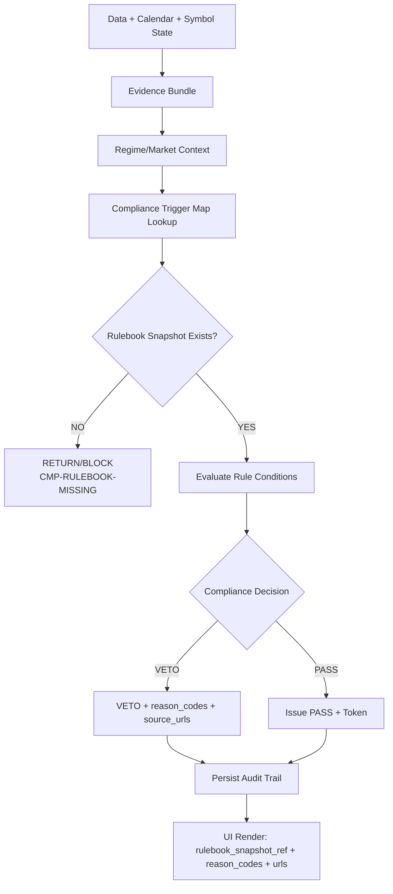

# TAITS_TWSE交易規則參考彙編（TWSE_RULES）

## 文件頭（Document Header）

- doc_key：TWSE_RULES
- 治理位階：治理制度級（市場規則參考彙編｜合規觸發映射）
- 版本狀態：ACTIVE
- 版本日期：（Asia/Taipei）
- 基線日期：（Asia/Taipei）
- 裁決序位（自高至低）：DOCUMENT_INDEX、MASTER_ARCH、AI_GOV
- 適用範圍：TAITS 全系統（規則引用基準、合規檢核依據、交易限制/撮合/漲跌幅/處置等參考彙整；不得取代正式法規）
- 引用原則：
 - 本文件為「規則參考彙編」，用於工程落點與稽核可追溯引用；若與官方最新公告/法規衝突，以官方為準，並由 VERSION_AUDIT 留痕更新本檔。
 - 本文件不構成交易授權；任何實盤行為須由人類最高決策者明確裁決，且受 RISK_COMPLIANCE 最高否決權約束。
 - L1–L11（Canonical Flow）之定義與權級說明以 doc_key=MASTER_CANON 為唯一正文來源；本檔不重複定義層級語義。

## 0. 文件定位（Rule Reference Charter）

本文件為 TAITS 的「台灣市場交易規則參考彙編與合規觸發映射（Rule Trigger Map）」文件，目的在於：

- 提供 TAITS 進行「合規判定」時所需的制度參考框架（非取代官方裁決）。
- 建立制度的 Rulebook Snapshot（規則快照）與 Trigger Map（觸發映射）：
 - 哪一條制度對應哪一類交易行為
 - 何時應觸發風控/合規檢查
 - 觸發後的裁決型態（PASS / VETO / RETURN / BLOCK）
- 確保 TAITS 遵守：
 - Binary Compliance（合規二元裁決：PASS/VETO）
 - Evidence 法律地位（無快照/無引用＝不可裁決）
 - 制度更新採用「快照追加＋可追溯留痕」（不得覆寫造成不可回放）
- 支援 TWSE（上市）、TPEX（上櫃）、TAIFEX（期貨/選擇權）制度引用（擴充性）。

本文件不做的事（避免越權）：

- 不宣稱本文件內容永遠正確或最新（制度以官方更新為準）。
- 不把制度內容「寫死在程式」作永久裁決。
- 不取代 RISK_COMPLIANCE 的否決條文與 reason codes 裁決口徑（本檔僅提供制度引用與映射骨架）。

## 1. 官方制度來源（Official Sources｜必須提供可追溯網址）

TAITS 任何合規裁決，必須能回指到以下官方來源之一（或其官方等價入口），並在 Rulebook Snapshot 中保存引用證據。

### 1.1 TWSE（臺灣證券交易所）官方制度
- TWSE 規章／法規查詢（Regulation Search / Rules）
 https://twse-regulation.twse.com.tw/
- TWSE 官方網站（公告/市場資訊）
 https://www.twse.com.tw/

### 1.2 TPEX（證券櫃檯買賣中心）官方制度
- TPEX 規章／法規
 https://www.tpex.org.tw/

### 1.3 TAIFEX（臺灣期貨交易所）官方制度
- TAIFEX 規章／法規
 https://www.taifex.com.tw/

### 1.4 MOPS（公開資訊觀測站）
- MOPS
 https://mops.twse.com.tw/

## 2. Rulebook Snapshot（制度快照）治理（核心制度）

### 2.1 Rulebook Snapshot 的最小內容（不可省略）
每一份制度快照至少包含：

- 版本識別：rulebook_snapshot_id、effective_date、captured_at
- 市場範圍：market_scope（TWSE/TPEX/TAIFEX）
- 規則來源：source_urls（可追溯、可點開）
- 規則內容：rule_items（可檢索的條文/條目）
- 取樣/摘錄方式：capture_method（例如：官網頁面快照、公告檔案、規章條文頁）
- 完整性標記：completeness_flags（缺口不得隱藏，必須顯示）

### 2.2 缺失快照＝不可裁決
若合規判定所需的制度快照缺失，系統必須 RETURN/BLOCK，並輸出可追溯原因碼（由 RISK_COMPLIANCE 裁決口徑）。

## 3. 制度不是條文堆疊：Rule Trigger Map（觸發映射）

### 3.1 Trigger Map 的最小輸出
Trigger Map 用於把「制度條目」映射到「觸發條件」與「可稽核輸出」：

- 觸發條件（conditions）：以可計算/可驗證的欄位表達（例如交易時段、漲跌幅、處置狀態、交易資格）
- 裁決型態（decision_type）：PASS / VETO / RETURN / BLOCK
- 原因碼（reason_codes）：必須能對應 RISK_COMPLIANCE 的 reason_code 口徑
- 引用證據（source_urls / snapshot_ref）：必須能回放至官方來源與制度快照

### 3.2 Trigger Map 的輸出位置（系統落點）
- Risk/Compliance Engine 必須使用 Trigger Map 做合規裁決。
- UI 必須可視化「是哪一條制度觸發了哪個原因碼」與其官方來源連結。
- VERSION_AUDIT 必須保存「觸發鏈」以回放。

## 4. TAITS 合規判定架構（Compliance Decision Architecture）

### 4.1 合規判定的二元性（Binary Compliance）
合規輸出必須是 PASS 或 VETO（若資料/快照缺失則 RETURN/BLOCK），不得以模糊敘述取代裁決結果。

### 4.2 Evidence 必須可回放
任何 PASS/VETO 必須附帶可回放的證據引用（rulebook_snapshot_ref、source_urls、evidence_refs、hash_manifest_ref）。

## 5. 規則分類（Rule Taxonomy｜最大完備骨架）

本節提供制度分類骨架，用於擴充與查詢（不限制官方分類方式）：

### 5.1 Trading Session & Calendar Rules（交易時段/交易日曆）
### 5.2 Price Limit & Volatility Rules（漲跌幅/波動限制）
### 5.3 Trading Halt & Disposition Rules（停止交易/處置/警示）
### 5.4 Matching & Order Type Rules（撮合/委託類型/申報限制）
### 5.5 Eligibility & Account Constraints（交易資格/帳戶限制）
### 5.6 Short Sale / Margin / Borrowing Rules（放空/融券/信用交易/借券）
### 5.7 Settlement & Corporate Action Impacts（交割/除權息/股權異動影響）
### 5.8 Disclosure & Information Rules（資訊揭露/公告義務）

## 6. 合規 Reason Codes（原因碼）與制度引用（Mapping）

### 6.1 Reason Codes 的設計要求
- 必須可追溯：每個 reason_code 必須能回指制度快照與官方來源。
- 必須可回放：保存觸發條件、輸入證據與計算結果（可重算）。

### 6.2 缺失資料的系統級原因碼（示意）
以下僅為分類示意；正式 reason codes 由 RISK_COMPLIANCE 統一裁決：

- CMP-RULEBOOK-MISSING：制度快照缺失（系統級合規不可裁決）
- CMP-SOURCE-URL-MISSING：官方來源連結缺失（不可裁決）
- CMP-EVIDENCE-MISSING：證據引用缺失（不可裁決）

## 7. 合規觸發點（Hard Triggers｜必查節點）

本節定義「在哪些系統節點必查」（以模組/控制點表述，不以 L 層級重覆定義）。

### 7.1 Risk/Compliance Gate 必查項目（不可省略）
- 交易時段/交易日曆（Session/Calendar）
- 標的可交易性（Eligibility）
- 帳戶/交易資格限制（例如信用交易）
- 制度快照存在與可追溯（Rulebook Snapshot）

### 7.2 Execution Preflight 必查項目（不可省略）
- 委託類型/申報限制（Order Type / Quote Constraints）
- 撮合/交易單位/最小變動（Tick / Lot / Matching Constraints）
- 即時處置/警示狀態（Disposition / Halt）

### 7.3 UI 顯示必備欄位（不可省略）
- rulebook_snapshot_ref
- reason_codes[]
- official_source_urls[]（可點開）
- 不得以模糊語句取代 VETO

## 8. Rule Trigger Map（制度觸發映射）資料結構（可落地）

這是一個可直接作為工程資料表/JSON schema 的規格骨架（最大完備）。
實際存放可由 DATA_SOURCES/DEPLOY_OPS 裁決，但語義不得改。

### 8.1 Trigger Map Record（單筆）
- trigger_id
- market_scope：TWSE/TPEX/TAIFEX
- rule_taxonomy：對應 §5 分類
- rulebook_snapshot_ref
- conditions：可計算條件集合
- decision_type：PASS/VETO/RETURN/BLOCK
- reason_codes[]
- official_source_urls[]
- evidence_refs[]
- hash_manifest_ref
- active_version_map_ref

## 9. Mermaid｜制度觸發到合規否決的流程圖

## 10. 制度更新策略（Rulebook Update Policy）

任何制度更新一律採用「快照追加」：

- 新增 rulebook_snapshot（不得覆寫舊快照）。
- 視需要新增 Trigger Map 條目（不得改寫既有條目語義；若需變更，應以新版本條目承接）。
- 更新必須落帳於 VERSION_AUDIT，並保留可回放鏈路（snapshot_ref／source_urls／hash_manifest_ref）。

## 11. 演進規則（TWSE_RULES 專屬）

### 11.1 允許新增（可擴充）
- 新市場/商品範圍（TPEX/TAIFEX）
- 新制度分類（Rule Taxonomy）
- 新觸發映射（Trigger Map Records）
- 新 reason codes 映射欄位（更嚴格、更可追溯）
- 新的官方來源入口（例如新增公告頁面類型）

### 11.2 禁止事項（不可違反）
- 把制度內容「寫死」作永久裁決
- 移除官方來源網址或快照引用
- 以摘要/推測取代制度快照或證據引用
## 稽核區塊（Audit Section｜非正文）

### 1) 變更清單（Changelog）
- FINAL_QA_FIX：統一 Hash Manifest 欄位格式（HASH_METHOD／BODY_SHA256），並以稽核區塊標頭之前全文為計算範圍重算 BODY_SHA256，確保可機械式驗證。
- FINAL_QA_NORMALIZE：移除正文中可能殘留之標籤式非制度條文行（若存在），確保正文乾淨且避免助記混讀。
- FINAL_QA_NORMALIZE：移除 Addendum／補丁式對話痕跡段落（若存在），確保正文乾淨且避免混讀。
- FINAL_QA_NORMALIZE：移除 Legacy Snapshot（若存在），以符合『不得保留 Legacy Snapshot』之正文規則。
- FINAL_QA_NORMALIZE：依 HASH_RULE 重新計算並更新 BODY_SHA256，確保稽核指紋可重現。
- ：Final QA 正文化（正文去重收斂、章節重排、格式修正、移除標籤化字樣與箭頭順位符號、更新文件頭與指紋）。

### 2) Hash Manifest（指紋清單）
- HASH_METHOD：SHA-256（UTF-8，LF）
- BODY_SHA256：ef16b9ae400ea3d047d01b7db14e33f6bfda93d584b2197b41b57e4863ee49da
### 3) 範圍聲明（Scope）
- 本次變更僅針對：正文去重收斂、結構重排、移除修補式/混讀文字、格式修正（含 Mermaid）、更新文件頭日期。
- 不包含：新增或推測任何官方規則內容；不替代官方裁決；不改寫 RISK_COMPLIANCE 之否決條文與 reason codes 最終裁決口徑。

### 4) 稽核交付（Audit Hand-off）
- 交付物：本檔為可直接覆蓋之最大完備 md。
- 需覆核點：章節編號連續性、Mermaid 渲染、官方來源連結可追溯性、Rulebook Snapshot/Trigger Map 欄位完整性。
