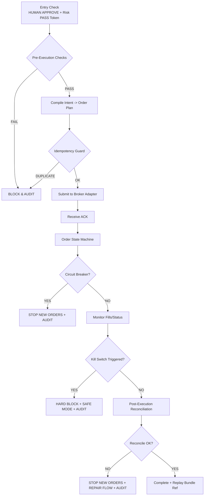

# TAITS_交易執行與控制規範（EXECUTION_CONTROL）

## 文件頭（Document Header）
- doc_key：EXECUTION_CONTROL
- 治理位階：治理制度級（交易執行與控制規範）
- 適用範圍：TAITS 執行鏈（送單前檢核／委託與路由／成交回報／風險控制／異常處理／緊急停機與復歸）。本文件僅規範「執行與控制」，不構成交易授權。
- 基線：以 doc_key=DOCUMENT_INDEX 之 ACTIVE 指向為準
- 版本日期：（Asia/Taipei）
- 裁決序位（自高至低）：DOCUMENT_INDEX、MASTER_ARCH、AI_GOV

---

## 0. 文件定位（Scope & Boundary）
本文件用於規範 TAITS 執行鏈之控制面（Execution Control），包含送單前檢核、執行中控制、事後對帳與回放資料封裝等制度要求。
本文件不裁決策略、標的、報告內容或人類裁決內容；亦不提供任何投資建議。

## 1. 核心鐵律（Hard Principles）
1. **授權先行**：未取得人類授權與風控放行之有效憑證，禁止任何可能造成成交的行為（含送單、改單、觸發單、撤單之自動重送）。
2. **風險/合規可否決**：任何執行動作均受風險/合規最高否決權約束，且須可被 Kill Switch 立即終止。
3. **可稽核、可回放**：執行鏈必須輸出足夠事件與證據，支援 Pre/In/Post 三段稽核與回放重建。
4. **一致性與冪等**：下單意圖、券商回報、成交/撤單、事後對帳必須一致；必須具備去重與冪等保護以防重送造成二次成交。
5. **語義一致**：不同模式（回測/模擬/紙上/實盤）控制語義一致，僅外部效果不同。

## 2. Canonical 承接與權限邊界（不重複定義）
- Canonical Flow（L1–L11）之層級定義與權責邊界，以 doc_key=MASTER_CANON 為唯一正文來源；本文件不重複定義任何 L 層內容。
- 本文件僅規範「執行與控制」制度：不得將「分析／報告／稽核回放」語義偷換為「授權或執行」語義；不得以任何方式繞過治理閘門、風險/合規否決權與人類授權流程。

## 3. 執行控制的核心目標（Execution Control Objectives）

1. **合法授權**：無人類授權與風控放行 Token，禁止任何可造成成交之行為。
2. **可控風險**：任何時刻可觸發 Kill Switch；風控/合規可一票否決。
3. **可稽核、可回放**：Pre/In/Post 三段審計 + Replay Bundle 能完整復現。
4. **一致性**：下單意圖、券商回報、成交/撤單、對帳結果必須一致。
5. **冪等與去重**：避免重送/重複成交、避免重放造成第二次下單。
6. **模式一致語義**：Backtest/Sim/Paper/Live 的「控制語義」一致（僅外部效果不同）。

---

## 4. 執行層輸入與輸出契約（Execution I/O Contract）

### 4.1 執行層輸入（必備）
- `human_approve_signature`：人類授權簽章
- （對齊）若輸入使用 `decision_signature`，必須映射為 `human_approve_signature` 並驗證一致性。
- `decision_signature`（欄位別名）：UI/L10 端輸出之授權簽章主鍵；執行層接收後必須**正規化為** `human_approve_signature`，且兩者內容必須位元級一致。若同時提供但不一致 → Preflight FAIL（BLOCK + AUDIT）。
- `risk_pass_token`：風控放行 Token（RISK_COMPLIANCE Gate）
- `order_intent`：下單意圖（含標的、方向、數量、限價/市價、有效期限等）
- `constraints`：授權包絡（authorization_envelope）映射到執行約束（max_notional / max_orders / slippage_guard 等）
- `mode`：BACKTEST / SIMULATION / PAPER / LIVE
- `trace_id`：全程追蹤 ID（跨模組一致）

### 4.2 執行層輸出（必備）
- `order_events[]`：送單/回報/成交/撤單/拒單等事件流
- `execution_summary`：執行摘要（成交均價、成交量、手續費估計、滑價估計、拒單原因等）
- `reconciliation_result`：對帳結果（含差異與修復狀態）
- `audit_bundle_ref`：審計包索引
- `replay_bundle_ref`：回放包索引

### 4.3 執行層在 Canonical Flow 的定位（承接 MASTER_CANON）
- 執行層本身不構成稽核回放層；但必須輸出足夠資料，供稽核回放使用。
- 稽核回放層不得被誤用為批准或放行；批准/放行僅能來自治理允許之授權與風控流程。

---

## 5. Pre-Execution Checks（送單前檢核）

必做檢核（任一 FAIL 即 BLOCK + AUDIT）：

1. **人類簽章驗證**：`human_approve_signature` 存在且有效。
2. **風控放行 Token 驗證**：`risk_pass_token` 存在且有效（hash 可追溯）。
3. **授權包絡一致性**：下單意圖不得超出 `authorization_envelope`。
4. **市場狀態檢核**：交易時段/盤中規則/漲跌停/撮合狀態等。
5. **標的可交易性**：停牌/處置/異常狀態禁止送單（依規則庫）。
6. **冪等鍵（idempotency_key）生成**：同一意圖重送不得造成第二筆成交風險。
7. **Kill Switch 狀態**：若已觸發，禁止新單。

---

## 6. In-Execution Control（執行中控制）

1. **Order State Machine**：所有訂單必須走狀態機（NEW / SENT / ACK / PARTIAL_FILL / FILLED / CANCELED / REJECTED 等）。
2. **速率限制與防爆單**：每秒/每分鐘最大送單數上限。
3. **滑價/偏離監控（Slippage Guard）**：超出授權包絡/策略允許範圍，觸發 BLOCK 或 ESCALATE。
4. **熔斷（Circuit Breaker）**：異常回報、連續拒單、報價失真、連線不穩等可觸發。
5. **Kill Switch 可即時生效**：觸發後應停止新單、撤單（依模式）、並完整留痕。
6. **事件流完整性**：任何券商回報事件必須可追溯到原訂單與 trace_id。

---

## 7. Post-Execution Reconciliation（事後對帳與一致性）

1. **券商回報對帳**：訂單最終狀態與成交明細必須一致。
2. **內部帳務對帳**：持倉/現金/手續費/交易稅估計與實際回報一致。
3. **差異處理（Mismatch Repair Flow）**
 - 記錄差異原因（來源延遲、重送、券商回報異常等）
 - 進入修復流程，期間可禁止新單（視嚴重度）
4. **對帳完成後**：產生 `reconciliation_result`、`replay_bundle_ref`、`audit_bundle_ref`

---

## 8. 審計三段式（Pre / In / Post）

- **Pre-Audit**：授權、Token、包絡、冪等鍵、模式、時間戳
- **In-Audit**：送單請求、券商 ACK、狀態轉移、熔斷/kill、事件碼
- **Post-Audit**：成交明細、對帳結果、差異、修復、回放包索引

---

## 9. Broker Adapter（券商適配器）最低要求

1. **雙向映射**：內部標準事件 ↔ 券商 API 回報事件
2. **錯誤碼標準化**：券商錯誤碼必須映射到本文件事件碼
3. **重試策略可稽核**：何時重試、重試次數、退避策略、每次重試需留痕
4. **序列一致性**：同訂單的事件排序必須可被重建
5. **沙盒/正式一致語義**：PAPER 與 LIVE 的 adapter 行為一致（僅外部效果不同）

---

## 10. 模式差異（Mode Differences｜語義一致）

- BACKTEST：不連外、以歷史撮合模擬；仍需產出事件流與回放包索引
- SIMULATION：可連外但不得成交；仍需完整 Pre/In/Post 審計
- PAPER：模擬成交/或券商紙上帳戶；仍需完整對帳與回放
- LIVE：真實成交；所有控制點強制啟用（不可降級）

---

## 11. Kill Switch 觸發條件（示例｜可擴充）

- 風控 Token 失效/過期/驗證失敗
- 人類簽章驗證失敗或授權包絡不一致
- 連續拒單超閾值
- 回報事件流異常（無 ACK、重複成交疑慮、狀態機不可能跳轉）
- 報價/行情異常（依風控規範閾值）
- 對帳重大差異（資金/持倉不一致）
- 人類手動觸發（HFI Emergency Stop）

---

## 12. Reason / Event Codes（事件碼｜最小集）

- `EC_PASS_TOKEN_MISSING`
- `EC_PASS_TOKEN_INVALID`
- `EC_HUMAN_SIGNATURE_INVALID`
- `EC_ENVELOPE_VIOLATION`
- `EC_IDEMPOTENCY_DUPLICATE`
- `EC_BROKER_REJECT`
- `EC_BROKER_TIMEOUT`
- `EC_STATE_MACHINE_ILLEGAL_TRANSITION`
- `EC_CIRCUIT_BREAKER_TRIGGERED`
- `EC_KILL_SWITCH_TRIGGERED`
- `EC_RECONCILIATION_MISMATCH`

---

## 13. 官方制度入口（執行層合規依據之官方來源）

- 交易所（TWSE）規則／公告
- 期交所（TAIFEX）規則／公告（如適用）
- 證交法規／主管機關公告（如適用）
- 券商 API/下單規格書（以券商官方文件為準）

> 注意：本章僅作「來源入口」列示；具體規則落地以 `TWSE_RULES` / 相關治理文件承接。

---

## 14. 版本與可追溯性（Version & Trace）

- 所有執行事件必須帶 `trace_id`
- 任何決策/授權必須可追溯到人類裁決記錄（含 decision_signature）
- 任何放行必須可追溯到 Risk PASS Token（含 hash）
- 任何成交/撤單必須可追溯到券商回報事件與 adapter 映射表版本

---

## 15. Replay Bundle（回放包）最低要求

回放包（Replay Bundle）至少包含：

- `trace_id`
- `inputs_manifest`（輸入索引＋hash）
- `decision_ref`（人類裁決引用）
- `risk_pass_token_ref`
- `order_events[]`（完整事件流）
- `reconciliation_result`
- `system_versions`（包含執行引擎、adapter、規則庫版本）
- `timeline`（可重建序列）

---

## 16. 緊急事件（Emergency）處置準則

- 任何緊急事件，先保護資金與合規：**停止新單、觸發 Kill Switch、留痕、回放、人類裁決**
- 若需撤單，必須留痕並可回放（撤單意圖、撤單結果、未撤成原因）

---

## 17. 禁止事項（Forbidden｜一票否決）

- 禁止無人類授權／無 Risk PASS Token 送單
- 禁止以稽核回放/已記錄 取代批准
- 禁止跳過 Pre/In/Post 任一段審計
- 禁止省略對帳
- 禁止以效能理由取消冪等/去重
- 禁止 AI/Agent 自行批准或暗示批准

---

## 18. 實作最小化建議（Implementation Minimums｜不可降標準）

- 以狀態機實作訂單生命週期
- 以事件溯源（event sourcing）實作審計
- 以 `idempotency_key` + `trace_id` 做冪等
- 以一致性對帳作為 LIVE 模式完成條件
- 以可插拔 adapter 支援多券商

---

## 19. Mermaid｜執行控制總流程圖（Execution Control Map）

---

## 稽核區塊（Audit Section｜非正文）

### 1) 變更清單（Changelog）
- L10_LAYER_QA_FIX（補強 Execution I/O Contract：新增 `decision_signature` 欄位別名之接收與正規化規則（UI/L10 ↔ Execution）；明確不一致處置（Preflight FAIL → BLOCK + AUDIT）；維持既有執行控制條款語義不變；重算 BODY_SHA256。）
- FINAL_QA_NORMALIZE：移除正文中可能殘留之標籤式非制度條文行（若存在），確保正文乾淨且避免助記混讀。
- FINAL_QA_NORMALIZE：移除 Addendum／補丁式對話痕跡段落（若存在），確保正文乾淨且避免混讀。
- FINAL_QA_NORMALIZE：移除 Legacy Snapshot（若存在），以符合『不得保留 Legacy Snapshot』之正文規則。
- FINAL_QA_NORMALIZE：依 HASH_RULE 重新計算並更新 BODY_SHA256，確保稽核指紋可重現。
- 正文整理（去重收斂、結構重排、口徑一致化），並更新指紋清單。

### 2) 指紋清單（Hash Manifest）
- HASH_METHOD：SHA-256（UTF-8，LF）
- BODY_SCOPE：全文正文（不含本稽核區塊）
- BODY_SHA256：bf0717db4e39491c6611e0bc2289773fd6fd71d8b2aad9b21a76427ea4be3aa6
### 3) 適用範圍（Scope）
- 僅處理 doc_key=EXECUTION_CONTROL 之正文整編驗收（去重收斂、結構重排、口徑一致化）。
- 不變更本檔既有之執行控制條款、檢核項目、事件碼、回放包結構與 Kill Switch 原則之實質語義（僅做文字與結構正常化，以避免混讀）。

### 4) Audit Hand-off（裁決承接）
- change_id：EC-FINALQA--0001
- authority_basis：DOCUMENT_INDEX；MASTER_ARCH；AI_GOV
- prepared_by：TAITS 正文整編驗收程序（Final QA）
- handoff_note：本次覆蓋版為單一正確正文版；後續變更須依 VERSION_AUDIT 規範落帳。
