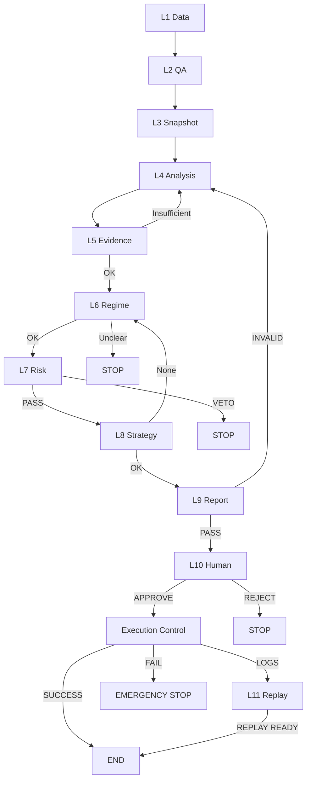

# TAITS_系統架構與流程細化說明（ARCH_FLOW）

## 文件頭（Document Header）
- doc_key：ARCH_FLOW 
- 治理位階：治理制度級（架構細化規格） 
- 治理裁決序位（自高至低）：1) DOCUMENT_INDEX 2) MASTER_ARCH 3) AI_GOV 
- Canonical Flow（L1–L11）唯一正文來源：doc_key=MASTER_CANON 
- 文件內部識別：正文一律僅以 doc_key 作唯一識別；版本/日期僅允許存在於檔名與檔尾稽核區塊（非正文） 

---

## 0. 文件定位（Architecture Flow Specification）

本文件為 TAITS 的「系統架構與流程細化說明（ARCH_FLOW）」：
- 用於把 FULL_ARCH（模組總覽）細化成可落地的跨模組流程、資料流、事件流與治理閘門落點。
- 用於逐段描述 Canonical Flow（L1–L11）在工程實作上的「節點、輸入、輸出、Gate、留痕」。
- 本文件不取代 MASTER_CANON 的 Canonical 定義；僅做工程落地的流程細化。
- 本文件不產生投資建議、不產生策略推薦。

本文件以制度化方式定義：
1) 流程觸發（Trigger） 
2) 各層責任邊界（做什麼／不做什麼） 
3) 中斷、退回、否決與緊急中止之語義 
4) 跨運行模式的一致性（Research / Backtest / Simulation / Paper / Live） 
5) 審計、回放、版本一致性之最低不可降標準 

嚴格遵守：
- L1–L11 不可跳步
- 流程 ≠ 策略；流程 ≠ 下單
- 任何中斷必須可解釋、可回放
- Risk / Compliance 具最高否決權
- Human-in-the-Loop 不可被替代

---

## 1. Canonical Flow 的不變核心（五大流程公理）

1) **單向性（Forward-only）**：只能前進或中斷；不存在隱性回寫或偷偷修正。 
2) **層級隔離（Layer Isolation）**：每層只處理該層責任；任何越權即違規。 
3) **證據先於判斷（Evidence First）**：無 Evidence 不得進入 Regime / Risk / Strategy。 
4) **否決優先於建議（Veto > Proposal）**：任一否決立即生效；績效不得辯護。 
5) **人類裁決不可被模擬**：L10 僅由人類完成；AI 不得取得最終裁決權。 

---

## 2. Canonical Flow 總覽（L1–L11｜不可跳步）

```text
L1 Data Ingestion（資料取得）
L2 Validation & Normalization（校驗/正規化）
L3 Snapshot & State Build（快照/狀態建構）
L4 Feature / Indicator / Structure Extraction（特徵/指標/結構）
L5 Evidence Bundle Assembly（證據包）
L6 Regime Determination（市場狀態）
L7 Risk & Compliance Gate（最高否決）
L8 Strategy Proposal Generation（策略建議）
L9 Investment Report（投資報告）
L10 UI Decision & Explain（人機決策/可解釋）
L11 Audit Replay（全層工程稽核回放）
```

跨層總禁止：
- 層間回寫（Back-write）
- 跳層（Skipping）
- 策略直連執行
- AI 自主化（以文本輸出冒充裁決/授權）
- Annotation 升格

---

## 3. 流程狀態轉移矩陣（State Transition Matrix｜最大完備）

| Stage | Canonical Reference | 輸入狀態 | 成功輸出 | 失敗狀態 | 失敗去向 |
|---|---|---|---|---|---|
| S01 | L1 | NoData | RawDataReady | SourceFail | STOP |
| S02 | L2 | RawDataReady | CanonicalReady | QAFail | STOP |
| S03 | L3 | CanonicalReady | SnapshotReady | SnapshotFail | STOP |
| S04 | L4 | SnapshotReady | FeatureReady | AnalysisFail | STOP |
| S05 | L5 | FeatureReady | EvidenceReady | EvidenceInsufficient | RETURN（回寫至上游） |
| S06 | L6 | EvidenceReady | RegimeReady | RegimeUnclear | STOP |
| S07 | L7 | RegimeReady | RiskPass | RiskVeto | STOP |
| S08 | L8 | RiskPass | StrategyReady | NoStrategy | RETURN（回寫至上游） |
| S09 | L9 | StrategyReady | ReportReady | ReportInvalid | RETURN（回寫至上游） |
| S10 | L10 | ReportReady | HumanApprove | HumanReject | STOP |
| S11 | L11 | HumanApprove | ReplayReady | AuditFail | STOP |

---

## 4. 中斷類型（Interrupt Taxonomy）

### 4.1 類型
- **Hard Stop**：Risk Veto / Compliance Violation 
- **Soft Return**：Evidence 不足 / Strategy 不適用 / Flow 不完整 
- **Emergency Stop**：Execution 異常 / 系統錯誤 / 人工 Kill Switch 

### 4.2 最小審計要求
任何中斷必留：
- 中斷層級（Layer）
- 原因碼（Reason Code）
- Evidence Snapshot（或其引用）
- Version Reference

---

## 5. 多模式一致性（Mode Consistency）

### 5.1 允許變動
- 資料來源（歷史/即時）
- 時間推進（模擬/真實）
- Execution 開關（真實/模擬）

### 5.2 禁止變動
- L1–L11 順序
- Risk / Governance Gate
- Human Decision 存在性
- 審計密度

---

## 6. 全域 Hard Gates（總表）

| Gate | 觸發 | 處置 |
|---|---|---|
| Human Sovereignty | 無人值守 | BLOCK |
| Evidence Replay | 不可回放 | BLOCK |
| Regime Precondition | 不符/衝突 | DOWNGRADE / BLOCK |
| Risk Veto | 任一疑慮 | VETO |
| Strategy≠Execution | 含方向/下單 | BLOCK |
| Governance Completeness | 缺審計 | RETURN |

---

## 7. Canonical Flow 承接規範（引用 MASTER_CANON）

本文件僅描述「工程落點與資料鍵」之承接方式，不對 Canonical Flow（L1–L11）做任何重複定義、子集合特別化或逐層條文化。

Canonical Flow（L1–L11）之唯一正文來源為 doc_key=MASTER_CANON；任何層級定義、層級責任、層級輸入輸出或層級禁止事項，均以 MASTER_CANON 為準。

以下內容為「工程實作字典」：保留既有產物鍵與禁止事項之文字，但不以層級章節形式呈現，以避免與 MASTER_CANON 混讀。

### 7.1 工程實作字典（產物鍵／禁止事項／失敗處置）

#### Data Ingestion（資料取得）
- 輸出（對齊 MASTER_CANON=L1 Raw Data；介面契約對齊 FULL_ARCH=`DataIngested`／DATA_SOURCES=23.1）： 
 - `source_id`：資料源主鍵（必須存在於 doc_key=DATA_SOURCES 之 Source Registry） 
 - `subcategory_id`：資料子類別主鍵（用於綁定解析器/失效模式/降級策略；來源：DATA_SOURCES） 
 - `fetch_window`：抓取/涵蓋時間窗（start/end；若不適用仍需以 null 明示） 
 - `captured_at`：抓取完成時間戳（資料取得時點；不得以資料內時間戳替代） 
 - `raw_payload_ref`：原始回應/原始檔案引用（bytes/file；L1 禁止任何清洗/推論改寫） 
 - `provenance_ref`：來源追溯引用（官方網址/端點/回應頭摘要/取得方式/必要授權註記） 
 - `hash_manifest_ref`：完整性校驗（至少含 sha256；缺失即屬 BLOCK 類風險） 
 - `quality_report_ref`：品質報告（至少含：延遲、缺漏、格式錯誤、值域檢查） 
 - `source_tier_used`：PRIMARY/SECONDARY/FALLBACK（若非 PRIMARY，必須同時提供 `licensing_notes_ref`） 
 - `licensing_notes_ref`（條件必填）：非 PRIMARY 必填（授權/限制註記；不得省略） 
 - `active_version_map_ref`：版本映射引用（對齊 E2E Trace 與回放一致性；不得缺漏） 
 - `failover_event_ref`（可選）：故障切換事件引用（若觸發 fallback；必須帶 `trust_level=LOW` 並預設 `compliance_eligible=false`，用途受 DATA_SOURCES=22 限制） 
- 禁止：推論、清洗、方向化、靜默補值/改值、第三方冒充官方或授權來源 
- 失敗：ABORT（L1_FETCH_FAIL）

#### Validation & Normalization（校驗/正規化）
- 輸出（對齊 MASTER_CANON=L2 Canonical Data；介面契約對齊 FULL_ARCH=`DataNormalized`／DATA_SOURCES=23.2）： 
 - `canonical_data_ref`：正規化後資料本體引用（可回放） 
 - `canonical_schema_id` 
 - `subcategory_id` 
 - `field_map_ref`：原欄位 → canonical 欄位映射（必留） 
 - `normalization_ruleset_version` 
 - `value_origin_map_ref`：值來源標記（OBSERVED/IMPUTED/DERIVED；必留） 
 - `imputation_ref`（若有）：補值/插值/推估方法、範圍、理由、版本（不可省略） 
 - `data_quality_flags[]`：至少含 `IMPUTED_VALUES_PRESENT`（若發生補值） 
 - `quality_flags[]`（legacy alias）：若出現在舊介面，必須同工件提供映射至 `data_quality_flags[]`（避免新舊混讀） 
- 禁止： 
 - 隱性補值（未留下 `imputation_ref` / `value_origin_map_ref` / `IMPUTED_VALUES_PRESENT`） 
 - 偷換欄位語義（例：把成交量當成交額） 
 - 以模型猜測取代缺值（除非明確標記並可追溯） 
- 失敗：QAFail（reason_codes 例：L2_SCHEMA_FAIL；STOP）

#### Snapshot & State Build（快照/狀態建構）
- 輸出：market_snapshot / replay_anchor 
- 禁止：只存在記憶體（不可回放） 
- 失敗：ABORT（L3_STATE_INTEGRITY_FAIL）

#### Feature / Indicator / Structure Extraction（特徵/指標/結構）
- 輸出（工程承接鍵；對齊 FULL_ARCH 之介面契約；不重複定義 Canonical 層級語義）： 
 - `feature_set_ref`：**唯一 canonical 引用鍵**（下游只讀此欄） 
 - `indicator_set_ref`：legacy alias（可選；若存在必須等價於 feature_set_ref；不得單獨存在/不得作為下游唯一鍵） 
 - `structure_descriptor_ref`：結構描述引用（可為 null；若存在，僅能以描述形式輸出，不得方向化） 
 - `feature_set_id` / `feature_schema_version`（若系統採用；用於回放一致性與版本化） 
 - `feature_quality_flags[]` 
 - `input_refs[]`（至少包含 L3 Snapshot/State 之引用鍵集合） 
 - `version_ref` 
- 禁止：方向化 / 非白名單 Feature / Annotation 升格 / 以 `indicator_set_ref` 取代 `feature_set_ref` / alias 不等價 
- 失敗：AnalysisFail（reason_codes：L4_FEATURE_REF_MISSING / L4_ALIAS_MISMATCH / L4_ILLEGAL_FEATURE；對齊 State Matrix：STOP）

#### Evidence Bundle Assembly（證據包）
- 輸出：evidence_bundle_id / completeness_score 
- 禁止：以推測補證據 
- 失敗：RETURN 或 ABORT（L5_EVIDENCE_INCOMPLETE）

#### Regime Determination（市場狀態）
- 輸出：regime_state / confidence / conflict_flag 
- 禁止：由策略反推 
- 失敗：ABORT（L6_REGIME_UNDEFINED）

#### Risk & Compliance Gate（最高否決）
- 輸出：PASS / VETO / DOWNGRADE / AVOID + reason codes 
- 禁止：績效辯護 
- 失敗：VETO（最高）

#### Strategy Proposal Generation（策略建議）
- 輸出：proposal（非指令） 
- 禁止：價格/數量/下單（不得輸出可直接送單之指令或參數） 
- 失敗：ABORT（L8_OUTPUT_VIOLATION）

#### Investment Report（投資報告）
- 輸出：investment_report（含數據/圖形/條件式進出場建議〔非指令〕/風險敘述/追蹤欄位） 
- 必含：report_id / report_timestamp / data_refs / price_snapshot / chart_refs / risk_disclosure / update_fields 
- 檢核：完整性與一致性檢核依 GOVERNANCE_GATE_SPEC 裁決（本檔不另立層級或順位） 
- 禁止：將報告視為裁決/批准層；以報告內容直接觸發下單；放行缺證據/缺風控揭露 
- 失敗：RETURN（回寫至上游分析層，依缺口類型）或 BLOCK（需人工介入）

#### UI Decision & Explain（人機決策/可解釋）
- 輸出：decision_trace / risk_disclosure 
- 禁止：誘導下單 / 隱藏否決 
- 失敗：STOP

#### Audit Replay（全層工程稽核回放）
- 輸出：replay_bundle_ref / audit_index / trace_manifest（含 Canonical 引用與執行控制引用） 
- 禁止：把回放與稽核機制當批准/下單/送單層；缺 replay 卻宣稱已執行；以 console log 取代正式稽核物 
- 失敗：STOP（AuditFail｜視同未可追溯，不得進入任何實盤路徑）

#### 附：Execution Control（受控執行｜模組，非 Canonical Layer）
- 啟動條件：僅能由人類裁決授權後啟動（依 MASTER_CANON 層級邊界承接） 
- 產物：execution_log / kill_switch_state / order_router_trace 
- 交付：其結果必須被回放與稽核包引用收錄（可回放、可追溯）

---

## 8.
---

## 8. 審計（Audit）總則｜「無紀錄＝未發生」

- 覆蓋 L1–L11、所有中斷、所有模式。
- 不得以 Console Log 取代正式審計物。

### 8.1 Mandatory Audit Fields（最小集）
- correlation_id / session_id / layer_id / module_id 
- timestamp_utc / version_ref 
- input_hash / output_hash / status / reason_codes 

### 8.2 追溯鍵（引用鍵｜層級不在本檔定義）
- snapshot_id
- evidence_id / provenance_map
- regime_label / confidence
- policy_version / veto_reason_codes
- user_id / ui_trace
- order_id_map / kill_switch_events（若存在 execution）
---

## 9. 回放（Replay）規範

Replay Bundle（最小集合）：
- documents_active_map 
- evidence_bundle 
- regime_state 
- risk_decision 
- human_decision（若有） 
- execution_logs（若有） 
- all_hashes 

一致性要求：相同 Bundle 時結論必須一致；否則視為污染。

---

## 10. 版本一致性（Version Alignment）

- 所有輸出必綁 version_ref。 
- 新版不得破壞舊 Replay。 

與 VERSION_AUDIT 分工：
- ARCH_FLOW 定義「在哪裡引用版本」 
- VERSION_AUDIT 管理「如何追溯/回退」 

---

## 11. Mermaid（含退回/否決）



---

## 12. FULL_ARCH 對位

- FULL_ARCH：定義「有什麼層/模組」 
- ARCH_FLOW：定義「如何按序運作」 
- 任一不對位即屬非法

---

## 13. 最大完備演進規則

允許：
- 新增子流程（例如：新增子節點編號）
- 新增中斷原因碼
- 新增模式（例如：Sandbox）

禁止：
- 刪除/合併 L1–L11
- 改寫中斷語義
- 以效能為由省略審計
## 稽核區塊（Audit Section｜非正文）

### 1) Changelog（變更清單）
- ｜L4_BLOCKER_UNBLOCK｜收斂 L4 工程輸出鍵：明確以 `feature_set_ref` 作為跨層唯一 canonical 引用鍵，`indicator_set_ref` 降級為 legacy alias（必須等價）；同步補上缺失/不等價之 reason_codes（L4_FEATURE_REF_MISSING / L4_ALIAS_MISMATCH）並將失敗語義對齊 State Matrix：AnalysisFail→STOP；不改寫 doc_key=MASTER_CANON 主幹語義。
- ｜L2_LAYER_QA_FIX｜對齊 L2（Validation & Normalization）工程輸出鍵與失敗語義：將舊 `validated_snapshot_id/validation_report` 收斂為 DataNormalized 契約鍵（`canonical_data_ref/field_map_ref/value_origin_map_ref/imputation_ref/...`），並將失敗處置語義對齊 State Matrix：QAFail→STOP；保留 reason_code（例：L2_SCHEMA_FAIL）作機器化裁決依據。
- ｜DOC_KEY_ONLY_BODY_HEADER｜移除正文文件頭中的基線/版本日期欄位；版本辨識僅允許於檔名與檔尾稽核區塊（非正文），避免以日期作正文識別或裁決依據。
- ｜L1_QA_FIX｜修正 L1 工程輸出鍵：ARCH_FLOW 的 Data Ingestion 輸出由自定義 alias 改為明確對齊 FULL_ARCH=DataIngested 與 DATA_SOURCES=23.1；補 `active_version_map_ref` 與 tier/授權欄位條件；保留 ABORT 語義。
- ｜FINAL_QA_NORMALIZE｜正文去混讀與一致化：移除字母標籤與箭頭順位；重寫 Canonical 承接段落；逐層章節改為工程實作字典（避免與 MASTER_CANON 混讀）；更新表格欄位命名；重算指紋。

### 2) Hash Manifest（指紋清單）
- HASH_METHOD：SHA-256（UTF-8，LF）
- BODY_SHA256： d6cef28eb0afdc4b177fad2f47b59e91b70a2a6cb8b7817c0630cbabd00c4c36
### 3) Scope（適用範圍）
- doc_key：ARCH_FLOW
- 本次變更範圍：補強 L4 工程輸出鍵之跨層唯一引用鍵（`feature_set_ref`）與 legacy alias（`indicator_set_ref`）等價規則，解除 L4→L5 契約混讀阻塞；不改寫 MASTER_CANON 主幹語義；不新增任何 Canonical 定義。

### 4) Audit Hand-off（裁決承接）
- 承接者：TAITS Governance Owner（人類最高決策者）
- 承接依據：本檔 Changelog + BODY_SHA256
